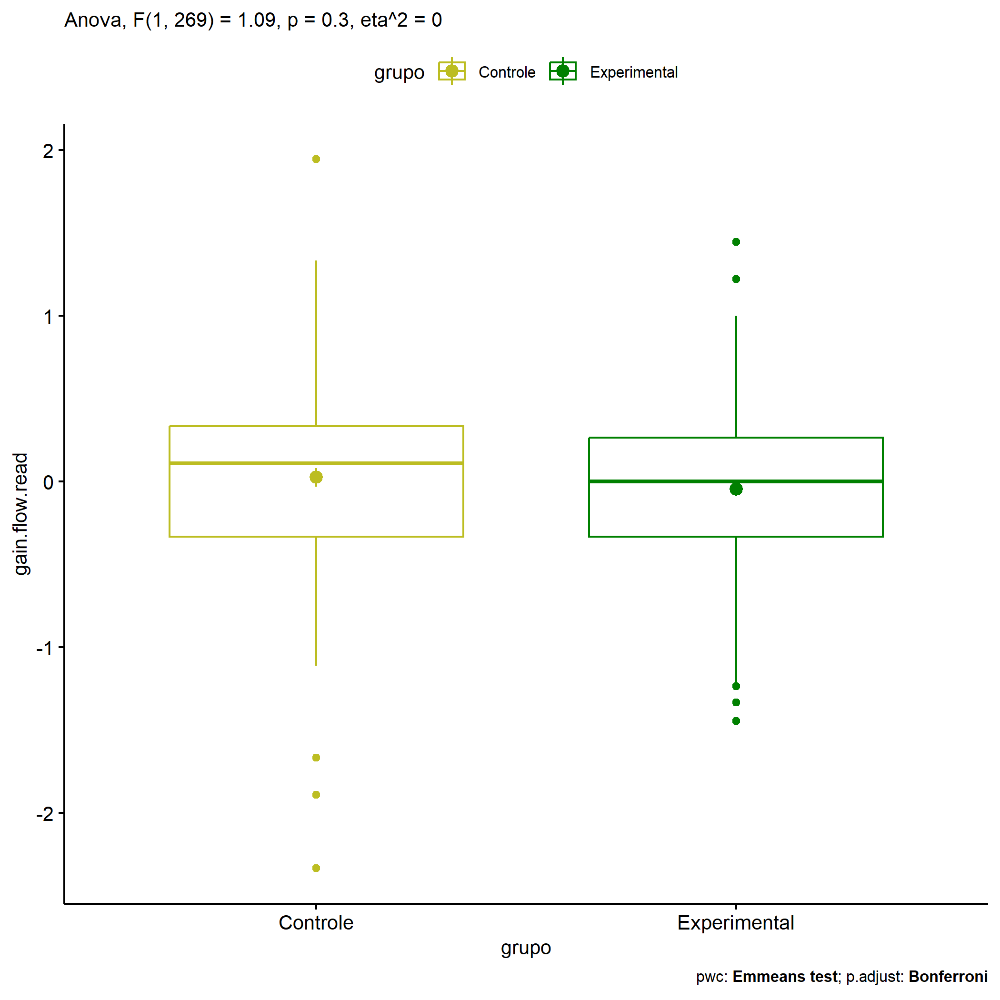
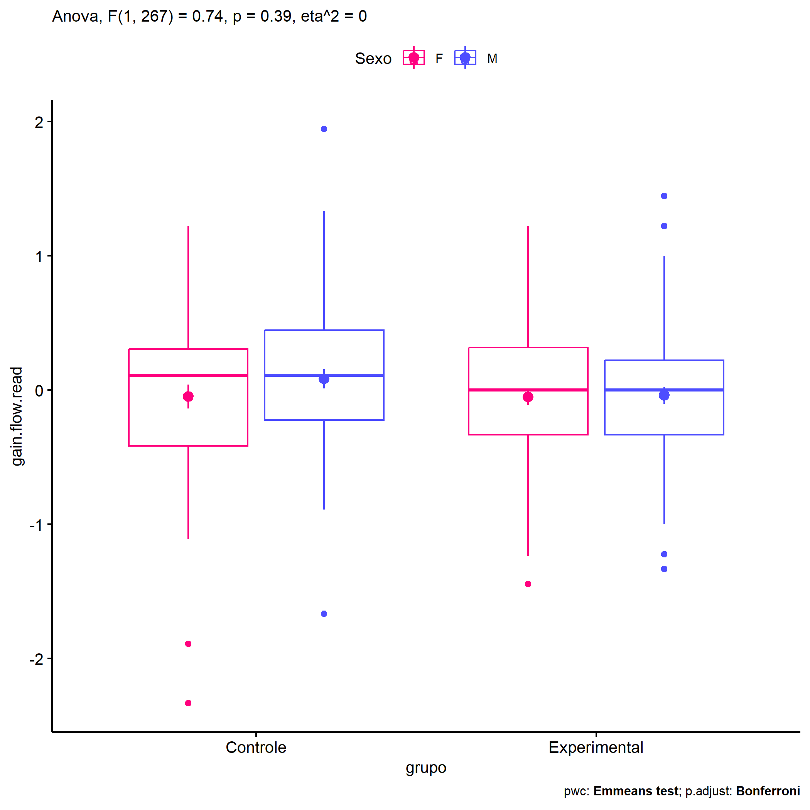
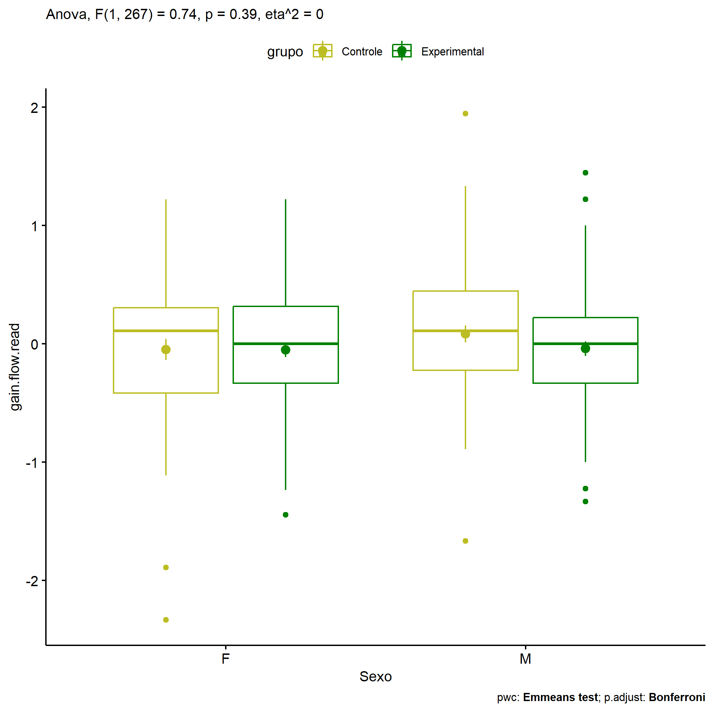
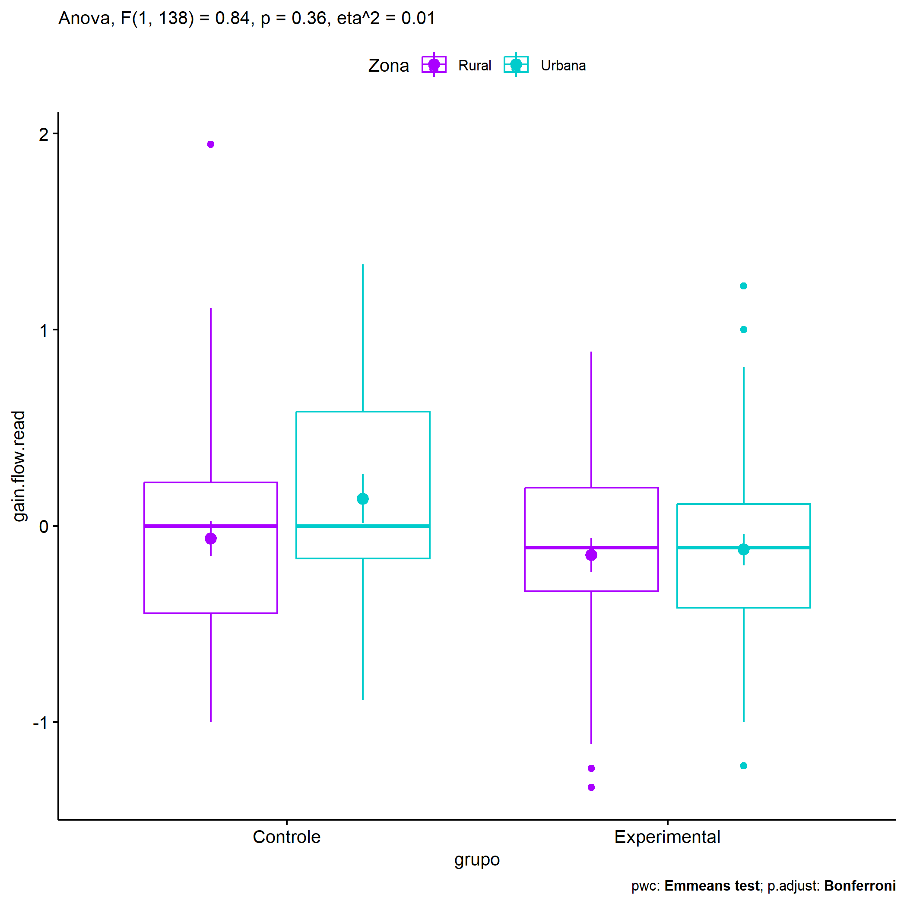
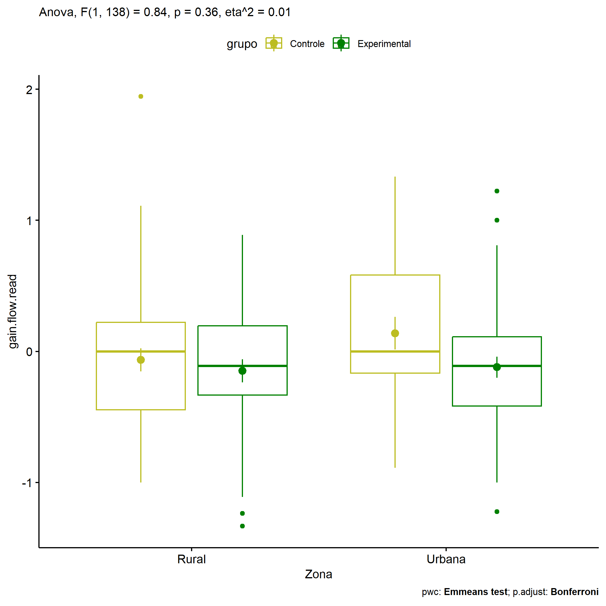
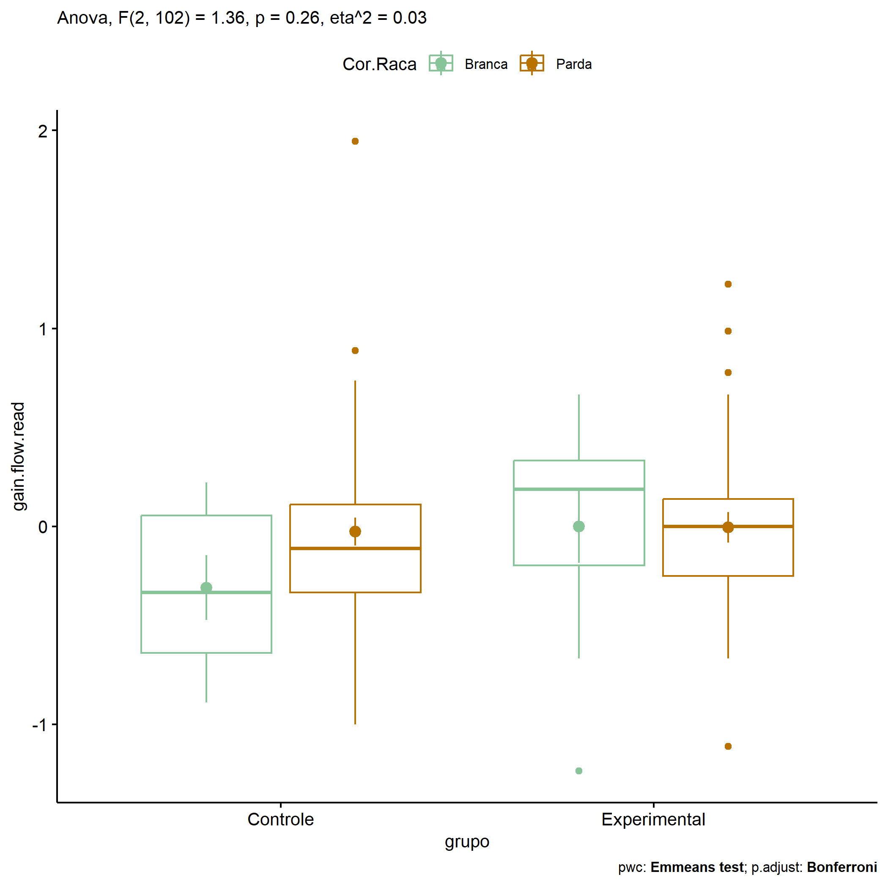
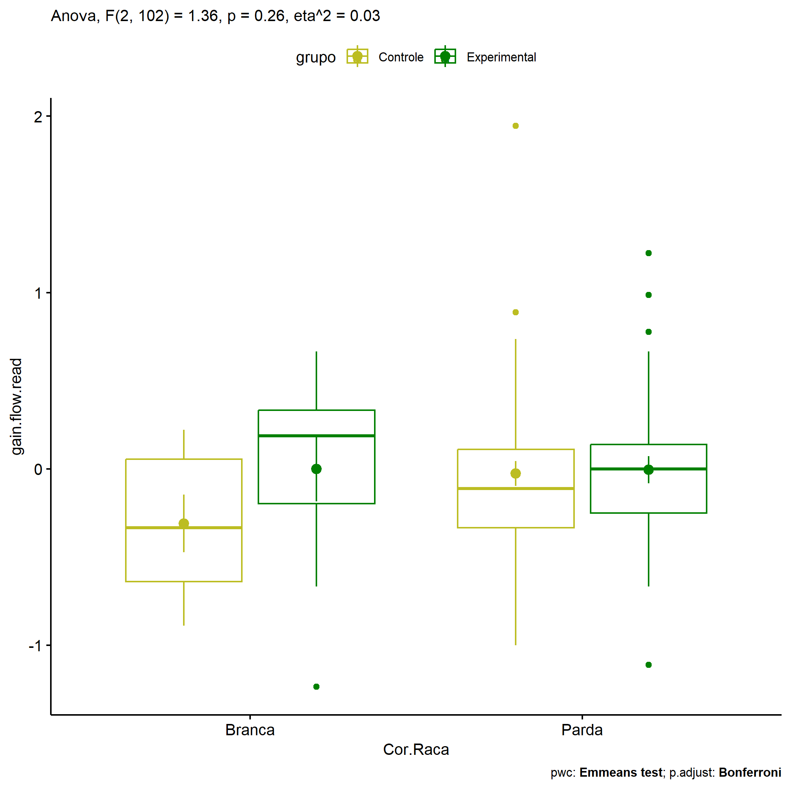

ANOVA in Gains for gain flow (ativ. leitura) (gain flow (ativ. leitura))
================
Geiser C. Challco <geiser@alumni.usp.br>

- [Descriptive Statistics of Initial
  Data](#descriptive-statistics-of-initial-data)
- [Checking of Assumptions](#checking-of-assumptions)
  - [Assumption: Normality distribution of
    data](#assumption-normality-distribution-of-data)
  - [Assumption: Homogeneity of data
    distribution](#assumption-homogeneity-of-data-distribution)
- [Computation of ANCOVA test and Pairwise
  Comparison](#computation-of-ancova-test-and-pairwise-comparison)
  - [ANCOVA tests for one factor](#ancova-tests-for-one-factor)
  - [ANCOVA tests for two factors](#ancova-tests-for-two-factors)
  - [Pairwise comparisons for one factor:
    **grupo**](#pairwise-comparisons-for-one-factor-grupo)
  - [Pairwise comparisons for two
    factors](#pairwise-comparisons-for-two-factors)
    - [factores: **grupo:Sexo**](#factores-gruposexo)
    - [factores: **grupo:Zona**](#factores-grupozona)
    - [factores: **grupo:Cor.Raca**](#factores-grupocorraca)

**NOTE**

- Teste ANOVA para determinar se houve diferenças significativas no gain
  flow (ativ. leitura) (medido usando a diferença entre post-test e
  pre-testes).
- ANOVA test to determine whether there were significant differences in
  gain flow (ativ. leitura) (measured using the difference between
  post-test and pre-tests).

# Descriptive Statistics of Initial Data

| grupo        | Sexo | Zona   | Cor.Raca | variable       |   n |   mean | median |    min |    max |    sd |    se |    ci |   iqr |
|:-------------|:-----|:-------|:---------|:---------------|----:|-------:|-------:|-------:|-------:|------:|------:|------:|------:|
| Controle     | F    |        |          | gain.flow.read |  54 | -0.047 |  0.111 | -2.333 |  1.222 | 0.656 | 0.089 | 0.179 | 0.722 |
| Controle     | M    |        |          | gain.flow.read |  68 |  0.085 |  0.111 | -1.667 |  1.944 | 0.587 | 0.071 | 0.142 | 0.667 |
| Experimental | F    |        |          | gain.flow.read |  74 | -0.052 |  0.000 | -1.444 |  1.222 | 0.514 | 0.060 | 0.119 | 0.649 |
| Experimental | M    |        |          | gain.flow.read |  75 | -0.040 |  0.000 | -1.333 |  1.444 | 0.537 | 0.062 | 0.124 | 0.556 |
| Controle     |      | Rural  |          | gain.flow.read |  42 | -0.064 |  0.000 | -1.000 |  1.944 | 0.568 | 0.088 | 0.177 | 0.667 |
| Controle     |      | Urbana |          | gain.flow.read |  24 |  0.139 |  0.000 | -0.889 |  1.333 | 0.607 | 0.124 | 0.256 | 0.750 |
| Controle     |      |        |          | gain.flow.read |  56 |  0.046 |  0.132 | -2.333 |  1.222 | 0.661 | 0.088 | 0.177 | 0.583 |
| Experimental |      | Rural  |          | gain.flow.read |  34 | -0.149 | -0.111 | -1.333 |  0.889 | 0.514 | 0.088 | 0.179 | 0.528 |
| Experimental |      | Urbana |          | gain.flow.read |  42 | -0.120 | -0.111 | -1.222 |  1.222 | 0.522 | 0.081 | 0.163 | 0.528 |
| Experimental |      |        |          | gain.flow.read |  73 |  0.044 |  0.111 | -1.444 |  1.444 | 0.521 | 0.061 | 0.122 | 0.556 |
| Controle     |      |        | Branca   | gain.flow.read |   7 | -0.310 | -0.333 | -0.889 |  0.222 | 0.433 | 0.163 | 0.400 | 0.694 |
| Controle     |      |        | Indígena | gain.flow.read |   3 | -0.037 |  0.000 | -0.333 |  0.222 | 0.280 | 0.161 | 0.695 | 0.278 |
| Controle     |      |        | Parda    | gain.flow.read |  47 | -0.026 | -0.111 | -1.000 |  1.944 | 0.482 | 0.070 | 0.141 | 0.444 |
| Controle     |      |        |          | gain.flow.read |  65 |  0.103 |  0.222 | -2.333 |  1.333 | 0.720 | 0.089 | 0.178 | 0.556 |
| Experimental |      |        | Branca   | gain.flow.read |  10 | -0.001 |  0.188 | -1.236 |  0.667 | 0.576 | 0.182 | 0.412 | 0.531 |
| Experimental |      |        | Indígena | gain.flow.read |   1 | -0.667 | -0.667 | -0.667 | -0.667 |       |       |       | 0.000 |
| Experimental |      |        | Parda    | gain.flow.read |  40 | -0.005 |  0.000 | -1.111 |  1.222 | 0.483 | 0.076 | 0.154 | 0.389 |
| Experimental |      |        |          | gain.flow.read |  98 | -0.061 |  0.000 | -1.444 |  1.444 | 0.538 | 0.054 | 0.108 | 0.556 |

# Checking of Assumptions

## Assumption: Normality distribution of data

| var            |   n |   skewness |  kurtosis | symmetry | statistic | method     |         p | p.signif | normality |
|:---------------|----:|-----------:|----------:|:---------|----------:|:-----------|----------:|:---------|:----------|
| gain.flow.read | 271 | -0.3160434 | 1.3411496 | YES      | 14.964439 | D’Agostino | 0.0005630 | \*\*     | \-        |
| gain.flow.read | 142 |  0.3045206 | 0.7088664 | YES      |  5.505538 | D’Agostino | 0.0637511 | ns       | QQ        |
| gain.flow.read | 108 |  0.4874181 | 2.2923553 | YES      | 14.678866 | D’Agostino | 0.0006494 | \*\*     | QQ        |

## Assumption: Homogeneity of data distribution

| var            | method        | formula                              |   n | df1 | df2 | statistic |         p | p.signif |
|:---------------|:--------------|:-------------------------------------|----:|----:|----:|----------:|----------:|:---------|
| gain.flow.read | Levene’s test | `gain.flow.read`~`grupo`\*`Sexo`     | 271 |   3 | 267 | 0.3394362 | 0.7968309 | ns       |
| gain.flow.read | Levene’s test | `gain.flow.read`~`grupo`\*`Zona`     | 142 |   3 | 138 | 0.3668449 | 0.7770435 | ns       |
| gain.flow.read | Levene’s test | `gain.flow.read`~`grupo`\*`Cor.Raca` | 108 |   5 | 102 | 0.4193482 | 0.8343233 | ns       |

# Computation of ANCOVA test and Pairwise Comparison

## ANCOVA tests for one factor

| Effect   | DFn | DFd |   SSn |    SSd |     F |     p |   ges | p\<.05 |
|:---------|----:|----:|------:|-------:|------:|------:|------:|:-------|
| grupo    |   1 | 269 | 0.352 | 87.052 | 1.086 | 0.298 | 0.004 |        |
| Sexo     |   1 | 269 | 0.325 | 87.079 | 1.003 | 0.317 | 0.004 |        |
| Zona     |   1 | 140 | 0.206 | 42.756 | 0.674 | 0.413 | 0.005 |        |
| Cor.Raca |   2 | 105 | 0.277 | 24.724 | 0.589 | 0.557 | 0.011 |        |

## ANCOVA tests for two factors

|     | Effect         | DFn | DFd |   SSn |    SSd |     F |     p |   ges | p\<.05 |
|:----|:---------------|----:|----:|------:|-------:|------:|------:|------:|:-------|
| 3   | grupo:Sexo     |   1 | 267 | 0.239 | 86.523 | 0.737 | 0.391 | 0.003 |        |
| 6   | grupo:Zona     |   1 | 138 | 0.255 | 41.598 | 0.845 | 0.360 | 0.006 |        |
| 9   | grupo:Cor.Raca |   2 | 102 | 0.639 | 24.026 | 1.356 | 0.262 | 0.026 |        |

## Pairwise comparisons for one factor: **grupo**

| var            | grupo        |   n |      M |    SE |
|:---------------|:-------------|----:|-------:|------:|
| gain.flow.read | Controle     | 122 |  0.026 | 0.056 |
| gain.flow.read | Experimental | 149 | -0.046 | 0.043 |

| .y.            | group1   | group2       | estimate | conf.low | conf.high |    se | statistic |     p | p.adj | p.adj.signif |
|:---------------|:---------|:-------------|---------:|---------:|----------:|------:|----------:|------:|------:|:-------------|
| gain.flow.read | Controle | Experimental |    0.072 |   -0.064 |     0.209 | 0.069 |     1.042 | 0.298 | 0.298 | ns           |

    ## Scale for colour is already present.
    ## Adding another scale for colour, which will replace the existing scale.

<!-- -->

## Pairwise comparisons for two factors

### factores: **grupo:Sexo**

| var            | grupo        | Sexo |   n |      M |    SE |
|:---------------|:-------------|:-----|----:|-------:|------:|
| gain.flow.read | Controle     | F    |  54 | -0.047 | 0.089 |
| gain.flow.read | Controle     | M    |  68 |  0.085 | 0.071 |
| gain.flow.read | Experimental | F    |  74 | -0.052 | 0.060 |
| gain.flow.read | Experimental | M    |  75 | -0.040 | 0.062 |

| .y.            | grupo        | Sexo | group1   | group2       | estimate | conf.low | conf.high |    se | statistic |     p | p.adj | p.adj.signif |
|:---------------|:-------------|:-----|:---------|:-------------|---------:|---------:|----------:|------:|----------:|------:|------:|:-------------|
| gain.flow.read |              | F    | Controle | Experimental |    0.005 |   -0.196 |     0.206 | 0.102 |     0.049 | 0.961 | 0.961 | ns           |
| gain.flow.read |              | M    | Controle | Experimental |    0.125 |   -0.063 |     0.312 | 0.095 |     1.309 | 0.192 | 0.192 | ns           |
| gain.flow.read | Controle     |      | F        | M            |   -0.132 |   -0.336 |     0.072 | 0.104 |    -1.271 | 0.205 | 0.205 | ns           |
| gain.flow.read | Experimental |      | F        | M            |   -0.012 |   -0.196 |     0.172 | 0.093 |    -0.130 | 0.897 | 0.897 | ns           |

    ## Scale for colour is already present.
    ## Adding another scale for colour, which will replace the existing scale.

<!-- -->

    ## Scale for colour is already present.
    ## Adding another scale for colour, which will replace the existing scale.

<!-- -->

### factores: **grupo:Zona**

| var            | grupo        | Zona   |   n |      M |    SE |
|:---------------|:-------------|:-------|----:|-------:|------:|
| gain.flow.read | Controle     | Rural  |  42 | -0.064 | 0.088 |
| gain.flow.read | Controle     | Urbana |  24 |  0.139 | 0.124 |
| gain.flow.read | Experimental | Rural  |  34 | -0.149 | 0.088 |
| gain.flow.read | Experimental | Urbana |  42 | -0.120 | 0.081 |

| .y.            | grupo        | Zona   | group1   | group2       | estimate | conf.low | conf.high |    se | statistic |     p | p.adj | p.adj.signif |
|:---------------|:-------------|:-------|:---------|:-------------|---------:|---------:|----------:|------:|----------:|------:|------:|:-------------|
| gain.flow.read |              | Rural  | Controle | Experimental |    0.085 |   -0.165 |     0.335 | 0.127 |     0.671 | 0.504 | 0.504 | ns           |
| gain.flow.read |              | Urbana | Controle | Experimental |    0.259 |   -0.019 |     0.537 | 0.140 |     1.842 | 0.068 | 0.068 | ns           |
| gain.flow.read | Controle     |        | Rural    | Urbana       |   -0.203 |   -0.481 |     0.075 | 0.140 |    -1.445 | 0.151 | 0.151 | ns           |
| gain.flow.read | Experimental |        | Rural    | Urbana       |   -0.029 |   -0.280 |     0.221 | 0.127 |    -0.230 | 0.818 | 0.818 | ns           |

    ## Scale for colour is already present.
    ## Adding another scale for colour, which will replace the existing scale.

<!-- -->

    ## Scale for colour is already present.
    ## Adding another scale for colour, which will replace the existing scale.

<!-- -->

### factores: **grupo:Cor.Raca**

| var            | grupo        | Cor.Raca |   n |      M |    SE |
|:---------------|:-------------|:---------|----:|-------:|------:|
| gain.flow.read | Controle     | Branca   |   7 | -0.310 | 0.163 |
| gain.flow.read | Controle     | Parda    |  47 | -0.026 | 0.070 |
| gain.flow.read | Experimental | Branca   |  10 | -0.001 | 0.182 |
| gain.flow.read | Experimental | Parda    |  40 | -0.005 | 0.076 |

| .y.            | grupo        | Cor.Raca | group1   | group2       | estimate | conf.low | conf.high |    se | statistic |     p | p.adj | p.adj.signif |
|:---------------|:-------------|:---------|:---------|:-------------|---------:|---------:|----------:|------:|----------:|------:|------:|:-------------|
| gain.flow.read |              | Branca   | Controle | Experimental |   -0.308 |   -0.786 |     0.170 | 0.241 |    -1.280 | 0.204 | 0.204 | ns           |
| gain.flow.read |              | Parda    | Controle | Experimental |   -0.021 |   -0.229 |     0.188 | 0.105 |    -0.198 | 0.843 | 0.843 | ns           |
| gain.flow.read | Controle     |          | Branca   | Parda        |   -0.284 |   -0.677 |     0.109 | 0.198 |    -1.434 | 0.155 | 0.155 | ns           |
| gain.flow.read | Experimental |          | Branca   | Parda        |    0.003 |   -0.339 |     0.346 | 0.173 |     0.020 | 0.984 | 0.984 | ns           |

    ## Scale for colour is already present.
    ## Adding another scale for colour, which will replace the existing scale.

<!-- -->

    ## Scale for colour is already present.
    ## Adding another scale for colour, which will replace the existing scale.

<!-- -->
