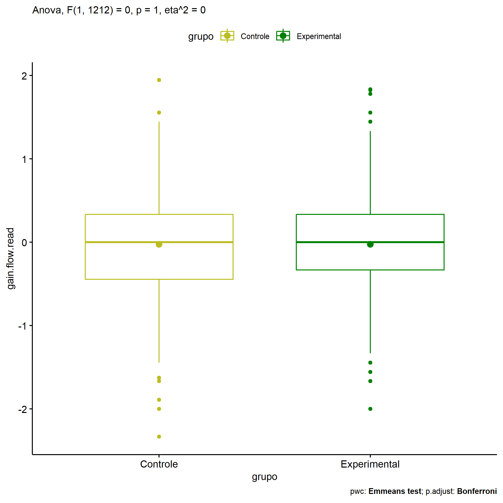
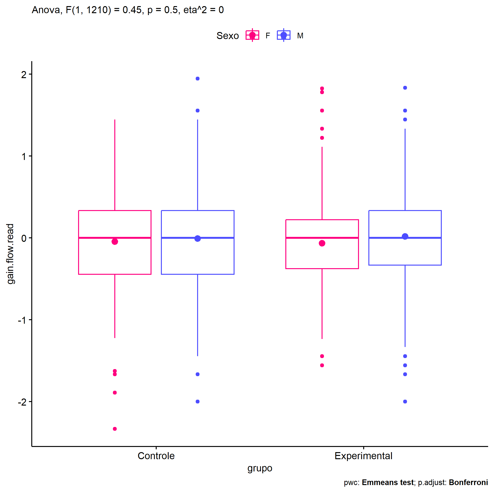
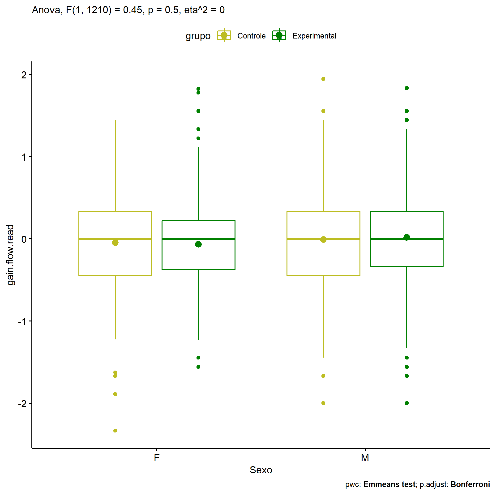
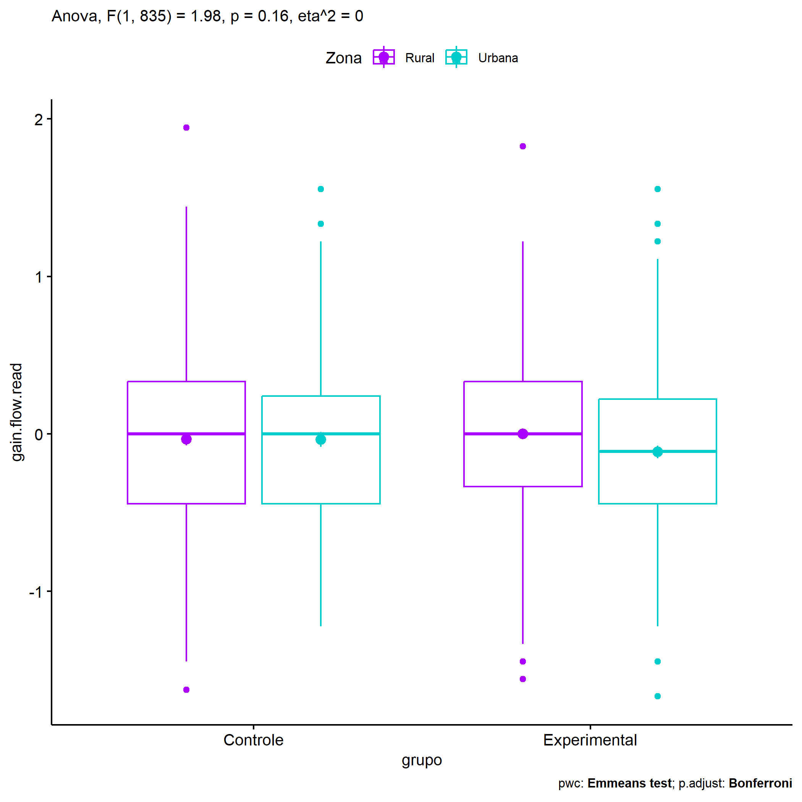
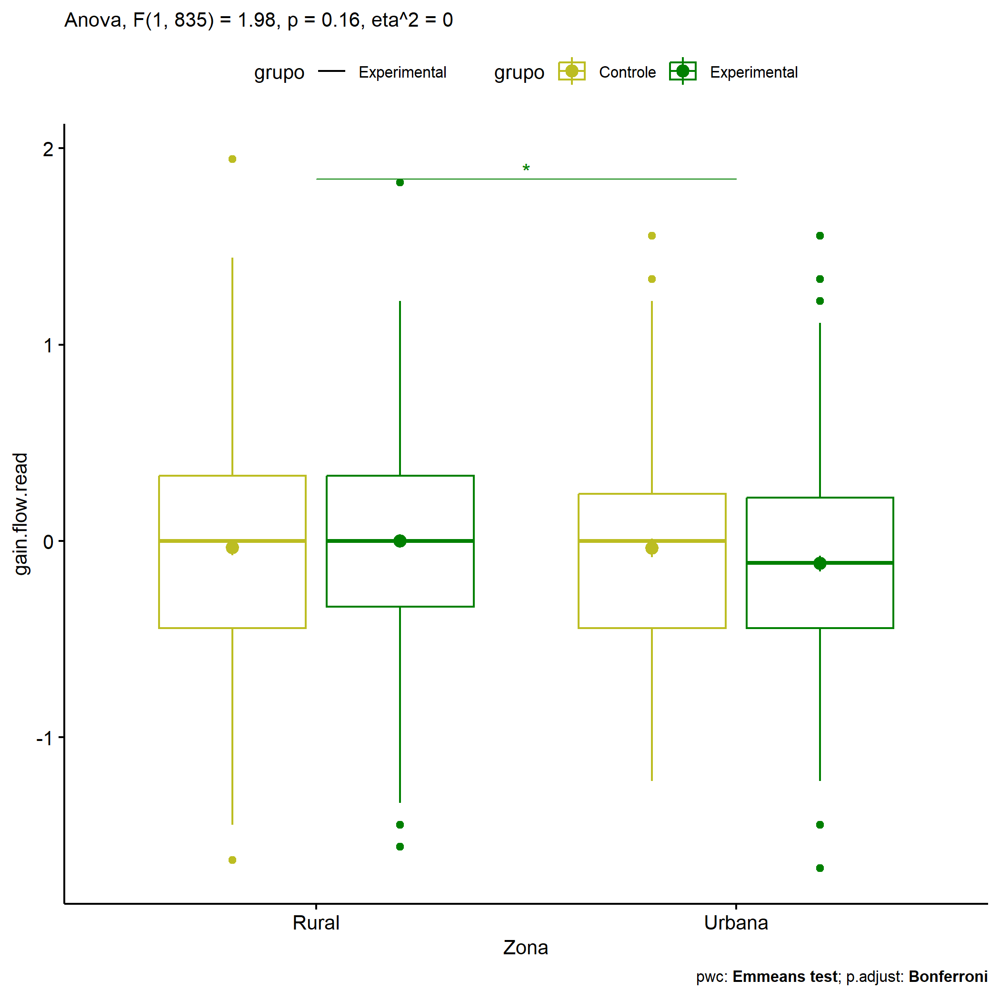
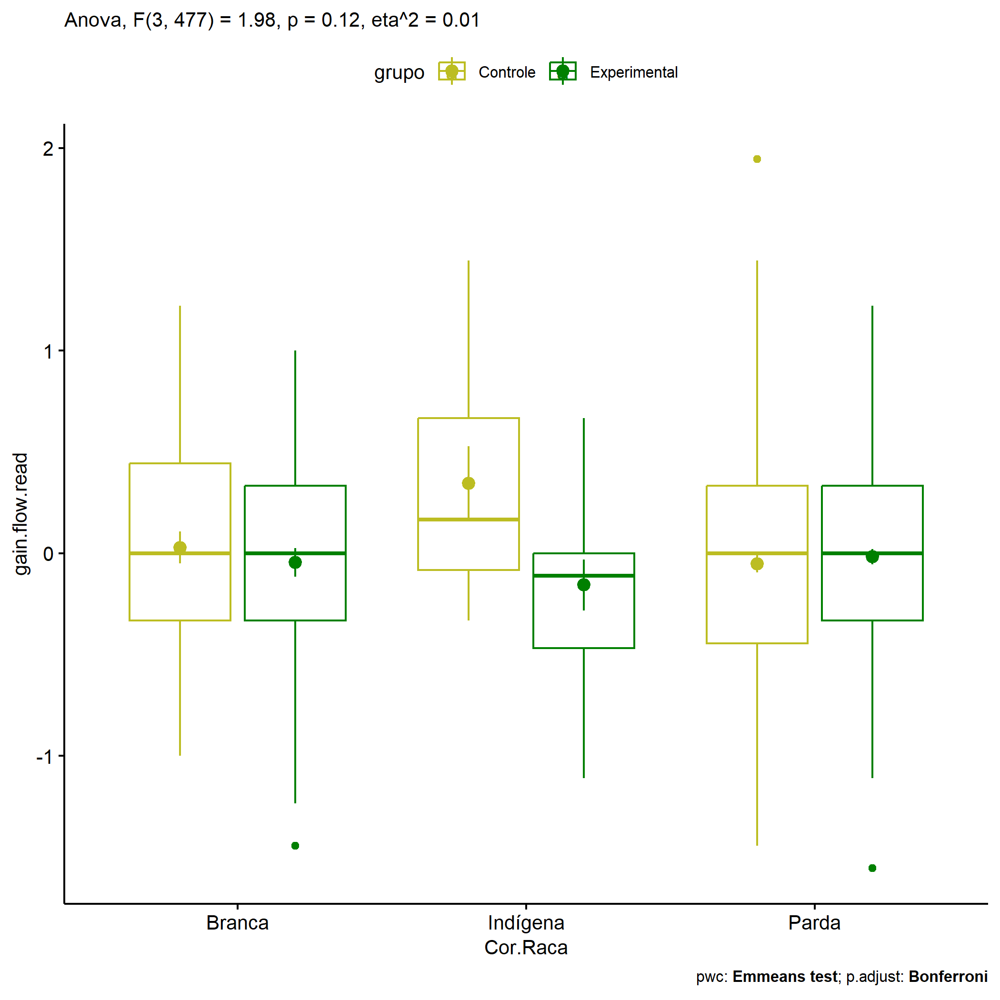

ANOVA in Gains for gain flow (ativ. leitura) (gain flow (ativ. leitura))
================
Geiser C. Challco <geiser@alumni.usp.br>

- [Descriptive Statistics of Initial
  Data](#descriptive-statistics-of-initial-data)
- [Checking of Assumptions](#checking-of-assumptions)
  - [Assumption: Normality distribution of
    data](#assumption-normality-distribution-of-data)
  - [Assumption: Homogeneity of data
    distribution](#assumption-homogeneity-of-data-distribution)
- [Computation of ANCOVA test and Pairwise
  Comparison](#computation-of-ancova-test-and-pairwise-comparison)
  - [ANCOVA tests for one factor](#ancova-tests-for-one-factor)
  - [ANCOVA tests for two factors](#ancova-tests-for-two-factors)
  - [Pairwise comparisons for one factor:
    **grupo**](#pairwise-comparisons-for-one-factor-grupo)
  - [Pairwise comparisons for two
    factors](#pairwise-comparisons-for-two-factors)
    - [factores: **grupo:Sexo**](#factores-gruposexo)
    - [factores: **grupo:Zona**](#factores-grupozona)
    - [factores: **grupo:Cor.Raca**](#factores-grupocorraca)

**NOTE**

- Teste ANOVA para determinar se houve diferenças significativas no gain
  flow (ativ. leitura) (medido usando a diferença entre post-test e
  pre-testes).
- ANOVA test to determine whether there were significant differences in
  gain flow (ativ. leitura) (measured using the difference between
  post-test and pre-tests).

# Descriptive Statistics of Initial Data

| grupo        | Sexo | Zona   | Cor.Raca | variable       |   n |   mean | median |    min |   max |    sd |    se |    ci |   iqr |
|:-------------|:-----|:-------|:---------|:---------------|----:|-------:|-------:|-------:|------:|------:|------:|------:|------:|
| Controle     | F    |        |          | gain.flow.read | 248 | -0.044 |  0.000 | -2.333 | 1.444 | 0.606 | 0.038 | 0.076 | 0.778 |
| Controle     | M    |        |          | gain.flow.read | 256 | -0.008 |  0.000 | -2.000 | 1.944 | 0.585 | 0.037 | 0.072 | 0.778 |
| Experimental | F    |        |          | gain.flow.read | 365 | -0.066 |  0.000 | -1.556 | 1.825 | 0.557 | 0.029 | 0.057 | 0.597 |
| Experimental | M    |        |          | gain.flow.read | 345 |  0.017 |  0.000 | -2.000 | 1.833 | 0.583 | 0.031 | 0.062 | 0.667 |
| Controle     |      | Rural  |          | gain.flow.read | 235 | -0.034 |  0.000 | -1.625 | 1.944 | 0.586 | 0.038 | 0.075 | 0.778 |
| Controle     |      | Urbana |          | gain.flow.read | 136 | -0.035 |  0.000 | -1.222 | 1.556 | 0.561 | 0.048 | 0.095 | 0.684 |
| Controle     |      |        |          | gain.flow.read | 133 | -0.001 |  0.111 | -2.333 | 1.222 | 0.646 | 0.056 | 0.111 | 0.778 |
| Experimental |      | Rural  |          | gain.flow.read | 269 |  0.000 |  0.000 | -1.556 | 1.825 | 0.556 | 0.034 | 0.067 | 0.667 |
| Experimental |      | Urbana |          | gain.flow.read | 199 | -0.115 | -0.111 | -1.667 | 1.556 | 0.568 | 0.040 | 0.079 | 0.667 |
| Experimental |      |        |          | gain.flow.read | 242 |  0.019 |  0.000 | -2.000 | 1.833 | 0.583 | 0.037 | 0.074 | 0.667 |
| Controle     |      |        | Branca   | gain.flow.read |  49 |  0.028 |  0.000 | -1.000 | 1.222 | 0.555 | 0.079 | 0.159 | 0.778 |
| Controle     |      |        | Indígena | gain.flow.read |  10 |  0.344 |  0.167 | -0.333 | 1.444 | 0.580 | 0.183 | 0.415 | 0.750 |
| Controle     |      |        | Parda    | gain.flow.read | 167 | -0.052 |  0.000 | -1.444 | 1.944 | 0.559 | 0.043 | 0.085 | 0.778 |
| Controle     |      |        | Preta    | gain.flow.read |   1 |  0.000 |  0.000 |  0.000 | 0.000 |       |       |       | 0.000 |
| Controle     |      |        |          | gain.flow.read | 277 | -0.033 |  0.000 | -2.333 | 1.556 | 0.622 | 0.037 | 0.074 | 0.778 |
| Experimental |      |        | Amarela  | gain.flow.read |   2 |  0.389 |  0.389 | -0.111 | 0.889 | 0.707 | 0.500 | 6.353 | 0.500 |
| Experimental |      |        | Branca   | gain.flow.read |  59 | -0.047 |  0.000 | -1.444 | 1.000 | 0.544 | 0.071 | 0.142 | 0.667 |
| Experimental |      |        | Indígena | gain.flow.read |  14 | -0.157 | -0.111 | -1.111 | 0.667 | 0.472 | 0.126 | 0.273 | 0.469 |
| Experimental |      |        | Parda    | gain.flow.read | 183 | -0.017 |  0.000 | -1.556 | 1.222 | 0.505 | 0.037 | 0.074 | 0.667 |
| Experimental |      |        | Preta    | gain.flow.read |   1 |  0.000 |  0.000 |  0.000 | 0.000 |       |       |       | 0.000 |
| Experimental |      |        |          | gain.flow.read | 451 | -0.024 |  0.000 | -2.000 | 1.833 | 0.602 | 0.028 | 0.056 | 0.667 |

# Checking of Assumptions

## Assumption: Normality distribution of data

| var            |    n |   skewness |  kurtosis | symmetry | statistic | method     |         p | p.signif | normality |
|:---------------|-----:|-----------:|----------:|:---------|----------:|:-----------|----------:|:---------|:----------|
| gain.flow.read | 1214 | -0.0515156 | 0.4658310 | YES      |  8.769913 | D’Agostino | 0.0124634 | ns       | \-        |
| gain.flow.read |  839 |  0.0698064 | 0.1827677 | YES      |  2.058533 | D’Agostino | 0.3572689 | ns       | \-        |
| gain.flow.read |  486 |  0.1219590 | 0.0554747 | YES      |  1.454698 | D’Agostino | 0.4831882 | ns       | \-        |

## Assumption: Homogeneity of data distribution

| var            | method        | formula                              |    n | df1 |  df2 | statistic |         p | p.signif |
|:---------------|:--------------|:-------------------------------------|-----:|----:|-----:|----------:|----------:|:---------|
| gain.flow.read | Levene’s test | `gain.flow.read`~`grupo`\*`Sexo`     | 1214 |   3 | 1210 | 0.7535315 | 0.5203399 | ns       |
| gain.flow.read | Levene’s test | `gain.flow.read`~`grupo`\*`Zona`     |  839 |   3 |  835 | 0.4918300 | 0.6880360 | ns       |
| gain.flow.read | Levene’s test | `gain.flow.read`~`grupo`\*`Cor.Raca` |  486 |   8 |  477 | 0.7766414 | 0.6235282 | ns       |

# Computation of ANCOVA test and Pairwise Comparison

## ANCOVA tests for one factor

| Effect   | DFn |  DFd |   SSn |     SSd |     F |     p |   ges | p\<.05 |
|:---------|----:|-----:|------:|--------:|------:|------:|------:|:-------|
| grupo    |   1 | 1212 | 0.000 | 408.780 | 0.000 | 0.996 | 0.000 |        |
| Sexo     |   1 | 1212 | 1.212 | 407.568 | 3.603 | 0.058 | 0.003 |        |
| Zona     |   1 |  837 | 0.889 | 270.094 | 2.754 | 0.097 | 0.003 |        |
| Cor.Raca |   4 |  481 | 0.528 | 138.316 | 0.459 | 0.766 | 0.004 |        |

## ANCOVA tests for two factors

|     | Effect         | DFn |  DFd |   SSn |     SSd |     F |     p |   ges | p\<.05 |
|:----|:---------------|----:|-----:|------:|--------:|------:|------:|------:|:-------|
| 3   | grupo:Sexo     |   1 | 1210 | 0.153 | 407.415 | 0.454 | 0.501 | 0.000 |        |
| 6   | grupo:Zona     |   1 |  835 | 0.639 | 269.434 | 1.981 | 0.160 | 0.002 |        |
| 9   | grupo:Cor.Raca |   3 |  477 | 1.696 | 136.591 | 1.975 | 0.117 | 0.012 |        |

## Pairwise comparisons for one factor: **grupo**

| var            | grupo        |   n |      M |    SE |
|:---------------|:-------------|----:|-------:|------:|
| gain.flow.read | Controle     | 504 | -0.026 | 0.026 |
| gain.flow.read | Experimental | 710 | -0.026 | 0.021 |

| .y.            | group1   | group2       | estimate | conf.low | conf.high |    se | statistic |     p | p.adj | p.adj.signif |
|:---------------|:---------|:-------------|---------:|---------:|----------:|------:|----------:|------:|------:|:-------------|
| gain.flow.read | Controle | Experimental |        0 |   -0.067 |     0.066 | 0.034 |    -0.005 | 0.996 | 0.996 | ns           |

    ## Scale for colour is already present.
    ## Adding another scale for colour, which will replace the existing scale.

<!-- -->

## Pairwise comparisons for two factors

### factores: **grupo:Sexo**

| var            | grupo        | Sexo |   n |      M |    SE |
|:---------------|:-------------|:-----|----:|-------:|------:|
| gain.flow.read | Controle     | F    | 248 | -0.044 | 0.038 |
| gain.flow.read | Controle     | M    | 256 | -0.008 | 0.037 |
| gain.flow.read | Experimental | F    | 365 | -0.066 | 0.029 |
| gain.flow.read | Experimental | M    | 345 |  0.017 | 0.031 |

| .y.            | grupo        | Sexo | group1   | group2       | estimate | conf.low | conf.high |    se | statistic |     p | p.adj | p.adj.signif |
|:---------------|:-------------|:-----|:---------|:-------------|---------:|---------:|----------:|------:|----------:|------:|------:|:-------------|
| gain.flow.read |              | F    | Controle | Experimental |    0.021 |   -0.073 |     0.115 | 0.048 |     0.443 | 0.658 | 0.658 | ns           |
| gain.flow.read |              | M    | Controle | Experimental |   -0.024 |   -0.118 |     0.070 | 0.048 |    -0.509 | 0.611 | 0.611 | ns           |
| gain.flow.read | Controle     |      | F        | M            |   -0.037 |   -0.138 |     0.065 | 0.052 |    -0.708 | 0.479 | 0.479 | ns           |
| gain.flow.read | Experimental |      | F        | M            |   -0.082 |   -0.168 |     0.003 | 0.044 |    -1.885 | 0.060 | 0.060 | ns           |

    ## Scale for colour is already present.
    ## Adding another scale for colour, which will replace the existing scale.

<!-- -->

    ## Scale for colour is already present.
    ## Adding another scale for colour, which will replace the existing scale.

<!-- -->

### factores: **grupo:Zona**

| var            | grupo        | Zona   |   n |      M |    SE |
|:---------------|:-------------|:-------|----:|-------:|------:|
| gain.flow.read | Controle     | Rural  | 235 | -0.034 | 0.038 |
| gain.flow.read | Controle     | Urbana | 136 | -0.035 | 0.048 |
| gain.flow.read | Experimental | Rural  | 269 |  0.000 | 0.034 |
| gain.flow.read | Experimental | Urbana | 199 | -0.115 | 0.040 |

| .y.            | grupo        | Zona   | group1   | group2       | estimate | conf.low | conf.high |    se | statistic |     p | p.adj | p.adj.signif |
|:---------------|:-------------|:-------|:---------|:-------------|---------:|---------:|----------:|------:|----------:|------:|------:|:-------------|
| gain.flow.read |              | Rural  | Controle | Experimental |   -0.035 |   -0.134 |     0.065 | 0.051 |    -0.684 | 0.494 | 0.494 | ns           |
| gain.flow.read |              | Urbana | Controle | Experimental |    0.079 |   -0.045 |     0.203 | 0.063 |     1.256 | 0.210 | 0.210 | ns           |
| gain.flow.read | Controle     |        | Rural    | Urbana       |    0.001 |   -0.119 |     0.121 | 0.061 |     0.013 | 0.990 | 0.990 | ns           |
| gain.flow.read | Experimental |        | Rural    | Urbana       |    0.115 |    0.011 |     0.219 | 0.053 |     2.162 | 0.031 | 0.031 | \*           |

    ## Scale for colour is already present.
    ## Adding another scale for colour, which will replace the existing scale.

<!-- -->

    ## Scale for colour is already present.
    ## Adding another scale for colour, which will replace the existing scale.

<!-- -->

### factores: **grupo:Cor.Raca**

| var            | grupo        | Cor.Raca |   n |      M |    SE |
|:---------------|:-------------|:---------|----:|-------:|------:|
| gain.flow.read | Controle     | Branca   |  49 |  0.028 | 0.079 |
| gain.flow.read | Controle     | Indígena |  10 |  0.344 | 0.183 |
| gain.flow.read | Controle     | Parda    | 167 | -0.052 | 0.043 |
| gain.flow.read | Experimental | Branca   |  59 | -0.047 | 0.071 |
| gain.flow.read | Experimental | Indígena |  14 | -0.157 | 0.126 |
| gain.flow.read | Experimental | Parda    | 183 | -0.017 | 0.037 |

| .y.            | grupo        | Cor.Raca | group1   | group2       | estimate | conf.low | conf.high |    se | statistic |     p | p.adj | p.adj.signif |
|:---------------|:-------------|:---------|:---------|:-------------|---------:|---------:|----------:|------:|----------:|------:|------:|:-------------|
| gain.flow.read |              | Branca   | Controle | Experimental |    0.075 |   -0.128 |     0.278 | 0.103 |     0.723 | 0.470 | 0.470 | ns           |
| gain.flow.read |              | Indígena | Controle | Experimental |    0.501 |    0.066 |     0.936 | 0.221 |     2.264 | 0.024 | 0.024 | \*           |
| gain.flow.read |              | Parda    | Controle | Experimental |   -0.035 |   -0.148 |     0.077 | 0.057 |    -0.619 | 0.536 | 0.536 | ns           |
| gain.flow.read | Controle     |          | Branca   | Indígena     |   -0.316 |   -0.681 |     0.048 | 0.186 |    -1.704 | 0.089 | 0.267 | ns           |
| gain.flow.read | Controle     |          | Branca   | Parda        |    0.081 |   -0.090 |     0.251 | 0.087 |     0.927 | 0.354 | 1.000 | ns           |
| gain.flow.read | Controle     |          | Indígena | Parda        |    0.397 |    0.055 |     0.739 | 0.174 |     2.279 | 0.023 | 0.069 | ns           |
| gain.flow.read | Experimental |          | Branca   | Indígena     |    0.110 |   -0.202 |     0.423 | 0.159 |     0.693 | 0.488 | 1.000 | ns           |
| gain.flow.read | Experimental |          | Branca   | Parda        |   -0.030 |   -0.187 |     0.128 | 0.080 |    -0.370 | 0.712 | 1.000 | ns           |
| gain.flow.read | Experimental |          | Indígena | Parda        |   -0.140 |   -0.431 |     0.152 | 0.148 |    -0.943 | 0.346 | 1.000 | ns           |

    ## Scale for colour is already present.
    ## Adding another scale for colour, which will replace the existing scale.

<!-- -->

    ## Scale for colour is already present.
    ## Adding another scale for colour, which will replace the existing scale.

<!-- -->
