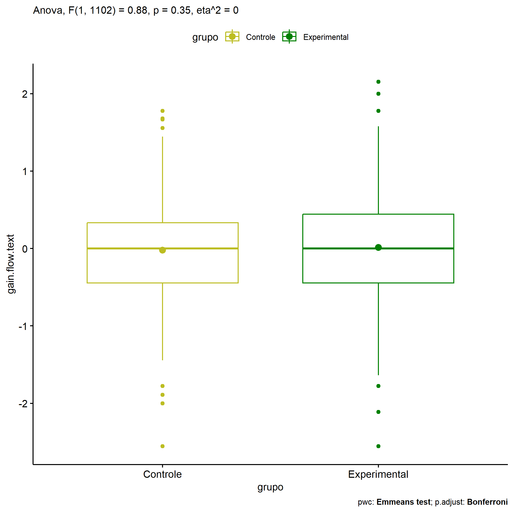
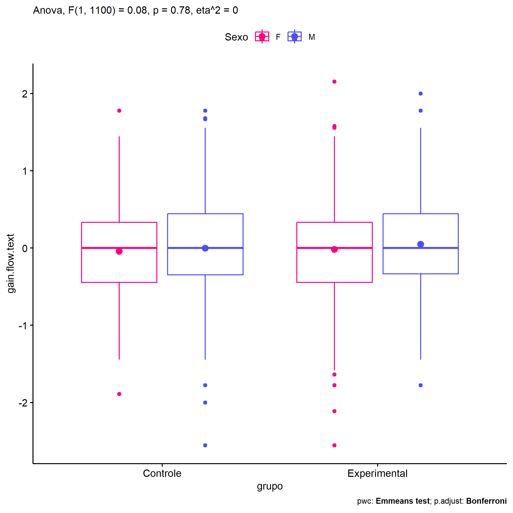
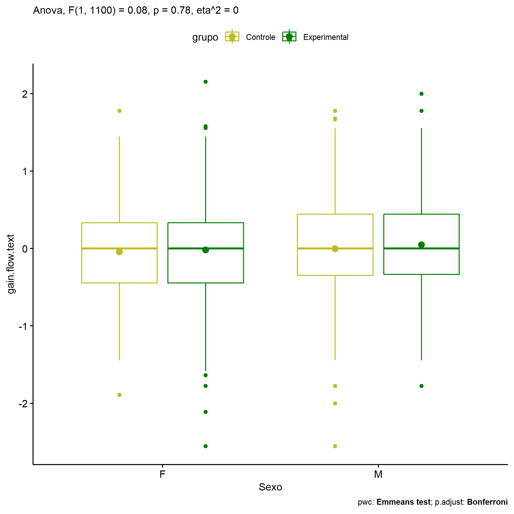
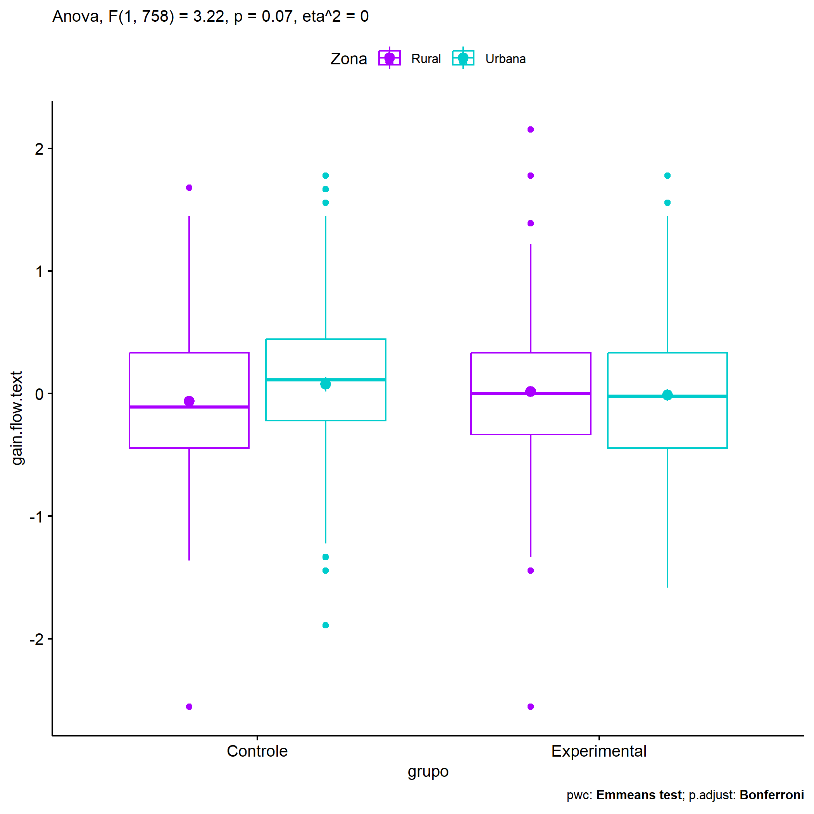
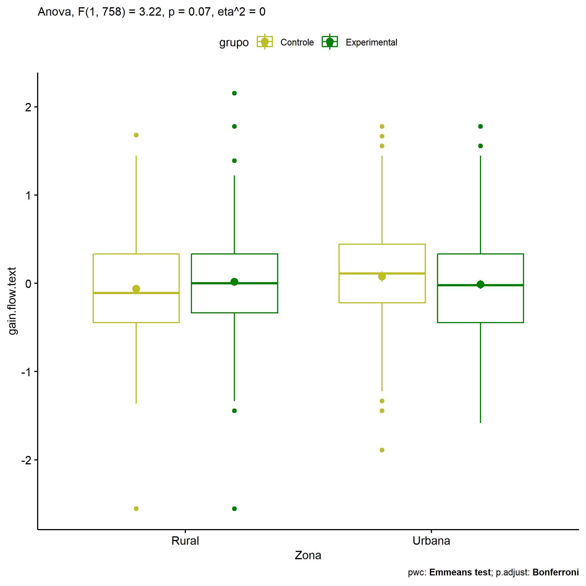
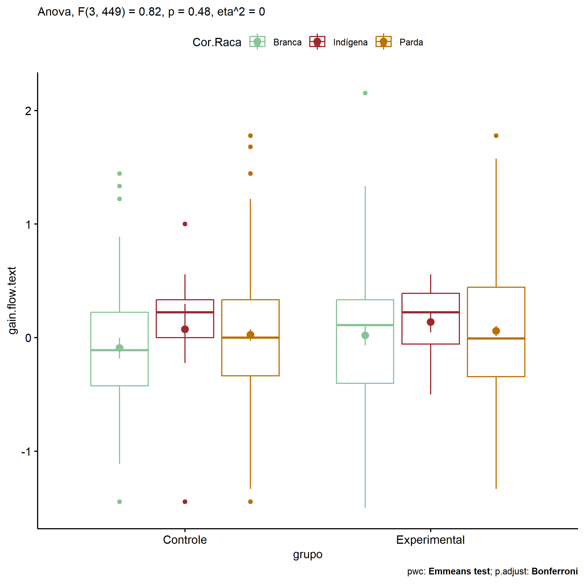
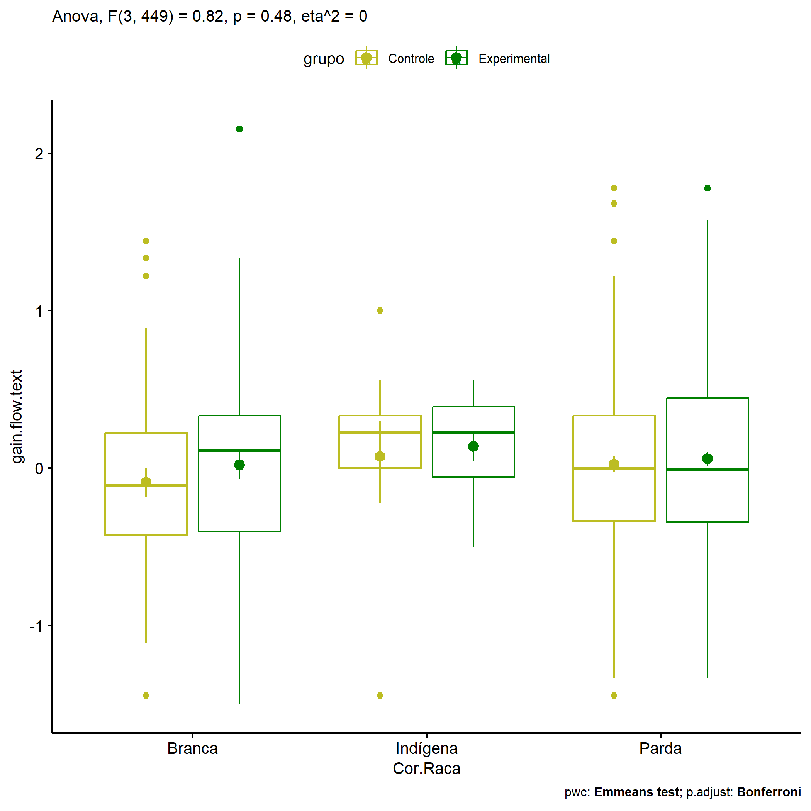

ANOVA in Gains for gain flow (prod. textual) (gain flow (prod. textual))
================
Geiser C. Challco <geiser@alumni.usp.br>

- [Descriptive Statistics of Initial
  Data](#descriptive-statistics-of-initial-data)
- [Checking of Assumptions](#checking-of-assumptions)
  - [Assumption: Normality distribution of
    data](#assumption-normality-distribution-of-data)
  - [Assumption: Homogeneity of data
    distribution](#assumption-homogeneity-of-data-distribution)
- [Computation of ANCOVA test and Pairwise
  Comparison](#computation-of-ancova-test-and-pairwise-comparison)
  - [ANCOVA tests for one factor](#ancova-tests-for-one-factor)
  - [ANCOVA tests for two factors](#ancova-tests-for-two-factors)
  - [Pairwise comparisons for one factor:
    **grupo**](#pairwise-comparisons-for-one-factor-grupo)
  - [Pairwise comparisons for two
    factors](#pairwise-comparisons-for-two-factors)
    - [factores: **grupo:Sexo**](#factores-gruposexo)
    - [factores: **grupo:Zona**](#factores-grupozona)
    - [factores: **grupo:Cor.Raca**](#factores-grupocorraca)

**NOTE**

- Teste ANOVA para determinar se houve diferenças significativas no gain
  flow (prod. textual) (medido usando a diferença entre post-test e
  pre-testes).
- ANOVA test to determine whether there were significant differences in
  gain flow (prod. textual) (measured using the difference between
  post-test and pre-tests).

# Descriptive Statistics of Initial Data

| grupo        | Sexo | Zona   | Cor.Raca | variable       |   n |   mean | median |    min |    max |    sd |    se |    ci |   iqr |
|:-------------|:-----|:-------|:---------|:---------------|----:|-------:|-------:|-------:|-------:|------:|------:|------:|------:|
| Controle     | F    |        |          | gain.flow.text | 226 | -0.044 |  0.000 | -1.889 |  1.778 | 0.593 | 0.039 | 0.078 | 0.778 |
| Controle     | M    |        |          | gain.flow.text | 229 | -0.002 |  0.000 | -2.556 |  1.778 | 0.681 | 0.045 | 0.089 | 0.792 |
| Experimental | F    |        |          | gain.flow.text | 335 | -0.018 |  0.000 | -2.556 |  2.153 | 0.652 | 0.036 | 0.070 | 0.778 |
| Experimental | M    |        |          | gain.flow.text | 314 |  0.047 |  0.000 | -1.778 |  2.000 | 0.630 | 0.036 | 0.070 | 0.778 |
| Controle     |      | Rural  |          | gain.flow.text | 217 | -0.063 | -0.111 | -2.556 |  1.681 | 0.623 | 0.042 | 0.083 | 0.778 |
| Controle     |      | Urbana |          | gain.flow.text | 116 |  0.076 |  0.111 | -1.889 |  1.778 | 0.629 | 0.058 | 0.116 | 0.667 |
| Controle     |      |        |          | gain.flow.text | 122 | -0.046 |  0.111 | -2.000 |  1.778 | 0.669 | 0.061 | 0.120 | 0.865 |
| Experimental |      | Rural  |          | gain.flow.text | 255 |  0.016 |  0.000 | -2.556 |  2.153 | 0.587 | 0.037 | 0.072 | 0.667 |
| Experimental |      | Urbana |          | gain.flow.text | 174 | -0.013 | -0.021 | -1.583 |  1.778 | 0.646 | 0.049 | 0.097 | 0.778 |
| Experimental |      |        |          | gain.flow.text | 220 |  0.032 |  0.111 | -2.111 |  2.000 | 0.699 | 0.047 | 0.093 | 0.889 |
| Controle     |      |        | Branca   | gain.flow.text |  46 | -0.091 | -0.111 | -1.444 |  1.444 | 0.624 | 0.092 | 0.185 | 0.646 |
| Controle     |      |        | Indígena | gain.flow.text |   9 |  0.074 |  0.222 | -1.444 |  1.000 | 0.671 | 0.224 | 0.516 | 0.333 |
| Controle     |      |        | Parda    | gain.flow.text | 152 |  0.023 |  0.000 | -1.444 |  1.778 | 0.626 | 0.051 | 0.100 | 0.670 |
| Controle     |      |        | Preta    | gain.flow.text |   1 | -0.333 | -0.333 | -0.333 | -0.333 |       |       |       | 0.000 |
| Controle     |      |        |          | gain.flow.text | 247 | -0.041 |  0.000 | -2.556 |  1.667 | 0.651 | 0.041 | 0.082 | 0.778 |
| Experimental |      |        | Branca   | gain.flow.text |  57 |  0.020 |  0.111 | -1.500 |  2.153 | 0.679 | 0.090 | 0.180 | 0.736 |
| Experimental |      |        | Indígena | gain.flow.text |  15 |  0.137 |  0.222 | -0.500 |  0.556 | 0.352 | 0.091 | 0.195 | 0.444 |
| Experimental |      |        | Parda    | gain.flow.text | 176 |  0.058 | -0.007 | -1.333 |  1.778 | 0.590 | 0.045 | 0.088 | 0.788 |
| Experimental |      |        | Preta    | gain.flow.text |   1 |  1.000 |  1.000 |  1.000 |  1.000 |       |       |       | 0.000 |
| Experimental |      |        |          | gain.flow.text | 400 | -0.014 |  0.000 | -2.556 |  2.000 | 0.665 | 0.033 | 0.065 | 0.816 |

# Checking of Assumptions

## Assumption: Normality distribution of data

| var            |    n |   skewness |  kurtosis | symmetry | statistic | method     |         p | p.signif | normality |
|:---------------|-----:|-----------:|----------:|:---------|----------:|:-----------|----------:|:---------|:----------|
| gain.flow.text | 1104 | -0.1098227 | 0.6772418 | YES      |  15.61268 | D’Agostino | 0.0004071 | \*\*     | \-        |
| gain.flow.text |  762 |  0.0134843 | 0.8545731 | YES      |  13.45746 | D’Agostino | 0.0011961 | \*       | \-        |
| gain.flow.text |  457 |  0.2923865 | 0.5022016 | YES      |  10.62239 | D’Agostino | 0.0049360 | \*       | \-        |

## Assumption: Homogeneity of data distribution

| var            | method        | formula                              |    n | df1 |  df2 | statistic |         p | p.signif |
|:---------------|:--------------|:-------------------------------------|-----:|----:|-----:|----------:|----------:|:---------|
| gain.flow.text | Levene’s test | `gain.flow.text`~`grupo`\*`Sexo`     | 1104 |   3 | 1100 | 0.7229139 | 0.5383601 | ns       |
| gain.flow.text | Levene’s test | `gain.flow.text`~`grupo`\*`Zona`     |  762 |   3 |  758 | 0.4086740 | 0.7468139 | ns       |
| gain.flow.text | Levene’s test | `gain.flow.text`~`grupo`\*`Cor.Raca` |  457 |   7 |  449 | 0.9801410 | 0.4449933 | ns       |

# Computation of ANCOVA test and Pairwise Comparison

## ANCOVA tests for one factor

| Effect   | DFn |  DFd |   SSn |     SSd |     F |     p |   ges | p\<.05 |
|:---------|----:|-----:|------:|--------:|------:|------:|------:|:-------|
| grupo    |   1 | 1102 | 0.361 | 452.030 | 0.881 | 0.348 | 0.001 |        |
| Sexo     |   1 | 1102 | 0.825 | 451.566 | 2.013 | 0.156 | 0.002 |        |
| Zona     |   1 |  760 | 0.325 | 290.512 | 0.851 | 0.356 | 0.001 |        |
| Cor.Raca |   3 |  453 | 0.763 | 170.120 | 0.677 | 0.566 | 0.004 |        |

## ANCOVA tests for two factors

|     | Effect         | DFn |  DFd |   SSn |     SSd |     F |     p |   ges | p\<.05 |
|:----|:---------------|----:|-----:|------:|--------:|------:|------:|------:|:-------|
| 3   | grupo:Sexo     |   1 | 1100 | 0.032 | 451.151 | 0.079 | 0.779 | 0.000 |        |
| 6   | grupo:Zona     |   1 |  758 | 1.230 | 289.230 | 3.224 | 0.073 | 0.004 |        |
| 9   | grupo:Cor.Raca |   3 |  449 | 0.930 | 168.794 | 0.825 | 0.481 | 0.005 |        |

## Pairwise comparisons for one factor: **grupo**

| var            | grupo        |   n |      M |    SE |
|:---------------|:-------------|----:|-------:|------:|
| gain.flow.text | Controle     | 455 | -0.023 | 0.030 |
| gain.flow.text | Experimental | 649 |  0.014 | 0.025 |

| .y.            | group1   | group2       | estimate | conf.low | conf.high |    se | statistic |     p | p.adj | p.adj.signif |
|:---------------|:---------|:-------------|---------:|---------:|----------:|------:|----------:|------:|------:|:-------------|
| gain.flow.text | Controle | Experimental |   -0.037 |   -0.114 |      0.04 | 0.039 |    -0.939 | 0.348 | 0.348 | ns           |

    ## Scale for colour is already present.
    ## Adding another scale for colour, which will replace the existing scale.

<!-- -->

## Pairwise comparisons for two factors

### factores: **grupo:Sexo**

| var            | grupo        | Sexo |   n |      M |    SE |
|:---------------|:-------------|:-----|----:|-------:|------:|
| gain.flow.text | Controle     | F    | 226 | -0.044 | 0.039 |
| gain.flow.text | Controle     | M    | 229 | -0.002 | 0.045 |
| gain.flow.text | Experimental | F    | 335 | -0.018 | 0.036 |
| gain.flow.text | Experimental | M    | 314 |  0.047 | 0.036 |

| .y.            | grupo        | Sexo | group1   | group2       | estimate | conf.low | conf.high |    se | statistic |     p | p.adj | p.adj.signif |
|:---------------|:-------------|:-----|:---------|:-------------|---------:|---------:|----------:|------:|----------:|------:|------:|:-------------|
| gain.flow.text |              | F    | Controle | Experimental |   -0.027 |   -0.135 |     0.081 | 0.055 |    -0.489 | 0.625 | 0.625 | ns           |
| gain.flow.text |              | M    | Controle | Experimental |   -0.049 |   -0.158 |     0.060 | 0.056 |    -0.880 | 0.379 | 0.379 | ns           |
| gain.flow.text | Controle     |      | F        | M            |   -0.042 |   -0.160 |     0.075 | 0.060 |    -0.707 | 0.480 | 0.480 | ns           |
| gain.flow.text | Experimental |      | F        | M            |   -0.064 |   -0.163 |     0.034 | 0.050 |    -1.282 | 0.200 | 0.200 | ns           |

    ## Scale for colour is already present.
    ## Adding another scale for colour, which will replace the existing scale.

<!-- -->

    ## Scale for colour is already present.
    ## Adding another scale for colour, which will replace the existing scale.

<!-- -->

### factores: **grupo:Zona**

| var            | grupo        | Zona   |   n |      M |    SE |
|:---------------|:-------------|:-------|----:|-------:|------:|
| gain.flow.text | Controle     | Rural  | 217 | -0.063 | 0.042 |
| gain.flow.text | Controle     | Urbana | 116 |  0.076 | 0.058 |
| gain.flow.text | Experimental | Rural  | 255 |  0.016 | 0.037 |
| gain.flow.text | Experimental | Urbana | 174 | -0.013 | 0.049 |

| .y.            | grupo        | Zona   | group1   | group2       | estimate | conf.low | conf.high |    se | statistic |     p | p.adj | p.adj.signif |
|:---------------|:-------------|:-------|:---------|:-------------|---------:|---------:|----------:|------:|----------:|------:|------:|:-------------|
| gain.flow.text |              | Rural  | Controle | Experimental |   -0.079 |   -0.191 |     0.033 | 0.057 |    -1.387 | 0.166 | 0.166 | ns           |
| gain.flow.text |              | Urbana | Controle | Experimental |    0.089 |   -0.057 |     0.234 | 0.074 |     1.198 | 0.231 | 0.231 | ns           |
| gain.flow.text | Controle     |        | Rural    | Urbana       |   -0.139 |   -0.278 |     0.001 | 0.071 |    -1.950 | 0.052 | 0.052 | ns           |
| gain.flow.text | Experimental |        | Rural    | Urbana       |    0.029 |   -0.090 |     0.149 | 0.061 |     0.482 | 0.630 | 0.630 | ns           |

    ## Scale for colour is already present.
    ## Adding another scale for colour, which will replace the existing scale.

<!-- -->

    ## Scale for colour is already present.
    ## Adding another scale for colour, which will replace the existing scale.

<!-- -->

### factores: **grupo:Cor.Raca**

| var            | grupo        | Cor.Raca |   n |      M |    SE |
|:---------------|:-------------|:---------|----:|-------:|------:|
| gain.flow.text | Controle     | Branca   |  46 | -0.091 | 0.092 |
| gain.flow.text | Controle     | Indígena |   9 |  0.074 | 0.224 |
| gain.flow.text | Controle     | Parda    | 152 |  0.023 | 0.051 |
| gain.flow.text | Experimental | Branca   |  57 |  0.020 | 0.090 |
| gain.flow.text | Experimental | Indígena |  15 |  0.137 | 0.091 |
| gain.flow.text | Experimental | Parda    | 176 |  0.058 | 0.045 |

| .y.            | grupo        | Cor.Raca | group1   | group2       | estimate | conf.low | conf.high |    se | statistic |     p | p.adj | p.adj.signif |
|:---------------|:-------------|:---------|:---------|:-------------|---------:|---------:|----------:|------:|----------:|------:|------:|:-------------|
| gain.flow.text |              | Branca   | Controle | Experimental |   -0.111 |   -0.350 |     0.127 | 0.122 |    -0.917 | 0.360 | 0.360 | ns           |
| gain.flow.text |              | Indígena | Controle | Experimental |   -0.063 |   -0.571 |     0.445 | 0.259 |    -0.244 | 0.808 | 0.808 | ns           |
| gain.flow.text |              | Parda    | Controle | Experimental |   -0.035 |   -0.168 |     0.099 | 0.068 |    -0.512 | 0.609 | 0.609 | ns           |
| gain.flow.text | Controle     |          | Branca   | Indígena     |   -0.165 |   -0.604 |     0.274 | 0.223 |    -0.739 | 0.460 | 1.000 | ns           |
| gain.flow.text | Controle     |          | Branca   | Parda        |   -0.115 |   -0.317 |     0.088 | 0.103 |    -1.110 | 0.268 | 0.803 | ns           |
| gain.flow.text | Controle     |          | Indígena | Parda        |    0.051 |   -0.363 |     0.464 | 0.210 |     0.241 | 0.810 | 1.000 | ns           |
| gain.flow.text | Experimental |          | Branca   | Indígena     |   -0.117 |   -0.466 |     0.233 | 0.178 |    -0.657 | 0.512 | 1.000 | ns           |
| gain.flow.text | Experimental |          | Branca   | Parda        |   -0.038 |   -0.222 |     0.146 | 0.093 |    -0.406 | 0.685 | 1.000 | ns           |
| gain.flow.text | Experimental |          | Indígena | Parda        |    0.079 |   -0.245 |     0.403 | 0.165 |     0.478 | 0.633 | 1.000 | ns           |

    ## Scale for colour is already present.
    ## Adding another scale for colour, which will replace the existing scale.

<!-- -->

    ## Scale for colour is already present.
    ## Adding another scale for colour, which will replace the existing scale.

<!-- -->
