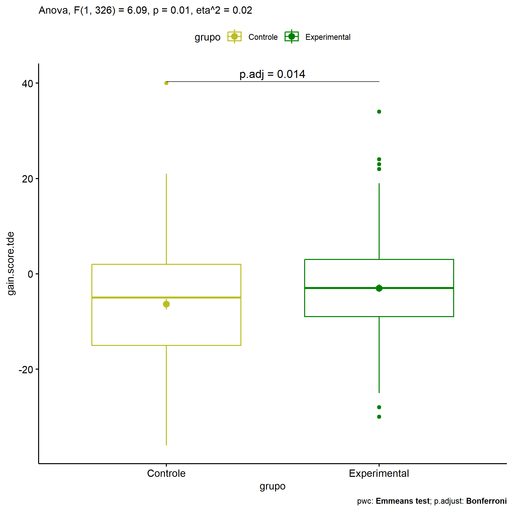
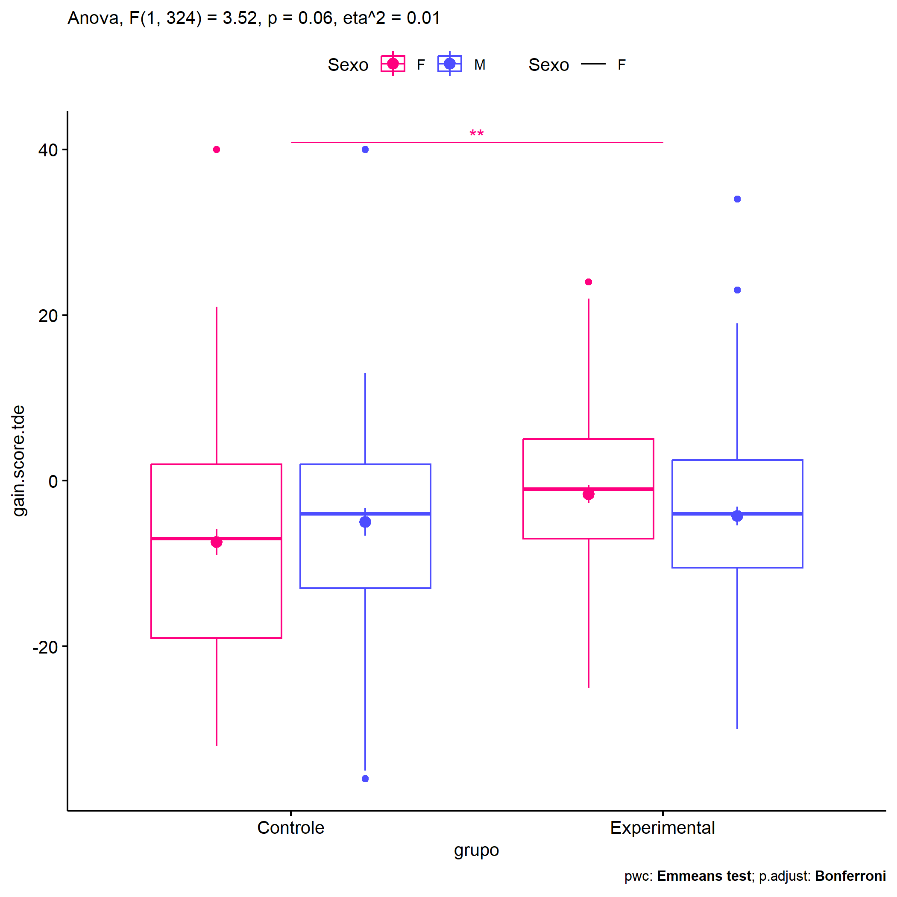
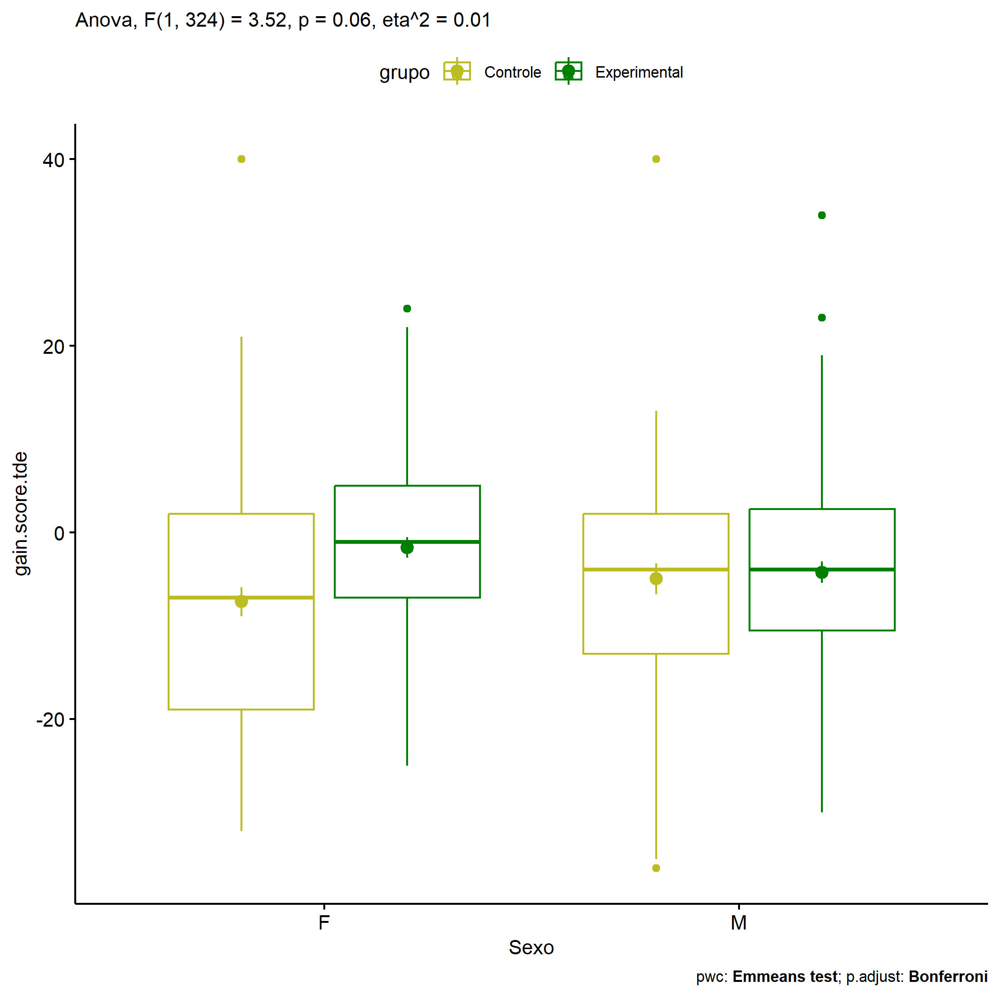
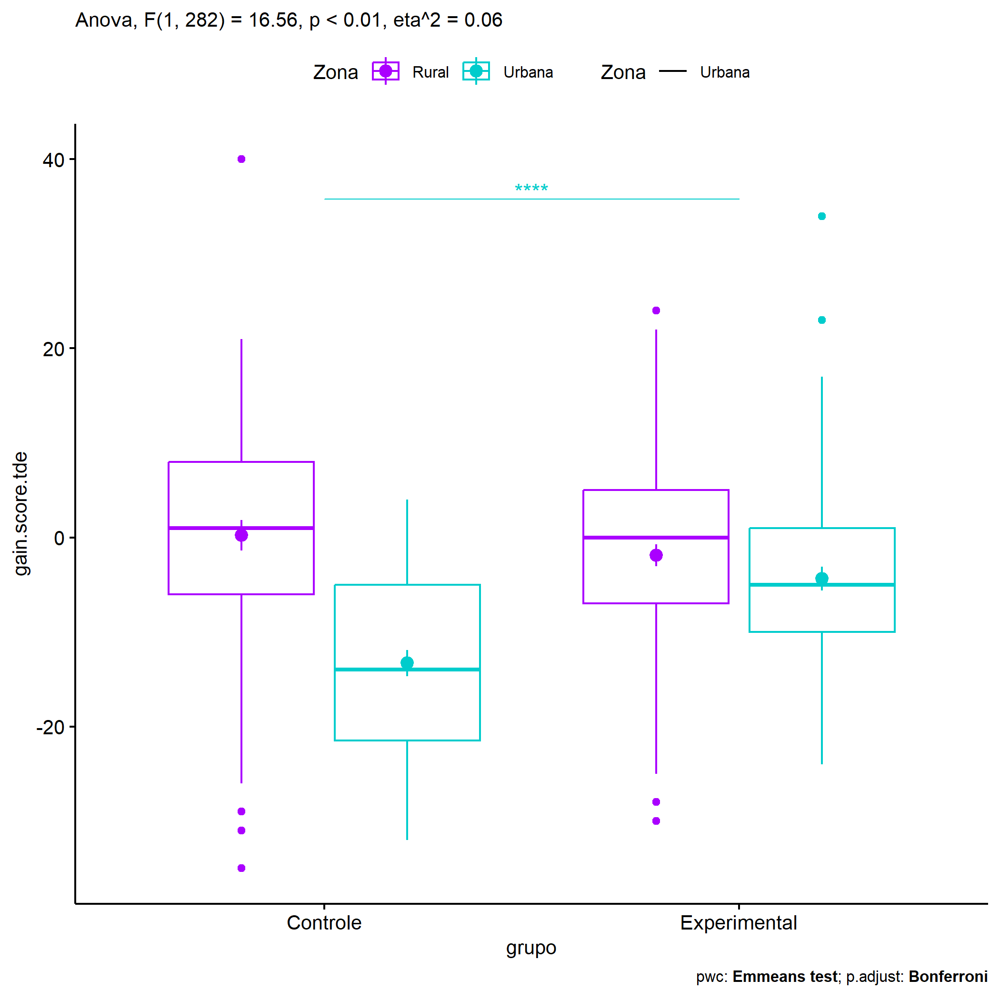
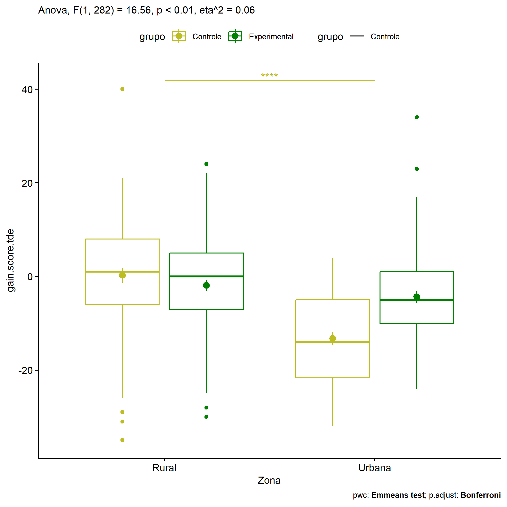

ANOVA in Gains for gain TDE - Escrita (acertos) (gain TDE - Escrita
(acertos))
================
Geiser C. Challco <geiser@alumni.usp.br>

- [Descriptive Statistics of Initial
  Data](#descriptive-statistics-of-initial-data)
- [Checking of Assumptions](#checking-of-assumptions)
  - [Assumption: Normality distribution of
    data](#assumption-normality-distribution-of-data)
  - [Assumption: Homogeneity of data
    distribution](#assumption-homogeneity-of-data-distribution)
- [Computation of ANCOVA test and Pairwise
  Comparison](#computation-of-ancova-test-and-pairwise-comparison)
  - [ANCOVA tests for one factor](#ancova-tests-for-one-factor)
  - [ANCOVA tests for two factors](#ancova-tests-for-two-factors)
  - [Pairwise comparisons for one factor:
    **grupo**](#pairwise-comparisons-for-one-factor-grupo)
  - [Pairwise comparisons for two
    factors](#pairwise-comparisons-for-two-factors)
    - [factores: **grupo:Sexo**](#factores-gruposexo)
    - [factores: **grupo:Zona**](#factores-grupozona)
    - [factores: **grupo:Cor.Raca**](#factores-grupocorraca)

**NOTE**

- Teste ANOVA para determinar se houve diferenças significativas no gain
  TDE - Escrita (acertos) (medido usando a diferença entre post-test e
  pre-testes).
- ANOVA test to determine whether there were significant differences in
  gain TDE - Escrita (acertos) (measured using the difference between
  post-test and pre-tests).

# Descriptive Statistics of Initial Data

| grupo        | Sexo | Zona   | Cor.Raca | variable       |   n |    mean | median | min | max |     sd |    se |    ci |   iqr |
|:-------------|:-----|:-------|:---------|:---------------|----:|--------:|-------:|----:|----:|-------:|------:|------:|------:|
| Controle     | F    |        |          | gain.score.tde |  80 |  -7.412 |   -7.0 | -32 |  40 | 13.847 | 1.548 | 3.081 | 21.00 |
| Controle     | M    |        |          | gain.score.tde |  61 |  -4.967 |   -4.0 | -36 |  40 | 13.097 | 1.677 | 3.354 | 15.00 |
| Experimental | F    |        |          | gain.score.tde |  88 |  -1.614 |   -1.0 | -25 |  24 | 10.164 | 1.083 | 2.153 | 12.00 |
| Experimental | M    |        |          | gain.score.tde |  99 |  -4.263 |   -4.0 | -30 |  34 | 11.519 | 1.158 | 2.297 | 13.00 |
| Controle     |      | Rural  |          | gain.score.tde |  69 |   0.232 |    1.0 | -35 |  40 | 13.273 | 1.598 | 3.189 | 14.00 |
| Controle     |      | Urbana |          | gain.score.tde |  55 | -13.291 |  -14.0 | -32 |   4 | 10.192 | 1.374 | 2.755 | 16.50 |
| Controle     |      |        |          | gain.score.tde |  17 | -10.647 |   -6.0 | -36 |   5 | 11.467 | 2.781 | 5.896 | 10.00 |
| Experimental |      | Rural  |          | gain.score.tde |  87 |  -1.897 |    0.0 | -30 |  24 | 10.724 | 1.150 | 2.286 | 12.00 |
| Experimental |      | Urbana |          | gain.score.tde |  75 |  -4.360 |   -5.0 | -24 |  34 | 10.869 | 1.255 | 2.501 | 11.00 |
| Experimental |      |        |          | gain.score.tde |  25 |  -2.880 |   -2.0 | -28 |  23 | 11.973 | 2.395 | 4.942 | 12.00 |
| Controle     |      |        | Branca   | gain.score.tde |  21 | -10.905 |  -13.0 | -30 |  11 | 14.380 | 3.138 | 6.546 | 25.00 |
| Controle     |      |        | Indígena | gain.score.tde |   6 |   4.167 |    6.5 | -10 |  12 |  8.060 | 3.291 | 8.459 |  7.75 |
| Controle     |      |        | Parda    | gain.score.tde |  39 |  -7.154 |   -3.0 | -35 |  13 | 13.952 | 2.234 | 4.523 | 19.50 |
| Controle     |      |        |          | gain.score.tde |  75 |  -5.507 |   -6.0 | -36 |  40 | 13.054 | 1.507 | 3.004 | 13.00 |
| Experimental |      |        | Branca   | gain.score.tde |  10 |   2.600 |    0.5 | -13 |  23 | 10.233 | 3.236 | 7.320 |  3.75 |
| Experimental |      |        | Indígena | gain.score.tde |   1 | -13.000 |  -13.0 | -13 | -13 |        |       |       |  0.00 |
| Experimental |      |        | Parda    | gain.score.tde |  45 |  -4.289 |   -5.0 | -30 |  24 | 11.973 | 1.785 | 3.597 | 15.00 |
| Experimental |      |        |          | gain.score.tde | 131 |  -2.931 |   -3.0 | -28 |  34 | 10.590 | 0.925 | 1.830 | 11.00 |

# Checking of Assumptions

## Assumption: Normality distribution of data

| var            |   n |   skewness |   kurtosis | symmetry | statistic | method     |         p | p.signif | normality |
|:---------------|----:|-----------:|-----------:|:---------|----------:|:-----------|----------:|:---------|:----------|
| gain.score.tde | 328 |  0.1891066 |  0.8829417 | YES      |  9.082058 | D’Agostino | 0.0106624 | ns       | \-        |
| gain.score.tde | 286 |  0.0629976 |  1.1642117 | YES      |  9.283413 | D’Agostino | 0.0096412 | \*       | \-        |
| gain.score.tde | 122 | -0.1520366 | -0.7107407 | YES      |  4.650295 | D’Agostino | 0.0977690 | ns       | QQ        |

## Assumption: Homogeneity of data distribution

| var            | method        | formula                              |   n | df1 | df2 | statistic |         p | p.signif |
|:---------------|:--------------|:-------------------------------------|----:|----:|----:|----------:|----------:|:---------|
| gain.score.tde | Levene’s test | `gain.score.tde`~`grupo`\*`Sexo`     | 328 |   3 | 324 | 2.6482382 | 0.0489747 | ns       |
| gain.score.tde | Levene’s test | `gain.score.tde`~`grupo`\*`Zona`     | 286 |   3 | 282 | 0.3631319 | 0.7796767 | ns       |
| gain.score.tde | Levene’s test | `gain.score.tde`~`grupo`\*`Cor.Raca` | 122 |   5 | 116 | 1.9338964 | 0.0939166 | ns       |

# Computation of ANCOVA test and Pairwise Comparison

## ANCOVA tests for one factor

| Effect   | DFn | DFd |      SSn |      SSd |      F | p       |   ges | p\<.05 |
|:---------|----:|----:|---------:|---------:|-------:|:--------|------:|:-------|
| grupo    |   1 | 326 |  895.998 | 47963.22 |  6.090 | 0.014   | 0.018 | \*     |
| Sexo     |   1 | 326 |    2.001 | 48857.22 |  0.013 | 0.908   | 0.000 |        |
| Zona     |   1 | 284 | 3658.929 | 38926.19 | 26.695 | \<0.001 | 0.086 | \*     |
| Cor.Raca |   2 | 119 |  399.060 | 20766.92 |  1.143 | 0.322   | 0.019 |        |

## ANCOVA tests for two factors

|     | Effect         | DFn | DFd |      SSn |      SSd |      F | p       |   ges | p\<.05 |
|:----|:---------------|----:|----:|---------:|---------:|-------:|:--------|------:|:-------|
| 3   | grupo:Sexo     |   1 | 324 |  515.342 | 47429.36 |  3.520 | 0.062   | 0.011 |        |
| 6   | grupo:Zona     |   1 | 282 | 2127.035 | 36220.98 | 16.560 | \<0.001 | 0.055 | \*     |
| 9   | grupo:Cor.Raca |   2 | 116 | 1005.129 | 19107.36 |  3.051 | 0.051   | 0.050 |        |

## Pairwise comparisons for one factor: **grupo**

| var            | grupo        |   n |      M |    SE |
|:---------------|:-------------|----:|-------:|------:|
| gain.score.tde | Controle     | 141 | -6.355 | 1.140 |
| gain.score.tde | Experimental | 187 | -3.016 | 0.801 |

| .y.            | group1   | group2       | estimate | conf.low | conf.high |    se | statistic |     p | p.adj | p.adj.signif |
|:---------------|:---------|:-------------|---------:|---------:|----------:|------:|----------:|------:|------:|:-------------|
| gain.score.tde | Controle | Experimental |   -3.339 |       -6 |    -0.677 | 1.353 |    -2.468 | 0.014 | 0.014 | \*           |

    ## Scale for colour is already present.
    ## Adding another scale for colour, which will replace the existing scale.

<!-- -->

## Pairwise comparisons for two factors

### factores: **grupo:Sexo**

| var            | grupo        | Sexo |   n |      M |    SE |
|:---------------|:-------------|:-----|----:|-------:|------:|
| gain.score.tde | Controle     | F    |  80 | -7.412 | 1.548 |
| gain.score.tde | Controle     | M    |  61 | -4.967 | 1.677 |
| gain.score.tde | Experimental | F    |  88 | -1.614 | 1.083 |
| gain.score.tde | Experimental | M    |  99 | -4.263 | 1.158 |

| .y.            | grupo        | Sexo | group1   | group2       | estimate | conf.low | conf.high |    se | statistic |     p | p.adj | p.adj.signif |
|:---------------|:-------------|:-----|:---------|:-------------|---------:|---------:|----------:|------:|----------:|------:|------:|:-------------|
| gain.score.tde |              | F    | Controle | Experimental |   -5.799 |   -9.476 |    -2.122 | 1.869 |    -3.103 | 0.002 | 0.002 | \*\*         |
| gain.score.tde |              | M    | Controle | Experimental |   -0.705 |   -4.579 |     3.170 | 1.969 |    -0.358 | 0.721 | 0.721 | ns           |
| gain.score.tde | Controle     |      | F        | M            |   -2.445 |   -6.491 |     1.601 | 2.057 |    -1.189 | 0.235 | 0.235 | ns           |
| gain.score.tde | Experimental |      | F        | M            |    2.649 |   -0.838 |     6.136 | 1.773 |     1.494 | 0.136 | 0.136 | ns           |

    ## Scale for colour is already present.
    ## Adding another scale for colour, which will replace the existing scale.

<!-- -->

    ## Scale for colour is already present.
    ## Adding another scale for colour, which will replace the existing scale.

<!-- -->

### factores: **grupo:Zona**

| var            | grupo        | Zona   |   n |       M |    SE |
|:---------------|:-------------|:-------|----:|--------:|------:|
| gain.score.tde | Controle     | Rural  |  69 |   0.232 | 1.598 |
| gain.score.tde | Controle     | Urbana |  55 | -13.291 | 1.374 |
| gain.score.tde | Experimental | Rural  |  87 |  -1.897 | 1.150 |
| gain.score.tde | Experimental | Urbana |  75 |  -4.360 | 1.255 |

| .y.            | grupo        | Zona   | group1   | group2       | estimate | conf.low | conf.high |    se | statistic | p       | p.adj   | p.adj.signif |
|:---------------|:-------------|:-------|:---------|:-------------|---------:|---------:|----------:|------:|----------:|:--------|:--------|:-------------|
| gain.score.tde |              | Rural  | Controle | Experimental |    2.128 |   -1.468 |     5.725 | 1.827 |     1.165 | 0.245   | 0.245   | ns           |
| gain.score.tde |              | Urbana | Controle | Experimental |   -8.931 |  -12.891 |    -4.971 | 2.012 |    -4.439 | \<0.001 | \<0.001 | \*\*\*\*     |
| gain.score.tde | Controle     |        | Rural    | Urbana       |   13.523 |    9.490 |    17.555 | 2.049 |     6.601 | \<0.001 | \<0.001 | \*\*\*\*     |
| gain.score.tde | Experimental |        | Rural    | Urbana       |    2.463 |   -1.052 |     5.979 | 1.786 |     1.379 | 0.169   | 0.169   | ns           |

    ## Scale for colour is already present.
    ## Adding another scale for colour, which will replace the existing scale.

<!-- -->

    ## Scale for colour is already present.
    ## Adding another scale for colour, which will replace the existing scale.

<!-- -->

### factores: **grupo:Cor.Raca**

| var            | grupo        | Cor.Raca |   n |       M |    SE |
|:---------------|:-------------|:---------|----:|--------:|------:|
| gain.score.tde | Controle     | Branca   |  21 | -10.905 | 3.138 |
| gain.score.tde | Controle     | Indígena |   6 |   4.167 | 3.291 |
| gain.score.tde | Controle     | Parda    |  39 |  -7.154 | 2.234 |
| gain.score.tde | Experimental | Branca   |  10 |   2.600 | 3.236 |
| gain.score.tde | Experimental | Parda    |  45 |  -4.289 | 1.785 |

|     | .y.            | grupo        | Cor.Raca | group1   | group2       | estimate | conf.low | conf.high |    se | statistic |     p | p.adj | p.adj.signif |
|:----|:---------------|:-------------|:---------|:---------|:-------------|---------:|---------:|----------:|------:|----------:|------:|------:|:-------------|
| 1   | gain.score.tde |              | Branca   | Controle | Experimental |  -13.505 |  -23.271 |    -3.738 | 4.931 |    -2.739 | 0.007 | 0.007 | \*\*         |
| 3   | gain.score.tde |              | Parda    | Controle | Experimental |   -2.865 |   -8.426 |     2.696 | 2.808 |    -1.020 | 0.310 | 0.310 | ns           |
| 4   | gain.score.tde | Controle     |          | Branca   | Indígena     |  -15.071 |  -26.839 |    -3.304 | 5.941 |    -2.537 | 0.013 | 0.038 | \*           |
| 5   | gain.score.tde | Controle     |          | Branca   | Parda        |   -3.751 |  -10.631 |     3.129 | 3.474 |    -1.080 | 0.282 | 0.847 | ns           |
| 6   | gain.score.tde | Controle     |          | Indígena | Parda        |   11.321 |    0.173 |    22.468 | 5.628 |     2.011 | 0.047 | 0.140 | ns           |
| 8   | gain.score.tde | Experimental |          | Branca   | Parda        |    6.889 |   -1.998 |    15.776 | 4.487 |     1.535 | 0.127 | 0.127 | ns           |

    ## Scale for colour is already present.
    ## Adding another scale for colour, which will replace the existing scale.

<!-- -->
