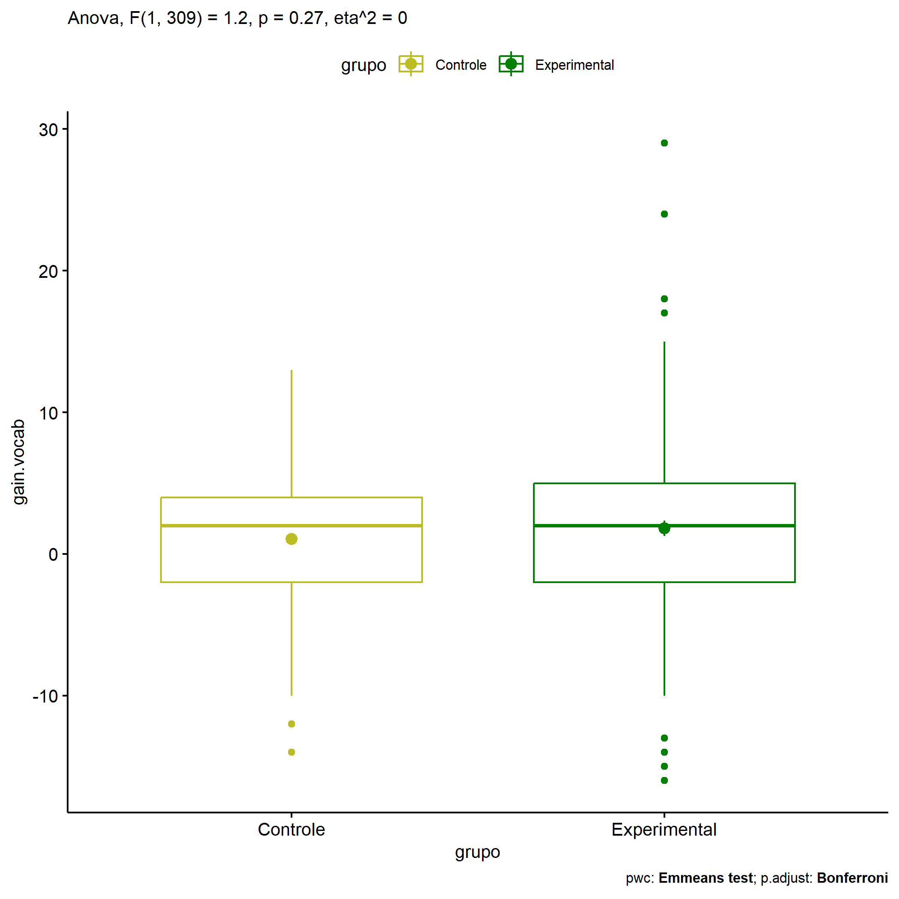
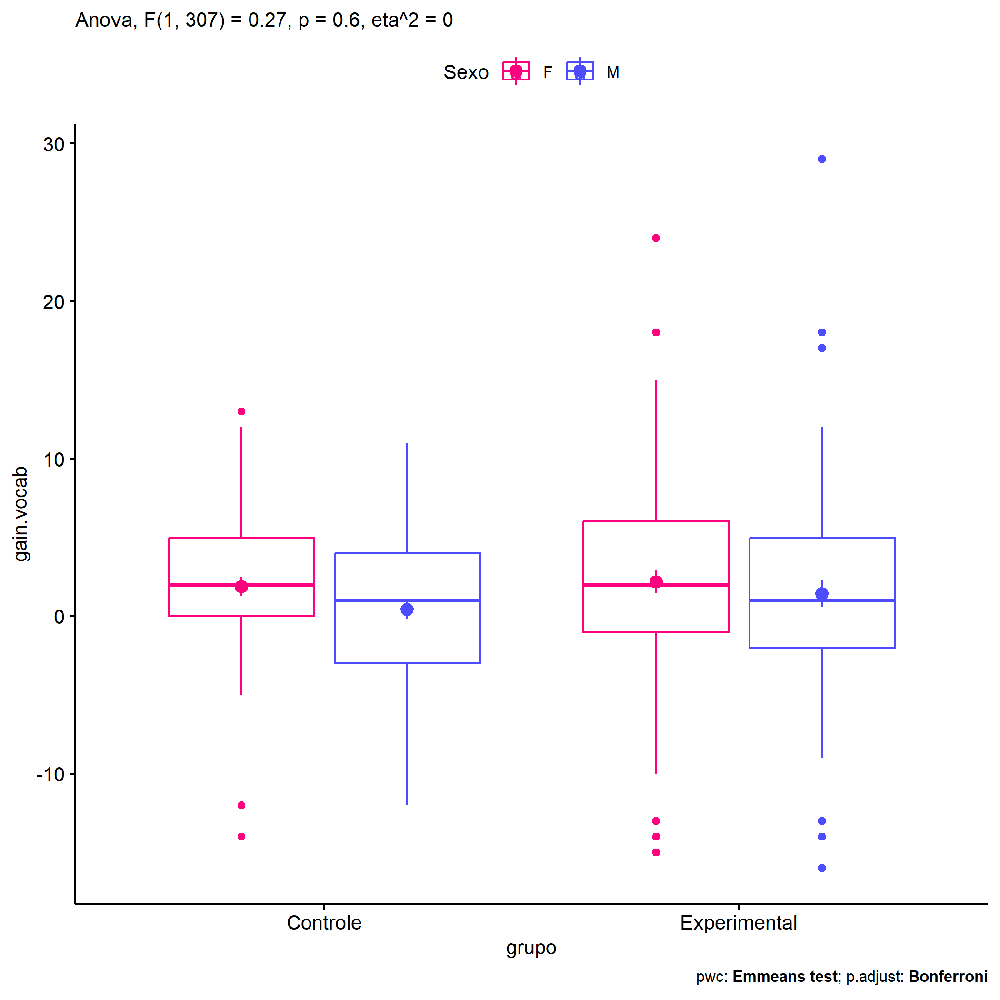
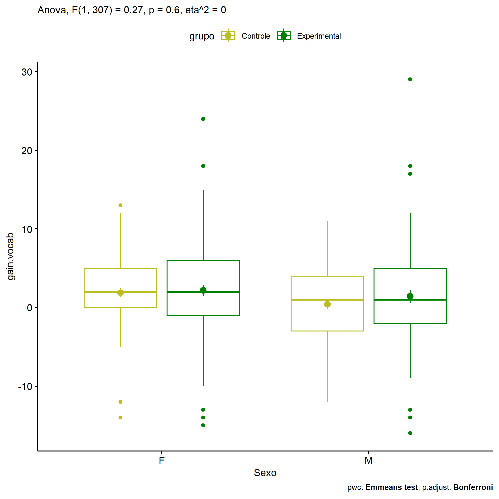
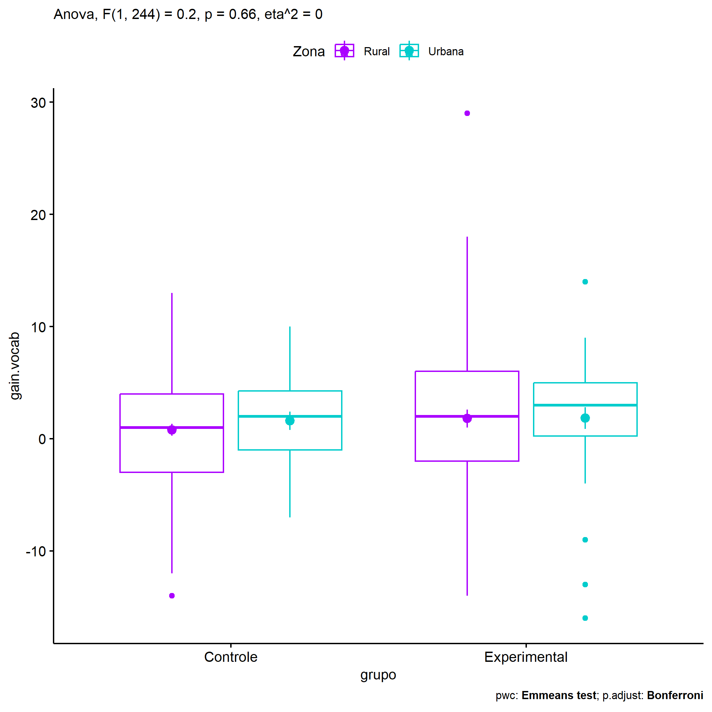
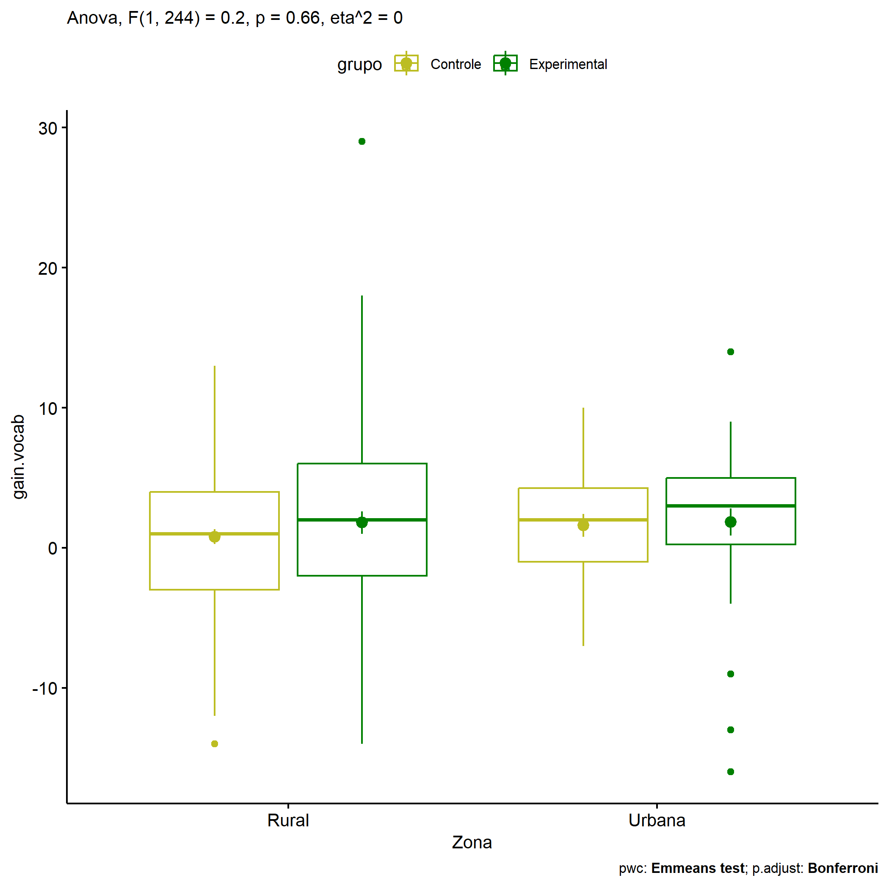

ANOVA in Gains for gain Vocabulario (acertos) (gain Vocabulario
(acertos))
================
Geiser C. Challco <geiser@alumni.usp.br>

- [Descriptive Statistics of Initial
  Data](#descriptive-statistics-of-initial-data)
- [Checking of Assumptions](#checking-of-assumptions)
  - [Assumption: Normality distribution of
    data](#assumption-normality-distribution-of-data)
  - [Assumption: Homogeneity of data
    distribution](#assumption-homogeneity-of-data-distribution)
- [Computation of ANCOVA test and Pairwise
  Comparison](#computation-of-ancova-test-and-pairwise-comparison)
  - [ANCOVA tests for one factor](#ancova-tests-for-one-factor)
  - [ANCOVA tests for two factors](#ancova-tests-for-two-factors)
  - [Pairwise comparisons for one factor:
    **grupo**](#pairwise-comparisons-for-one-factor-grupo)
  - [Pairwise comparisons for two
    factors](#pairwise-comparisons-for-two-factors)
    - [factores: **grupo:Sexo**](#factores-gruposexo)
    - [factores: **grupo:Zona**](#factores-grupozona)
    - [factores: **grupo:Cor.Raca**](#factores-grupocorraca)

**NOTE**

- Teste ANOVA para determinar se houve diferenças significativas no gain
  Vocabulario (acertos) (medido usando a diferença entre post-test e
  pre-testes).
- ANOVA test to determine whether there were significant differences in
  gain Vocabulario (acertos) (measured using the difference between
  post-test and pre-tests).

# Descriptive Statistics of Initial Data

| grupo        | Sexo | Zona   | Cor.Raca | variable   |   n |   mean | median | min | max |    sd |    se |    ci |  iqr |
|:-------------|:-----|:-------|:---------|:-----------|----:|-------:|-------:|----:|----:|------:|------:|------:|-----:|
| Controle     | F    |        |          | gain.vocab |  65 |  1.877 |    2.0 | -14 |  13 | 4.784 | 0.593 | 1.186 | 5.00 |
| Controle     | M    |        |          | gain.vocab |  81 |  0.407 |    1.0 | -12 |  11 | 4.992 | 0.555 | 1.104 | 7.00 |
| Experimental | F    |        |          | gain.vocab |  88 |  2.170 |    2.0 | -15 |  24 | 6.704 | 0.715 | 1.421 | 7.00 |
| Experimental | M    |        |          | gain.vocab |  77 |  1.429 |    1.0 | -16 |  29 | 7.349 | 0.838 | 1.668 | 7.00 |
| Controle     |      | Rural  |          | gain.vocab |  97 |  0.794 |    1.0 | -14 |  13 | 5.168 | 0.525 | 1.042 | 7.00 |
| Controle     |      | Urbana |          | gain.vocab |  28 |  1.607 |    2.0 |  -7 |  10 | 4.289 | 0.811 | 1.663 | 5.25 |
| Controle     |      |        |          | gain.vocab |  21 |  1.571 |    2.0 |  -7 |  11 | 4.770 | 1.041 | 2.171 | 6.00 |
| Experimental |      | Rural  |          | gain.vocab |  85 |  1.800 |    2.0 | -14 |  29 | 7.285 | 0.790 | 1.571 | 8.00 |
| Experimental |      | Urbana |          | gain.vocab |  38 |  1.842 |    3.0 | -16 |  14 | 5.971 | 0.969 | 1.963 | 4.75 |
| Experimental |      |        |          | gain.vocab |  42 |  1.857 |    1.5 | -15 |  24 | 7.426 | 1.146 | 2.314 | 7.75 |
| Controle     |      |        | Branca   | gain.vocab |  22 |  0.727 |    2.0 |  -6 |   7 | 4.188 | 0.893 | 1.857 | 6.50 |
| Controle     |      |        | Indígena | gain.vocab |   2 |  6.000 |    6.0 |   6 |   6 | 0.000 | 0.000 | 0.000 | 0.00 |
| Controle     |      |        | Parda    | gain.vocab |  42 |  0.762 |    0.5 | -12 |   9 | 4.878 | 0.753 | 1.520 | 6.75 |
| Controle     |      |        | Preta    | gain.vocab |   1 |  5.000 |    5.0 |   5 |   5 |       |       |       | 0.00 |
| Controle     |      |        |          | gain.vocab |  79 |  1.139 |    1.0 | -14 |  13 | 5.215 | 0.587 | 1.168 | 5.50 |
| Experimental |      |        | Branca   | gain.vocab |  18 | -1.167 |    1.5 | -14 |   7 | 6.546 | 1.543 | 3.255 | 9.25 |
| Experimental |      |        | Indígena | gain.vocab |  13 |  3.308 |    2.0 |   0 |  12 | 3.351 | 0.929 | 2.025 | 4.00 |
| Experimental |      |        | Parda    | gain.vocab |  44 |  2.682 |    1.0 | -13 |  29 | 7.335 | 1.106 | 2.230 | 8.00 |
| Experimental |      |        | Preta    | gain.vocab |   1 |  3.000 |    3.0 |   3 |   3 |       |       |       | 0.00 |
| Experimental |      |        |          | gain.vocab |  89 |  1.775 |    2.0 | -16 |  24 | 7.259 | 0.769 | 1.529 | 7.00 |

# Checking of Assumptions

## Assumption: Normality distribution of data

| var        |   n |   skewness | kurtosis | symmetry | statistic | method     |         p | p.signif | normality |
|:-----------|----:|-----------:|---------:|:---------|----------:|:-----------|----------:|:---------|:----------|
| gain.vocab | 311 |  0.1306898 | 2.024644 | YES      |  19.35677 | D’Agostino | 0.0000626 | \*\*\*   | \-        |
| gain.vocab | 248 | -0.0221197 | 1.927712 | YES      |  14.70940 | D’Agostino | 0.0006396 | \*\*     | \-        |
| gain.vocab | 143 |  0.3998648 | 2.859904 | YES      |  18.89044 | D’Agostino | 0.0000791 | \*\*\*   | QQ        |

## Assumption: Homogeneity of data distribution

| var        | method        | formula                          |   n | df1 | df2 | statistic |         p | p.signif |
|:-----------|:--------------|:---------------------------------|----:|----:|----:|----------:|----------:|:---------|
| gain.vocab | Levene’s test | `gain.vocab`~`grupo`\*`Sexo`     | 311 |   3 | 307 |  2.702765 | 0.0456810 | ns       |
| gain.vocab | Levene’s test | `gain.vocab`~`grupo`\*`Zona`     | 248 |   3 | 244 |  2.518910 | 0.0586669 | ns       |
| gain.vocab | Levene’s test | `gain.vocab`~`grupo`\*`Cor.Raca` | 143 |   7 | 135 |  2.005965 | 0.0587207 | ns       |

# Computation of ANCOVA test and Pairwise Comparison

## ANCOVA tests for one factor

| Effect   | DFn | DFd |     SSn |       SSd |     F |     p |   ges | p\<.05 |
|:---------|----:|----:|--------:|----------:|------:|------:|------:|:-------|
| grupo    |   1 | 309 |  45.047 | 11574.348 | 1.203 | 0.274 | 0.004 |        |
| Sexo     |   1 | 309 | 101.140 | 11518.256 | 2.713 | 0.101 | 0.009 |        |
| Zona     |   1 | 246 |  11.099 |  8883.962 | 0.307 | 0.580 | 0.001 |        |
| Cor.Raca |   3 | 139 | 193.374 |  4650.080 | 1.927 | 0.128 | 0.040 |        |

## ANCOVA tests for two factors

|     | Effect         | DFn | DFd |     SSn |       SSd |     F |     p |   ges | p\<.05 |
|:----|:---------------|----:|----:|--------:|----------:|------:|------:|------:|:-------|
| 3   | grupo:Sexo     |   1 | 307 |  10.166 | 11473.871 | 0.272 | 0.602 | 0.001 |        |
| 6   | grupo:Zona     |   1 | 244 |   7.072 |  8837.207 | 0.195 | 0.659 | 0.001 |        |
| 9   | grupo:Cor.Raca |   3 | 135 | 120.849 |  4520.797 | 1.203 | 0.311 | 0.026 |        |

## Pairwise comparisons for one factor: **grupo**

| var        | grupo        |   n |     M |    SE |
|:-----------|:-------------|----:|------:|------:|
| gain.vocab | Controle     | 146 | 1.062 | 0.409 |
| gain.vocab | Experimental | 165 | 1.824 | 0.545 |

| .y.        | group1   | group2       | estimate | conf.low | conf.high |    se | statistic |     p | p.adj | p.adj.signif |
|:-----------|:---------|:-------------|---------:|---------:|----------:|------:|----------:|------:|------:|:-------------|
| gain.vocab | Controle | Experimental |   -0.763 |   -2.131 |     0.606 | 0.695 |    -1.097 | 0.274 | 0.274 | ns           |

    ## Scale for colour is already present.
    ## Adding another scale for colour, which will replace the existing scale.

<!-- -->

## Pairwise comparisons for two factors

### factores: **grupo:Sexo**

| var        | grupo        | Sexo |   n |     M |    SE |
|:-----------|:-------------|:-----|----:|------:|------:|
| gain.vocab | Controle     | F    |  65 | 1.877 | 0.593 |
| gain.vocab | Controle     | M    |  81 | 0.407 | 0.555 |
| gain.vocab | Experimental | F    |  88 | 2.170 | 0.715 |
| gain.vocab | Experimental | M    |  77 | 1.429 | 0.838 |

| .y.        | grupo        | Sexo | group1   | group2       | estimate | conf.low | conf.high |    se | statistic |     p | p.adj | p.adj.signif |
|:-----------|:-------------|:-----|:---------|:-------------|---------:|---------:|----------:|------:|----------:|------:|------:|:-------------|
| gain.vocab |              | F    | Controle | Experimental |   -0.294 |   -2.261 |     1.674 | 1.000 |    -0.294 | 0.769 | 0.769 | ns           |
| gain.vocab |              | M    | Controle | Experimental |   -1.021 |   -2.936 |     0.893 | 0.973 |    -1.049 | 0.295 | 0.295 | ns           |
| gain.vocab | Controle     |      | F        | M            |    1.470 |   -0.534 |     3.473 | 1.018 |     1.443 | 0.150 | 0.150 | ns           |
| gain.vocab | Experimental |      | F        | M            |    0.742 |   -1.135 |     2.619 | 0.954 |     0.778 | 0.437 | 0.437 | ns           |

    ## Scale for colour is already present.
    ## Adding another scale for colour, which will replace the existing scale.

<!-- -->

    ## Scale for colour is already present.
    ## Adding another scale for colour, which will replace the existing scale.

<!-- -->

### factores: **grupo:Zona**

| var        | grupo        | Zona   |   n |     M |    SE |
|:-----------|:-------------|:-------|----:|------:|------:|
| gain.vocab | Controle     | Rural  |  97 | 0.794 | 0.525 |
| gain.vocab | Controle     | Urbana |  28 | 1.607 | 0.811 |
| gain.vocab | Experimental | Rural  |  85 | 1.800 | 0.790 |
| gain.vocab | Experimental | Urbana |  38 | 1.842 | 0.969 |

| .y.        | grupo        | Zona   | group1   | group2       | estimate | conf.low | conf.high |    se | statistic |     p | p.adj | p.adj.signif |
|:-----------|:-------------|:-------|:---------|:-------------|---------:|---------:|----------:|------:|----------:|------:|------:|:-------------|
| gain.vocab |              | Rural  | Controle | Experimental |   -1.006 |   -2.767 |     0.755 | 0.894 |    -1.125 | 0.262 | 0.262 | ns           |
| gain.vocab |              | Urbana | Controle | Experimental |   -0.235 |   -3.187 |     2.717 | 1.499 |    -0.157 | 0.876 | 0.876 | ns           |
| gain.vocab | Controle     |        | Rural    | Urbana       |   -0.813 |   -3.356 |     1.730 | 1.291 |    -0.630 | 0.529 | 0.529 | ns           |
| gain.vocab | Experimental |        | Rural    | Urbana       |   -0.042 |   -2.355 |     2.271 | 1.174 |    -0.036 | 0.971 | 0.971 | ns           |

    ## Scale for colour is already present.
    ## Adding another scale for colour, which will replace the existing scale.

<!-- -->

    ## Scale for colour is already present.
    ## Adding another scale for colour, which will replace the existing scale.

<!-- -->

### factores: **grupo:Cor.Raca**

| var        | grupo        | Cor.Raca |   n |      M |    SE |
|:-----------|:-------------|:---------|----:|-------:|------:|
| gain.vocab | Controle     | Branca   |  22 |  0.727 | 0.893 |
| gain.vocab | Controle     | Parda    |  42 |  0.762 | 0.753 |
| gain.vocab | Experimental | Branca   |  18 | -1.167 | 1.543 |
| gain.vocab | Experimental | Indígena |  13 |  3.308 | 0.929 |
| gain.vocab | Experimental | Parda    |  44 |  2.682 | 1.106 |

|     | .y.        | grupo        | Cor.Raca | group1   | group2       | estimate | conf.low | conf.high |    se | statistic |     p | p.adj | p.adj.signif |
|:----|:-----------|:-------------|:---------|:---------|:-------------|---------:|---------:|----------:|------:|----------:|------:|------:|:-------------|
| 1   | gain.vocab |              | Branca   | Controle | Experimental |    1.894 |   -1.757 |     5.545 | 1.846 |     1.026 | 0.307 | 0.307 | ns           |
| 3   | gain.vocab |              | Parda    | Controle | Experimental |   -1.920 |   -4.398 |     0.558 | 1.253 |    -1.532 | 0.128 | 0.128 | ns           |
| 5   | gain.vocab | Controle     |          | Branca   | Parda        |   -0.035 |   -3.058 |     2.989 | 1.529 |    -0.023 | 0.982 | 0.982 | ns           |
| 7   | gain.vocab | Experimental |          | Branca   | Indígena     |   -4.474 |   -8.656 |    -0.293 | 2.114 |    -2.116 | 0.036 | 0.108 | ns           |
| 8   | gain.vocab | Experimental |          | Branca   | Parda        |   -3.848 |   -7.063 |    -0.634 | 1.625 |    -2.368 | 0.019 | 0.058 | ns           |
| 9   | gain.vocab | Experimental |          | Indígena | Parda        |    0.626 |   -3.001 |     4.252 | 1.834 |     0.341 | 0.733 | 1.000 | ns           |

    ## Scale for colour is already present.
    ## Adding another scale for colour, which will replace the existing scale.

<!-- -->
