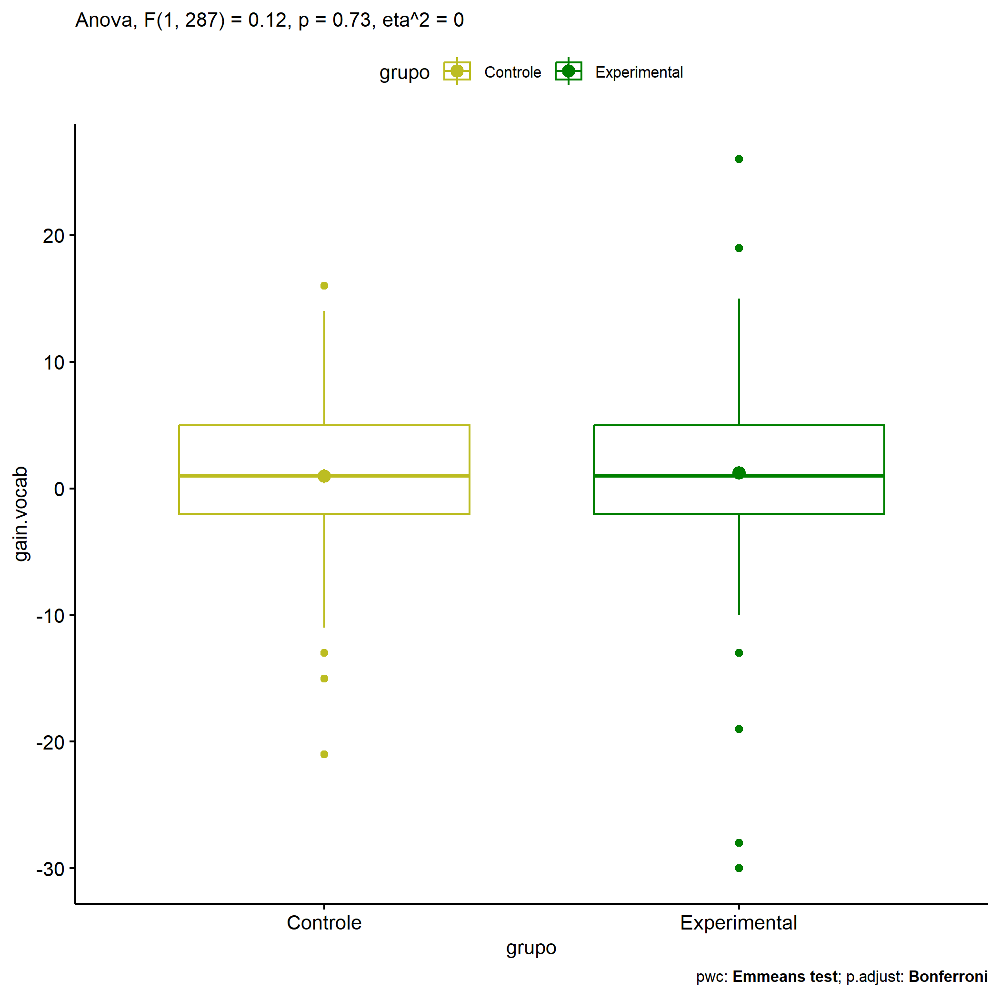
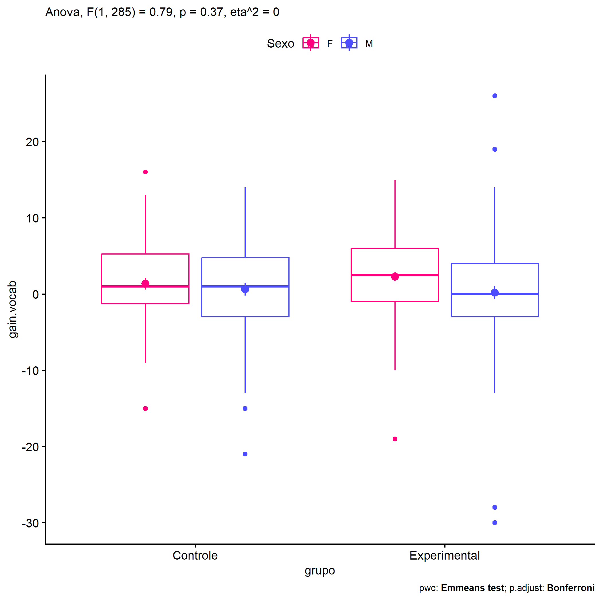
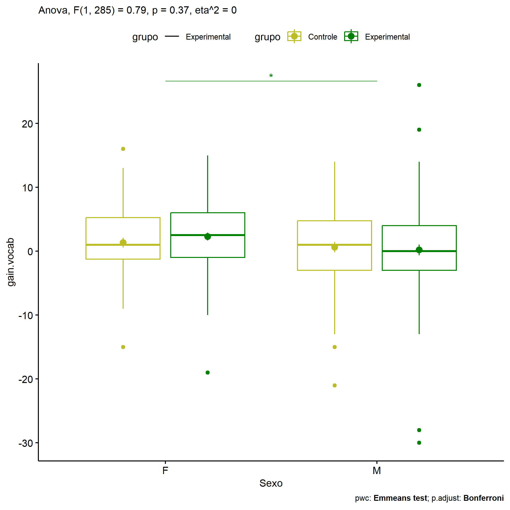
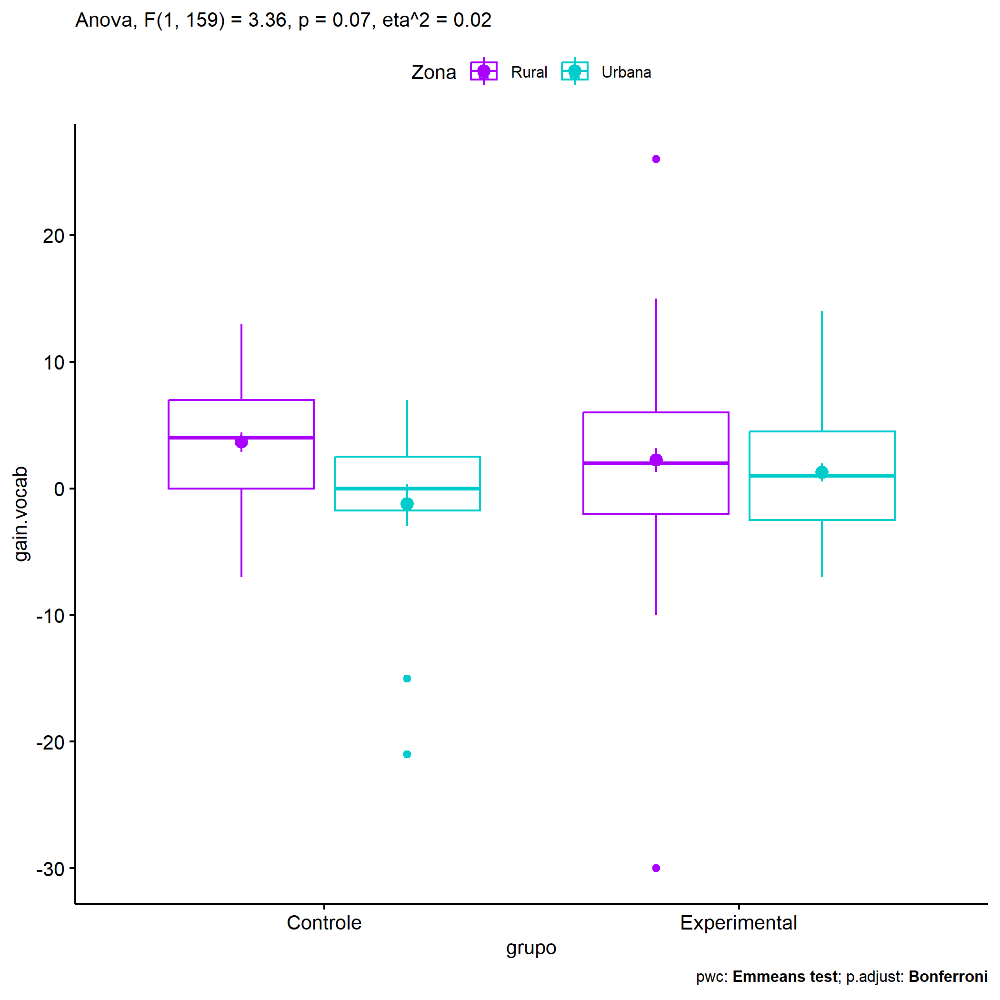
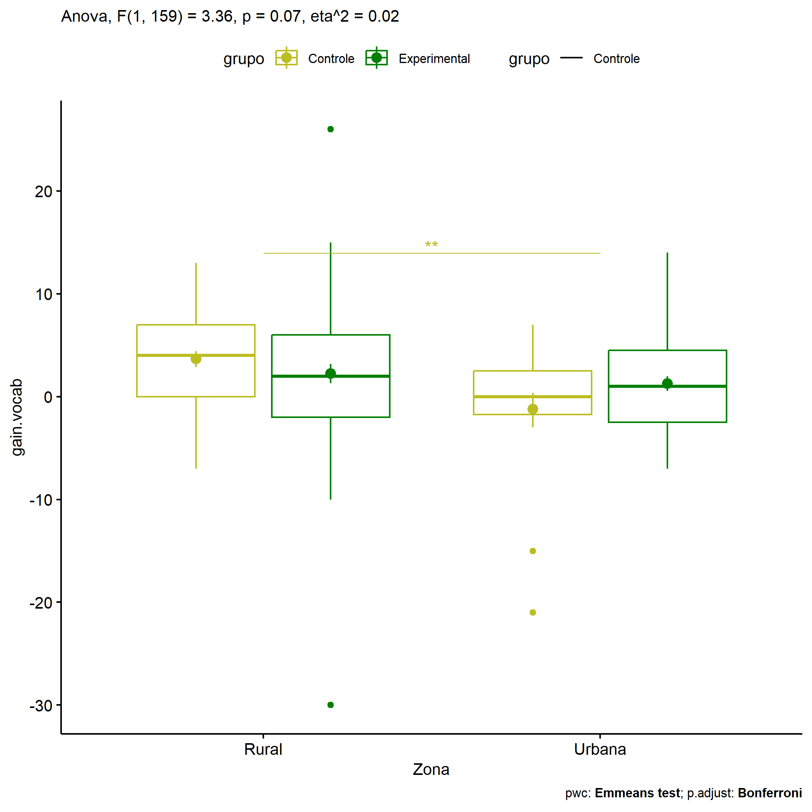
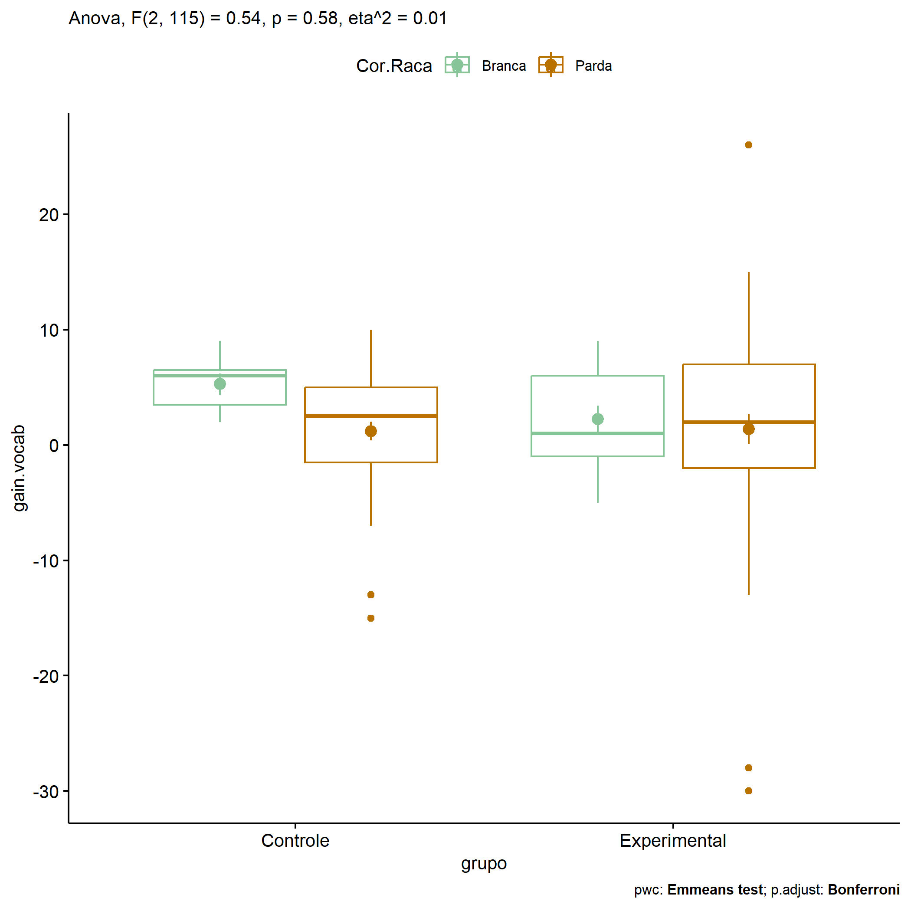
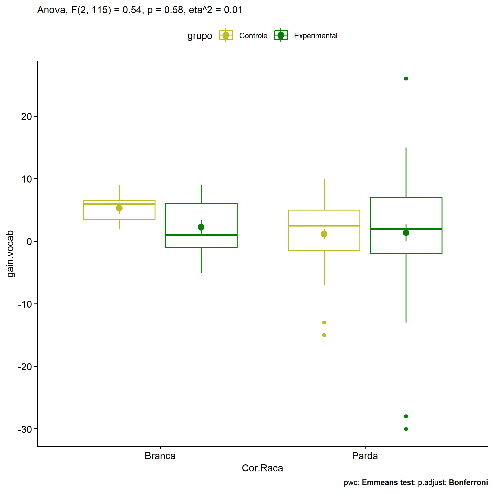

ANOVA in Gains for gain Vocabulario (acertos) (gain Vocabulario
(acertos))
================
Geiser C. Challco <geiser@alumni.usp.br>

- [Descriptive Statistics of Initial
  Data](#descriptive-statistics-of-initial-data)
- [Checking of Assumptions](#checking-of-assumptions)
  - [Assumption: Normality distribution of
    data](#assumption-normality-distribution-of-data)
  - [Assumption: Homogeneity of data
    distribution](#assumption-homogeneity-of-data-distribution)
- [Computation of ANCOVA test and Pairwise
  Comparison](#computation-of-ancova-test-and-pairwise-comparison)
  - [ANCOVA tests for one factor](#ancova-tests-for-one-factor)
  - [ANCOVA tests for two factors](#ancova-tests-for-two-factors)
  - [Pairwise comparisons for one factor:
    **grupo**](#pairwise-comparisons-for-one-factor-grupo)
  - [Pairwise comparisons for two
    factors](#pairwise-comparisons-for-two-factors)
    - [factores: **grupo:Sexo**](#factores-gruposexo)
    - [factores: **grupo:Zona**](#factores-grupozona)
    - [factores: **grupo:Cor.Raca**](#factores-grupocorraca)

**NOTE**

- Teste ANOVA para determinar se houve diferenças significativas no gain
  Vocabulario (acertos) (medido usando a diferença entre post-test e
  pre-testes).
- ANOVA test to determine whether there were significant differences in
  gain Vocabulario (acertos) (measured using the difference between
  post-test and pre-tests).

# Descriptive Statistics of Initial Data

| grupo        | Sexo | Zona   | Cor.Raca | variable   |   n |   mean | median | min | max |    sd |    se |     ci |  iqr |
|:-------------|:-----|:-------|:---------|:-----------|----:|-------:|-------:|----:|----:|------:|------:|-------:|-----:|
| Controle     | F    |        |          | gain.vocab |  56 |  1.339 |    1.0 | -15 |  16 | 5.671 | 0.758 |  1.519 | 6.50 |
| Controle     | M    |        |          | gain.vocab |  62 |  0.629 |    1.0 | -21 |  14 | 6.395 | 0.812 |  1.624 | 7.75 |
| Experimental | F    |        |          | gain.vocab |  86 |  2.279 |    2.5 | -19 |  15 | 5.633 | 0.607 |  1.208 | 7.00 |
| Experimental | M    |        |          | gain.vocab |  85 |  0.188 |    0.0 | -30 |  26 | 7.711 | 0.836 |  1.663 | 7.00 |
| Controle     |      | Rural  |          | gain.vocab |  41 |  3.659 |    4.0 |  -7 |  13 | 4.978 | 0.777 |  1.571 | 7.00 |
| Controle     |      | Urbana |          | gain.vocab |  18 | -1.222 |    0.0 | -21 |   7 | 6.744 | 1.589 |  3.354 | 4.25 |
| Controle     |      |        |          | gain.vocab |  59 | -0.237 |    0.0 | -15 |  16 | 5.937 | 0.773 |  1.547 | 6.00 |
| Experimental |      | Rural  |          | gain.vocab |  61 |  2.246 |    2.0 | -30 |  26 | 7.395 | 0.947 |  1.894 | 8.00 |
| Experimental |      | Urbana |          | gain.vocab |  43 |  1.256 |    1.0 |  -7 |  14 | 4.721 | 0.720 |  1.453 | 7.00 |
| Experimental |      |        |          | gain.vocab |  67 |  0.313 |    1.0 | -28 |  19 | 7.326 | 0.895 |  1.787 | 7.50 |
| Controle     |      |        | Branca   | gain.vocab |   7 |  5.286 |    6.0 |   2 |   9 | 2.430 | 0.918 |  2.247 | 3.00 |
| Controle     |      |        | Indígena | gain.vocab |   2 | -0.500 |   -0.5 |  -3 |   2 | 3.536 | 2.500 | 31.766 | 2.50 |
| Controle     |      |        | Parda    | gain.vocab |  44 |  1.205 |    2.5 | -15 |  10 | 5.398 | 0.814 |  1.641 | 6.50 |
| Controle     |      |        |          | gain.vocab |  65 |  0.385 |    0.0 | -21 |  16 | 6.635 | 0.823 |  1.644 | 6.00 |
| Experimental |      |        | Branca   | gain.vocab |  13 |  2.231 |    1.0 |  -5 |   9 | 4.226 | 1.172 |  2.554 | 7.00 |
| Experimental |      |        | Indígena | gain.vocab |   3 |  3.000 |    3.0 |  -2 |   8 | 5.000 | 2.887 | 12.421 | 5.00 |
| Experimental |      |        | Parda    | gain.vocab |  52 |  1.385 |    2.0 | -30 |  26 | 9.396 | 1.303 |  2.616 | 9.00 |
| Experimental |      |        |          | gain.vocab | 103 |  0.990 |    1.0 | -19 |  19 | 5.498 | 0.542 |  1.074 | 8.00 |

# Checking of Assumptions

## Assumption: Normality distribution of data

| var        |   n |   skewness | kurtosis | symmetry | statistic | method     |   p | p.signif | normality |
|:-----------|----:|-----------:|---------:|:---------|----------:|:-----------|----:|:---------|:----------|
| gain.vocab | 289 | -0.5986480 | 3.542884 | NO       |  45.92041 | D’Agostino |   0 | \*\*\*\* | \-        |
| gain.vocab | 163 | -0.7204707 | 5.258458 | NO       |  40.04324 | D’Agostino |   0 | \*\*\*\* | QQ        |
| gain.vocab | 121 | -1.0661577 | 4.989281 | NO       |  40.13990 | D’Agostino |   0 | \*\*\*\* | QQ        |

## Assumption: Homogeneity of data distribution

| var        | method        | formula                          |   n | df1 | df2 | statistic |         p | p.signif |
|:-----------|:--------------|:---------------------------------|----:|----:|----:|----------:|----------:|:---------|
| gain.vocab | Levene’s test | `gain.vocab`~`grupo`\*`Sexo`     | 289 |   3 | 285 | 0.6150595 | 0.6057409 | ns       |
| gain.vocab | Levene’s test | `gain.vocab`~`grupo`\*`Zona`     | 163 |   3 | 159 | 1.0117575 | 0.3891526 | ns       |
| gain.vocab | Levene’s test | `gain.vocab`~`grupo`\*`Cor.Raca` | 121 |   5 | 115 | 1.8598182 | 0.1067913 | ns       |

# Computation of ANCOVA test and Pairwise Comparison

## ANCOVA tests for one factor

| Effect   | DFn | DFd |     SSn |       SSd |     F |     p |   ges | p\<.05 |
|:---------|----:|----:|--------:|----------:|------:|------:|------:|:-------|
| grupo    |   1 | 287 |   5.229 | 12157.034 | 0.123 | 0.726 | 0.000 |        |
| Sexo     |   1 | 287 | 170.031 | 11992.232 | 4.069 | 0.045 | 0.014 | \*     |
| Zona     |   1 | 161 | 200.025 |  6108.674 | 5.272 | 0.023 | 0.032 | \*     |
| Cor.Raca |   2 | 118 |  66.079 |  6125.640 | 0.636 | 0.531 | 0.011 |        |

## ANCOVA tests for two factors

|     | Effect         | DFn | DFd |     SSn |       SSd |     F |     p |   ges | p\<.05 |
|:----|:---------------|----:|----:|--------:|----------:|------:|------:|------:|:-------|
| 3   | grupo:Sexo     |   1 | 285 |  33.218 | 11955.312 | 0.792 | 0.374 | 0.003 |        |
| 6   | grupo:Zona     |   1 | 159 | 126.571 |  5981.828 | 3.364 | 0.068 | 0.021 |        |
| 9   | grupo:Cor.Raca |   2 | 115 |  56.948 |  6067.703 | 0.540 | 0.584 | 0.009 |        |

## Pairwise comparisons for one factor: **grupo**

| var        | grupo        |   n |     M |    SE |
|:-----------|:-------------|----:|------:|------:|
| gain.vocab | Controle     | 118 | 0.966 | 0.557 |
| gain.vocab | Experimental | 171 | 1.240 | 0.521 |

| .y.        | group1   | group2       | estimate | conf.low | conf.high |    se | statistic |     p | p.adj | p.adj.signif |
|:-----------|:---------|:-------------|---------:|---------:|----------:|------:|----------:|------:|------:|:-------------|
| gain.vocab | Controle | Experimental |   -0.274 |   -1.807 |     1.259 | 0.779 |    -0.351 | 0.726 | 0.726 | ns           |

    ## Scale for colour is already present.
    ## Adding another scale for colour, which will replace the existing scale.

<!-- -->

## Pairwise comparisons for two factors

### factores: **grupo:Sexo**

| var        | grupo        | Sexo |   n |     M |    SE |
|:-----------|:-------------|:-----|----:|------:|------:|
| gain.vocab | Controle     | F    |  56 | 1.339 | 0.758 |
| gain.vocab | Controle     | M    |  62 | 0.629 | 0.812 |
| gain.vocab | Experimental | F    |  86 | 2.279 | 0.607 |
| gain.vocab | Experimental | M    |  85 | 0.188 | 0.836 |

| .y.        | grupo        | Sexo | group1   | group2       | estimate | conf.low | conf.high |    se | statistic |     p | p.adj | p.adj.signif |
|:-----------|:-------------|:-----|:---------|:-------------|---------:|---------:|----------:|------:|----------:|------:|------:|:-------------|
| gain.vocab |              | F    | Controle | Experimental |   -0.940 |   -3.129 |     1.249 | 1.112 |    -0.845 | 0.399 | 0.399 | ns           |
| gain.vocab |              | M    | Controle | Experimental |    0.441 |   -1.688 |     2.570 | 1.082 |     0.407 | 0.684 | 0.684 | ns           |
| gain.vocab | Controle     |      | F        | M            |    0.710 |   -1.640 |     3.060 | 1.194 |     0.595 | 0.552 | 0.552 | ns           |
| gain.vocab | Experimental |      | F        | M            |    2.091 |    0.141 |     4.041 | 0.991 |     2.111 | 0.036 | 0.036 | \*           |

    ## Scale for colour is already present.
    ## Adding another scale for colour, which will replace the existing scale.

<!-- -->

    ## Scale for colour is already present.
    ## Adding another scale for colour, which will replace the existing scale.

<!-- -->

### factores: **grupo:Zona**

| var        | grupo        | Zona   |   n |      M |    SE |
|:-----------|:-------------|:-------|----:|-------:|------:|
| gain.vocab | Controle     | Rural  |  41 |  3.659 | 0.777 |
| gain.vocab | Controle     | Urbana |  18 | -1.222 | 1.589 |
| gain.vocab | Experimental | Rural  |  61 |  2.246 | 0.947 |
| gain.vocab | Experimental | Urbana |  43 |  1.256 | 0.720 |

| .y.        | grupo        | Zona   | group1   | group2       | estimate | conf.low | conf.high |    se | statistic |     p | p.adj | p.adj.signif |
|:-----------|:-------------|:-------|:---------|:-------------|---------:|---------:|----------:|------:|----------:|------:|------:|:-------------|
| gain.vocab |              | Rural  | Controle | Experimental |    1.413 |   -1.034 |     3.859 | 1.239 |     1.140 | 0.256 | 0.256 | ns           |
| gain.vocab |              | Urbana | Controle | Experimental |   -2.478 |   -5.879 |     0.923 | 1.722 |    -1.439 | 0.152 | 0.152 | ns           |
| gain.vocab | Controle     |        | Rural    | Urbana       |    4.881 |    1.456 |     8.306 | 1.734 |     2.814 | 0.006 | 0.006 | \*\*         |
| gain.vocab | Experimental |        | Rural    | Urbana       |    0.990 |   -1.422 |     3.402 | 1.221 |     0.811 | 0.419 | 0.419 | ns           |

    ## Scale for colour is already present.
    ## Adding another scale for colour, which will replace the existing scale.

<!-- -->

    ## Scale for colour is already present.
    ## Adding another scale for colour, which will replace the existing scale.

<!-- -->

### factores: **grupo:Cor.Raca**

| var        | grupo        | Cor.Raca |   n |     M |    SE |
|:-----------|:-------------|:---------|----:|------:|------:|
| gain.vocab | Controle     | Branca   |   7 | 5.286 | 0.918 |
| gain.vocab | Controle     | Parda    |  44 | 1.205 | 0.814 |
| gain.vocab | Experimental | Branca   |  13 | 2.231 | 1.172 |
| gain.vocab | Experimental | Parda    |  52 | 1.385 | 1.303 |

| .y.        | grupo        | Cor.Raca | group1   | group2       | estimate | conf.low | conf.high |    se | statistic |     p | p.adj | p.adj.signif |
|:-----------|:-------------|:---------|:---------|:-------------|---------:|---------:|----------:|------:|----------:|------:|------:|:-------------|
| gain.vocab |              | Branca   | Controle | Experimental |    3.055 |   -3.747 |     9.857 | 3.433 |     0.890 | 0.375 | 0.375 | ns           |
| gain.vocab |              | Parda    | Controle | Experimental |   -0.180 |   -3.152 |     2.792 | 1.500 |    -0.120 | 0.905 | 0.905 | ns           |
| gain.vocab | Controle     |          | Branca   | Parda        |    4.081 |   -1.823 |     9.985 | 2.980 |     1.370 | 0.174 | 0.174 | ns           |
| gain.vocab | Experimental |          | Branca   | Parda        |    0.846 |   -3.653 |     5.345 | 2.271 |     0.373 | 0.710 | 0.710 | ns           |

    ## Scale for colour is already present.
    ## Adding another scale for colour, which will replace the existing scale.

<!-- -->

    ## Scale for colour is already present.
    ## Adding another scale for colour, which will replace the existing scale.

<!-- -->
