ANCOVA in TDE - Escrita (Acertos) (TDE - Escrita (Acertos))
================
Geiser C. Challco <geiser@alumni.usp.br>

- [Descriptive Statistics of Initial
  Data](#descriptive-statistics-of-initial-data)
- [Checking of Assumptions](#checking-of-assumptions)
  - [Assumption: Normality distribution of
    data](#assumption-normality-distribution-of-data)
  - [Assumption: Homogeneity of data
    distribution](#assumption-homogeneity-of-data-distribution)
- [Computation of ANCOVA test and Pairwise
  Comparison](#computation-of-ancova-test-and-pairwise-comparison)
  - [ANCOVA tests for one factor](#ancova-tests-for-one-factor)
  - [ANCOVA tests for two factors](#ancova-tests-for-two-factors)
  - [Pairwise comparisons for one factor:
    **grupo**](#pairwise-comparisons-for-one-factor-grupo)
  - [Pairwise comparisons for two
    factors](#pairwise-comparisons-for-two-factors)
    - [factores: **grupo:Sexo**](#factores-gruposexo)
    - [factores: **grupo:Zona**](#factores-grupozona)
    - [factores: **grupo:Cor.Raca**](#factores-grupocorraca)
    - [factores: **grupo:Serie**](#factores-gruposerie)

**NOTE**

- Teste ANCOVA para determinar se houve diferenças significativas no
  TDE - Escrita (Acertos) (medido usando pre- e pos-testes).
- ANCOVA test to determine whether there were significant differences in
  TDE - Escrita (Acertos) (measured using pre- and post-tests).

# Descriptive Statistics of Initial Data

| grupo        | Sexo | Zona   | Cor.Raca | Serie | variable      |   n |   mean | median | min | max |     sd |    se |     ci |   iqr |
|:-------------|:-----|:-------|:---------|:------|:--------------|----:|-------:|-------:|----:|----:|-------:|------:|-------:|------:|
| Controle     | F    |        |          |       | score.tde.pre |  31 | 24.935 |   26.0 |  19 |  31 |  3.669 | 0.659 |  1.346 |  5.50 |
| Controle     | M    |        |          |       | score.tde.pre |  28 | 24.107 |   24.0 |  19 |  31 |  3.919 | 0.741 |  1.520 |  6.25 |
| Experimental | F    |        |          |       | score.tde.pre |  49 | 26.184 |   26.0 |  19 |  31 |  3.073 | 0.439 |  0.883 |  5.00 |
| Experimental | M    |        |          |       | score.tde.pre |  68 | 25.618 |   25.5 |  19 |  31 |  3.657 | 0.443 |  0.885 |  6.00 |
| Controle     | F    |        |          |       | score.tde.pos |  31 | 19.452 |   19.0 |   0 |  62 | 12.457 | 2.237 |  4.569 | 14.00 |
| Controle     | M    |        |          |       | score.tde.pos |  28 | 20.536 |   20.0 |   3 |  66 | 13.675 | 2.584 |  5.303 | 12.75 |
| Experimental | F    |        |          |       | score.tde.pos |  49 | 24.510 |   25.0 |   2 |  60 | 12.045 | 1.721 |  3.460 | 15.00 |
| Experimental | M    |        |          |       | score.tde.pos |  68 | 24.794 |   25.5 |   0 |  48 | 12.403 | 1.504 |  3.002 | 18.75 |
| Controle     |      | Rural  |          |       | score.tde.pre |  21 | 23.429 |   25.0 |  19 |  31 |  3.429 | 0.748 |  1.561 |  7.00 |
| Controle     |      | Urbana |          |       | score.tde.pre |  20 | 25.150 |   26.0 |  19 |  31 |  3.787 | 0.847 |  1.773 |  5.50 |
| Controle     |      |        |          |       | score.tde.pre |  18 | 25.167 |   26.0 |  19 |  31 |  4.062 | 0.957 |  2.020 |  7.25 |
| Experimental |      | Rural  |          |       | score.tde.pre |  55 | 25.891 |   26.0 |  19 |  31 |  3.494 | 0.471 |  0.945 |  6.00 |
| Experimental |      | Urbana |          |       | score.tde.pre |  27 | 25.778 |   26.0 |  19 |  31 |  3.389 | 0.652 |  1.341 |  5.00 |
| Experimental |      |        |          |       | score.tde.pre |  35 | 25.857 |   26.0 |  19 |  31 |  3.431 | 0.580 |  1.179 |  6.00 |
| Controle     |      | Rural  |          |       | score.tde.pos |  21 | 26.238 |   24.0 |   4 |  66 | 16.325 | 3.562 |  7.431 | 15.00 |
| Controle     |      | Urbana |          |       | score.tde.pos |  20 | 12.200 |   12.0 |   0 |  27 |  7.682 | 1.718 |  3.595 |  9.75 |
| Controle     |      |        |          |       | score.tde.pos |  18 | 21.278 |   22.0 |   6 |  45 |  8.428 | 1.987 |  4.191 |  8.25 |
| Experimental |      | Rural  |          |       | score.tde.pos |  55 | 25.873 |   26.0 |   1 |  48 | 11.898 | 1.604 |  3.216 | 18.00 |
| Experimental |      | Urbana |          |       | score.tde.pos |  27 | 18.889 |   20.0 |   0 |  39 | 11.157 | 2.147 |  4.414 | 18.00 |
| Experimental |      |        |          |       | score.tde.pos |  35 | 27.257 |   28.0 |   4 |  60 | 12.339 | 2.086 |  4.239 | 15.00 |
| Controle     |      |        | Branca   |       | score.tde.pre |   3 | 23.333 |   23.0 |  19 |  28 |  4.509 | 2.603 | 11.202 |  4.50 |
| Controle     |      |        | Parda    |       | score.tde.pre |  17 | 25.765 |   27.0 |  19 |  31 |  3.474 | 0.842 |  1.786 |  4.00 |
| Controle     |      |        |          |       | score.tde.pre |  39 | 24.103 |   25.0 |  19 |  31 |  3.831 | 0.613 |  1.242 |  6.00 |
| Experimental |      |        | Amarela  |       | score.tde.pre |   1 | 23.000 |   23.0 |  23 |  23 |        |       |        |  0.00 |
| Experimental |      |        | Branca   |       | score.tde.pre |   9 | 27.111 |   27.0 |  23 |  30 |  2.147 | 0.716 |  1.651 |  2.00 |
| Experimental |      |        | Indígena |       | score.tde.pre |   3 | 24.000 |   25.0 |  21 |  26 |  2.646 | 1.528 |  6.572 |  2.50 |
| Experimental |      |        | Parda    |       | score.tde.pre |  46 | 25.239 |   25.0 |  19 |  31 |  3.465 | 0.511 |  1.029 |  5.00 |
| Experimental |      |        |          |       | score.tde.pre |  58 | 26.293 |   27.0 |  19 |  31 |  3.519 | 0.462 |  0.925 |  5.00 |
| Controle     |      |        | Branca   |       | score.tde.pos |   3 | 15.000 |   15.0 |   0 |  30 | 15.000 | 8.660 | 37.262 | 15.00 |
| Controle     |      |        | Parda    |       | score.tde.pos |  17 | 17.706 |   19.0 |   3 |  45 | 10.833 | 2.627 |  5.570 | 17.00 |
| Controle     |      |        |          |       | score.tde.pos |  39 | 21.333 |   20.0 |   2 |  66 | 13.727 | 2.198 |  4.450 | 12.50 |
| Experimental |      |        | Amarela  |       | score.tde.pos |   1 | 23.000 |   23.0 |  23 |  23 |        |       |        |  0.00 |
| Experimental |      |        | Branca   |       | score.tde.pos |   9 | 20.222 |   21.0 |   1 |  39 | 11.987 | 3.996 |  9.214 |  5.00 |
| Experimental |      |        | Indígena |       | score.tde.pos |   3 | 27.000 |   27.0 |  13 |  41 | 14.000 | 8.083 | 34.778 | 14.00 |
| Experimental |      |        | Parda    |       | score.tde.pos |  46 | 25.565 |   26.0 |   0 |  60 | 13.096 | 1.931 |  3.889 | 16.50 |
| Experimental |      |        |          |       | score.tde.pos |  58 | 24.569 |   25.0 |   4 |  48 | 11.683 | 1.534 |  3.072 | 16.75 |
| Controle     |      |        |          | 6 ano | score.tde.pre |  17 | 24.235 |   25.0 |  19 |  31 |  3.993 | 0.968 |  2.053 |  7.00 |
| Controle     |      |        |          | 7 ano | score.tde.pre |  25 | 23.800 |   24.0 |  19 |  31 |  3.416 | 0.683 |  1.410 |  5.00 |
| Controle     |      |        |          | 8 ano | score.tde.pre |  10 | 26.500 |   27.0 |  19 |  31 |  4.143 | 1.310 |  2.964 |  3.50 |
| Controle     |      |        |          | 9 ano | score.tde.pre |   7 | 25.143 |   26.0 |  19 |  29 |  3.716 | 1.405 |  3.437 |  5.00 |
| Experimental |      |        |          | 6 ano | score.tde.pre |  36 | 25.361 |   25.0 |  20 |  30 |  2.929 | 0.488 |  0.991 |  5.25 |
| Experimental |      |        |          | 7 ano | score.tde.pre |  41 | 25.512 |   25.0 |  19 |  31 |  3.854 | 0.602 |  1.217 |  6.00 |
| Experimental |      |        |          | 8 ano | score.tde.pre |  19 | 27.105 |   27.0 |  22 |  31 |  3.107 | 0.713 |  1.498 |  5.00 |
| Experimental |      |        |          | 9 ano | score.tde.pre |  21 | 26.238 |   27.0 |  19 |  31 |  3.491 | 0.762 |  1.589 |  5.00 |
| Controle     |      |        |          | 6 ano | score.tde.pos |  17 | 16.529 |   14.0 |   4 |  36 | 10.180 | 2.469 |  5.234 | 13.00 |
| Controle     |      |        |          | 7 ano | score.tde.pos |  25 | 19.240 |   15.0 |   0 |  66 | 16.893 | 3.379 |  6.973 | 14.00 |
| Controle     |      |        |          | 8 ano | score.tde.pos |  10 | 22.800 |   25.0 |  15 |  27 |  4.417 | 1.397 |  3.160 |  5.50 |
| Controle     |      |        |          | 9 ano | score.tde.pos |   7 | 26.857 |   25.0 |  20 |  45 |  8.295 | 3.135 |  7.672 |  3.00 |
| Experimental |      |        |          | 6 ano | score.tde.pos |  36 | 19.500 |   19.5 |   0 |  46 | 11.732 | 1.955 |  3.969 | 13.50 |
| Experimental |      |        |          | 7 ano | score.tde.pos |  41 | 23.585 |   24.0 |   2 |  47 | 12.153 | 1.898 |  3.836 | 21.00 |
| Experimental |      |        |          | 8 ano | score.tde.pos |  19 | 28.053 |   29.0 |   1 |  46 | 11.301 | 2.593 |  5.447 | 11.50 |
| Experimental |      |        |          | 9 ano | score.tde.pos |  21 | 32.619 |   31.0 |  20 |  60 |  9.206 | 2.009 |  4.190 |  8.00 |

# Checking of Assumptions

## Assumption: Normality distribution of data

| var           |   n |  skewness |   kurtosis | symmetry |  statistic | method     |         p | p.signif | normality |
|:--------------|----:|----------:|-----------:|:---------|-----------:|:-----------|----------:|:---------|:----------|
| score.tde.pos | 176 | 0.5797223 |  1.1699675 | NO       | 16.0292225 | D’Agostino | 0.0003306 | \*\*     | QQ        |
| score.tde.pos | 123 | 0.3080944 |  0.6182124 | YES      |  4.6232433 | D’Agostino | 0.0991004 | ns       | QQ        |
| score.tde.pos |  79 | 0.2268459 | -0.1190686 | YES      |  0.8717275 | D’Agostino | 0.6467058 | ns       | YES       |
| score.tde.pos | 176 | 0.7962071 |  1.5990110 | NO       | 25.7140178 | D’Agostino | 0.0000026 | \*\*\*\* | QQ        |

## Assumption: Homogeneity of data distribution

| var           | method         | formula                    |   n | DFn.df1 | DFd.df2 | statistic |         p | p.signif |
|:--------------|:---------------|:---------------------------|----:|--------:|--------:|----------:|----------:|:---------|
| score.tde.pos | Levene’s test  | `.res`~`grupo`\*`Sexo`     | 176 |       3 |     172 | 0.0277026 | 0.9937601 | ns       |
| score.tde.pos | Anova’s slopes | `.res`~`grupo`\*`Sexo`     | 176 |       3 |     168 | 1.1320000 | 0.3380000 | ns       |
| score.tde.pos | Levene’s test  | `.res`~`grupo`\*`Zona`     | 123 |       3 |     119 | 2.1950209 | 0.0922196 | ns       |
| score.tde.pos | Anova’s slopes | `.res`~`grupo`\*`Zona`     | 123 |       3 |     115 | 0.1870000 | 0.9050000 | ns       |
| score.tde.pos | Levene’s test  | `.res`~`grupo`\*`Cor.Raca` |  79 |       5 |      73 | 0.4093327 | 0.8408448 | ns       |
| score.tde.pos | Anova’s slopes | `.res`~`grupo`\*`Cor.Raca` |  79 |       4 |      68 | 3.4160000 | 0.0130000 | \*       |
| score.tde.pos | Levene’s test  | `.res`~`grupo`\*`Serie`    | 176 |       7 |     168 | 1.9735116 | 0.0614242 | ns       |
| score.tde.pos | Anova’s slopes | `.res`~`grupo`\*`Serie`    | 176 |       7 |     160 | 0.9930000 | 0.4380000 | ns       |

# Computation of ANCOVA test and Pairwise Comparison

## ANCOVA tests for one factor

|     | Effect        | DFn | DFd |      SSn |      SSd |      F | p       |   ges | p\<.05 |
|:----|:--------------|----:|----:|---------:|---------:|-------:|:--------|------:|:-------|
| 1   | score.tde.pre |   1 | 173 | 1399.510 | 25596.08 |  9.459 | 0.002   | 0.052 | \*     |
| 2   | grupo         |   1 | 173 |  509.477 | 25596.08 |  3.443 | 0.065   | 0.020 |        |
| 4   | Sexo          |   1 | 173 |   94.031 | 26011.53 |  0.625 | 0.43    | 0.004 |        |
| 6   | Zona          |   1 | 120 | 3002.118 | 16808.36 | 21.433 | \<0.001 | 0.152 | \*     |
| 8   | Cor.Raca      |   3 |  74 |  351.323 | 11885.78 |  0.729 | 0.538   | 0.029 |        |
| 10  | Serie         |   3 | 171 | 2715.767 | 23389.79 |  6.618 | \<0.001 | 0.104 | \*     |

## ANCOVA tests for two factors

|     | Effect         | DFn | DFd |      SSn |      SSd |     F |     p |   ges | p\<.05 |
|:----|:---------------|----:|----:|---------:|---------:|------:|------:|------:|:-------|
| 1   | score.tde.pre  |   1 | 171 | 1440.773 | 25535.23 | 9.648 | 0.002 | 0.053 | \*     |
| 4   | grupo:Sexo     |   1 | 171 |    9.972 | 25535.23 | 0.067 | 0.796 | 0.000 |        |
| 8   | grupo:Zona     |   1 | 118 |  477.425 | 16283.03 | 3.460 | 0.065 | 0.028 |        |
| 12  | grupo:Cor.Raca |   1 |  72 |   70.021 | 11023.61 | 0.457 | 0.501 | 0.006 |        |
| 16  | grupo:Serie    |   3 | 167 |   44.286 | 22897.57 | 0.108 | 0.956 | 0.002 |        |

## Pairwise comparisons for one factor: **grupo**

| var           | grupo        |   n | M (pre) | SE (pre) | M (unadj) | SE (unadj) | M (adj) | SE (adj) |
|:--------------|:-------------|----:|--------:|---------:|----------:|-----------:|--------:|---------:|
| score.tde.pos | Controle     |  59 |  24.542 |    0.492 |    19.966 |      1.686 |  20.664 |     1.60 |
| score.tde.pos | Experimental | 117 |  25.855 |    0.316 |    24.675 |      1.128 |  24.323 |     1.13 |

| .y.           | group1   | group2       | estimate | conf.low | conf.high |    se | statistic |     p | p.adj | p.adj.signif |
|:--------------|:---------|:-------------|---------:|---------:|----------:|------:|----------:|------:|------:|:-------------|
| score.tde.pos | Controle | Experimental |   -3.659 |   -7.552 |     0.233 | 1.972 |    -1.856 | 0.065 | 0.065 | ns           |
| score.tde.pre | Controle | Experimental |   -1.312 |   -2.430 |    -0.195 | 0.566 |    -2.318 | 0.022 | 0.022 | \*           |

| .y.       | grupo        | group1 | group2 | estimate | conf.low | conf.high |    se | statistic |     p | p.adj | p.adj.signif |
|:----------|:-------------|:-------|:-------|---------:|---------:|----------:|------:|----------:|------:|------:|:-------------|
| score.tde | Controle     | pre    | pos    |    4.576 |    1.260 |     7.892 | 1.686 |     2.714 | 0.007 | 0.007 | \*\*         |
| score.tde | Experimental | pre    | pos    |    1.179 |   -1.175 |     3.534 | 1.197 |     0.985 | 0.325 | 0.325 | ns           |

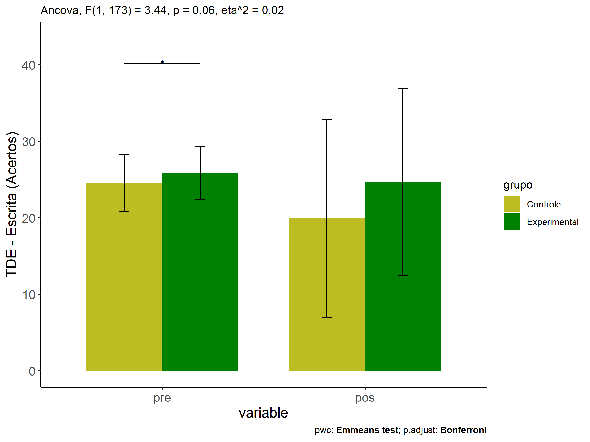<!-- -->

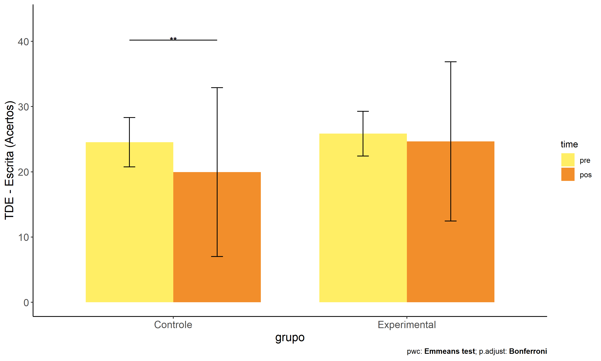<!-- -->

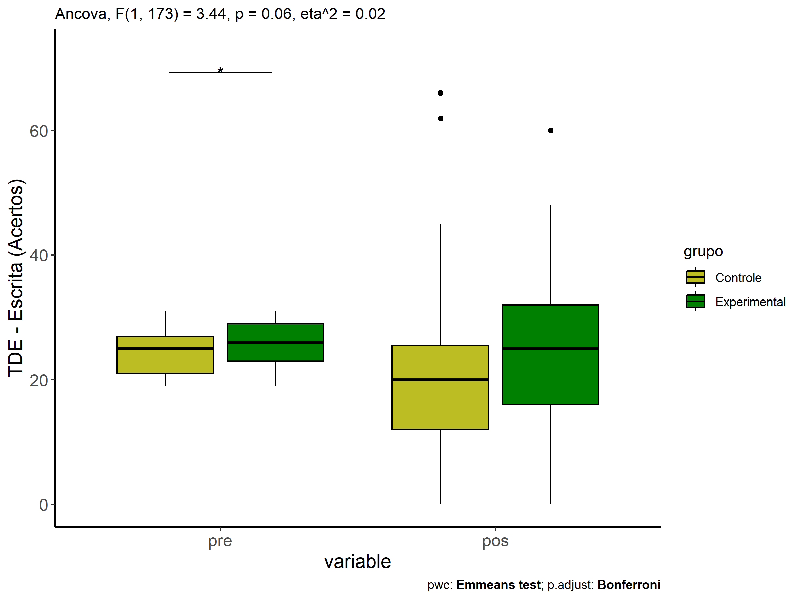<!-- -->

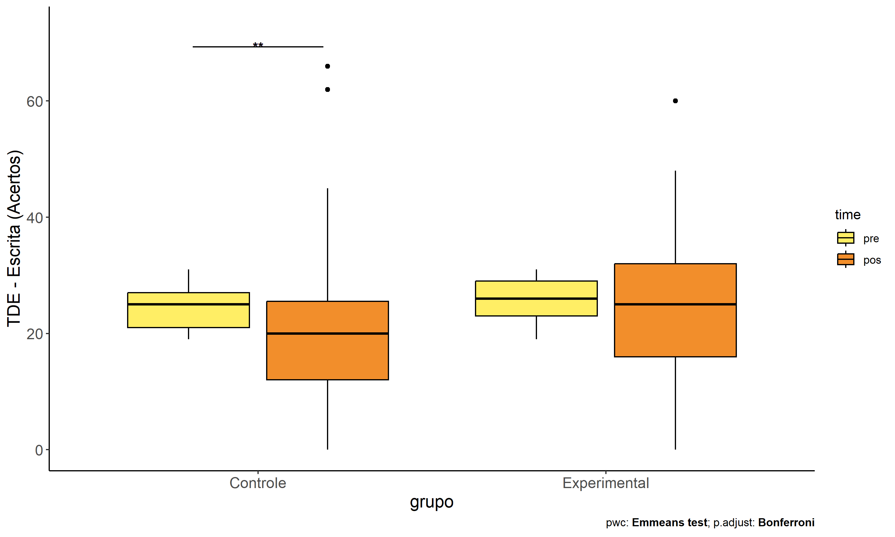<!-- -->

## Pairwise comparisons for two factors

### factores: **grupo:Sexo**

| var           | grupo        | Sexo |   n | M (pre) | SE (pre) | M (unadj) | SE (unadj) | M (adj) | SE (adj) |
|:--------------|:-------------|:-----|----:|--------:|---------:|----------:|-----------:|--------:|---------:|
| score.tde.pos | Controle     | F    |  31 |  24.935 |    0.659 |    19.452 |      2.237 |  19.842 |    2.198 |
| score.tde.pos | Controle     | M    |  28 |  24.107 |    0.741 |    20.536 |      2.584 |  21.602 |    2.335 |
| score.tde.pos | Experimental | F    |  49 |  26.184 |    0.439 |    24.510 |      1.721 |  23.883 |    1.757 |
| score.tde.pos | Experimental | M    |  68 |  25.618 |    0.443 |    24.794 |      1.504 |  24.629 |    1.483 |

| .y.           | grupo        | Sexo | group1   | group2       | estimate | conf.low | conf.high |    se | statistic |     p | p.adj | p.adj.signif |
|:--------------|:-------------|:-----|:---------|:-------------|---------:|---------:|----------:|------:|----------:|------:|------:|:-------------|
| score.tde.pos |              | F    | Controle | Experimental |   -4.041 |   -9.614 |     1.532 | 2.823 |    -1.431 | 0.154 | 0.154 | ns           |
| score.tde.pos |              | M    | Controle | Experimental |   -3.027 |   -8.500 |     2.446 | 2.772 |    -1.092 | 0.276 | 0.276 | ns           |
| score.tde.pre |              | F    | Controle | Experimental |   -1.248 |   -2.856 |     0.360 | 0.815 |    -1.532 | 0.127 | 0.127 | ns           |
| score.tde.pre |              | M    | Controle | Experimental |   -1.511 |   -3.084 |     0.063 | 0.797 |    -1.895 | 0.060 | 0.060 | ns           |
| score.tde.pos | Controle     |      | F        | M            |   -1.759 |   -8.063 |     4.544 | 3.193 |    -0.551 | 0.582 | 0.582 | ns           |
| score.tde.pos | Experimental |      | F        | M            |   -0.745 |   -5.275 |     3.784 | 2.295 |    -0.325 | 0.746 | 0.746 | ns           |
| score.tde.pre | Controle     |      | F        | M            |    0.828 |   -0.999 |     2.655 | 0.926 |     0.895 | 0.372 | 0.372 | ns           |
| score.tde.pre | Experimental |      | F        | M            |    0.566 |   -0.747 |     1.879 | 0.665 |     0.851 | 0.396 | 0.396 | ns           |

| .y.       | grupo        | Sexo | group1 | group2 | estimate | conf.low | conf.high |    se | statistic |     p | p.adj | p.adj.signif |
|:----------|:-------------|:-----|:-------|:-------|---------:|---------:|----------:|------:|----------:|------:|------:|:-------------|
| score.tde | Controle     | F    | pre    | pos    |    5.484 |    0.885 |    10.082 | 2.338 |     2.346 | 0.020 | 0.020 | \*           |
| score.tde | Controle     | M    | pre    | pos    |    3.571 |   -1.267 |     8.410 | 2.460 |     1.452 | 0.147 | 0.147 | ns           |
| score.tde | Experimental | F    | pre    | pos    |    1.673 |   -1.984 |     5.331 | 1.860 |     0.900 | 0.369 | 0.369 | ns           |
| score.tde | Experimental | M    | pre    | pos    |    0.824 |   -2.281 |     3.928 | 1.579 |     0.522 | 0.602 | 0.602 | ns           |

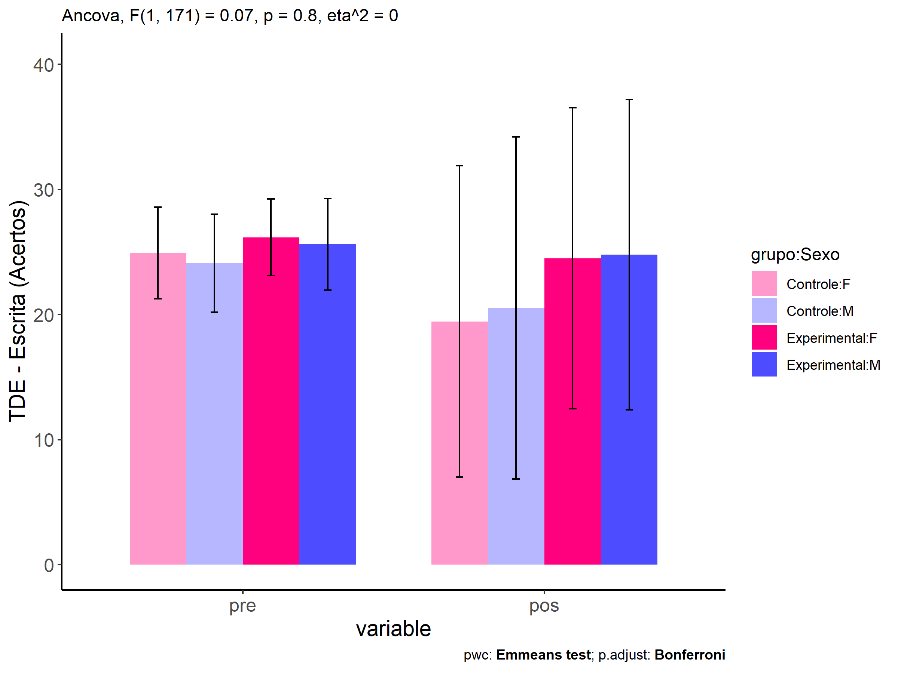<!-- -->

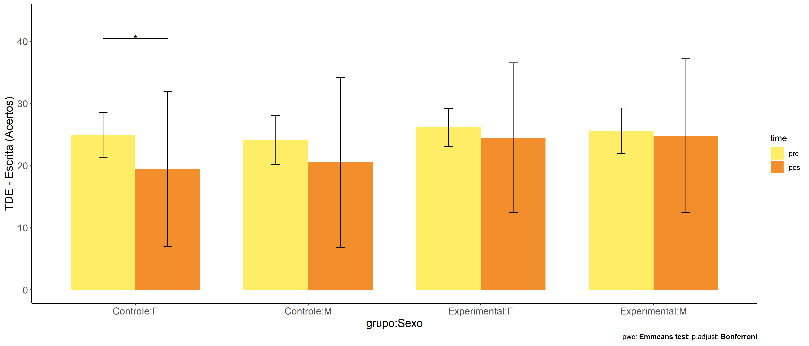<!-- -->

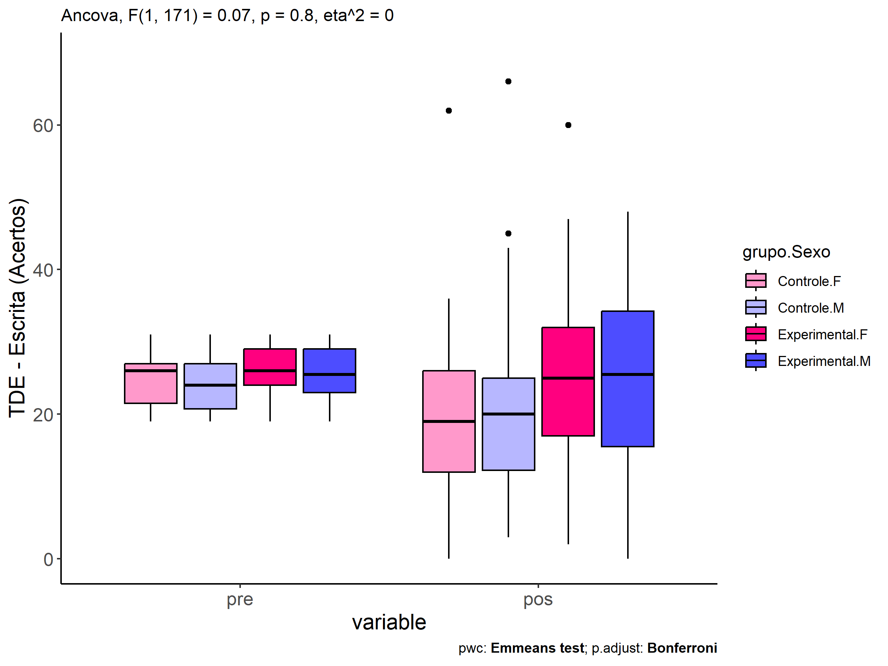<!-- -->

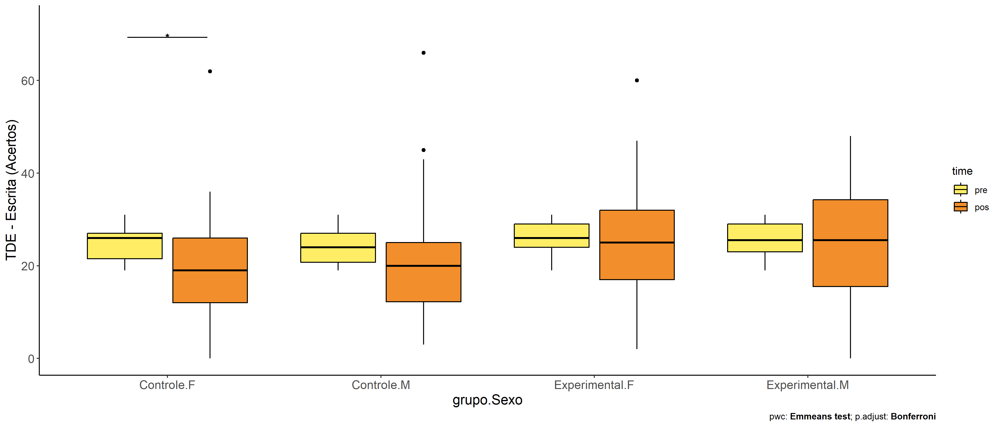<!-- -->

### factores: **grupo:Zona**

| var           | grupo        | Zona   |   n | M (pre) | SE (pre) | M (unadj) | SE (unadj) | M (adj) | SE (adj) |
|:--------------|:-------------|:-------|----:|--------:|---------:|----------:|-----------:|--------:|---------:|
| score.tde.pos | Controle     | Rural  |  21 |  23.429 |    0.748 |    26.238 |      3.562 |  27.842 |    2.629 |
| score.tde.pos | Controle     | Urbana |  20 |  25.150 |    0.847 |    12.200 |      1.718 |  12.348 |    2.627 |
| score.tde.pos | Experimental | Rural  |  55 |  25.891 |    0.471 |    25.873 |      1.604 |  25.394 |    1.593 |
| score.tde.pos | Experimental | Urbana |  27 |  25.778 |    0.652 |    18.889 |      2.147 |  18.506 |    2.265 |

| .y.           | grupo        | Zona   | group1   | group2       | estimate | conf.low | conf.high |    se | statistic | p       | p.adj   | p.adj.signif |
|:--------------|:-------------|:-------|:---------|:-------------|---------:|---------:|----------:|------:|----------:|:--------|:--------|:-------------|
| score.tde.pos |              | Rural  | Controle | Experimental |    2.448 |   -3.704 |     8.600 | 3.107 |     0.788 | 0.432   | 0.432   | ns           |
| score.tde.pos |              | Urbana | Controle | Experimental |   -6.158 |  -13.031 |     0.716 | 3.471 |    -1.774 | 0.079   | 0.079   | ns           |
| score.tde.pre |              | Rural  | Controle | Experimental |   -2.462 |   -4.245 |    -0.680 | 0.900 |    -2.735 | 0.007   | 0.007   | \*\*         |
| score.tde.pre |              | Urbana | Controle | Experimental |   -0.628 |   -2.678 |     1.422 | 1.035 |    -0.606 | 0.545   | 0.545   | ns           |
| score.tde.pos | Controle     |        | Rural    | Urbana       |   15.494 |    8.151 |    22.837 | 3.708 |     4.179 | \<0.001 | \<0.001 | \*\*\*\*     |
| score.tde.pos | Experimental |        | Rural    | Urbana       |    6.888 |    1.421 |    12.355 | 2.761 |     2.495 | 0.014   | 0.014   | \*           |
| score.tde.pre | Controle     |        | Rural    | Urbana       |   -1.721 |   -3.893 |     0.450 | 1.097 |    -1.570 | 0.119   | 0.119   | ns           |
| score.tde.pre | Experimental |        | Rural    | Urbana       |    0.113 |   -1.520 |     1.746 | 0.825 |     0.137 | 0.891   | 0.891   | ns           |

| .y.       | grupo        | Zona   | group1 | group2 | estimate | conf.low | conf.high |    se | statistic | p       | p.adj   | p.adj.signif |
|:----------|:-------------|:-------|:-------|:-------|---------:|---------:|----------:|------:|----------:|:--------|:--------|:-------------|
| score.tde | Controle     | Rural  | pre    | pos    |   -2.810 |   -8.212 |     2.593 | 2.743 |    -1.024 | 0.307   | 0.307   | ns           |
| score.tde | Controle     | Urbana | pre    | pos    |   12.950 |    7.414 |    18.486 | 2.810 |     4.608 | \<0.001 | \<0.001 | \*\*\*\*     |
| score.tde | Experimental | Rural  | pre    | pos    |    0.018 |   -3.320 |     3.357 | 1.695 |     0.011 | 0.991   | 0.991   | ns           |
| score.tde | Experimental | Urbana | pre    | pos    |    6.889 |    2.124 |    11.654 | 2.419 |     2.848 | 0.005   | 0.005   | \*\*         |

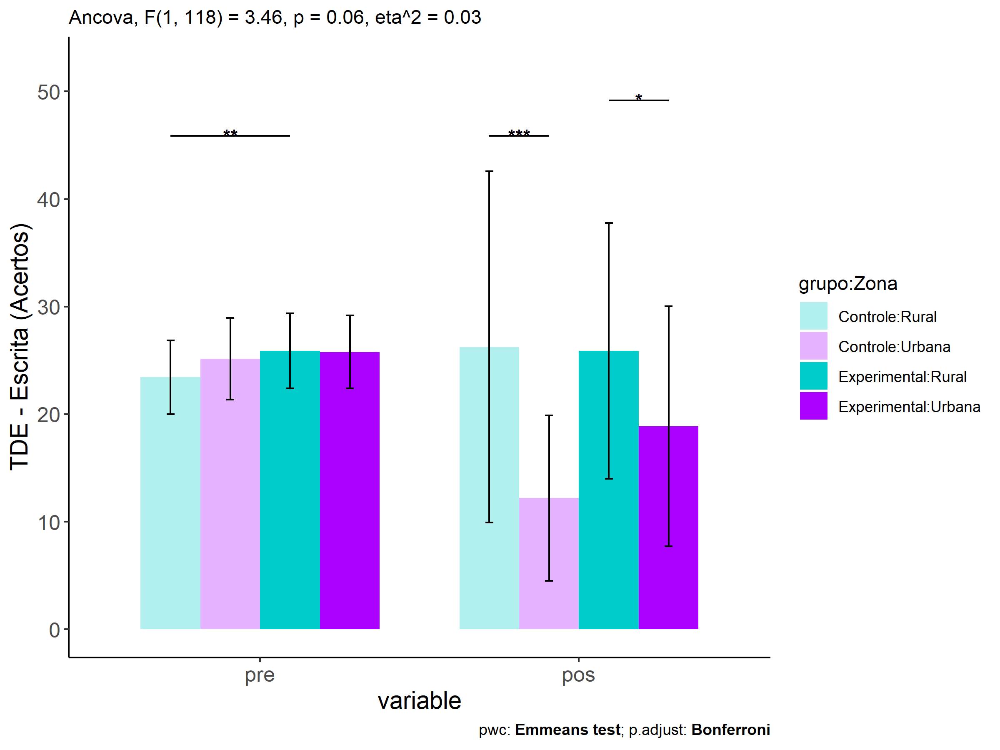<!-- -->

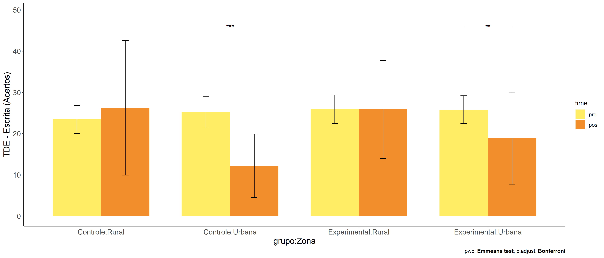<!-- -->

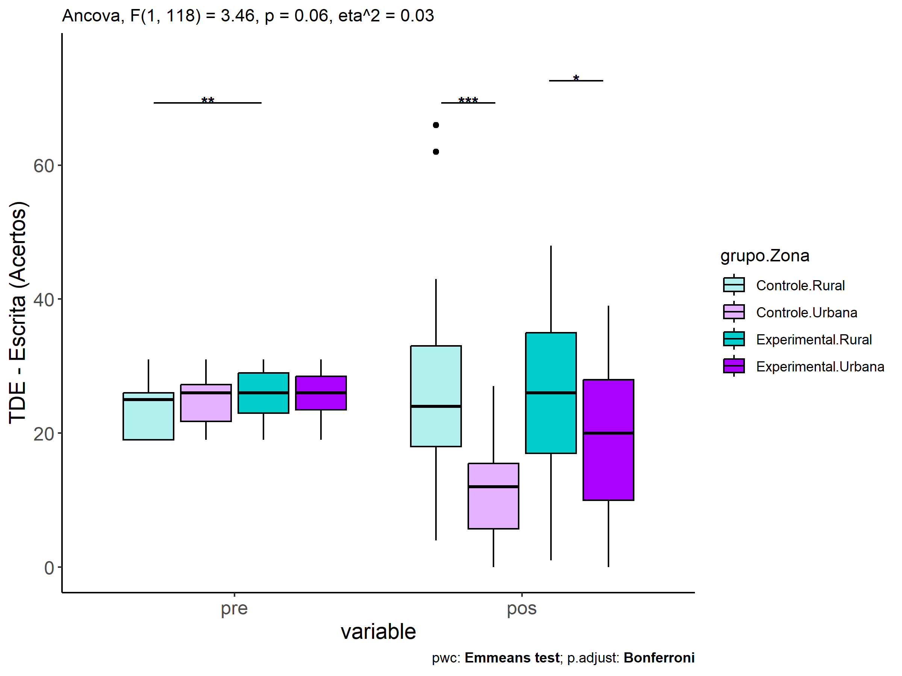<!-- -->

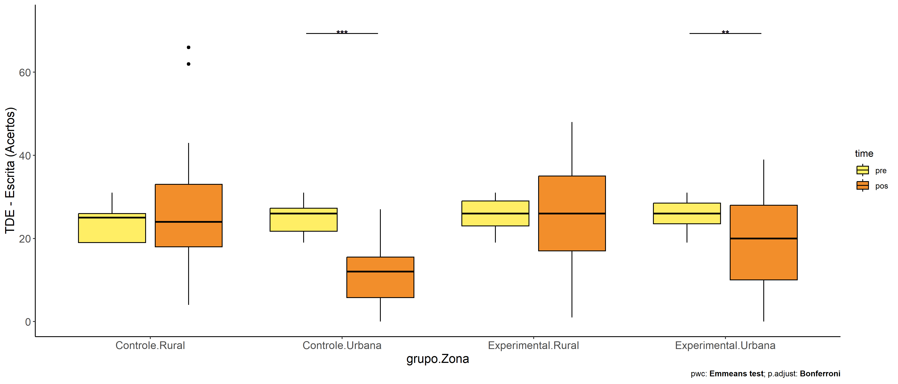<!-- -->

### factores: **grupo:Cor.Raca**

| var           | grupo        | Cor.Raca |   n | M (pre) | SE (pre) | M (unadj) | SE (unadj) | M (adj) | SE (adj) |
|:--------------|:-------------|:---------|----:|--------:|---------:|----------:|-----------:|--------:|---------:|
| score.tde.pos | Controle     | Parda    |  17 |  25.765 |    0.842 |    17.706 |      2.627 |  17.541 |    2.941 |
| score.tde.pos | Experimental | Branca   |   9 |  27.111 |    0.716 |    20.222 |      3.996 |  18.728 |    4.095 |
| score.tde.pos | Experimental | Parda    |  46 |  25.239 |    0.511 |    25.565 |      1.931 |  25.919 |    1.794 |

|     | .y.           | grupo        | Cor.Raca | group1   | group2       | estimate | conf.low | conf.high |    se | statistic |     p | p.adj | p.adj.signif |
|:----|:--------------|:-------------|:---------|:---------|:-------------|---------:|---------:|----------:|------:|----------:|------:|------:|:-------------|
| 2   | score.tde.pos |              | Parda    | Controle | Experimental |   -8.378 |  -15.260 |    -1.497 | 3.449 |    -2.429 | 0.018 | 0.018 | \*           |
| 4   | score.tde.pre |              | Parda    | Controle | Experimental |    0.526 |   -1.366 |     2.418 | 0.948 |     0.554 | 0.581 | 0.581 | ns           |
| 6   | score.tde.pos | Experimental |          | Branca   | Parda        |   -7.191 |  -16.158 |     1.776 | 4.494 |    -1.600 | 0.114 | 0.114 | ns           |
| 8   | score.tde.pre | Experimental |          | Branca   | Parda        |    1.872 |   -0.558 |     4.302 | 1.218 |     1.537 | 0.129 | 0.129 | ns           |

| .y.       | grupo        | Cor.Raca | group1 | group2 | estimate | conf.low | conf.high |    se | statistic |     p | p.adj | p.adj.signif |
|:----------|:-------------|:---------|:-------|:-------|---------:|---------:|----------:|------:|----------:|------:|------:|:-------------|
| score.tde | Controle     | Parda    | pre    | pos    |    8.059 |    1.864 |    14.254 | 3.133 |     2.572 | 0.011 | 0.011 | \*           |
| score.tde | Experimental | Branca   | pre    | pos    |    6.889 |   -1.626 |    15.403 | 4.306 |     1.600 | 0.112 | 0.112 | ns           |
| score.tde | Experimental | Parda    | pre    | pos    |   -0.326 |   -4.092 |     3.440 | 1.905 |    -0.171 | 0.864 | 0.864 | ns           |

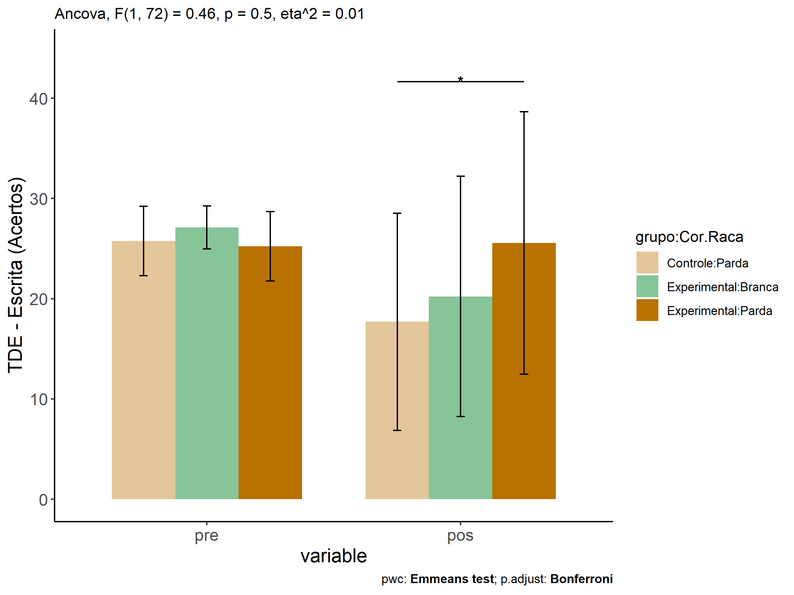<!-- -->

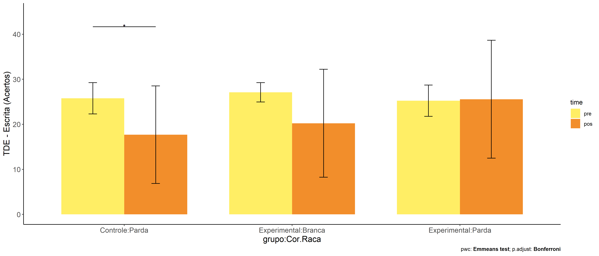<!-- -->

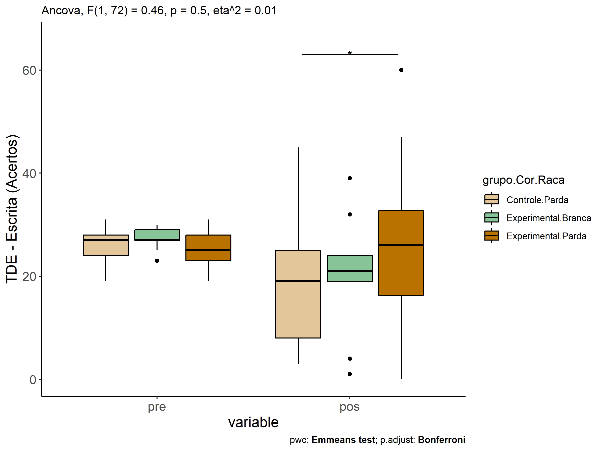<!-- -->

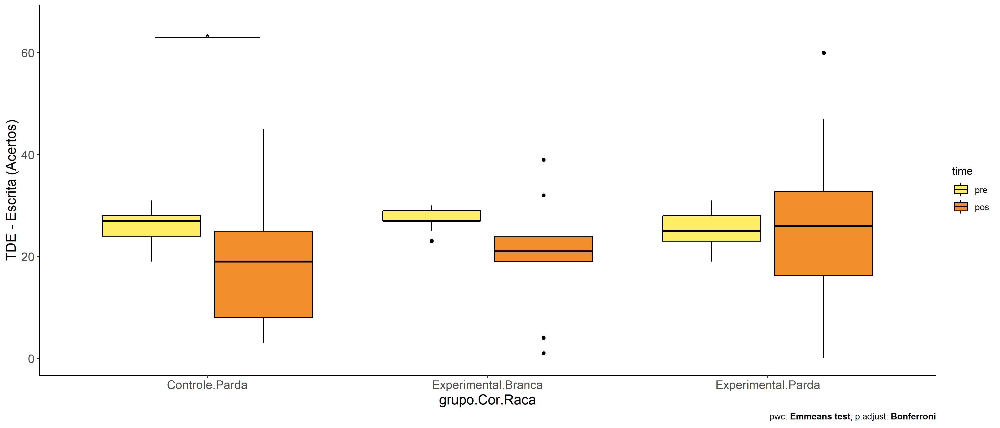<!-- -->

### factores: **grupo:Serie**

| var           | grupo        | Serie |   n | M (pre) | SE (pre) | M (unadj) | SE (unadj) | M (adj) | SE (adj) |
|:--------------|:-------------|:------|----:|--------:|---------:|----------:|-----------:|--------:|---------:|
| score.tde.pos | Controle     | 6 ano |  17 |  24.235 |    0.968 |    16.529 |      2.469 |  17.311 |    2.856 |
| score.tde.pos | Controle     | 7 ano |  25 |  23.800 |    0.683 |    19.240 |      3.379 |  20.311 |    2.378 |
| score.tde.pos | Controle     | 8 ano |  10 |  26.500 |    1.310 |    22.800 |      1.397 |  22.080 |    3.713 |
| score.tde.pos | Controle     | 9 ano |   7 |  25.143 |    1.405 |    26.857 |      3.135 |  27.037 |    4.426 |
| score.tde.pos | Experimental | 6 ano |  36 |  25.361 |    0.488 |    19.500 |      1.955 |  19.536 |    1.952 |
| score.tde.pos | Experimental | 7 ano |  41 |  25.512 |    0.602 |    23.585 |      1.898 |  23.521 |    1.829 |
| score.tde.pos | Experimental | 8 ano |  19 |  27.105 |    0.713 |    28.053 |      2.593 |  26.932 |    2.721 |
| score.tde.pos | Experimental | 9 ano |  21 |  26.238 |    0.762 |    32.619 |      2.009 |  32.073 |    2.564 |

| .y.           | grupo        | Serie | group1   | group2       | estimate | conf.low | conf.high |    se | statistic | p       | p.adj   | p.adj.signif |
|:--------------|:-------------|:------|:---------|:-------------|---------:|---------:|----------:|------:|----------:|:--------|:--------|:-------------|
| score.tde.pos |              | 6 ano | Controle | Experimental |   -2.224 |   -9.051 |     4.603 | 3.458 |    -0.643 | 0.521   | 0.521   | ns           |
| score.tde.pos |              | 7 ano | Controle | Experimental |   -3.210 |   -9.140 |     2.720 | 3.004 |    -1.069 | 0.287   | 0.287   | ns           |
| score.tde.pos |              | 8 ano | Controle | Experimental |   -4.851 |  -13.888 |     4.186 | 4.577 |    -1.060 | 0.291   | 0.291   | ns           |
| score.tde.pos |              | 9 ano | Controle | Experimental |   -5.036 |  -15.140 |     5.069 | 5.118 |    -0.984 | 0.327   | 0.327   | ns           |
| score.tde.pre |              | 6 ano | Controle | Experimental |   -1.126 |   -3.172 |     0.921 | 1.037 |    -1.086 | 0.279   | 0.279   | ns           |
| score.tde.pre |              | 7 ano | Controle | Experimental |   -1.712 |   -3.477 |     0.052 | 0.894 |    -1.916 | 0.057   | 0.057   | ns           |
| score.tde.pre |              | 8 ano | Controle | Experimental |   -0.605 |   -3.322 |     2.112 | 1.376 |    -0.440 | 0.661   | 0.661   | ns           |
| score.tde.pre |              | 9 ano | Controle | Experimental |   -1.095 |   -4.130 |     1.940 | 1.537 |    -0.712 | 0.477   | 0.477   | ns           |
| score.tde.pos | Controle     |       | 6 ano    | 7 ano        |   -2.999 |  -10.270 |     4.271 | 3.683 |    -0.814 | 0.417   | 1       | ns           |
| score.tde.pos | Controle     |       | 6 ano    | 8 ano        |   -4.769 |  -14.053 |     4.515 | 4.703 |    -1.014 | 0.312   | 1       | ns           |
| score.tde.pos | Controle     |       | 6 ano    | 9 ano        |   -9.726 |  -20.118 |     0.666 | 5.264 |    -1.848 | 0.066   | 0.398   | ns           |
| score.tde.pos | Controle     |       | 7 ano    | 8 ano        |   -1.770 |  -10.527 |     6.988 | 4.436 |    -0.399 | 0.69    | 1       | ns           |
| score.tde.pos | Controle     |       | 7 ano    | 9 ano        |   -6.727 |  -16.636 |     3.182 | 5.019 |    -1.340 | 0.182   | 1       | ns           |
| score.tde.pos | Controle     |       | 8 ano    | 9 ano        |   -4.957 |  -16.370 |     6.456 | 5.781 |    -0.857 | 0.392   | 1       | ns           |
| score.tde.pos | Experimental |       | 6 ano    | 7 ano        |   -3.985 |   -9.266 |     1.296 | 2.675 |    -1.490 | 0.138   | 0.829   | ns           |
| score.tde.pos | Experimental |       | 6 ano    | 8 ano        |   -7.396 |  -14.011 |    -0.782 | 3.350 |    -2.208 | 0.029   | 0.172   | ns           |
| score.tde.pos | Experimental |       | 6 ano    | 9 ano        |  -12.538 |  -18.901 |    -6.174 | 3.223 |    -3.890 | \<0.001 | \<0.001 | \*\*\*       |
| score.tde.pos | Experimental |       | 7 ano    | 8 ano        |   -3.411 |   -9.877 |     3.055 | 3.275 |    -1.041 | 0.299   | 1       | ns           |
| score.tde.pos | Experimental |       | 7 ano    | 9 ano        |   -8.552 |  -14.767 |    -2.338 | 3.148 |    -2.717 | 0.007   | 0.044   | \*           |
| score.tde.pos | Experimental |       | 8 ano    | 9 ano        |   -5.141 |  -12.474 |     2.191 | 3.714 |    -1.384 | 0.168   | 1       | ns           |
| score.tde.pre | Controle     |       | 6 ano    | 7 ano        |    0.435 |   -1.751 |     2.621 | 1.107 |     0.393 | 0.695   | 1       | ns           |
| score.tde.pre | Controle     |       | 6 ano    | 8 ano        |   -2.265 |   -5.036 |     0.507 | 1.404 |    -1.613 | 0.109   | 0.651   | ns           |
| score.tde.pre | Controle     |       | 6 ano    | 9 ano        |   -0.908 |   -4.031 |     2.215 | 1.582 |    -0.574 | 0.567   | 1       | ns           |
| score.tde.pre | Controle     |       | 7 ano    | 8 ano        |   -2.700 |   -5.302 |    -0.098 | 1.318 |    -2.049 | 0.042   | 0.252   | ns           |
| score.tde.pre | Controle     |       | 7 ano    | 9 ano        |   -1.343 |   -4.317 |     1.631 | 1.506 |    -0.891 | 0.374   | 1       | ns           |
| score.tde.pre | Controle     |       | 8 ano    | 9 ano        |    1.357 |   -2.070 |     4.784 | 1.736 |     0.782 | 0.435   | 1       | ns           |
| score.tde.pre | Experimental |       | 6 ano    | 7 ano        |   -0.151 |   -1.739 |     1.437 | 0.805 |    -0.188 | 0.851   | 1       | ns           |
| score.tde.pre | Experimental |       | 6 ano    | 8 ano        |   -1.744 |   -3.716 |     0.228 | 0.999 |    -1.746 | 0.083   | 0.496   | ns           |
| score.tde.pre | Experimental |       | 6 ano    | 9 ano        |   -0.877 |   -2.786 |     1.033 | 0.967 |    -0.907 | 0.366   | 1       | ns           |
| score.tde.pre | Experimental |       | 7 ano    | 8 ano        |   -1.593 |   -3.523 |     0.337 | 0.978 |    -1.630 | 0.105   | 0.63    | ns           |
| score.tde.pre | Experimental |       | 7 ano    | 9 ano        |   -0.726 |   -2.592 |     1.140 | 0.945 |    -0.768 | 0.444   | 1       | ns           |
| score.tde.pre | Experimental |       | 8 ano    | 9 ano        |    0.867 |   -1.335 |     3.069 | 1.115 |     0.778 | 0.438   | 1       | ns           |

| .y.       | grupo        | Serie | group1 | group2 | estimate | conf.low | conf.high |    se | statistic |     p | p.adj | p.adj.signif |
|:----------|:-------------|:------|:-------|:-------|---------:|---------:|----------:|------:|----------:|------:|------:|:-------------|
| score.tde | Controle     | 6 ano | pre    | pos    |    7.706 |    1.782 |    13.629 | 3.011 |     2.559 | 0.011 | 0.011 | \*           |
| score.tde | Controle     | 7 ano | pre    | pos    |    4.560 |   -0.325 |     9.445 | 2.483 |     1.836 | 0.067 | 0.067 | ns           |
| score.tde | Controle     | 8 ano | pre    | pos    |    3.700 |   -4.023 |    11.423 | 3.926 |     0.942 | 0.347 | 0.347 | ns           |
| score.tde | Controle     | 9 ano | pre    | pos    |   -1.714 |  -10.945 |     7.517 | 4.693 |    -0.365 | 0.715 | 0.715 | ns           |
| score.tde | Experimental | 6 ano | pre    | pos    |    5.861 |    1.791 |     9.932 | 2.069 |     2.832 | 0.005 | 0.005 | \*\*         |
| score.tde | Experimental | 7 ano | pre    | pos    |    1.927 |   -1.887 |     5.741 | 1.939 |     0.994 | 0.321 | 0.321 | ns           |
| score.tde | Experimental | 8 ano | pre    | pos    |   -0.947 |   -6.550 |     4.656 | 2.848 |    -0.333 | 0.740 | 0.740 | ns           |
| score.tde | Experimental | 9 ano | pre    | pos    |   -6.381 |  -11.710 |    -1.051 | 2.709 |    -2.355 | 0.019 | 0.019 | \*           |

<!-- -->

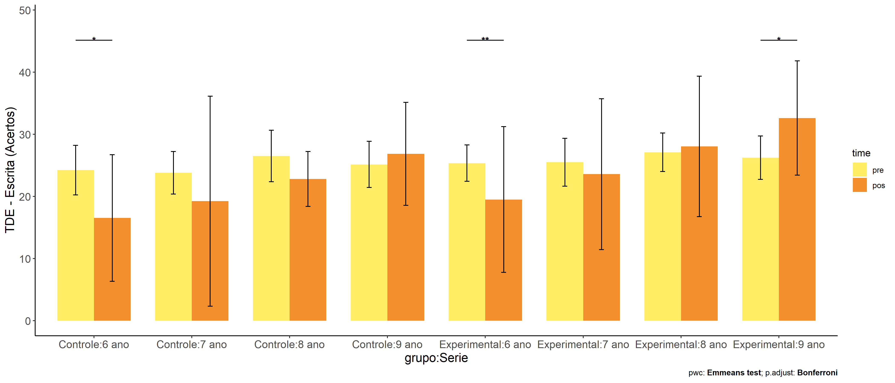<!-- -->

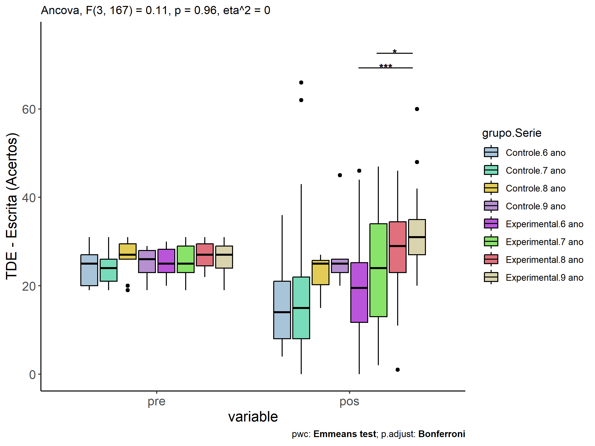<!-- -->

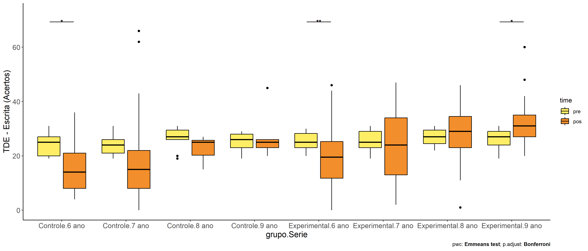<!-- -->
