ANCOVA in TDE - Escrita (Acertos) (TDE - Escrita (Acertos))
================
Geiser C. Challco <geiser@alumni.usp.br>

- [Descriptive Statistics of Initial
  Data](#descriptive-statistics-of-initial-data)
- [Checking of Assumptions](#checking-of-assumptions)
  - [Assumption: Normality distribution of
    data](#assumption-normality-distribution-of-data)
  - [Assumption: Homogeneity of data
    distribution](#assumption-homogeneity-of-data-distribution)
- [Computation of ANCOVA test and Pairwise
  Comparison](#computation-of-ancova-test-and-pairwise-comparison)
  - [ANCOVA tests for one factor](#ancova-tests-for-one-factor)
  - [ANCOVA tests for two factors](#ancova-tests-for-two-factors)
  - [Pairwise comparisons for one factor:
    **grupo**](#pairwise-comparisons-for-one-factor-grupo)
  - [Pairwise comparisons for two
    factors](#pairwise-comparisons-for-two-factors)
    - [factores: **grupo:Sexo**](#factores-gruposexo)
    - [factores: **grupo:Zona**](#factores-grupozona)
    - [factores: **grupo:Cor.Raca**](#factores-grupocorraca)
    - [factores: **grupo:Serie**](#factores-gruposerie)

**NOTE**

- Teste ANCOVA para determinar se houve diferenças significativas no
  TDE - Escrita (Acertos) (medido usando pre- e pos-testes).
- ANCOVA test to determine whether there were significant differences in
  TDE - Escrita (Acertos) (measured using pre- and post-tests).

# Descriptive Statistics of Initial Data

| grupo        | Sexo | Zona   | Cor.Raca | Serie | variable      |   n |   mean | median | min | max |     sd |    se |     ci |   iqr |
|:-------------|:-----|:-------|:---------|:------|:--------------|----:|-------:|-------:|----:|----:|-------:|------:|-------:|------:|
| Controle     | F    |        |          |       | score.tde.pre |  70 | 47.386 |   47.5 |  43 |  51 |  2.515 | 0.301 |  0.600 |  4.75 |
| Controle     | M    |        |          |       | score.tde.pre |  65 | 47.354 |   47.0 |  43 |  51 |  2.666 | 0.331 |  0.661 |  4.00 |
| Experimental | F    |        |          |       | score.tde.pre |  74 | 46.757 |   47.0 |  43 |  51 |  2.443 | 0.284 |  0.566 |  4.00 |
| Experimental | M    |        |          |       | score.tde.pre |  58 | 46.621 |   47.0 |  43 |  51 |  2.567 | 0.337 |  0.675 |  3.75 |
| Controle     | F    |        |          |       | score.tde.pos |  70 | 43.086 |   45.5 |  14 |  63 | 11.573 | 1.383 |  2.759 | 16.75 |
| Controle     | M    |        |          |       | score.tde.pos |  65 | 43.354 |   46.0 |  15 |  62 | 11.214 | 1.391 |  2.779 | 15.00 |
| Experimental | F    |        |          |       | score.tde.pos |  74 | 44.622 |   47.0 |  10 |  65 | 11.430 | 1.329 |  2.648 | 12.00 |
| Experimental | M    |        |          |       | score.tde.pos |  58 | 45.552 |   47.0 |  16 |  69 |  9.563 | 1.256 |  2.514 | 10.00 |
| Controle     |      | Rural  |          |       | score.tde.pre |  78 | 47.269 |   47.0 |  43 |  51 |  2.661 | 0.301 |  0.600 |  5.00 |
| Controle     |      | Urbana |          |       | score.tde.pre |  26 | 47.692 |   48.0 |  43 |  51 |  2.510 | 0.492 |  1.014 |  4.00 |
| Controle     |      |        |          |       | score.tde.pre |  31 | 47.355 |   47.0 |  43 |  51 |  2.484 | 0.446 |  0.911 |  3.00 |
| Experimental |      | Rural  |          |       | score.tde.pre |  51 | 46.922 |   47.0 |  43 |  51 |  2.415 | 0.338 |  0.679 |  4.00 |
| Experimental |      | Urbana |          |       | score.tde.pre |  37 | 46.270 |   46.0 |  43 |  51 |  2.317 | 0.381 |  0.773 |  4.00 |
| Experimental |      |        |          |       | score.tde.pre |  44 | 46.795 |   47.0 |  43 |  51 |  2.716 | 0.409 |  0.826 |  5.00 |
| Controle     |      | Rural  |          |       | score.tde.pos |  78 | 44.436 |   46.0 |  14 |  63 | 11.425 | 1.294 |  2.576 | 15.25 |
| Controle     |      | Urbana |          |       | score.tde.pos |  26 | 37.808 |   38.5 |  18 |  62 | 12.741 | 2.499 |  5.146 | 23.00 |
| Controle     |      |        |          |       | score.tde.pos |  31 | 44.677 |   47.0 |  28 |  57 |  8.642 | 1.552 |  3.170 | 12.50 |
| Experimental |      | Rural  |          |       | score.tde.pos |  51 | 45.569 |   48.0 |  15 |  65 | 11.549 | 1.617 |  3.248 | 11.50 |
| Experimental |      | Urbana |          |       | score.tde.pos |  37 | 42.324 |   44.0 |  10 |  64 | 11.719 | 1.927 |  3.907 | 12.00 |
| Experimental |      |        |          |       | score.tde.pos |  44 | 46.682 |   47.0 |  28 |  69 |  8.011 | 1.208 |  2.436 | 11.25 |
| Controle     |      |        | Branca   |       | score.tde.pre |  22 | 47.045 |   47.0 |  43 |  51 |  2.319 | 0.494 |  1.028 |  3.75 |
| Controle     |      |        | Indígena |       | score.tde.pre |   4 | 47.250 |   46.5 |  46 |  50 |  1.893 | 0.946 |  3.012 |  1.75 |
| Controle     |      |        | Parda    |       | score.tde.pre |  49 | 47.694 |   48.0 |  43 |  51 |  2.632 | 0.376 |  0.756 |  4.00 |
| Controle     |      |        |          |       | score.tde.pre |  60 | 47.233 |   47.0 |  43 |  51 |  2.689 | 0.347 |  0.695 |  5.00 |
| Experimental |      |        | Branca   |       | score.tde.pre |   7 | 48.714 |   49.0 |  44 |  51 |  2.628 | 0.993 |  2.430 |  3.50 |
| Experimental |      |        | Indígena |       | score.tde.pre |   1 | 48.000 |   48.0 |  48 |  48 |        |       |        |  0.00 |
| Experimental |      |        | Parda    |       | score.tde.pre |  36 | 47.222 |   47.0 |  43 |  51 |  2.205 | 0.368 |  0.746 |  4.00 |
| Experimental |      |        |          |       | score.tde.pre |  88 | 46.307 |   46.0 |  43 |  51 |  2.507 | 0.267 |  0.531 |  4.00 |
| Controle     |      |        | Branca   |       | score.tde.pos |  22 | 39.545 |   43.5 |  14 |  59 | 11.995 | 2.557 |  5.318 | 18.50 |
| Controle     |      |        | Indígena |       | score.tde.pos |   4 | 55.250 |   55.5 |  50 |  60 |  4.992 | 2.496 |  7.943 |  7.75 |
| Controle     |      |        | Parda    |       | score.tde.pos |  49 | 44.980 |   47.0 |  18 |  60 | 10.435 | 1.491 |  2.997 | 16.00 |
| Controle     |      |        |          |       | score.tde.pos |  60 | 42.317 |   45.0 |  15 |  63 | 11.566 | 1.493 |  2.988 | 15.25 |
| Experimental |      |        | Branca   |       | score.tde.pos |   7 | 42.286 |   47.0 |  15 |  62 | 14.963 | 5.656 | 13.839 | 13.00 |
| Experimental |      |        | Indígena |       | score.tde.pos |   1 | 52.000 |   52.0 |  52 |  52 |        |       |        |  0.00 |
| Experimental |      |        | Parda    |       | score.tde.pos |  36 | 44.333 |   48.0 |  10 |  65 | 12.759 | 2.127 |  4.317 | 14.00 |
| Experimental |      |        |          |       | score.tde.pos |  88 | 45.455 |   47.0 |  16 |  69 |  9.348 | 0.996 |  1.981 | 11.00 |
| Controle     |      |        |          | 6 ano | score.tde.pre |  33 | 47.788 |   48.0 |  43 |  51 |  2.559 | 0.445 |  0.907 |  4.00 |
| Controle     |      |        |          | 7 ano | score.tde.pre |  42 | 47.000 |   47.0 |  43 |  51 |  2.295 | 0.354 |  0.715 |  2.75 |
| Controle     |      |        |          | 8 ano | score.tde.pre |  24 | 47.542 |   48.0 |  43 |  51 |  2.734 | 0.558 |  1.155 |  5.00 |
| Controle     |      |        |          | 9 ano | score.tde.pre |  36 | 47.306 |   47.0 |  43 |  51 |  2.837 | 0.473 |  0.960 |  5.00 |
| Experimental |      |        |          | 6 ano | score.tde.pre |  20 | 46.750 |   46.5 |  44 |  50 |  2.074 | 0.464 |  0.971 |  3.25 |
| Experimental |      |        |          | 7 ano | score.tde.pre |  43 | 46.488 |   47.0 |  43 |  51 |  2.539 | 0.387 |  0.781 |  4.50 |
| Experimental |      |        |          | 8 ano | score.tde.pre |  37 | 46.703 |   46.0 |  43 |  51 |  2.644 | 0.435 |  0.882 |  5.00 |
| Experimental |      |        |          | 9 ano | score.tde.pre |  32 | 46.938 |   47.5 |  43 |  51 |  2.564 | 0.453 |  0.925 |  4.25 |
| Controle     |      |        |          | 6 ano | score.tde.pos |  33 | 42.364 |   44.0 |  15 |  60 | 11.261 | 1.960 |  3.993 | 12.00 |
| Controle     |      |        |          | 7 ano | score.tde.pos |  42 | 39.262 |   41.5 |  14 |  63 | 13.991 | 2.159 |  4.360 | 24.00 |
| Controle     |      |        |          | 8 ano | score.tde.pos |  24 | 44.958 |   47.0 |  28 |  55 |  8.917 | 1.820 |  3.765 | 13.00 |
| Controle     |      |        |          | 9 ano | score.tde.pos |  36 | 47.444 |   48.5 |  28 |  62 |  7.527 | 1.254 |  2.547 |  9.00 |
| Experimental |      |        |          | 6 ano | score.tde.pos |  20 | 37.700 |   40.5 |  10 |  62 | 14.124 | 3.158 |  6.610 | 18.75 |
| Experimental |      |        |          | 7 ano | score.tde.pos |  43 | 44.000 |   46.0 |  16 |  69 | 11.737 | 1.790 |  3.612 | 12.50 |
| Experimental |      |        |          | 8 ano | score.tde.pos |  37 | 47.405 |   47.0 |  35 |  64 |  7.533 | 1.238 |  2.512 |  9.00 |
| Experimental |      |        |          | 9 ano | score.tde.pos |  32 | 48.250 |   49.5 |  28 |  59 |  6.951 | 1.229 |  2.506 |  5.25 |

# Checking of Assumptions

## Assumption: Normality distribution of data

| var           |   n |   skewness |  kurtosis | symmetry | statistic | method     |         p | p.signif | normality |
|:--------------|----:|-----------:|----------:|:---------|----------:|:-----------|----------:|:---------|:----------|
| score.tde.pos | 267 | -0.5903054 | 0.3099689 | NO       | 15.851175 | D’Agostino | 0.0003614 | \*\*     | \-        |
| score.tde.pos | 192 | -0.5577882 | 0.1738301 | NO       | 10.243227 | D’Agostino | 0.0059664 | \*       | QQ        |
| score.tde.pos | 119 | -0.4970274 | 0.2215246 | YES      |  5.878635 | D’Agostino | 0.0529018 | ns       | QQ        |
| score.tde.pos | 267 | -0.2272771 | 0.3149273 | YES      |  3.903272 | D’Agostino | 0.1420415 | ns       | \-        |

## Assumption: Homogeneity of data distribution

| var           | method         | formula                    |   n | DFn.df1 | DFd.df2 | statistic |         p | p.signif |
|:--------------|:---------------|:---------------------------|----:|--------:|--------:|----------:|----------:|:---------|
| score.tde.pos | Levene’s test  | `.res`~`grupo`\*`Sexo`     | 267 |       3 |     263 | 0.8036980 | 0.4927675 | ns       |
| score.tde.pos | Anova’s slopes | `.res`~`grupo`\*`Sexo`     | 267 |       3 |     259 | 0.7250000 | 0.5380000 | ns       |
| score.tde.pos | Levene’s test  | `.res`~`grupo`\*`Zona`     | 192 |       3 |     188 | 0.3073503 | 0.8200585 | ns       |
| score.tde.pos | Anova’s slopes | `.res`~`grupo`\*`Zona`     | 192 |       3 |     184 | 1.4290000 | 0.2360000 | ns       |
| score.tde.pos | Levene’s test  | `.res`~`grupo`\*`Cor.Raca` | 119 |       5 |     113 | 0.5521395 | 0.7363963 | ns       |
| score.tde.pos | Anova’s slopes | `.res`~`grupo`\*`Cor.Raca` | 119 |       4 |     108 | 0.5690000 | 0.6860000 | ns       |
| score.tde.pos | Levene’s test  | `.res`~`grupo`\*`Serie`    | 267 |       7 |     259 | 5.4118968 | 0.0000083 | \*\*\*\* |
| score.tde.pos | Anova’s slopes | `.res`~`grupo`\*`Serie`    | 267 |       7 |     251 | 0.9860000 | 0.4420000 | ns       |

# Computation of ANCOVA test and Pairwise Comparison

## ANCOVA tests for one factor

|     | Effect        | DFn | DFd |      SSn |      SSd |      F | p       |   ges | p\<.05 |
|:----|:--------------|----:|----:|---------:|---------:|-------:|:--------|------:|:-------|
| 1   | score.tde.pre |   1 | 264 | 3074.571 | 28996.08 | 27.993 | \<0.001 | 0.096 | \*     |
| 2   | grupo         |   1 | 264 |  485.234 | 28996.08 |  4.418 | 0.037   | 0.016 | \*     |
| 4   | Sexo          |   1 | 264 |   22.663 | 29458.65 |  0.203 | 0.653   | 0.001 |        |
| 6   | Zona          |   1 | 189 |  689.253 | 23697.38 |  5.497 | 0.02    | 0.028 | \*     |
| 8   | Cor.Raca      |   2 | 115 | 1021.216 | 13074.26 |  4.491 | 0.013   | 0.072 | \*     |
| 10  | Serie         |   3 | 262 | 2409.313 | 27072.00 |  7.772 | \<0.001 | 0.082 | \*     |

## ANCOVA tests for two factors

|     | Effect         | DFn | DFd |      SSn |      SSd |      F | p       |   ges | p\<.05 |
|:----|:---------------|----:|----:|---------:|---------:|-------:|:--------|------:|:-------|
| 1   | score.tde.pre  |   1 | 262 | 3087.566 | 28952.53 | 27.940 | \<0.001 | 0.096 | \*     |
| 4   | grupo:Sexo     |   1 | 262 |   10.651 | 28952.53 |  0.096 | 0.756   | 0.000 |        |
| 8   | grupo:Zona     |   1 | 187 |  255.333 | 22950.63 |  2.080 | 0.151   | 0.011 |        |
| 12  | grupo:Cor.Raca |   2 | 112 |   18.939 | 13055.30 |  0.081 | 0.922   | 0.001 |        |
| 16  | grupo:Serie    |   3 | 258 |  635.605 | 26105.73 |  2.094 | 0.101   | 0.024 |        |

## Pairwise comparisons for one factor: **grupo**

| var           | grupo        |   n | M (pre) | SE (pre) | M (unadj) | SE (unadj) | M (adj) | SE (adj) |
|:--------------|:-------------|----:|--------:|---------:|----------:|-----------:|--------:|---------:|
| score.tde.pos | Controle     | 135 |  47.370 |    0.222 |    43.215 |      0.978 |  42.768 |    0.906 |
| score.tde.pos | Experimental | 132 |  46.697 |    0.217 |    45.030 |      0.924 |  45.488 |    0.916 |

| .y.           | group1   | group2       | estimate | conf.low | conf.high |    se | statistic |     p | p.adj | p.adj.signif |
|:--------------|:---------|:-------------|---------:|---------:|----------:|------:|----------:|------:|------:|:-------------|
| score.tde.pos | Controle | Experimental |   -2.720 |   -5.268 |    -0.172 | 1.294 |    -2.102 | 0.037 | 0.037 | \*           |
| score.tde.pre | Controle | Experimental |    0.673 |    0.062 |     1.284 | 0.310 |     2.170 | 0.031 | 0.031 | \*           |

| .y.       | grupo        | group1 | group2 | estimate | conf.low | conf.high |    se | statistic | p       | p.adj   | p.adj.signif |
|:----------|:-------------|:-------|:-------|---------:|---------:|----------:|------:|----------:|:--------|:--------|:-------------|
| score.tde | Controle     | pre    | pos    |    4.156 |    2.247 |     6.064 | 0.972 |     4.277 | \<0.001 | \<0.001 | \*\*\*\*     |
| score.tde | Experimental | pre    | pos    |    1.667 |   -0.264 |     3.597 | 0.983 |     1.696 | 0.09    | 0.09    | ns           |

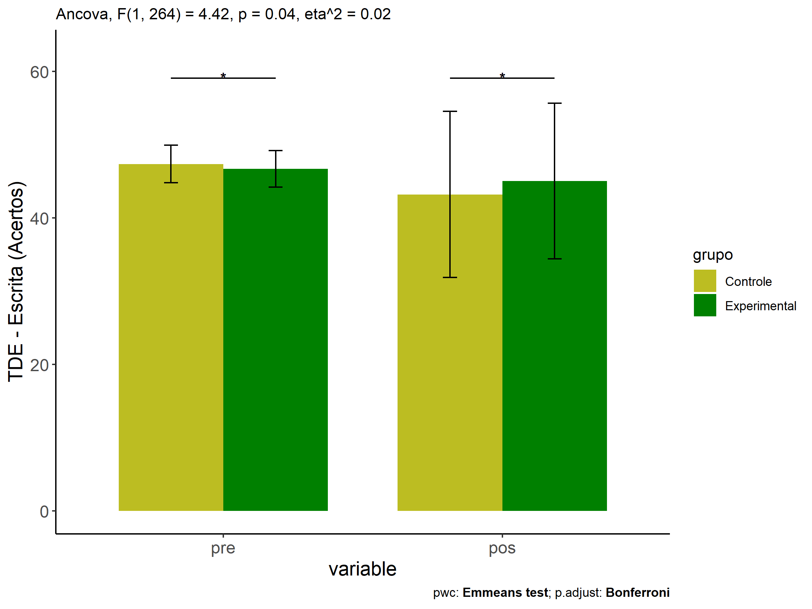<!-- -->

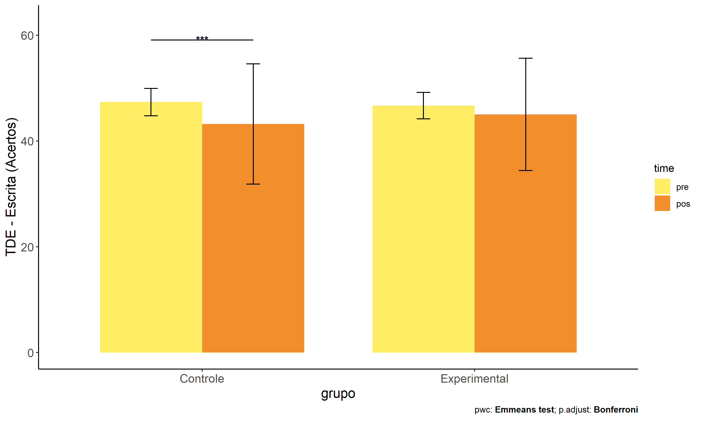<!-- -->

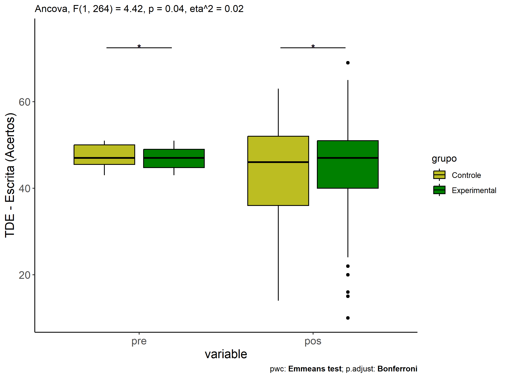<!-- -->

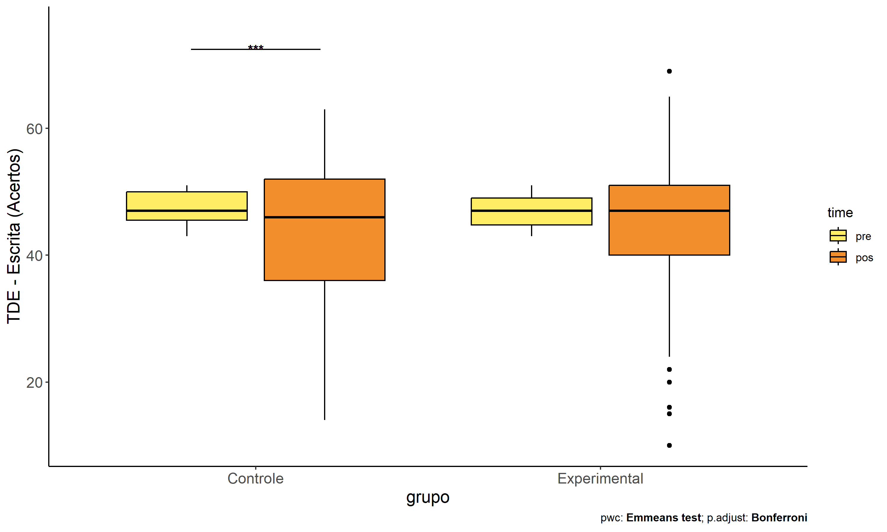<!-- -->

## Pairwise comparisons for two factors

### factores: **grupo:Sexo**

| var           | grupo        | Sexo |   n | M (pre) | SE (pre) | M (unadj) | SE (unadj) | M (adj) | SE (adj) |
|:--------------|:-------------|:-----|----:|--------:|---------:|----------:|-----------:|--------:|---------:|
| score.tde.pos | Controle     | F    |  70 |  47.386 |    0.301 |    43.086 |      1.383 |  42.617 |    1.260 |
| score.tde.pos | Controle     | M    |  65 |  47.354 |    0.331 |    43.354 |      1.391 |  42.928 |    1.306 |
| score.tde.pos | Experimental | F    |  74 |  46.757 |    0.284 |    44.622 |      1.329 |  45.000 |    1.224 |
| score.tde.pos | Experimental | M    |  58 |  46.621 |    0.337 |    45.552 |      1.256 |  46.113 |    1.384 |

| .y.           | grupo        | Sexo | group1   | group2       | estimate | conf.low | conf.high |    se | statistic |     p | p.adj | p.adj.signif |
|:--------------|:-------------|:-----|:---------|:-------------|---------:|---------:|----------:|------:|----------:|------:|------:|:-------------|
| score.tde.pos |              | F    | Controle | Experimental |   -2.383 |   -5.848 |     1.083 | 1.760 |    -1.354 | 0.177 | 0.177 | ns           |
| score.tde.pos |              | M    | Controle | Experimental |   -3.185 |   -6.942 |     0.572 | 1.908 |    -1.669 | 0.096 | 0.096 | ns           |
| score.tde.pre |              | F    | Controle | Experimental |    0.629 |   -0.206 |     1.464 | 0.424 |     1.483 | 0.139 | 0.139 | ns           |
| score.tde.pre |              | M    | Controle | Experimental |    0.733 |   -0.172 |     1.638 | 0.460 |     1.595 | 0.112 | 0.112 | ns           |
| score.tde.pos | Controle     |      | F        | M            |   -0.311 |   -3.877 |     3.254 | 1.811 |    -0.172 | 0.864 | 0.864 | ns           |
| score.tde.pos | Experimental |      | F        | M            |   -1.113 |   -4.744 |     2.517 | 1.844 |    -0.604 | 0.546 | 0.546 | ns           |
| score.tde.pre | Controle     |      | F        | M            |    0.032 |   -0.831 |     0.895 | 0.438 |     0.073 | 0.942 | 0.942 | ns           |
| score.tde.pre | Experimental |      | F        | M            |    0.136 |   -0.743 |     1.015 | 0.446 |     0.305 | 0.761 | 0.761 | ns           |

| .y.       | grupo        | Sexo | group1 | group2 | estimate | conf.low | conf.high |    se | statistic |     p | p.adj | p.adj.signif |
|:----------|:-------------|:-----|:-------|:-------|---------:|---------:|----------:|------:|----------:|------:|------:|:-------------|
| score.tde | Controle     | F    | pre    | pos    |    4.300 |    1.640 |     6.960 | 1.354 |     3.176 | 0.002 | 0.002 | \*\*         |
| score.tde | Controle     | M    | pre    | pos    |    4.000 |    1.240 |     6.760 | 1.405 |     2.847 | 0.005 | 0.005 | \*\*         |
| score.tde | Experimental | F    | pre    | pos    |    2.135 |   -0.452 |     4.722 | 1.317 |     1.622 | 0.106 | 0.106 | ns           |
| score.tde | Experimental | M    | pre    | pos    |    1.069 |   -1.853 |     3.991 | 1.487 |     0.719 | 0.473 | 0.473 | ns           |

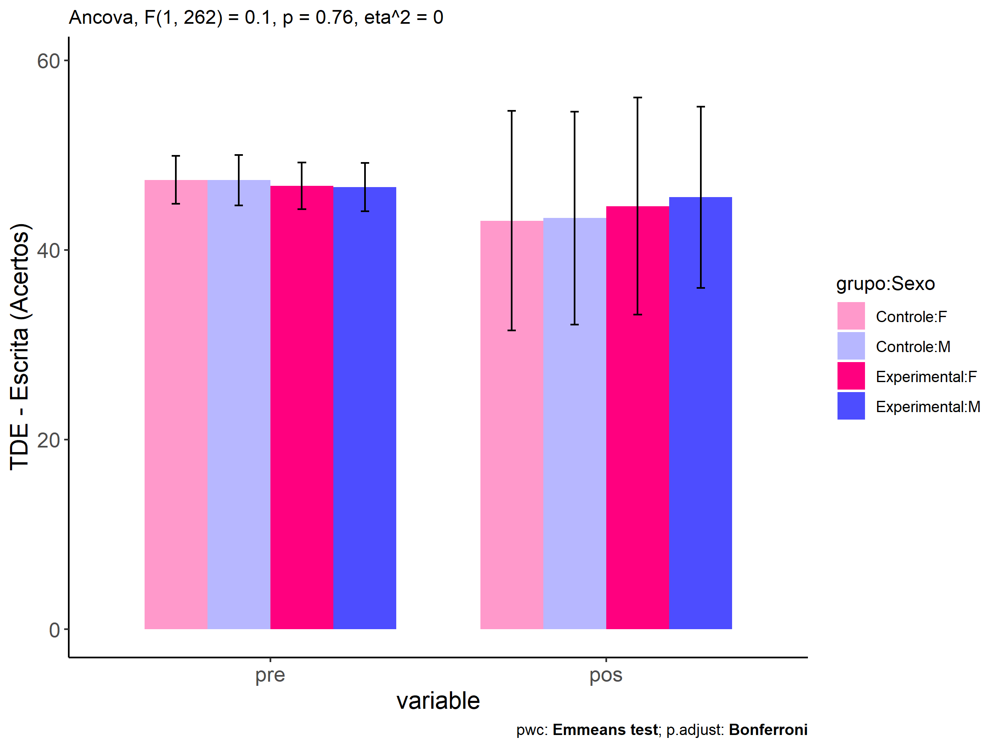<!-- -->

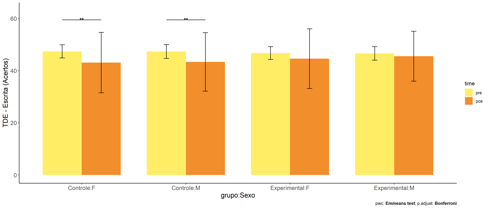<!-- -->

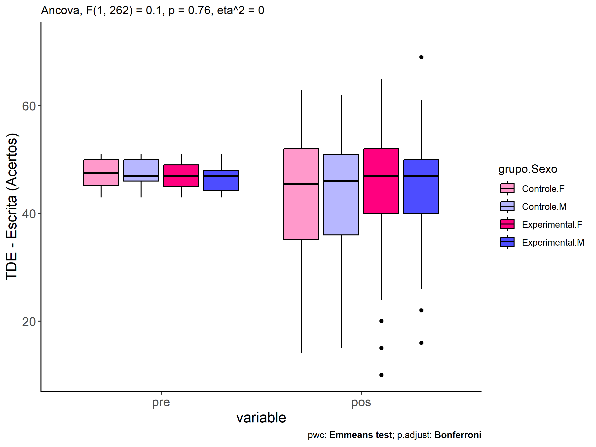<!-- -->

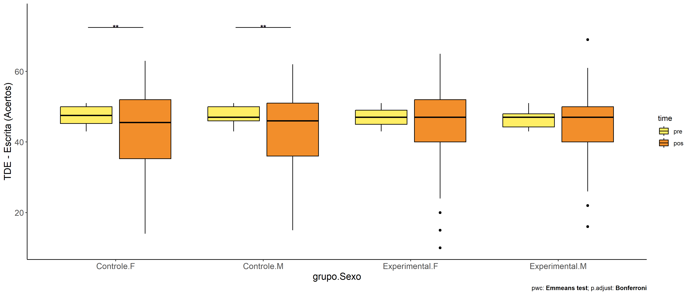<!-- -->

### factores: **grupo:Zona**

| var           | grupo        | Zona   |   n | M (pre) | SE (pre) | M (unadj) | SE (unadj) | M (adj) | SE (adj) |
|:--------------|:-------------|:-------|----:|--------:|---------:|----------:|-----------:|--------:|---------:|
| score.tde.pos | Controle     | Rural  |  78 |  47.269 |    0.301 |    44.436 |      1.294 |  44.088 |    1.257 |
| score.tde.pos | Controle     | Urbana |  26 |  47.692 |    0.492 |    37.808 |      2.499 |  36.814 |    2.183 |
| score.tde.pos | Experimental | Rural  |  51 |  46.922 |    0.338 |    45.569 |      1.617 |  45.752 |    1.552 |
| score.tde.pos | Experimental | Urbana |  37 |  46.270 |    0.381 |    42.324 |      1.927 |  43.503 |    1.838 |

| .y.           | grupo        | Zona   | group1   | group2       | estimate | conf.low | conf.high |    se | statistic |     p | p.adj | p.adj.signif |
|:--------------|:-------------|:-------|:---------|:-------------|---------:|---------:|----------:|------:|----------:|------:|------:|:-------------|
| score.tde.pos |              | Rural  | Controle | Experimental |   -1.664 |   -5.605 |     2.278 | 1.998 |    -0.833 | 0.406 | 0.406 | ns           |
| score.tde.pos |              | Urbana | Controle | Experimental |   -6.689 |  -12.354 |    -1.024 | 2.872 |    -2.329 | 0.021 | 0.021 | \*           |
| score.tde.pre |              | Rural  | Controle | Experimental |    0.348 |   -0.545 |     1.241 | 0.453 |     0.768 | 0.443 | 0.443 | ns           |
| score.tde.pre |              | Urbana | Controle | Experimental |    1.422 |    0.153 |     2.691 | 0.643 |     2.211 | 0.028 | 0.028 | \*           |
| score.tde.pos | Controle     |        | Rural    | Urbana       |    7.274 |    2.318 |    12.231 | 2.512 |     2.895 | 0.004 | 0.004 | \*\*         |
| score.tde.pos | Experimental |        | Rural    | Urbana       |    2.250 |   -2.488 |     6.987 | 2.402 |     0.937 | 0.350 | 0.350 | ns           |
| score.tde.pre | Controle     |        | Rural    | Urbana       |   -0.423 |   -1.546 |     0.700 | 0.569 |    -0.743 | 0.458 | 0.458 | ns           |
| score.tde.pre | Experimental |        | Rural    | Urbana       |    0.651 |   -0.420 |     1.722 | 0.543 |     1.200 | 0.232 | 0.232 | ns           |

| .y.       | grupo        | Zona   | group1 | group2 | estimate | conf.low | conf.high |    se | statistic | p       | p.adj   | p.adj.signif |
|:----------|:-------------|:-------|:-------|:-------|---------:|---------:|----------:|------:|----------:|:--------|:--------|:-------------|
| score.tde | Controle     | Rural  | pre    | pos    |    2.833 |    0.170 |     5.497 | 1.355 |     2.092 | 0.037   | 0.037   | \*           |
| score.tde | Controle     | Urbana | pre    | pos    |    9.885 |    5.271 |    14.498 | 2.346 |     4.213 | \<0.001 | \<0.001 | \*\*\*\*     |
| score.tde | Experimental | Rural  | pre    | pos    |    1.353 |   -1.941 |     4.647 | 1.675 |     0.808 | 0.42    | 0.42    | ns           |
| score.tde | Experimental | Urbana | pre    | pos    |    3.946 |    0.079 |     7.813 | 1.967 |     2.006 | 0.046   | 0.046   | \*           |

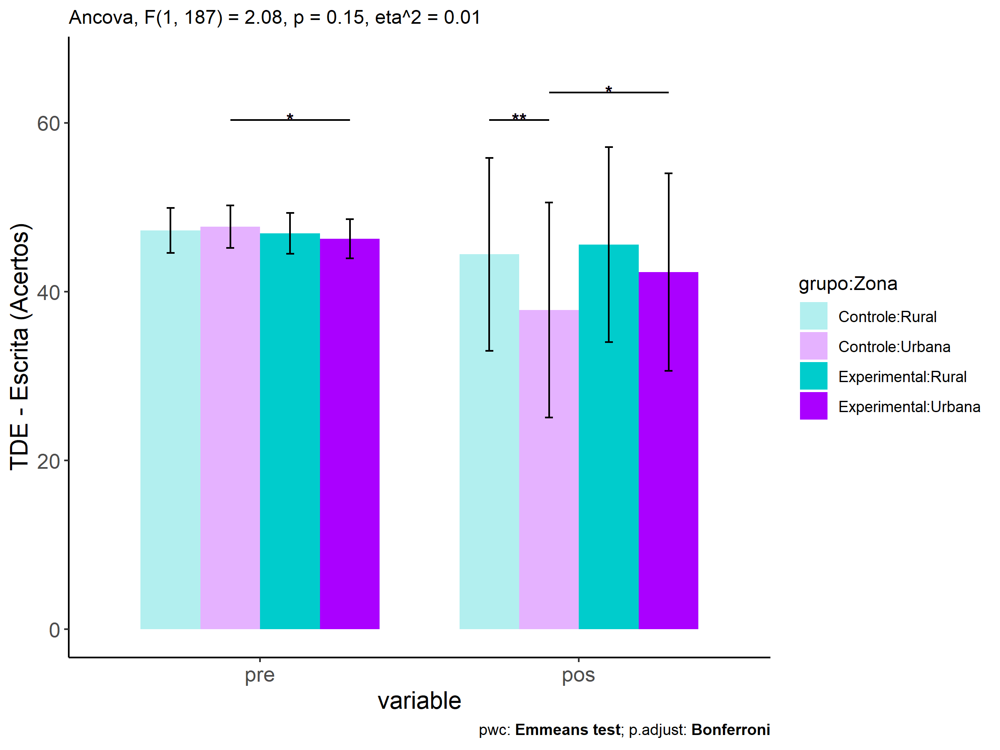<!-- -->

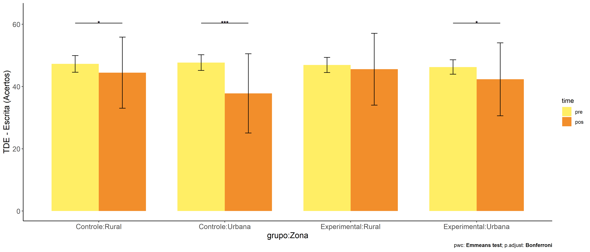<!-- -->

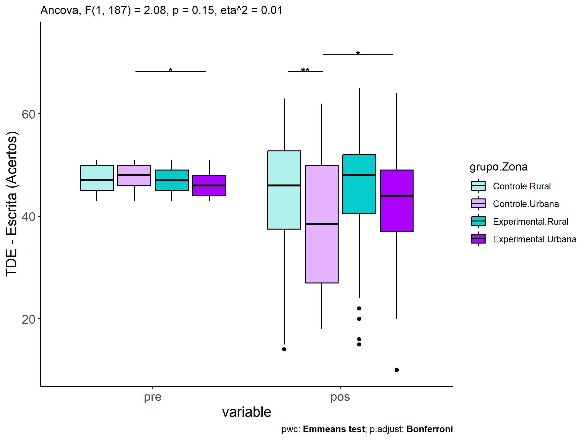<!-- -->

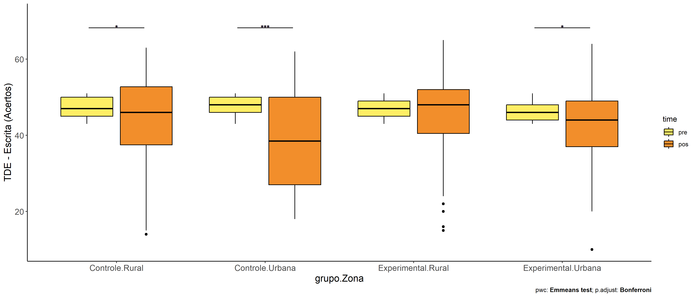<!-- -->

### factores: **grupo:Cor.Raca**

| var           | grupo        | Cor.Raca |   n | M (pre) | SE (pre) | M (unadj) | SE (unadj) | M (adj) | SE (adj) |
|:--------------|:-------------|:---------|----:|--------:|---------:|----------:|-----------:|--------:|---------:|
| score.tde.pos | Controle     | Branca   |  22 |  47.045 |    0.494 |    39.545 |      2.557 |  40.383 |    2.325 |
| score.tde.pos | Controle     | Parda    |  49 |  47.694 |    0.376 |    44.980 |      1.491 |  44.574 |    1.555 |
| score.tde.pos | Experimental | Branca   |   7 |  48.714 |    0.993 |    42.286 |      5.656 |  39.925 |    4.141 |
| score.tde.pos | Experimental | Parda    |  36 |  47.222 |    0.368 |    44.333 |      2.127 |  44.832 |    1.815 |

| .y.           | grupo        | Cor.Raca | group1   | group2       | estimate | conf.low | conf.high |    se | statistic |     p | p.adj | p.adj.signif |
|:--------------|:-------------|:---------|:---------|:-------------|---------:|---------:|----------:|------:|----------:|------:|------:|:-------------|
| score.tde.pos |              | Branca   | Controle | Experimental |    0.458 |   -8.995 |     9.911 | 4.769 |     0.096 | 0.924 | 0.924 | ns           |
| score.tde.pos |              | Parda    | Controle | Experimental |   -0.258 |   -5.003 |     4.488 | 2.394 |    -0.108 | 0.915 | 0.915 | ns           |
| score.tde.pre |              | Branca   | Controle | Experimental |   -1.669 |   -3.771 |     0.433 | 1.061 |    -1.574 | 0.118 | 0.118 | ns           |
| score.tde.pre |              | Parda    | Controle | Experimental |    0.472 |   -0.592 |     1.535 | 0.536 |     0.879 | 0.381 | 0.381 | ns           |
| score.tde.pos | Controle     |          | Branca   | Parda        |   -4.192 |   -9.747 |     1.364 | 2.803 |    -1.495 | 0.138 | 0.138 | ns           |
| score.tde.pos | Experimental |          | Branca   | Parda        |   -4.907 |  -13.894 |     4.080 | 4.534 |    -1.082 | 0.282 | 0.282 | ns           |
| score.tde.pre | Controle     |          | Branca   | Parda        |   -0.648 |   -1.891 |     0.595 | 0.627 |    -1.034 | 0.303 | 0.303 | ns           |
| score.tde.pre | Experimental |          | Branca   | Parda        |    1.492 |   -0.509 |     3.493 | 1.010 |     1.478 | 0.142 | 0.142 | ns           |

| .y.       | grupo        | Cor.Raca | group1 | group2 | estimate | conf.low | conf.high |    se | statistic |     p | p.adj | p.adj.signif |
|:----------|:-------------|:---------|:-------|:-------|---------:|---------:|----------:|------:|----------:|------:|------:|:-------------|
| score.tde | Controle     | Branca   | pre    | pos    |    7.500 |    2.441 |    12.559 | 2.567 |     2.922 | 0.004 | 0.004 | \*\*         |
| score.tde | Controle     | Parda    | pre    | pos    |    2.714 |   -0.676 |     6.104 | 1.720 |     1.578 | 0.116 | 0.116 | ns           |
| score.tde | Experimental | Branca   | pre    | pos    |    6.429 |   -2.540 |    15.397 | 4.551 |     1.413 | 0.159 | 0.159 | ns           |
| score.tde | Experimental | Parda    | pre    | pos    |    2.889 |   -1.066 |     6.844 | 2.007 |     1.440 | 0.151 | 0.151 | ns           |

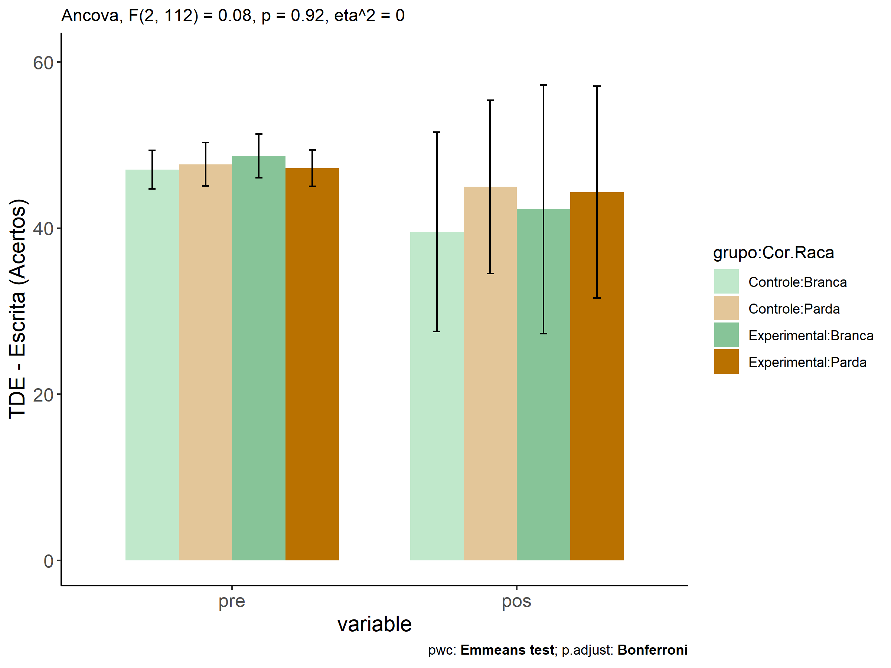<!-- -->

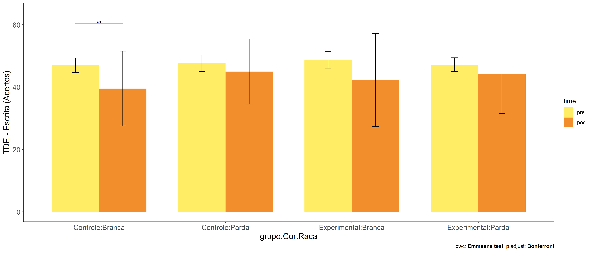<!-- -->

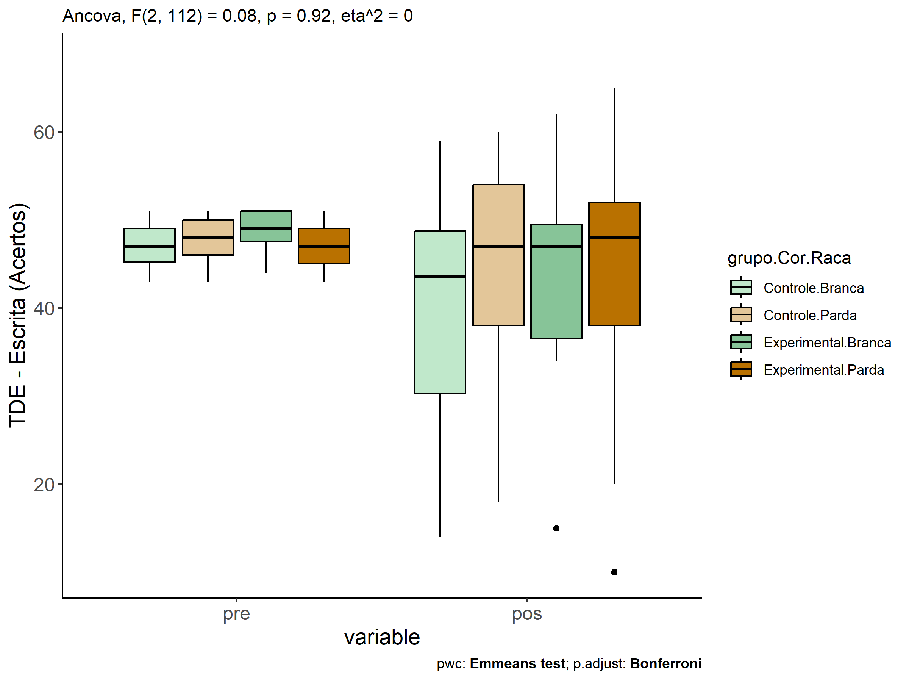<!-- -->

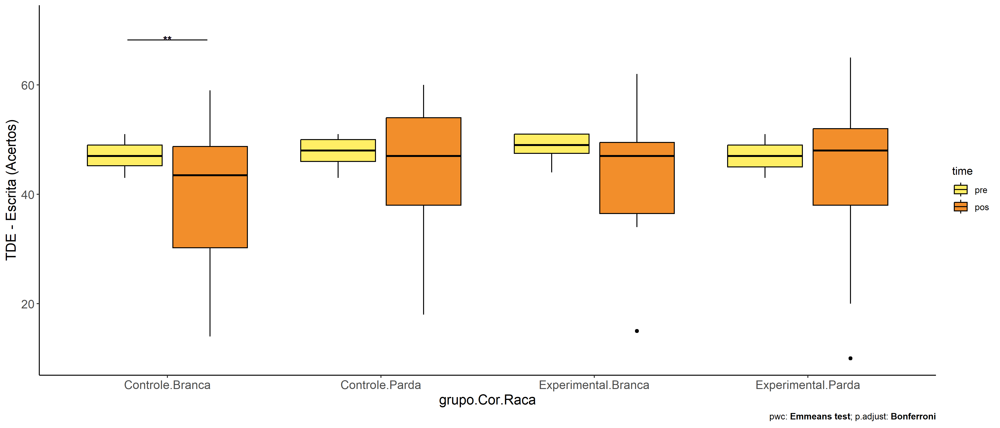<!-- -->

### factores: **grupo:Serie**

| var           | grupo        | Serie |   n | M (pre) | SE (pre) | M (unadj) | SE (unadj) | M (adj) | SE (adj) |
|:--------------|:-------------|:------|----:|--------:|---------:|----------:|-----------:|--------:|---------:|
| score.tde.pos | Controle     | 6 ano |  33 |  47.788 |    0.445 |    42.364 |      1.960 |  41.379 |    1.761 |
| score.tde.pos | Controle     | 7 ano |  42 |  47.000 |    0.354 |    39.262 |      2.159 |  39.311 |    1.552 |
| score.tde.pos | Controle     | 8 ano |  24 |  47.542 |    0.558 |    44.958 |      1.820 |  44.296 |    2.057 |
| score.tde.pos | Controle     | 9 ano |  36 |  47.306 |    0.473 |    47.444 |      1.254 |  47.093 |    1.678 |
| score.tde.pos | Experimental | 6 ano |  20 |  46.750 |    0.464 |    37.700 |      3.158 |  38.077 |    2.250 |
| score.tde.pos | Experimental | 7 ano |  43 |  46.488 |    0.387 |    44.000 |      1.790 |  44.721 |    1.540 |
| score.tde.pos | Experimental | 8 ano |  37 |  46.703 |    0.435 |    47.405 |      1.238 |  47.845 |    1.656 |
| score.tde.pos | Experimental | 9 ano |  32 |  46.938 |    0.453 |    48.250 |      1.229 |  48.381 |    1.778 |

| .y.           | grupo        | Serie | group1   | group2       | estimate | conf.low | conf.high |    se | statistic | p       | p.adj | p.adj.signif |
|:--------------|:-------------|:------|:---------|:-------------|---------:|---------:|----------:|------:|----------:|:--------|------:|:-------------|
| score.tde.pos |              | 6 ano | Controle | Experimental |    3.301 |   -2.334 |     8.937 | 2.862 |     1.154 | 0.25    | 0.250 | ns           |
| score.tde.pos |              | 7 ano | Controle | Experimental |   -5.410 |   -9.714 |    -1.105 | 2.186 |    -2.475 | 0.014   | 0.014 | \*           |
| score.tde.pos |              | 8 ano | Controle | Experimental |   -3.548 |   -8.756 |     1.659 | 2.644 |    -1.342 | 0.181   | 0.181 | ns           |
| score.tde.pos |              | 9 ano | Controle | Experimental |   -1.289 |   -6.105 |     3.527 | 2.446 |    -0.527 | 0.599   | 0.599 | ns           |
| score.tde.pre |              | 6 ano | Controle | Experimental |    1.038 |   -0.386 |     2.462 | 0.723 |     1.435 | 0.152   | 0.152 | ns           |
| score.tde.pre |              | 7 ano | Controle | Experimental |    0.512 |   -0.579 |     1.602 | 0.554 |     0.924 | 0.356   | 0.356 | ns           |
| score.tde.pre |              | 8 ano | Controle | Experimental |    0.839 |   -0.478 |     2.156 | 0.669 |     1.254 | 0.211   | 0.211 | ns           |
| score.tde.pre |              | 9 ano | Controle | Experimental |    0.368 |   -0.853 |     1.589 | 0.620 |     0.594 | 0.553   | 0.553 | ns           |
| score.tde.pos | Controle     |       | 6 ano    | 7 ano        |    2.068 |   -2.556 |     6.691 | 2.348 |     0.881 | 0.379   | 1.000 | ns           |
| score.tde.pos | Controle     |       | 6 ano    | 8 ano        |   -2.918 |   -8.233 |     2.397 | 2.699 |    -1.081 | 0.281   | 1.000 | ns           |
| score.tde.pos | Controle     |       | 6 ano    | 9 ano        |   -5.714 |  -10.493 |    -0.934 | 2.427 |    -2.354 | 0.019   | 0.116 | ns           |
| score.tde.pos | Controle     |       | 7 ano    | 8 ano        |   -4.985 |  -10.061 |     0.090 | 2.577 |    -1.934 | 0.054   | 0.325 | ns           |
| score.tde.pos | Controle     |       | 7 ano    | 9 ano        |   -7.781 |  -12.283 |    -3.280 | 2.286 |    -3.404 | \<0.001 | 0.005 | \*\*         |
| score.tde.pos | Controle     |       | 8 ano    | 9 ano        |   -2.796 |   -8.017 |     2.425 | 2.651 |    -1.055 | 0.293   | 1.000 | ns           |
| score.tde.pos | Experimental |       | 6 ano    | 7 ano        |   -6.643 |  -12.006 |    -1.281 | 2.723 |    -2.439 | 0.015   | 0.092 | ns           |
| score.tde.pos | Experimental |       | 6 ano    | 8 ano        |   -9.767 |  -15.265 |    -4.270 | 2.792 |    -3.499 | \<0.001 | 0.003 | \*\*         |
| score.tde.pos | Experimental |       | 6 ano    | 9 ano        |  -10.304 |  -15.951 |    -4.657 | 2.868 |    -3.593 | \<0.001 | 0.002 | \*\*         |
| score.tde.pos | Experimental |       | 7 ano    | 8 ano        |   -3.124 |   -7.567 |     1.319 | 2.256 |    -1.385 | 0.167   | 1.000 | ns           |
| score.tde.pos | Experimental |       | 7 ano    | 9 ano        |   -3.660 |   -8.290 |     0.969 | 2.351 |    -1.557 | 0.121   | 0.724 | ns           |
| score.tde.pos | Experimental |       | 8 ano    | 9 ano        |   -0.536 |   -5.320 |     4.247 | 2.429 |    -0.221 | 0.825   | 1.000 | ns           |
| score.tde.pre | Controle     |       | 6 ano    | 7 ano        |    0.788 |   -0.381 |     1.957 | 0.594 |     1.327 | 0.186   | 1.000 | ns           |
| score.tde.pre | Controle     |       | 6 ano    | 8 ano        |    0.246 |   -1.102 |     1.595 | 0.685 |     0.360 | 0.719   | 1.000 | ns           |
| score.tde.pre | Controle     |       | 6 ano    | 9 ano        |    0.482 |   -0.729 |     1.694 | 0.615 |     0.784 | 0.434   | 1.000 | ns           |
| score.tde.pre | Controle     |       | 7 ano    | 8 ano        |   -0.542 |   -1.828 |     0.744 | 0.653 |    -0.829 | 0.408   | 1.000 | ns           |
| score.tde.pre | Controle     |       | 7 ano    | 9 ano        |   -0.306 |   -1.447 |     0.836 | 0.580 |    -0.527 | 0.599   | 1.000 | ns           |
| score.tde.pre | Controle     |       | 8 ano    | 9 ano        |    0.236 |   -1.088 |     1.561 | 0.673 |     0.351 | 0.726   | 1.000 | ns           |
| score.tde.pre | Experimental |       | 6 ano    | 7 ano        |    0.262 |   -1.099 |     1.622 | 0.691 |     0.379 | 0.705   | 1.000 | ns           |
| score.tde.pre | Experimental |       | 6 ano    | 8 ano        |    0.047 |   -1.348 |     1.442 | 0.708 |     0.067 | 0.947   | 1.000 | ns           |
| score.tde.pre | Experimental |       | 6 ano    | 9 ano        |   -0.187 |   -1.620 |     1.245 | 0.728 |    -0.258 | 0.797   | 1.000 | ns           |
| score.tde.pre | Experimental |       | 7 ano    | 8 ano        |   -0.214 |   -1.341 |     0.913 | 0.572 |    -0.374 | 0.708   | 1.000 | ns           |
| score.tde.pre | Experimental |       | 7 ano    | 9 ano        |   -0.449 |   -1.623 |     0.724 | 0.596 |    -0.754 | 0.452   | 1.000 | ns           |
| score.tde.pre | Experimental |       | 8 ano    | 9 ano        |   -0.235 |   -1.448 |     0.978 | 0.616 |    -0.381 | 0.703   | 1.000 | ns           |

| .y.       | grupo        | Serie | group1 | group2 | estimate | conf.low | conf.high |    se | statistic | p       | p.adj   | p.adj.signif |
|:----------|:-------------|:------|:-------|:-------|---------:|---------:|----------:|------:|----------:|:--------|:--------|:-------------|
| score.tde | Controle     | 6 ano | pre    | pos    |    5.424 |    1.701 |     9.148 | 1.895 |     2.862 | 0.004   | 0.004   | \*\*         |
| score.tde | Controle     | 7 ano | pre    | pos    |    7.738 |    4.438 |    11.038 | 1.680 |     4.606 | \<0.001 | \<0.001 | \*\*\*\*     |
| score.tde | Controle     | 8 ano | pre    | pos    |    2.583 |   -1.783 |     6.949 | 2.222 |     1.162 | 0.246   | 0.246   | ns           |
| score.tde | Controle     | 9 ano | pre    | pos    |   -0.139 |   -3.704 |     3.426 | 1.815 |    -0.077 | 0.939   | 0.939   | ns           |
| score.tde | Experimental | 6 ano | pre    | pos    |    9.050 |    4.267 |    13.833 | 2.434 |     3.717 | \<0.001 | \<0.001 | \*\*\*       |
| score.tde | Experimental | 7 ano | pre    | pos    |    2.488 |   -0.773 |     5.750 | 1.660 |     1.499 | 0.135   | 0.135   | ns           |
| score.tde | Experimental | 8 ano | pre    | pos    |   -0.703 |   -4.219 |     2.814 | 1.790 |    -0.393 | 0.695   | 0.695   | ns           |
| score.tde | Experimental | 9 ano | pre    | pos    |   -1.312 |   -5.094 |     2.469 | 1.925 |    -0.682 | 0.496   | 0.496   | ns           |

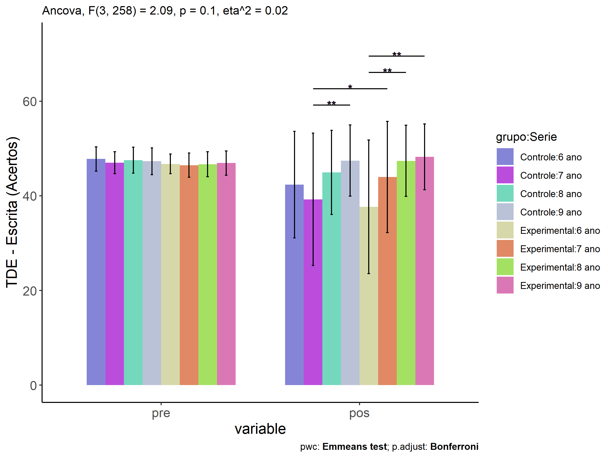<!-- -->

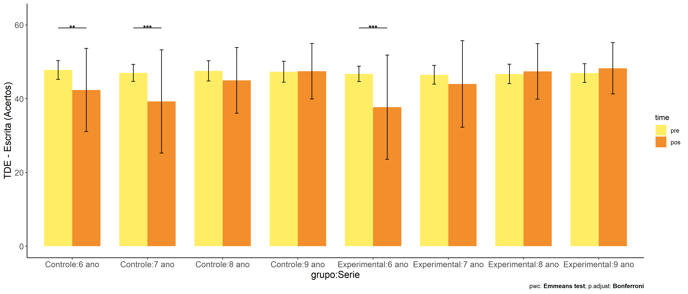<!-- -->

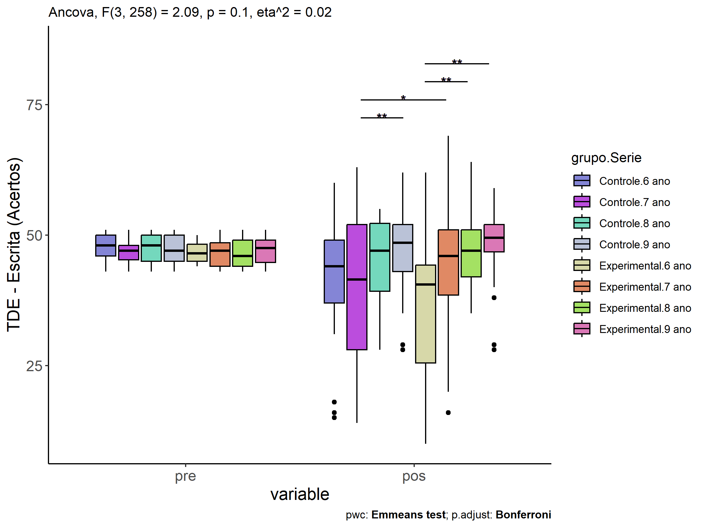<!-- -->

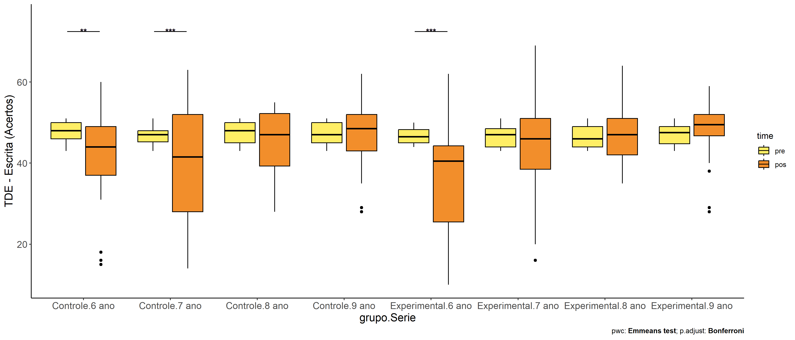<!-- -->
