ANCOVA in TDE - Escrita (Acertos) (TDE - Escrita (Acertos))
================
Geiser C. Challco <geiser@alumni.usp.br>

- [Descriptive Statistics of Initial
  Data](#descriptive-statistics-of-initial-data)
- [Checking of Assumptions](#checking-of-assumptions)
  - [Assumption: Normality distribution of
    data](#assumption-normality-distribution-of-data)
  - [Assumption: Homogeneity of data
    distribution](#assumption-homogeneity-of-data-distribution)
- [Computation of ANCOVA test and Pairwise
  Comparison](#computation-of-ancova-test-and-pairwise-comparison)
  - [ANCOVA tests for one factor](#ancova-tests-for-one-factor)
  - [ANCOVA tests for two factors](#ancova-tests-for-two-factors)
  - [Pairwise comparisons for one factor:
    **grupo**](#pairwise-comparisons-for-one-factor-grupo)
  - [Pairwise comparisons for two
    factors](#pairwise-comparisons-for-two-factors)
    - [factores: **grupo:Sexo**](#factores-gruposexo)
    - [factores: **grupo:Zona**](#factores-grupozona)
    - [factores: **grupo:Cor.Raca**](#factores-grupocorraca)
    - [factores:
      **grupo:score.tde.quintile**](#factores-gruposcoretdequintile)

**NOTE**

- Teste ANCOVA para determinar se houve diferenças significativas no
  TDE - Escrita (Acertos) (medido usando pre- e pos-testes).
- ANCOVA test to determine whether there were significant differences in
  TDE - Escrita (Acertos) (measured using pre- and post-tests).

# Descriptive Statistics of Initial Data

| grupo        | Sexo | Zona   | Cor.Raca | score.tde.quintile | variable      |   n |   mean | median | min | max |     sd |     se |     ci |   iqr |
|:-------------|:-----|:-------|:---------|:-------------------|:--------------|----:|-------:|-------:|----:|----:|-------:|-------:|-------:|------:|
| Controle     | F    |        |          |                    | score.tde.pre |  63 | 34.587 |   43.0 |   2 |  63 | 18.464 |  2.326 |  4.650 | 32.50 |
| Controle     | M    |        |          |                    | score.tde.pre |  71 | 24.028 |   17.0 |   0 |  63 | 19.216 |  2.281 |  4.548 | 34.50 |
| Experimental | F    |        |          |                    | score.tde.pre |  83 | 31.494 |   34.0 |   0 |  59 | 15.421 |  1.693 |  3.367 | 26.00 |
| Experimental | M    |        |          |                    | score.tde.pre |  76 | 26.276 |   25.5 |   0 |  65 | 16.171 |  1.855 |  3.695 | 23.25 |
| Controle     | F    |        |          |                    | score.tde.pos |  63 | 30.365 |   33.0 |   0 |  66 | 19.510 |  2.458 |  4.914 | 34.50 |
| Controle     | M    |        |          |                    | score.tde.pos |  71 | 18.789 |   13.0 |   0 |  65 | 19.255 |  2.285 |  4.558 | 26.00 |
| Experimental | F    |        |          |                    | score.tde.pos |  83 | 25.494 |   22.0 |   0 |  63 | 17.274 |  1.896 |  3.772 | 28.00 |
| Experimental | M    |        |          |                    | score.tde.pos |  76 | 22.566 |   22.0 |   0 |  65 | 16.152 |  1.853 |  3.691 | 22.50 |
| Controle     |      | Rural  |          |                    | score.tde.pre |  97 | 29.907 |   27.0 |   0 |  63 | 19.677 |  1.998 |  3.966 | 36.00 |
| Controle     |      | Urbana |          |                    | score.tde.pre |  21 | 31.143 |   31.0 |   1 |  58 | 18.863 |  4.116 |  8.587 | 34.00 |
| Controle     |      |        |          |                    | score.tde.pre |  16 | 20.625 |   13.5 |   0 |  62 | 18.478 |  4.620 |  9.846 | 26.75 |
| Experimental |      | Rural  |          |                    | score.tde.pre |  86 | 25.593 |   25.0 |   0 |  62 | 15.447 |  1.666 |  3.312 | 22.00 |
| Experimental |      | Urbana |          |                    | score.tde.pre |  40 | 31.075 |   36.5 |   0 |  65 | 17.016 |  2.691 |  5.442 | 25.75 |
| Experimental |      |        |          |                    | score.tde.pre |  33 | 35.364 |   36.0 |   8 |  57 | 13.822 |  2.406 |  4.901 | 22.00 |
| Controle     |      | Rural  |          |                    | score.tde.pos |  97 | 25.979 |   21.0 |   0 |  66 | 20.748 |  2.107 |  4.182 | 40.00 |
| Controle     |      | Urbana |          |                    | score.tde.pos |  21 | 22.810 |   14.0 |   0 |  58 | 18.870 |  4.118 |  8.589 | 33.00 |
| Controle     |      |        |          |                    | score.tde.pos |  16 | 15.500 |   12.0 |   0 |  54 | 16.371 |  4.093 |  8.723 | 17.25 |
| Experimental |      | Rural  |          |                    | score.tde.pos |  86 | 23.488 |   22.0 |   0 |  64 | 15.957 |  1.721 |  3.421 | 21.00 |
| Experimental |      | Urbana |          |                    | score.tde.pos |  40 | 20.675 |   16.0 |   0 |  65 | 17.171 |  2.715 |  5.492 | 28.50 |
| Experimental |      |        |          |                    | score.tde.pos |  33 | 29.818 |   28.0 |   4 |  63 | 17.368 |  3.023 |  6.158 | 24.00 |
| Controle     |      |        | Branca   |                    | score.tde.pre |  17 | 35.000 |   43.0 |   2 |  62 | 20.616 |  5.000 | 10.600 | 36.00 |
| Controle     |      |        | Indígena |                    | score.tde.pre |   3 | 34.000 |   46.0 |   4 |  52 | 26.153 | 15.100 | 64.969 | 24.00 |
| Controle     |      |        | Parda    |                    | score.tde.pre |  39 | 28.410 |   27.0 |   0 |  56 | 19.271 |  3.086 |  6.247 | 38.00 |
| Controle     |      |        |          |                    | score.tde.pre |  75 | 27.733 |   23.0 |   1 |  63 | 19.315 |  2.230 |  4.444 | 35.50 |
| Experimental |      |        | Branca   |                    | score.tde.pre |  22 | 22.318 |   17.0 |   0 |  49 | 15.410 |  3.285 |  6.832 | 25.25 |
| Experimental |      |        | Indígena |                    | score.tde.pre |  11 | 21.818 |   21.0 |   6 |  54 | 16.136 |  4.865 | 10.840 | 25.50 |
| Experimental |      |        | Parda    |                    | score.tde.pre |  45 | 27.333 |   28.0 |   0 |  62 | 15.744 |  2.347 |  4.730 | 21.00 |
| Experimental |      |        |          |                    | score.tde.pre |  81 | 32.716 |   34.0 |   0 |  65 | 15.372 |  1.708 |  3.399 | 22.00 |
| Controle     |      |        | Branca   |                    | score.tde.pos |  17 | 27.647 |   36.0 |   0 |  59 | 22.136 |  5.369 | 11.381 | 41.00 |
| Controle     |      |        | Indígena |                    | score.tde.pos |   3 | 39.667 |   55.0 |   4 |  60 | 30.989 | 17.892 | 76.982 | 28.00 |
| Controle     |      |        | Parda    |                    | score.tde.pos |  39 | 21.641 |   14.0 |   0 |  60 | 20.220 |  3.238 |  6.555 | 34.00 |
| Controle     |      |        |          |                    | score.tde.pos |  75 | 24.187 |   20.0 |   0 |  66 | 19.297 |  2.228 |  4.440 | 38.50 |
| Experimental |      |        | Branca   |                    | score.tde.pos |  22 | 19.682 |   16.5 |   0 |  62 | 14.946 |  3.186 |  6.626 | 13.50 |
| Experimental |      |        | Indígena |                    | score.tde.pos |  11 | 25.727 |   23.0 |   1 |  57 | 16.566 |  4.995 | 11.129 | 19.00 |
| Experimental |      |        | Parda    |                    | score.tde.pos |  45 | 22.222 |   21.0 |   0 |  64 | 16.426 |  2.449 |  4.935 | 24.00 |
| Experimental |      |        |          |                    | score.tde.pos |  81 | 26.111 |   24.0 |   0 |  65 | 17.365 |  1.929 |  3.840 | 28.00 |
| Controle     |      |        |          | 1st quintile       | score.tde.pre |  55 |  8.727 |    8.0 |   0 |  18 |  5.345 |  0.721 |  1.445 |  9.00 |
| Controle     |      |        |          | 2nd quintile       | score.tde.pre |  17 | 24.235 |   25.0 |  19 |  31 |  3.993 |  0.968 |  2.053 |  7.00 |
| Controle     |      |        |          | 3rd quintile       | score.tde.pre |  13 | 38.846 |   40.0 |  35 |  42 |  2.794 |  0.775 |  1.689 |  4.00 |
| Controle     |      |        |          | 4th quintile       | score.tde.pre |  33 | 47.788 |   48.0 |  43 |  51 |  2.559 |  0.445 |  0.907 |  4.00 |
| Controle     |      |        |          | 5th quintile       | score.tde.pre |  16 | 56.938 |   56.5 |  52 |  63 |  3.820 |  0.955 |  2.036 |  5.75 |
| Experimental |      |        |          | 1st quintile       | score.tde.pre |  47 |  9.234 |    9.0 |   0 |  18 |  5.760 |  0.840 |  1.691 | 10.00 |
| Experimental |      |        |          | 2nd quintile       | score.tde.pre |  36 | 25.361 |   25.0 |  20 |  30 |  2.929 |  0.488 |  0.991 |  5.25 |
| Experimental |      |        |          | 3rd quintile       | score.tde.pre |  43 | 37.116 |   37.0 |  32 |  42 |  3.064 |  0.467 |  0.943 |  5.50 |
| Experimental |      |        |          | 4th quintile       | score.tde.pre |  20 | 46.750 |   46.5 |  44 |  50 |  2.074 |  0.464 |  0.971 |  3.25 |
| Experimental |      |        |          | 5th quintile       | score.tde.pre |  13 | 56.385 |   56.0 |  52 |  65 |  3.754 |  1.041 |  2.268 |  3.00 |
| Controle     |      |        |          | 1st quintile       | score.tde.pos |  55 |  7.036 |    4.0 |   0 |  44 |  8.542 |  1.152 |  2.309 | 11.00 |
| Controle     |      |        |          | 2nd quintile       | score.tde.pos |  17 | 16.529 |   14.0 |   4 |  36 | 10.180 |  2.469 |  5.234 | 13.00 |
| Controle     |      |        |          | 3rd quintile       | score.tde.pos |  13 | 26.231 |   25.0 |  10 |  51 | 13.230 |  3.669 |  7.995 | 15.00 |
| Controle     |      |        |          | 4th quintile       | score.tde.pos |  33 | 42.364 |   44.0 |  15 |  60 | 11.261 |  1.960 |  3.993 | 12.00 |
| Controle     |      |        |          | 5th quintile       | score.tde.pos |  16 | 52.500 |   54.0 |  28 |  66 |  9.359 |  2.340 |  4.987 |  7.75 |
| Experimental |      |        |          | 1st quintile       | score.tde.pos |  47 |  9.681 |    7.0 |   0 |  29 |  7.667 |  1.118 |  2.251 | 11.00 |
| Experimental |      |        |          | 2nd quintile       | score.tde.pos |  36 | 19.500 |   19.5 |   0 |  46 | 11.732 |  1.955 |  3.969 | 13.50 |
| Experimental |      |        |          | 3rd quintile       | score.tde.pos |  43 | 28.651 |   29.0 |   8 |  50 | 12.002 |  1.830 |  3.694 | 20.50 |
| Experimental |      |        |          | 4th quintile       | score.tde.pos |  20 | 37.700 |   40.5 |  10 |  62 | 14.124 |  3.158 |  6.610 | 18.75 |
| Experimental |      |        |          | 5th quintile       | score.tde.pos |  13 | 52.923 |   52.0 |  40 |  65 |  9.535 |  2.644 |  5.762 | 18.00 |

# Checking of Assumptions

## Assumption: Normality distribution of data

| var           |   n |   skewness |   kurtosis | symmetry | statistic | method     |         p | p.signif | normality |
|:--------------|----:|-----------:|-----------:|:---------|----------:|:-----------|----------:|:---------|:----------|
| score.tde.pos | 293 | -0.1464130 | -0.0445518 | YES      | 1.1114284 | D’Agostino | 0.5736624 | ns       | \-        |
| score.tde.pos | 244 | -0.1050872 | -0.1773335 | YES      | 0.5867504 | D’Agostino | 0.7457423 | ns       | \-        |
| score.tde.pos | 137 | -0.2466355 | -0.1938147 | YES      | 1.5391657 | D’Agostino | 0.4632063 | ns       | QQ        |
| score.tde.pos | 293 |  0.0864616 |  0.2757597 | YES      | 1.7084458 | D’Agostino | 0.4256138 | ns       | \-        |

## Assumption: Homogeneity of data distribution

| var           | method         | formula                              |   n | DFn.df1 | DFd.df2 | statistic |         p | p.signif |
|:--------------|:---------------|:-------------------------------------|----:|--------:|--------:|----------:|----------:|:---------|
| score.tde.pos | Levene’s test  | `.res`~`grupo`\*`Sexo`               | 293 |       3 |     289 | 0.5322318 | 0.6605126 | ns       |
| score.tde.pos | Anova’s slopes | `.res`~`grupo`\*`Sexo`               | 293 |       3 |     285 | 0.7580000 | 0.5180000 | ns       |
| score.tde.pos | Levene’s test  | `.res`~`grupo`\*`Zona`               | 244 |       3 |     240 | 0.4618978 | 0.7091531 | ns       |
| score.tde.pos | Anova’s slopes | `.res`~`grupo`\*`Zona`               | 244 |       3 |     236 | 1.2760000 | 0.2830000 | ns       |
| score.tde.pos | Levene’s test  | `.res`~`grupo`\*`Cor.Raca`           | 137 |       5 |     131 | 1.2837188 | 0.2747539 | ns       |
| score.tde.pos | Anova’s slopes | `.res`~`grupo`\*`Cor.Raca`           | 137 |       5 |     125 | 1.6160000 | 0.1600000 | ns       |
| score.tde.pos | Levene’s test  | `.res`~`grupo`\*`score.tde.quintile` | 293 |       9 |     283 | 3.1260142 | 0.0013210 | \*       |
| score.tde.pos | Anova’s slopes | `.res`~`grupo`\*`score.tde.quintile` | 293 |       9 |     273 | 1.7410000 | 0.0800000 | ns       |

# Computation of ANCOVA test and Pairwise Comparison

## ANCOVA tests for one factor

|     | Effect             | DFn | DFd |       SSn |      SSd |       F | p       |   ges | p\<.05 |
|:----|:-------------------|----:|----:|----------:|---------:|--------:|:--------|------:|:-------|
| 1   | score.tde.pre      |   1 | 290 | 67577.190 | 30826.22 | 635.737 | \<0.001 | 0.687 | \*     |
| 2   | grupo              |   1 | 290 |     1.496 | 30826.22 |   0.014 | 0.906   | 0.000 |        |
| 4   | Sexo               |   1 | 290 |     5.543 | 30822.18 |   0.052 | 0.82    | 0.000 |        |
| 6   | Zona               |   1 | 241 |  1722.694 | 25679.05 |  16.168 | \<0.001 | 0.063 | \*     |
| 8   | Cor.Raca           |   2 | 133 |  1111.802 | 15231.49 |   4.854 | 0.009   | 0.068 | \*     |
| 10  | score.tde.quintile |   4 | 287 |  1762.283 | 29065.44 |   4.350 | 0.002   | 0.057 | \*     |

## ANCOVA tests for two factors

|     | Effect                   | DFn | DFd |       SSn |      SSd |       F | p       |   ges | p\<.05 |
|:----|:-------------------------|----:|----:|----------:|---------:|--------:|:--------|------:|:-------|
| 1   | score.tde.pre            |   1 | 288 | 63068.952 | 30520.90 | 595.129 | \<0.001 | 0.674 | \*     |
| 4   | grupo:Sexo               |   1 | 288 |   299.455 | 30520.90 |   2.826 | 0.094   | 0.010 |        |
| 8   | grupo:Zona               |   1 | 239 |   114.405 | 25552.91 |   1.070 | 0.302   | 0.004 |        |
| 12  | grupo:Cor.Raca           |   2 | 130 |    77.520 | 15079.71 |   0.334 | 0.717   | 0.005 |        |
| 16  | grupo:score.tde.quintile |   4 | 282 |   420.751 | 28555.40 |   1.039 | 0.387   | 0.015 |        |

## Pairwise comparisons for one factor: **grupo**

| var           | grupo        |   n | M (pre) | SE (pre) | M (unadj) | SE (unadj) | M (adj) | SE (adj) |
|:--------------|:-------------|----:|--------:|---------:|----------:|-----------:|--------:|---------:|
| score.tde.pos | Controle     | 134 |  28.993 |    1.687 |    24.231 |      1.741 |  24.235 |    0.891 |
| score.tde.pos | Experimental | 159 |  29.000 |    1.265 |    24.094 |      1.329 |  24.091 |    0.818 |

| .y.           | group1   | group2       | estimate | conf.low | conf.high |    se | statistic |     p | p.adj | p.adj.signif |
|:--------------|:---------|:-------------|---------:|---------:|----------:|------:|----------:|------:|------:|:-------------|
| score.tde.pos | Controle | Experimental |    0.143 |   -2.236 |     2.523 | 1.209 |     0.119 | 0.906 | 0.906 | ns           |
| score.tde.pre | Controle | Experimental |   -0.007 |   -4.087 |     4.072 | 2.073 |    -0.004 | 0.997 | 0.997 | ns           |

| .y.       | grupo        | group1 | group2 | estimate | conf.low | conf.high |    se | statistic |     p | p.adj | p.adj.signif |
|:----------|:-------------|:-------|:-------|---------:|---------:|----------:|------:|----------:|------:|------:|:-------------|
| score.tde | Controle     | pre    | pos    |    4.761 |    0.434 |     9.089 | 2.203 |     2.161 | 0.031 | 0.031 | \*           |
| score.tde | Experimental | pre    | pos    |    4.906 |    0.933 |     8.878 | 2.023 |     2.425 | 0.016 | 0.016 | \*           |

    ## Scale for colour is already present.
    ## Adding another scale for colour, which will replace the existing scale.

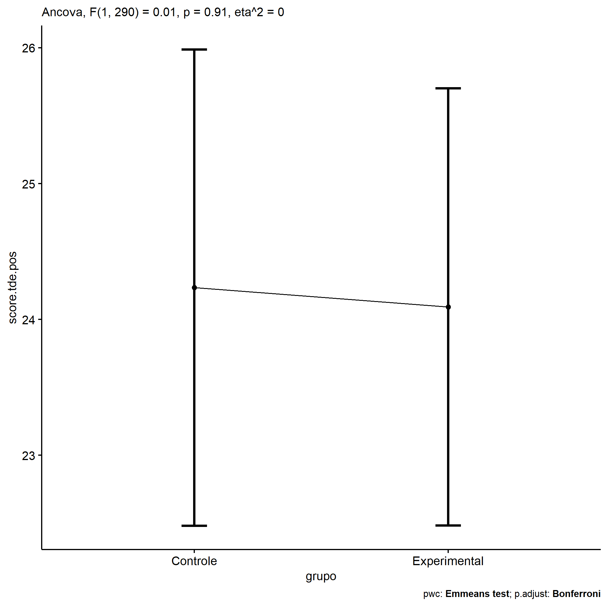<!-- -->

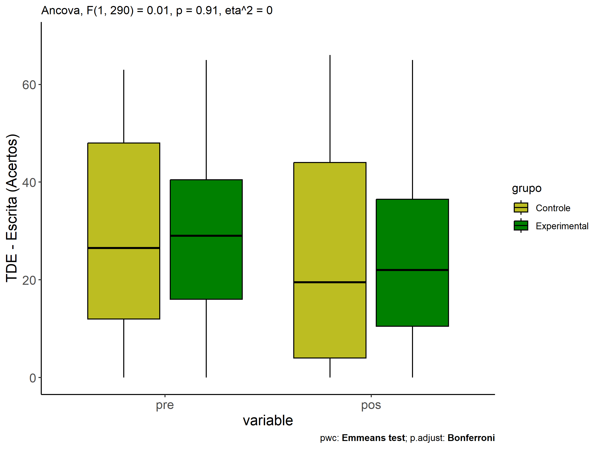<!-- -->

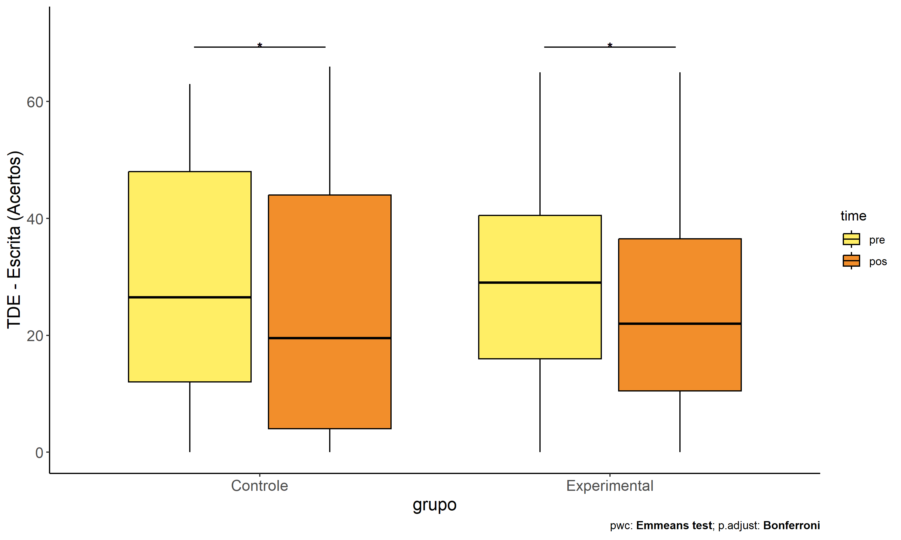<!-- -->

## Pairwise comparisons for two factors

### factores: **grupo:Sexo**

| var           | grupo        | Sexo |   n | M (pre) | SE (pre) | M (unadj) | SE (unadj) | M (adj) | SE (adj) |
|:--------------|:-------------|:-----|----:|--------:|---------:|----------:|-----------:|--------:|---------:|
| score.tde.pos | Controle     | F    |  63 |  34.587 |    2.326 |    30.365 |      2.458 |  25.580 |    1.312 |
| score.tde.pos | Controle     | M    |  71 |  24.028 |    2.281 |    18.789 |      2.285 |  23.041 |    1.234 |
| score.tde.pos | Experimental | F    |  83 |  31.494 |    1.693 |    25.494 |      1.896 |  23.357 |    1.133 |
| score.tde.pos | Experimental | M    |  76 |  26.276 |    1.855 |    22.566 |      1.853 |  24.894 |    1.185 |

| .y.           | grupo        | Sexo | group1   | group2       | estimate | conf.low | conf.high |    se | statistic | p       | p.adj   | p.adj.signif |
|:--------------|:-------------|:-----|:---------|:-------------|---------:|---------:|----------:|------:|----------:|:--------|:--------|:-------------|
| score.tde.pos |              | F    | Controle | Experimental |    2.224 |   -1.169 |     5.616 | 1.724 |     1.290 | 0.198   | 0.198   | ns           |
| score.tde.pos |              | M    | Controle | Experimental |   -1.853 |   -5.201 |     1.495 | 1.701 |    -1.089 | 0.277   | 0.277   | ns           |
| score.tde.pre |              | F    | Controle | Experimental |    3.093 |   -2.583 |     8.770 | 2.884 |     1.073 | 0.284   | 0.284   | ns           |
| score.tde.pre |              | M    | Controle | Experimental |   -2.248 |   -7.855 |     3.359 | 2.849 |    -0.789 | 0.431   | 0.431   | ns           |
| score.tde.pos | Controle     |      | F        | M            |    2.539 |   -1.043 |     6.121 | 1.820 |     1.395 | 0.164   | 0.164   | ns           |
| score.tde.pos | Experimental |      | F        | M            |   -1.537 |   -4.774 |     1.700 | 1.645 |    -0.935 | 0.351   | 0.351   | ns           |
| score.tde.pre | Controle     |      | F        | M            |   10.559 |    4.679 |    16.439 | 2.987 |     3.534 | \<0.001 | \<0.001 | \*\*\*       |
| score.tde.pre | Experimental |      | F        | M            |    5.218 |   -0.176 |    10.611 | 2.740 |     1.904 | 0.058   | 0.058   | ns           |

| .y.       | grupo        | Sexo | group1 | group2 | estimate | conf.low | conf.high |    se | statistic |     p | p.adj | p.adj.signif |
|:----------|:-------------|:-----|:-------|:-------|---------:|---------:|----------:|------:|----------:|------:|------:|:-------------|
| score.tde | Controle     | F    | pre    | pos    |    4.222 |   -1.948 |    10.392 | 3.142 |     1.344 | 0.179 | 0.179 | ns           |
| score.tde | Controle     | M    | pre    | pos    |    5.239 |   -0.573 |    11.052 | 2.959 |     1.771 | 0.077 | 0.077 | ns           |
| score.tde | Experimental | F    | pre    | pos    |    6.000 |    0.624 |    11.376 | 2.737 |     2.192 | 0.029 | 0.029 | \*           |
| score.tde | Experimental | M    | pre    | pos    |    3.711 |   -1.907 |     9.328 | 2.860 |     1.297 | 0.195 | 0.195 | ns           |

    ## Scale for colour is already present.
    ## Adding another scale for colour, which will replace the existing scale.

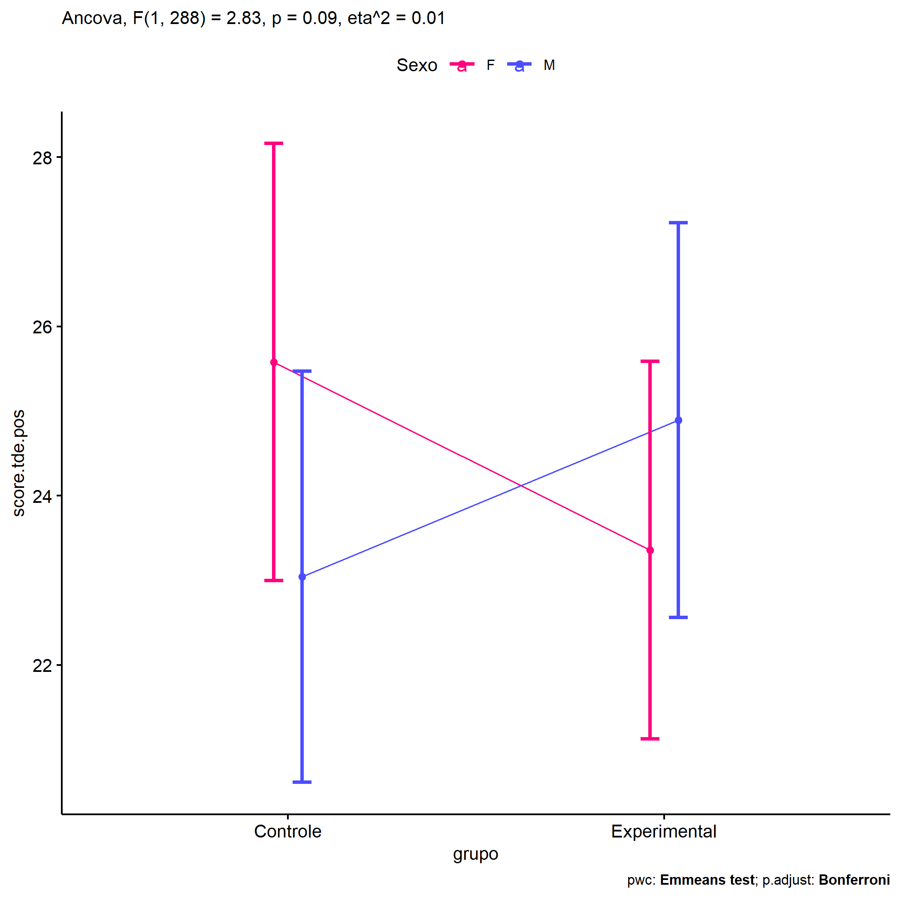<!-- -->

    ## Scale for colour is already present.
    ## Adding another scale for colour, which will replace the existing scale.

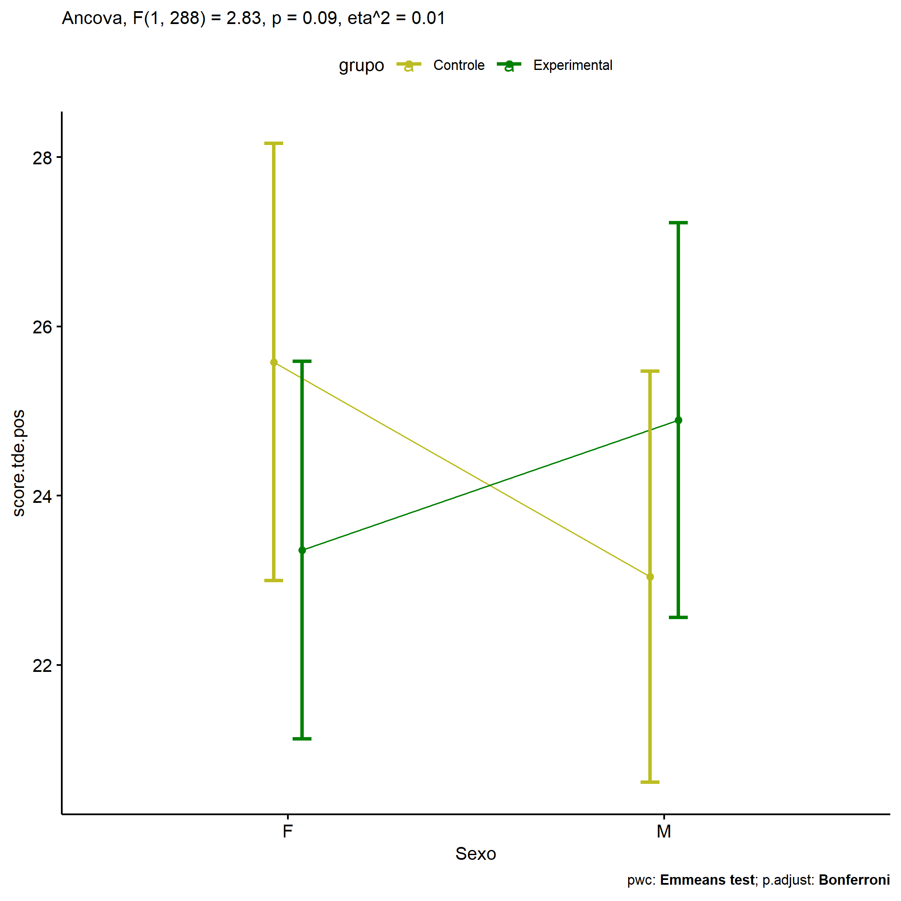<!-- -->

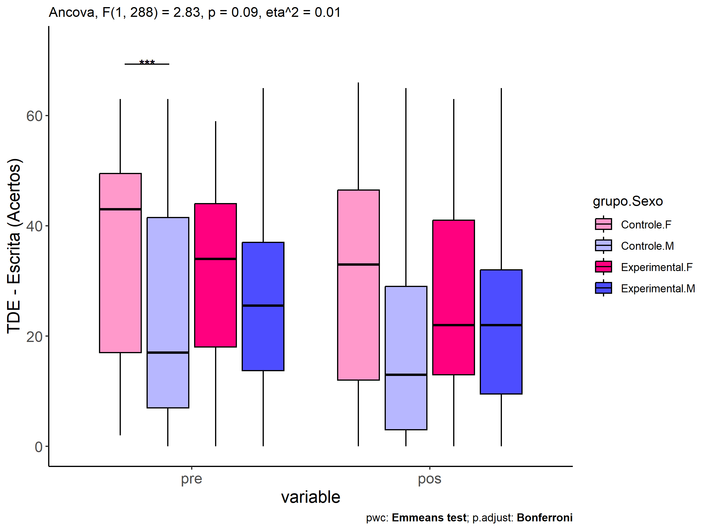<!-- -->

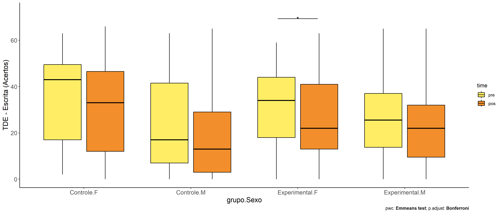<!-- -->

### factores: **grupo:Zona**

| var           | grupo        | Zona   |   n | M (pre) | SE (pre) | M (unadj) | SE (unadj) | M (adj) | SE (adj) |
|:--------------|:-------------|:-------|----:|--------:|---------:|----------:|-----------:|--------:|---------:|
| score.tde.pos | Controle     | Rural  |  97 |  29.907 |    1.998 |    25.979 |      2.107 |  24.928 |    1.051 |
| score.tde.pos | Controle     | Urbana |  21 |  31.143 |    4.116 |    22.810 |      4.118 |  20.697 |    2.258 |
| score.tde.pos | Experimental | Rural  |  86 |  25.593 |    1.666 |    23.488 |      1.721 |  26.145 |    1.121 |
| score.tde.pos | Experimental | Urbana |  40 |  31.075 |    2.691 |    20.675 |      2.715 |  18.620 |    1.637 |

| .y.           | grupo        | Zona   | group1   | group2       | estimate | conf.low | conf.high |    se | statistic | p       | p.adj   | p.adj.signif |
|:--------------|:-------------|:-------|:---------|:-------------|---------:|---------:|----------:|------:|----------:|:--------|:--------|:-------------|
| score.tde.pos |              | Rural  | Controle | Experimental |   -1.217 |   -4.251 |     1.817 | 1.540 |    -0.790 | 0.43    | 0.43    | ns           |
| score.tde.pos |              | Urbana | Controle | Experimental |    2.076 |   -3.413 |     7.565 | 2.786 |     0.745 | 0.457   | 0.457   | ns           |
| score.tde.pre |              | Rural  | Controle | Experimental |    4.314 |   -0.873 |     9.501 | 2.633 |     1.638 | 0.103   | 0.103   | ns           |
| score.tde.pre |              | Urbana | Controle | Experimental |    0.068 |   -9.370 |     9.506 | 4.791 |     0.014 | 0.989   | 0.989   | ns           |
| score.tde.pos | Controle     |        | Rural    | Urbana       |    4.232 |   -0.672 |     9.135 | 2.489 |     1.700 | 0.09    | 0.09    | ns           |
| score.tde.pos | Experimental |        | Rural    | Urbana       |    7.525 |    3.606 |    11.444 | 1.990 |     3.782 | \<0.001 | \<0.001 | \*\*\*       |
| score.tde.pre | Controle     |        | Rural    | Urbana       |   -1.236 |   -9.665 |     7.194 | 4.279 |    -0.289 | 0.773   | 0.773   | ns           |
| score.tde.pre | Experimental |        | Rural    | Urbana       |   -5.482 |  -12.185 |     1.221 | 3.403 |    -1.611 | 0.108   | 0.108   | ns           |

| .y.       | grupo        | Zona   | group1 | group2 | estimate | conf.low | conf.high |    se | statistic |     p | p.adj | p.adj.signif |
|:----------|:-------------|:-------|:-------|:-------|---------:|---------:|----------:|------:|----------:|------:|------:|:-------------|
| score.tde | Controle     | Rural  | pre    | pos    |    3.928 |   -1.182 |     9.038 | 2.601 |     1.510 | 0.132 | 0.132 | ns           |
| score.tde | Controle     | Urbana | pre    | pos    |    8.333 |   -2.649 |    19.316 | 5.589 |     1.491 | 0.137 | 0.137 | ns           |
| score.tde | Experimental | Rural  | pre    | pos    |    2.105 |   -3.322 |     7.532 | 2.762 |     0.762 | 0.446 | 0.446 | ns           |
| score.tde | Experimental | Urbana | pre    | pos    |   10.400 |    2.442 |    18.358 | 4.050 |     2.568 | 0.011 | 0.011 | \*           |

    ## Scale for colour is already present.
    ## Adding another scale for colour, which will replace the existing scale.

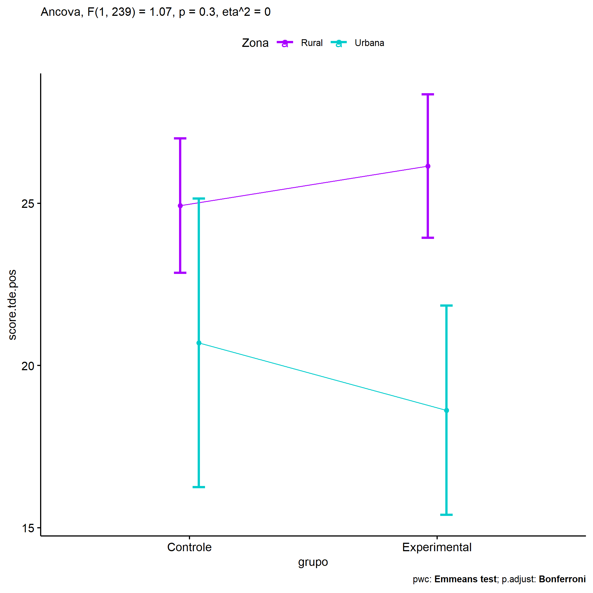<!-- -->

    ## Scale for colour is already present.
    ## Adding another scale for colour, which will replace the existing scale.

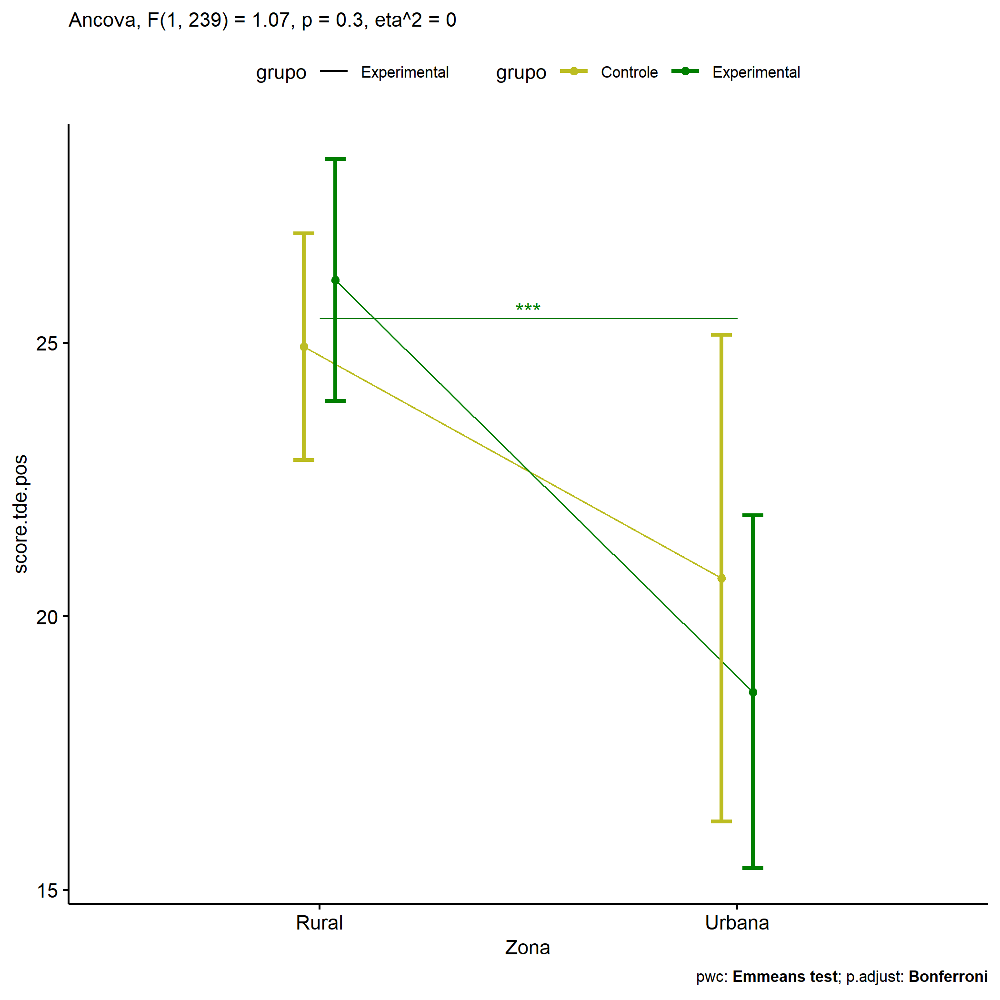<!-- -->

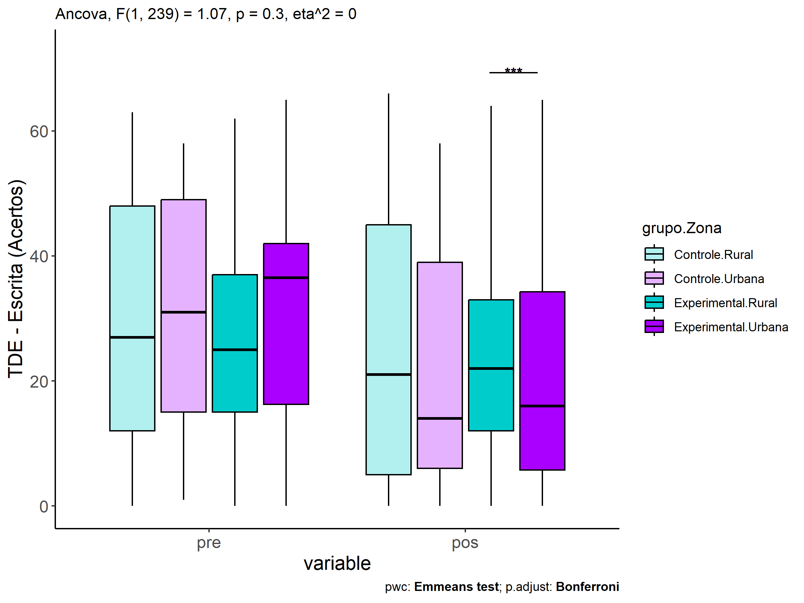<!-- -->

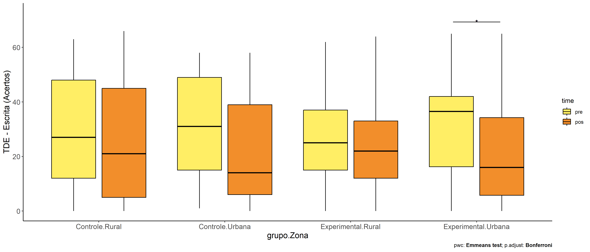<!-- -->

### factores: **grupo:Cor.Raca**

| var           | grupo        | Cor.Raca |   n | M (pre) | SE (pre) | M (unadj) | SE (unadj) | M (adj) | SE (adj) |
|:--------------|:-------------|:---------|----:|--------:|---------:|----------:|-----------:|--------:|---------:|
| score.tde.pos | Controle     | Branca   |  17 |  35.000 |    5.000 |    27.647 |      5.369 |  21.215 |    2.647 |
| score.tde.pos | Controle     | Parda    |  39 |  28.410 |    3.086 |    21.641 |      3.238 |  20.745 |    1.727 |
| score.tde.pos | Experimental | Branca   |  22 |  22.318 |    3.285 |    19.682 |      3.186 |  23.903 |    2.314 |
| score.tde.pos | Experimental | Indígena |  11 |  21.818 |    4.865 |    25.727 |      4.995 |  30.369 |    3.264 |
| score.tde.pos | Experimental | Parda    |  45 |  27.333 |    2.347 |    22.222 |      2.449 |  22.231 |    1.607 |

|     | .y.           | grupo        | Cor.Raca | group1   | group2       | estimate | conf.low | conf.high |    se | statistic |     p | p.adj | p.adj.signif |
|:----|:--------------|:-------------|:---------|:---------|:-------------|---------:|---------:|----------:|------:|----------:|------:|------:|:-------------|
| 1   | score.tde.pos |              | Branca   | Controle | Experimental |   -2.689 |   -9.709 |     4.331 | 3.548 |    -0.758 | 0.450 | 0.450 | ns           |
| 3   | score.tde.pos |              | Parda    | Controle | Experimental |   -1.486 |   -6.153 |     3.181 | 2.359 |    -0.630 | 0.530 | 0.530 | ns           |
| 4   | score.tde.pre |              | Branca   | Controle | Experimental |   12.682 |    1.515 |    23.849 | 5.644 |     2.247 | 0.026 | 0.026 | \*           |
| 6   | score.tde.pre |              | Parda    | Controle | Experimental |    1.077 |   -6.489 |     8.642 | 3.824 |     0.282 | 0.779 | 0.779 | ns           |
| 8   | score.tde.pos | Controle     |          | Branca   | Parda        |    0.470 |   -5.769 |     6.708 | 3.153 |     0.149 | 0.882 | 0.882 | ns           |
| 10  | score.tde.pos | Experimental |          | Branca   | Indígena     |   -6.466 |  -14.341 |     1.410 | 3.980 |    -1.624 | 0.107 | 0.320 | ns           |
| 11  | score.tde.pos | Experimental |          | Branca   | Parda        |    1.673 |   -3.901 |     7.247 | 2.817 |     0.594 | 0.554 | 1.000 | ns           |
| 12  | score.tde.pos | Experimental |          | Indígena | Parda        |    8.138 |    0.941 |    15.336 | 3.638 |     2.237 | 0.027 | 0.081 | ns           |
| 14  | score.tde.pre | Controle     |          | Branca   | Parda        |    6.590 |   -3.460 |    16.640 | 5.080 |     1.297 | 0.197 | 0.197 | ns           |
| 16  | score.tde.pre | Experimental |          | Branca   | Indígena     |    0.500 |  -12.270 |    13.270 | 6.454 |     0.077 | 0.938 | 1.000 | ns           |
| 17  | score.tde.pre | Experimental |          | Branca   | Parda        |   -5.015 |  -14.011 |     3.981 | 4.547 |    -1.103 | 0.272 | 0.816 | ns           |
| 18  | score.tde.pre | Experimental |          | Indígena | Parda        |   -5.515 |  -17.146 |     6.116 | 5.879 |    -0.938 | 0.350 | 1.000 | ns           |

| .y.       | grupo        | Cor.Raca | group1 | group2 | estimate | conf.low | conf.high |    se | statistic |     p | p.adj | p.adj.signif |
|:----------|:-------------|:---------|:-------|:-------|---------:|---------:|----------:|------:|----------:|------:|------:|:-------------|
| score.tde | Controle     | Branca   | pre    | pos    |    7.353 |   -4.695 |    19.401 | 6.118 |     1.202 | 0.231 | 0.231 | ns           |
| score.tde | Controle     | Parda    | pre    | pos    |    6.769 |   -1.185 |    14.724 | 4.039 |     1.676 | 0.095 | 0.095 | ns           |
| score.tde | Experimental | Branca   | pre    | pos    |    2.636 |   -7.955 |    13.227 | 5.378 |     0.490 | 0.624 | 0.624 | ns           |
| score.tde | Experimental | Indígena | pre    | pos    |   -3.909 |  -18.887 |    11.069 | 7.606 |    -0.514 | 0.608 | 0.608 | ns           |
| score.tde | Experimental | Parda    | pre    | pos    |    5.111 |   -2.294 |    12.516 | 3.761 |     1.359 | 0.175 | 0.175 | ns           |

    ## Scale for colour is already present.
    ## Adding another scale for colour, which will replace the existing scale.

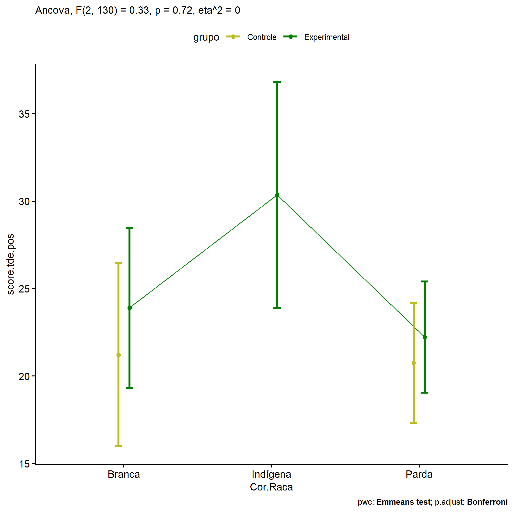<!-- -->

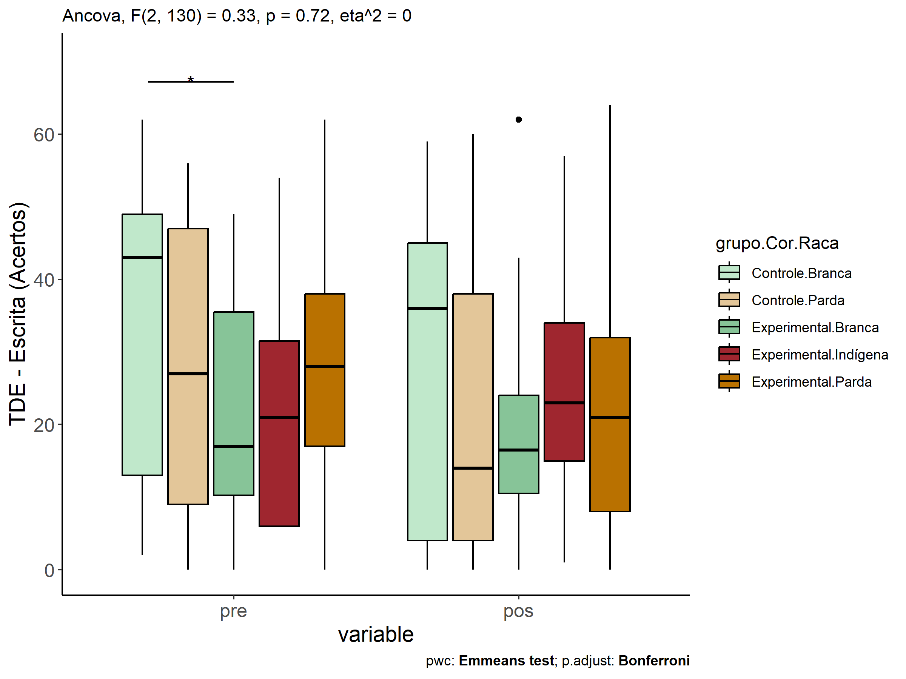<!-- -->

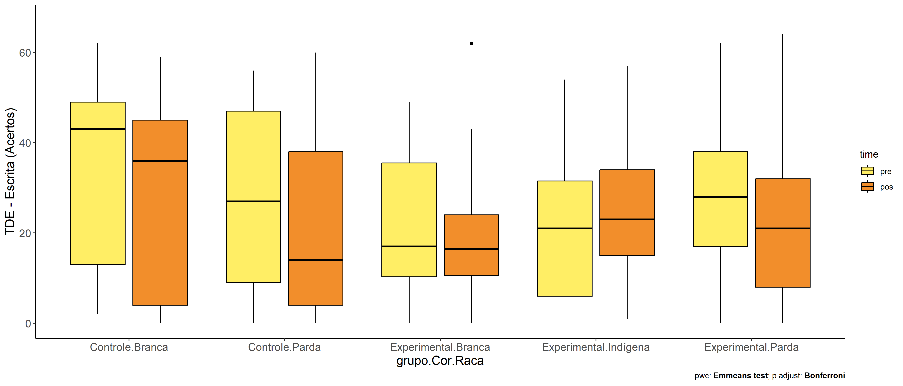<!-- -->

### factores: **grupo:score.tde.quintile**

| var           | grupo        | score.tde.quintile |   n | M (pre) | SE (pre) | M (unadj) | SE (unadj) | M (adj) | SE (adj) |
|:--------------|:-------------|:-------------------|----:|--------:|---------:|----------:|-----------:|--------:|---------:|
| score.tde.pos | Controle     | 1st quintile       |  55 |   8.727 |    0.721 |     7.036 |      1.152 |  22.985 |    3.244 |
| score.tde.pos | Controle     | 2nd quintile       |  17 |  24.235 |    0.968 |    16.529 |      2.469 |  20.276 |    2.537 |
| score.tde.pos | Controle     | 3rd quintile       |  13 |  38.846 |    0.775 |    26.231 |      3.669 |  18.481 |    3.137 |
| score.tde.pos | Controle     | 4th quintile       |  33 |  47.788 |    0.445 |    42.364 |      1.960 |  27.578 |    3.245 |
| score.tde.pos | Controle     | 5th quintile       |  16 |  56.938 |    0.955 |    52.500 |      2.340 |  30.515 |    4.778 |
| score.tde.pos | Experimental | 1st quintile       |  47 |   9.234 |    0.840 |     9.681 |      1.118 |  25.231 |    3.226 |
| score.tde.pos | Experimental | 2nd quintile       |  36 |  25.361 |    0.488 |    19.500 |      1.955 |  22.361 |    1.758 |
| score.tde.pos | Experimental | 3rd quintile       |  43 |  37.116 |    0.467 |    28.651 |      1.830 |  22.262 |    1.936 |
| score.tde.pos | Experimental | 4th quintile       |  20 |  46.750 |    0.464 |    37.700 |      3.158 |  23.731 |    3.424 |
| score.tde.pos | Experimental | 5th quintile       |  13 |  56.385 |    1.041 |    52.923 |      2.644 |  31.373 |    4.862 |

| .y.           | grupo        | score.tde.quintile | group1       | group2       | estimate | conf.low | conf.high |    se | statistic | p       | p.adj   | p.adj.signif |
|:--------------|:-------------|:-------------------|:-------------|:-------------|---------:|---------:|----------:|------:|----------:|:--------|:--------|:-------------|
| score.tde.pos |              | 1st quintile       | Controle     | Experimental |   -2.246 |   -6.183 |     1.692 | 2.000 |    -1.123 | 0.263   | 0.263   | ns           |
| score.tde.pos |              | 2nd quintile       | Controle     | Experimental |   -2.085 |   -7.923 |     3.753 | 2.966 |    -0.703 | 0.483   | 0.483   | ns           |
| score.tde.pos |              | 3rd quintile       | Controle     | Experimental |   -3.782 |  -10.070 |     2.507 | 3.195 |    -1.184 | 0.238   | 0.238   | ns           |
| score.tde.pos |              | 4th quintile       | Controle     | Experimental |    3.847 |   -1.774 |     9.468 | 2.856 |     1.347 | 0.179   | 0.179   | ns           |
| score.tde.pos |              | 5th quintile       | Controle     | Experimental |   -0.858 |   -8.256 |     6.540 | 3.758 |    -0.228 | 0.82    | 0.82    | ns           |
| score.tde.pre |              | 1st quintile       | Controle     | Experimental |   -0.507 |   -2.116 |     1.102 | 0.817 |    -0.620 | 0.536   | 0.536   | ns           |
| score.tde.pre |              | 2nd quintile       | Controle     | Experimental |   -1.126 |   -3.509 |     1.258 | 1.211 |    -0.930 | 0.353   | 0.353   | ns           |
| score.tde.pre |              | 3rd quintile       | Controle     | Experimental |    1.730 |   -0.834 |     4.294 | 1.302 |     1.328 | 0.185   | 0.185   | ns           |
| score.tde.pre |              | 4th quintile       | Controle     | Experimental |    1.038 |   -1.257 |     3.333 | 1.166 |     0.890 | 0.374   | 0.374   | ns           |
| score.tde.pre |              | 5th quintile       | Controle     | Experimental |    0.553 |   -2.472 |     3.577 | 1.537 |     0.360 | 0.719   | 0.719   | ns           |
| score.tde.pos | Controle     |                    | 1st quintile | 2nd quintile |    2.709 |   -4.355 |     9.773 | 3.589 |     0.755 | 0.451   | 1       | ns           |
| score.tde.pos | Controle     |                    | 1st quintile | 3rd quintile |    4.504 |   -6.059 |    15.068 | 5.366 |     0.839 | 0.402   | 1       | ns           |
| score.tde.pos | Controle     |                    | 1st quintile | 4th quintile |   -4.593 |  -16.591 |     7.404 | 6.095 |    -0.754 | 0.452   | 1       | ns           |
| score.tde.pos | Controle     |                    | 1st quintile | 5th quintile |   -7.530 |  -22.428 |     7.368 | 7.569 |    -0.995 | 0.321   | 1       | ns           |
| score.tde.pos | Controle     |                    | 2nd quintile | 3rd quintile |    1.795 |   -6.616 |    10.206 | 4.273 |     0.420 | 0.675   | 1       | ns           |
| score.tde.pos | Controle     |                    | 2nd quintile | 4th quintile |   -7.302 |  -16.268 |     1.664 | 4.555 |    -1.603 | 0.11    | 1       | ns           |
| score.tde.pos | Controle     |                    | 2nd quintile | 5th quintile |  -10.239 |  -21.865 |     1.386 | 5.906 |    -1.734 | 0.084   | 0.841   | ns           |
| score.tde.pos | Controle     |                    | 3rd quintile | 4th quintile |   -9.097 |  -16.070 |    -2.125 | 3.542 |    -2.568 | 0.011   | 0.107   | ns           |
| score.tde.pos | Controle     |                    | 3rd quintile | 5th quintile |  -12.034 |  -21.062 |    -3.007 | 4.586 |    -2.624 | 0.009   | 0.092   | ns           |
| score.tde.pos | Controle     |                    | 4th quintile | 5th quintile |   -2.937 |   -9.515 |     3.640 | 3.342 |    -0.879 | 0.38    | 1       | ns           |
| score.tde.pos | Experimental |                    | 1st quintile | 2nd quintile |    2.870 |   -3.497 |     9.237 | 3.235 |     0.887 | 0.376   | 1       | ns           |
| score.tde.pos | Experimental |                    | 1st quintile | 3rd quintile |    2.968 |   -6.038 |    11.975 | 4.576 |     0.649 | 0.517   | 1       | ns           |
| score.tde.pos | Experimental |                    | 1st quintile | 4th quintile |    1.500 |  -10.467 |    13.466 | 6.079 |     0.247 | 0.805   | 1       | ns           |
| score.tde.pos | Experimental |                    | 1st quintile | 5th quintile |   -6.143 |  -20.993 |     8.708 | 7.545 |    -0.814 | 0.416   | 1       | ns           |
| score.tde.pos | Experimental |                    | 2nd quintile | 3rd quintile |    0.098 |   -5.500 |     5.696 | 2.844 |     0.035 | 0.972   | 1       | ns           |
| score.tde.pos | Experimental |                    | 2nd quintile | 4th quintile |   -1.371 |   -9.615 |     6.874 | 4.188 |    -0.327 | 0.744   | 1       | ns           |
| score.tde.pos | Experimental |                    | 2nd quintile | 5th quintile |   -9.013 |  -19.962 |     1.936 | 5.562 |    -1.620 | 0.106   | 1       | ns           |
| score.tde.pos | Experimental |                    | 3rd quintile | 4th quintile |   -1.469 |   -7.497 |     4.560 | 3.063 |    -0.480 | 0.632   | 1       | ns           |
| score.tde.pos | Experimental |                    | 3rd quintile | 5th quintile |   -9.111 |  -17.460 |    -0.762 | 4.241 |    -2.148 | 0.033   | 0.326   | ns           |
| score.tde.pos | Experimental |                    | 4th quintile | 5th quintile |   -7.642 |  -15.218 |    -0.066 | 3.849 |    -1.986 | 0.048   | 0.48    | ns           |
| score.tde.pre | Controle     |                    | 1st quintile | 2nd quintile |  -15.508 |  -17.756 |   -13.260 | 1.142 |   -13.581 | \<0.001 | \<0.001 | \*\*\*\*     |
| score.tde.pre | Controle     |                    | 1st quintile | 3rd quintile |  -30.119 |  -32.617 |   -27.621 | 1.269 |   -23.734 | \<0.001 | \<0.001 | \*\*\*\*     |
| score.tde.pre | Controle     |                    | 1st quintile | 4th quintile |  -39.061 |  -40.844 |   -37.277 | 0.906 |   -43.109 | \<0.001 | \<0.001 | \*\*\*\*     |
| score.tde.pre | Controle     |                    | 1st quintile | 5th quintile |  -48.210 |  -50.511 |   -45.909 | 1.169 |   -41.246 | \<0.001 | \<0.001 | \*\*\*\*     |
| score.tde.pre | Controle     |                    | 2nd quintile | 3rd quintile |  -14.611 |  -17.595 |   -11.627 | 1.516 |    -9.637 | \<0.001 | \<0.001 | \*\*\*\*     |
| score.tde.pre | Controle     |                    | 2nd quintile | 4th quintile |  -23.553 |  -25.971 |   -21.134 | 1.228 |   -19.172 | \<0.001 | \<0.001 | \*\*\*\*     |
| score.tde.pre | Controle     |                    | 2nd quintile | 5th quintile |  -32.702 |  -35.524 |   -29.881 | 1.433 |   -22.816 | \<0.001 | \<0.001 | \*\*\*\*     |
| score.tde.pre | Controle     |                    | 3rd quintile | 4th quintile |   -8.942 |  -11.594 |    -6.289 | 1.347 |    -6.636 | \<0.001 | \<0.001 | \*\*\*\*     |
| score.tde.pre | Controle     |                    | 3rd quintile | 5th quintile |  -18.091 |  -21.116 |   -15.067 | 1.537 |   -11.774 | \<0.001 | \<0.001 | \*\*\*\*     |
| score.tde.pre | Controle     |                    | 4th quintile | 5th quintile |   -9.150 |  -11.617 |    -6.682 | 1.254 |    -7.299 | \<0.001 | \<0.001 | \*\*\*\*     |
| score.tde.pre | Experimental |                    | 1st quintile | 2nd quintile |  -16.127 |  -17.921 |   -14.333 | 0.911 |   -17.695 | \<0.001 | \<0.001 | \*\*\*\*     |
| score.tde.pre | Experimental |                    | 1st quintile | 3rd quintile |  -27.882 |  -29.592 |   -26.173 | 0.868 |   -32.109 | \<0.001 | \<0.001 | \*\*\*\*     |
| score.tde.pre | Experimental |                    | 1st quintile | 4th quintile |  -37.516 |  -39.678 |   -35.353 | 1.099 |   -34.149 | \<0.001 | \<0.001 | \*\*\*\*     |
| score.tde.pre | Experimental |                    | 1st quintile | 5th quintile |  -47.151 |  -49.689 |   -44.612 | 1.290 |   -36.565 | \<0.001 | \<0.001 | \*\*\*\*     |
| score.tde.pre | Experimental |                    | 2nd quintile | 3rd quintile |  -11.755 |  -13.585 |    -9.925 | 0.930 |   -12.645 | \<0.001 | \<0.001 | \*\*\*\*     |
| score.tde.pre | Experimental |                    | 2nd quintile | 4th quintile |  -21.389 |  -23.648 |   -19.130 | 1.148 |   -18.638 | \<0.001 | \<0.001 | \*\*\*\*     |
| score.tde.pre | Experimental |                    | 2nd quintile | 5th quintile |  -31.024 |  -33.644 |   -28.403 | 1.332 |   -23.299 | \<0.001 | \<0.001 | \*\*\*\*     |
| score.tde.pre | Experimental |                    | 3rd quintile | 4th quintile |   -9.634 |  -11.826 |    -7.441 | 1.114 |    -8.650 | \<0.001 | \<0.001 | \*\*\*\*     |
| score.tde.pre | Experimental |                    | 3rd quintile | 5th quintile |  -19.268 |  -21.832 |   -16.705 | 1.302 |   -14.794 | \<0.001 | \<0.001 | \*\*\*\*     |
| score.tde.pre | Experimental |                    | 4th quintile | 5th quintile |   -9.635 |  -12.520 |    -6.749 | 1.466 |    -6.572 | \<0.001 | \<0.001 | \*\*\*\*     |

| .y.       | grupo        | score.tde.quintile | group1 | group2 | estimate | conf.low | conf.high |    se | statistic | p       | p.adj   | p.adj.signif |
|:----------|:-------------|:-------------------|:-------|:-------|---------:|---------:|----------:|------:|----------:|:--------|:--------|:-------------|
| score.tde | Controle     | 1st quintile       | pre    | pos    |    1.691 |   -1.309 |     4.691 | 1.527 |     1.107 | 0.269   | 0.269   | ns           |
| score.tde | Controle     | 2nd quintile       | pre    | pos    |    7.706 |    2.310 |    13.102 | 2.747 |     2.805 | 0.005   | 0.005   | \*\*         |
| score.tde | Controle     | 3rd quintile       | pre    | pos    |   12.615 |    6.444 |    18.786 | 3.142 |     4.015 | \<0.001 | \<0.001 | \*\*\*\*     |
| score.tde | Controle     | 4th quintile       | pre    | pos    |    5.424 |    1.551 |     9.297 | 1.972 |     2.751 | 0.006   | 0.006   | \*\*         |
| score.tde | Controle     | 5th quintile       | pre    | pos    |    4.437 |   -1.125 |    10.000 | 2.832 |     1.567 | 0.118   | 0.118   | ns           |
| score.tde | Experimental | 1st quintile       | pre    | pos    |   -0.447 |   -3.692 |     2.799 | 1.652 |    -0.270 | 0.787   | 0.787   | ns           |
| score.tde | Experimental | 2nd quintile       | pre    | pos    |    5.861 |    2.153 |     9.569 | 1.888 |     3.104 | 0.002   | 0.002   | \*\*         |
| score.tde | Experimental | 3rd quintile       | pre    | pos    |    8.465 |    5.072 |    11.858 | 1.727 |     4.900 | \<0.001 | \<0.001 | \*\*\*\*     |
| score.tde | Experimental | 4th quintile       | pre    | pos    |    9.050 |    4.075 |    14.025 | 2.533 |     3.573 | \<0.001 | \<0.001 | \*\*\*       |
| score.tde | Experimental | 5th quintile       | pre    | pos    |    3.462 |   -2.709 |     9.632 | 3.142 |     1.102 | 0.271   | 0.271   | ns           |

    ## Scale for colour is already present.
    ## Adding another scale for colour, which will replace the existing scale.

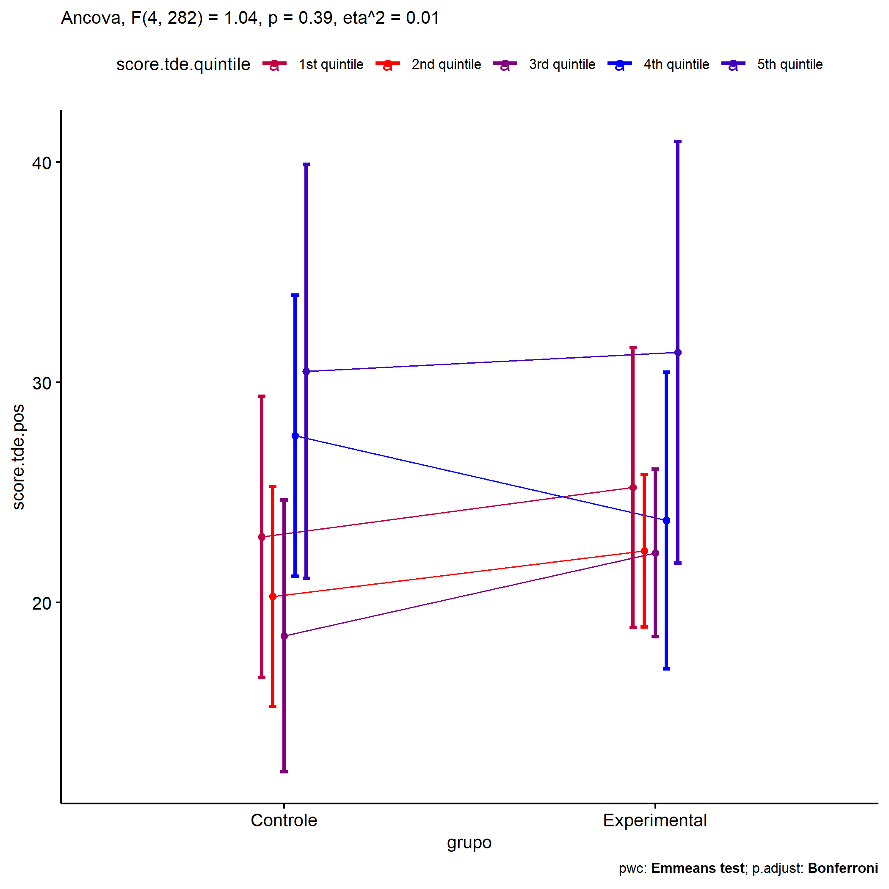<!-- -->

    ## Scale for colour is already present.
    ## Adding another scale for colour, which will replace the existing scale.

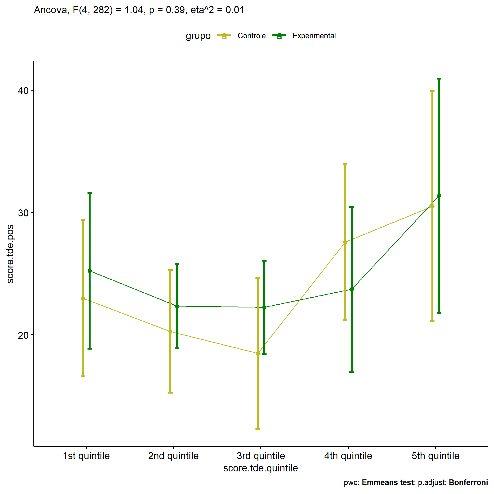<!-- -->

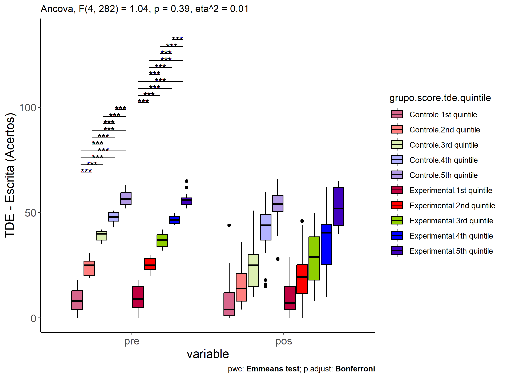<!-- -->

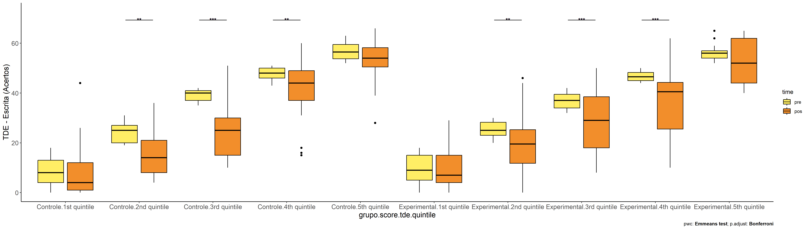<!-- -->
