ANCOVA in TDE - Escrita (Acertos) (TDE - Escrita (Acertos))
================
Geiser C. Challco <geiser@alumni.usp.br>

- [Descriptive Statistics of Initial
  Data](#descriptive-statistics-of-initial-data)
- [Checking of Assumptions](#checking-of-assumptions)
  - [Assumption: Normality distribution of
    data](#assumption-normality-distribution-of-data)
  - [Assumption: Homogeneity of data
    distribution](#assumption-homogeneity-of-data-distribution)
- [Computation of ANCOVA test and Pairwise
  Comparison](#computation-of-ancova-test-and-pairwise-comparison)
  - [ANCOVA tests for one factor](#ancova-tests-for-one-factor)
  - [ANCOVA tests for two factors](#ancova-tests-for-two-factors)
  - [Pairwise comparisons for one factor:
    **grupo**](#pairwise-comparisons-for-one-factor-grupo)
  - [Pairwise comparisons for two
    factors](#pairwise-comparisons-for-two-factors)
    - [factores: **grupo:Sexo**](#factores-gruposexo)
    - [factores: **grupo:Zona**](#factores-grupozona)
    - [factores: **grupo:Cor.Raca**](#factores-grupocorraca)
    - [factores:
      **grupo:score.tde.quintile**](#factores-gruposcoretdequintile)

**NOTE**

- Teste ANCOVA para determinar se houve diferenças significativas no
  TDE - Escrita (Acertos) (medido usando pre- e pos-testes).
- ANCOVA test to determine whether there were significant differences in
  TDE - Escrita (Acertos) (measured using pre- and post-tests).

# Descriptive Statistics of Initial Data

| grupo        | Sexo | Zona   | Cor.Raca | score.tde.quintile | variable      |   n |   mean | median | min | max |     sd |    se |     ci |   iqr |
|:-------------|:-----|:-------|:---------|:-------------------|:--------------|----:|-------:|-------:|----:|----:|-------:|------:|-------:|------:|
| Controle     | F    |        |          |                    | score.tde.pre | 247 | 40.652 |   46.0 |   0 |  72 | 17.259 | 1.098 |  2.163 | 24.50 |
| Controle     | M    |        |          |                    | score.tde.pre | 238 | 34.496 |   42.0 |   0 |  75 | 20.552 | 1.332 |  2.624 | 37.00 |
| Experimental | F    |        |          |                    | score.tde.pre | 319 | 39.408 |   43.0 |   0 |  73 | 16.802 | 0.941 |  1.851 | 25.00 |
| Experimental | M    |        |          |                    | score.tde.pre | 317 | 34.073 |   36.0 |   0 |  71 | 16.580 | 0.931 |  1.832 | 23.00 |
| Controle     | F    |        |          |                    | score.tde.pos | 247 | 36.567 |   42.0 |   0 |  72 | 19.883 | 1.265 |  2.492 | 35.00 |
| Controle     | M    |        |          |                    | score.tde.pos | 238 | 30.962 |   28.5 |   0 |  73 | 21.752 | 1.410 |  2.778 | 37.00 |
| Experimental | F    |        |          |                    | score.tde.pos | 319 | 38.138 |   42.0 |   0 |  73 | 19.397 | 1.086 |  2.137 | 32.00 |
| Experimental | M    |        |          |                    | score.tde.pos | 317 | 32.596 |   34.0 |   0 |  74 | 17.992 | 1.011 |  1.988 | 29.00 |
| Controle     |      | Rural  |          |                    | score.tde.pre | 243 | 36.181 |   43.0 |   0 |  69 | 19.626 | 1.259 |  2.480 | 34.50 |
| Controle     |      | Urbana |          |                    | score.tde.pre | 109 | 39.468 |   43.0 |   1 |  75 | 18.034 | 1.727 |  3.424 | 26.00 |
| Controle     |      |        |          |                    | score.tde.pre | 133 | 38.774 |   45.0 |   0 |  73 | 19.183 | 1.663 |  3.290 | 32.00 |
| Experimental |      | Rural  |          |                    | score.tde.pre | 284 | 34.592 |   35.5 |   0 |  73 | 17.467 | 1.036 |  2.040 | 25.25 |
| Experimental |      | Urbana |          |                    | score.tde.pre | 167 | 37.850 |   42.0 |   0 |  71 | 16.633 | 1.287 |  2.541 | 22.00 |
| Experimental |      |        |          |                    | score.tde.pre | 185 | 39.065 |   42.0 |   0 |  69 | 15.877 | 1.167 |  2.303 | 23.00 |
| Controle     |      | Rural  |          |                    | score.tde.pos | 243 | 34.243 |   39.0 |   0 |  72 | 21.515 | 1.380 |  2.719 | 38.00 |
| Controle     |      | Urbana |          |                    | score.tde.pos | 109 | 29.835 |   26.0 |   0 |  73 | 20.374 | 1.951 |  3.868 | 37.00 |
| Controle     |      |        |          |                    | score.tde.pos | 133 | 36.301 |   39.0 |   0 |  73 | 20.179 | 1.750 |  3.461 | 34.00 |
| Experimental |      | Rural  |          |                    | score.tde.pos | 284 | 33.627 |   33.0 |   0 |  72 | 19.232 | 1.141 |  2.246 | 33.00 |
| Experimental |      | Urbana |          |                    | score.tde.pos | 167 | 34.108 |   38.0 |   0 |  74 | 18.899 | 1.462 |  2.887 | 30.50 |
| Experimental |      |        |          |                    | score.tde.pos | 185 | 39.205 |   42.0 |   0 |  73 | 17.909 | 1.317 |  2.598 | 26.00 |
| Controle     |      |        | Branca   |                    | score.tde.pre |  50 | 41.460 |   46.0 |   2 |  67 | 16.942 | 2.396 |  4.815 | 14.50 |
| Controle     |      |        | Indígena |                    | score.tde.pre |  11 | 42.000 |   46.0 |   4 |  65 | 17.297 | 5.215 | 11.621 |  9.50 |
| Controle     |      |        | Parda    |                    | score.tde.pre | 162 | 36.741 |   43.0 |   0 |  66 | 18.900 | 1.485 |  2.932 | 31.25 |
| Controle     |      |        |          |                    | score.tde.pre | 262 | 37.267 |   43.0 |   0 |  75 | 19.798 | 1.223 |  2.408 | 34.00 |
| Experimental |      |        | Amarela  |                    | score.tde.pre |   1 | 23.000 |   23.0 |  23 |  23 |        |       |        |  0.00 |
| Experimental |      |        | Branca   |                    | score.tde.pre |  61 | 34.623 |   36.0 |   0 |  73 | 19.728 | 2.526 |  5.053 | 33.00 |
| Experimental |      |        | Indígena |                    | score.tde.pre |  15 | 27.067 |   26.0 |   6 |  54 | 17.065 | 4.406 |  9.450 | 27.00 |
| Experimental |      |        | Parda    |                    | score.tde.pre | 190 | 34.253 |   35.0 |   0 |  68 | 17.537 | 1.272 |  2.510 | 27.00 |
| Experimental |      |        |          |                    | score.tde.pre | 369 | 38.816 |   42.0 |   0 |  71 | 15.723 | 0.819 |  1.610 | 21.00 |
| Controle     |      |        | Branca   |                    | score.tde.pos |  50 | 34.300 |   38.0 |   0 |  72 | 20.518 | 2.902 |  5.831 | 34.75 |
| Controle     |      |        | Indígena |                    | score.tde.pos |  11 | 45.636 |   52.0 |   4 |  63 | 19.931 | 6.009 | 13.390 | 19.50 |
| Controle     |      |        | Parda    |                    | score.tde.pos | 162 | 32.463 |   35.0 |   0 |  68 | 20.798 | 1.634 |  3.227 | 39.75 |
| Controle     |      |        |          |                    | score.tde.pos | 262 | 34.065 |   34.0 |   0 |  73 | 21.180 | 1.309 |  2.577 | 36.00 |
| Experimental |      |        | Amarela  |                    | score.tde.pos |   1 | 23.000 |   23.0 |  23 |  23 |        |       |        |  0.00 |
| Experimental |      |        | Branca   |                    | score.tde.pos |  61 | 33.311 |   34.0 |   0 |  72 | 21.189 | 2.713 |  5.427 | 34.00 |
| Experimental |      |        | Indígena |                    | score.tde.pos |  15 | 30.333 |   26.0 |   1 |  57 | 17.715 | 4.574 |  9.810 | 30.50 |
| Experimental |      |        | Parda    |                    | score.tde.pos | 190 | 32.447 |   30.0 |   0 |  71 | 19.467 | 1.412 |  2.786 | 32.75 |
| Experimental |      |        |          |                    | score.tde.pos | 369 | 37.463 |   40.0 |   0 |  74 | 18.045 | 0.939 |  1.847 | 27.00 |
| Controle     |      |        |          | 1st quintile       | score.tde.pre | 113 |  9.230 |   10.0 |   0 |  18 |  5.560 | 0.523 |  1.036 |  9.00 |
| Controle     |      |        |          | 2nd quintile       | score.tde.pre |  59 | 24.542 |   25.0 |  19 |  31 |  3.780 | 0.492 |  0.985 |  6.00 |
| Controle     |      |        |          | 3rd quintile       | score.tde.pre |  54 | 38.815 |   39.5 |  32 |  42 |  3.004 | 0.409 |  0.820 |  5.00 |
| Controle     |      |        |          | 4th quintile       | score.tde.pre | 135 | 47.370 |   47.0 |  43 |  51 |  2.579 | 0.222 |  0.439 |  4.50 |
| Controle     |      |        |          | 5th quintile       | score.tde.pre | 124 | 58.621 |   58.0 |  52 |  75 |  5.367 | 0.482 |  0.954 |  8.00 |
| Experimental |      |        |          | 1st quintile       | score.tde.pre | 112 |  9.777 |   10.0 |   0 |  18 |  5.445 | 0.515 |  1.020 |  9.25 |
| Experimental |      |        |          | 2nd quintile       | score.tde.pre | 117 | 25.855 |   26.0 |  19 |  31 |  3.422 | 0.316 |  0.627 |  6.00 |
| Experimental |      |        |          | 3rd quintile       | score.tde.pre | 141 | 37.383 |   38.0 |  32 |  42 |  3.177 | 0.268 |  0.529 |  6.00 |
| Experimental |      |        |          | 4th quintile       | score.tde.pre | 132 | 46.697 |   47.0 |  43 |  51 |  2.489 | 0.217 |  0.429 |  4.25 |
| Experimental |      |        |          | 5th quintile       | score.tde.pre | 134 | 58.336 |   57.5 |  52 |  73 |  5.029 | 0.434 |  0.859 |  8.00 |
| Controle     |      |        |          | 1st quintile       | score.tde.pos | 113 |  8.522 |    5.0 |   0 |  44 |  8.588 | 0.808 |  1.601 | 12.00 |
| Controle     |      |        |          | 2nd quintile       | score.tde.pos |  59 | 19.966 |   20.0 |   0 |  66 | 12.947 | 1.686 |  3.374 | 13.50 |
| Controle     |      |        |          | 3rd quintile       | score.tde.pos |  54 | 30.185 |   28.5 |   2 |  62 | 15.298 | 2.082 |  4.176 | 22.25 |
| Controle     |      |        |          | 4th quintile       | score.tde.pos | 135 | 43.215 |   46.0 |  14 |  63 | 11.360 | 0.978 |  1.934 | 16.00 |
| Controle     |      |        |          | 5th quintile       | score.tde.pos | 124 | 54.806 |   56.0 |  22 |  73 | 10.905 | 0.979 |  1.938 | 11.25 |
| Experimental |      |        |          | 1st quintile       | score.tde.pos | 112 | 11.384 |   10.0 |   0 |  51 |  9.500 | 0.898 |  1.779 | 12.00 |
| Experimental |      |        |          | 2nd quintile       | score.tde.pos | 117 | 24.675 |   25.0 |   0 |  60 | 12.203 | 1.128 |  2.234 | 16.00 |
| Experimental |      |        |          | 3rd quintile       | score.tde.pos | 141 | 34.872 |   37.0 |   0 |  64 | 13.013 | 1.096 |  2.167 | 18.00 |
| Experimental |      |        |          | 4th quintile       | score.tde.pos | 132 | 45.030 |   47.0 |  10 |  69 | 10.621 | 0.924 |  1.829 | 11.00 |
| Experimental |      |        |          | 5th quintile       | score.tde.pos | 134 | 55.791 |   57.0 |  14 |  74 | 10.619 | 0.917 |  1.814 | 12.00 |

# Checking of Assumptions

## Assumption: Normality distribution of data

| var           |    n |   skewness |  kurtosis | symmetry | statistic | method     |        p | p.signif | normality |
|:--------------|-----:|-----------:|----------:|:---------|----------:|:-----------|---------:|:---------|:----------|
| score.tde.pos | 1121 | -0.3413548 | 1.1677623 | YES      |  49.96350 | D’Agostino | 0.00e+00 | \*\*\*\* | \-        |
| score.tde.pos |  803 | -0.2526071 | 0.9142617 | YES      |  23.91582 | D’Agostino | 6.40e-06 | \*\*\*\* | \-        |
| score.tde.pos |  490 | -0.4128143 | 0.5839234 | YES      |  18.78008 | D’Agostino | 8.36e-05 | \*\*\*   | \-        |
| score.tde.pos | 1121 | -0.2106527 | 1.2877717 | YES      |  41.15505 | D’Agostino | 0.00e+00 | \*\*\*\* | \-        |

## Assumption: Homogeneity of data distribution

| var           | method         | formula                              |    n | DFn.df1 | DFd.df2 | statistic |         p | p.signif |
|:--------------|:---------------|:-------------------------------------|-----:|--------:|--------:|----------:|----------:|:---------|
| score.tde.pos | Levene’s test  | `.res`~`grupo`\*`Sexo`               | 1121 |       3 |    1117 | 0.6189260 | 0.6028109 | ns       |
| score.tde.pos | Anova’s slopes | `.res`~`grupo`\*`Sexo`               | 1121 |       3 |    1113 | 0.5590000 | 0.6420000 | ns       |
| score.tde.pos | Levene’s test  | `.res`~`grupo`\*`Zona`               |  803 |       3 |     799 | 0.9346134 | 0.4233876 | ns       |
| score.tde.pos | Anova’s slopes | `.res`~`grupo`\*`Zona`               |  803 |       3 |     795 | 0.2870000 | 0.8350000 | ns       |
| score.tde.pos | Levene’s test  | `.res`~`grupo`\*`Cor.Raca`           |  490 |       6 |     483 | 0.6536290 | 0.6872206 | ns       |
| score.tde.pos | Anova’s slopes | `.res`~`grupo`\*`Cor.Raca`           |  490 |       5 |     477 | 0.6120000 | 0.6900000 | ns       |
| score.tde.pos | Levene’s test  | `.res`~`grupo`\*`score.tde.quintile` | 1121 |       9 |    1111 | 7.3338886 | 0.0000000 | \*\*\*\* |
| score.tde.pos | Anova’s slopes | `.res`~`grupo`\*`score.tde.quintile` | 1121 |       9 |    1101 | 1.8820000 | 0.0510000 | ns       |

# Computation of ANCOVA test and Pairwise Comparison

## ANCOVA tests for one factor

|     | Effect             | DFn |  DFd |        SSn |       SSd |        F | p       |   ges | p\<.05 |
|:----|:-------------------|----:|-----:|-----------:|----------:|---------:|:--------|------:|:-------|
| 1   | score.tde.pre      |   1 | 1118 | 314931.071 | 125084.78 | 2814.834 | \<0.001 | 0.716 | \*     |
| 2   | grupo              |   1 | 1118 |   1565.177 | 125084.78 |   13.989 | \<0.001 | 0.012 | \*     |
| 4   | Sexo               |   1 | 1118 |     15.423 | 126634.54 |    0.136 | 0.712   | 0.000 |        |
| 6   | Zona               |   1 |  800 |   3610.187 |  89074.31 |   32.424 | \<0.001 | 0.039 | \*     |
| 8   | Cor.Raca           |   3 |  485 |   1053.522 |  63779.28 |    2.670 | 0.047   | 0.016 | \*     |
| 10  | score.tde.quintile |   4 | 1115 |   1152.233 | 125497.73 |    2.559 | 0.037   | 0.009 | \*     |

## ANCOVA tests for two factors

|     | Effect                   | DFn |  DFd |        SSn |       SSd |        F | p       |   ges | p\<.05 |
|:----|:-------------------------|----:|-----:|-----------:|----------:|---------:|:--------|------:|:-------|
| 1   | score.tde.pre            |   1 | 1116 | 306291.592 | 125033.96 | 2733.829 | \<0.001 | 0.710 | \*     |
| 4   | grupo:Sexo               |   1 | 1116 |     34.195 | 125033.96 |    0.305 | 0.581   | 0.000 |        |
| 8   | grupo:Zona               |   1 |  798 |   1059.830 |  86749.82 |    9.749 | 0.002   | 0.012 | \*     |
| 12  | grupo:Cor.Raca           |   2 |  482 |    317.090 |  62558.39 |    1.222 | 0.296   | 0.005 |        |
| 16  | grupo:score.tde.quintile |   4 | 1110 |    619.322 | 122756.86 |    1.400 | 0.232   | 0.005 |        |

## Pairwise comparisons for one factor: **grupo**

| var           | grupo        |   n | M (pre) | SE (pre) | M (unadj) | SE (unadj) | M (adj) | SE (adj) |
|:--------------|:-------------|----:|--------:|---------:|----------:|-----------:|--------:|---------:|
| score.tde.pos | Controle     | 485 |  37.631 |    0.871 |    33.816 |      0.953 |  33.348 |    0.480 |
| score.tde.pos | Experimental | 636 |  36.748 |    0.670 |    35.376 |      0.749 |  35.733 |    0.419 |

| .y.           | group1   | group2       | estimate | conf.low | conf.high |    se | statistic | p       | p.adj   | p.adj.signif |
|:--------------|:---------|:-------------|---------:|---------:|----------:|------:|----------:|:--------|:--------|:-------------|
| score.tde.pos | Controle | Experimental |   -2.386 |   -3.637 |    -1.134 | 0.638 |    -3.740 | \<0.001 | \<0.001 | \*\*\*       |
| score.tde.pre | Controle | Experimental |    0.883 |   -1.237 |     3.002 | 1.080 |     0.817 | 0.414   | 0.414   | ns           |

| .y.       | grupo        | group1 | group2 | estimate | conf.low | conf.high |    se | statistic |     p | p.adj | p.adj.signif |
|:----------|:-------------|:-------|:-------|---------:|---------:|----------:|------:|----------:|------:|------:|:-------------|
| score.tde | Controle     | pre    | pos    |    3.814 |    1.435 |     6.194 | 1.213 |     3.143 | 0.002 | 0.002 | \*\*         |
| score.tde | Experimental | pre    | pos    |    1.373 |   -0.705 |     3.451 | 1.060 |     1.295 | 0.195 | 0.195 | ns           |

    ## Scale for colour is already present.
    ## Adding another scale for colour, which will replace the existing scale.

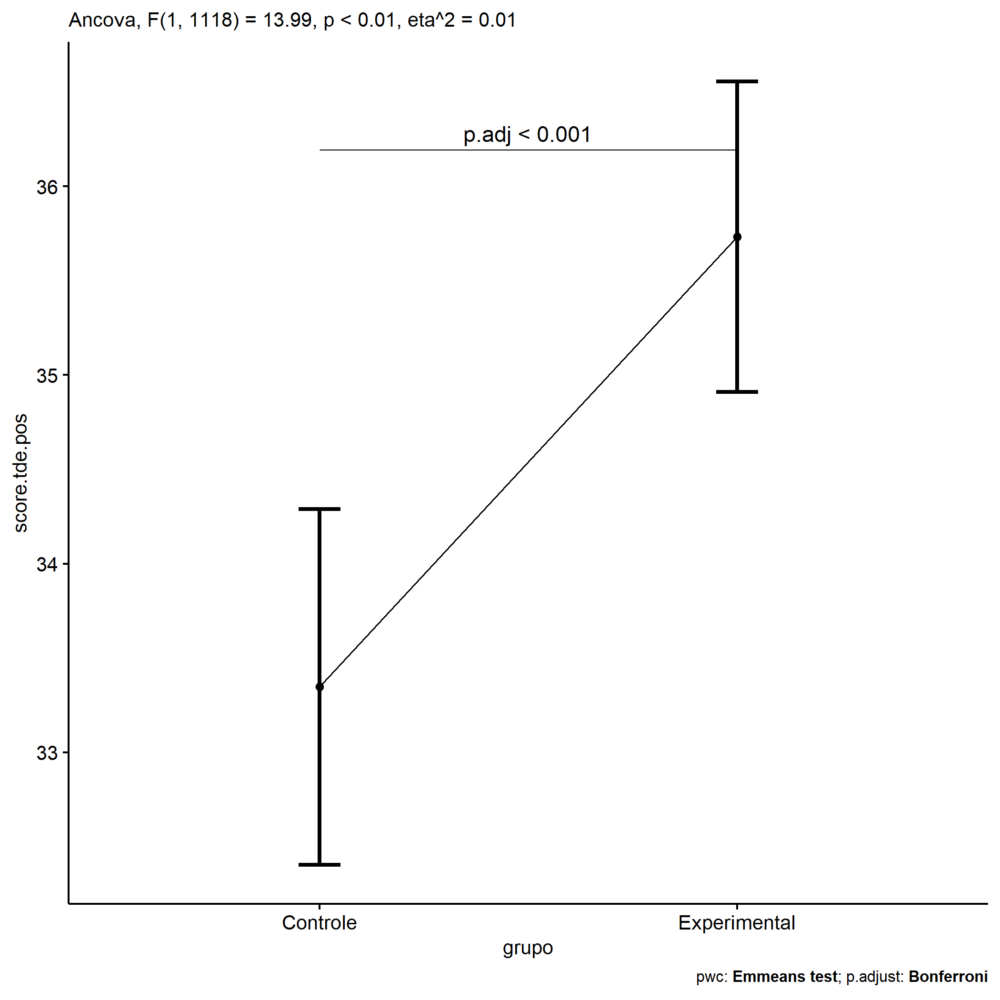<!-- -->

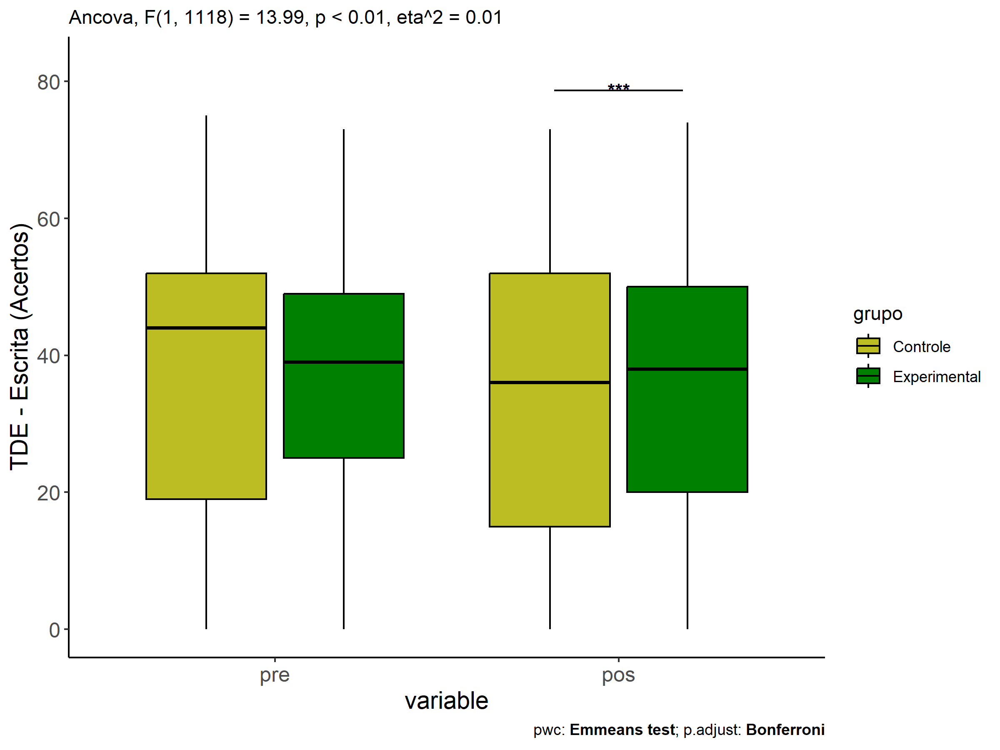<!-- -->

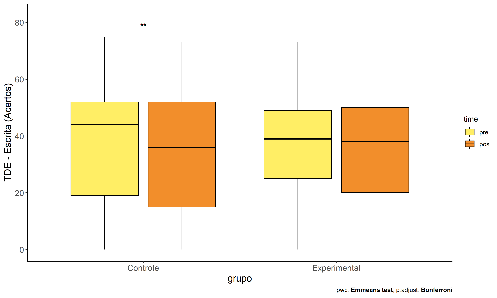<!-- -->

## Pairwise comparisons for two factors

### factores: **grupo:Sexo**

| var           | grupo        | Sexo |   n | M (pre) | SE (pre) | M (unadj) | SE (unadj) | M (adj) | SE (adj) |
|:--------------|:-------------|:-----|----:|--------:|---------:|----------:|-----------:|--------:|---------:|
| score.tde.pos | Controle     | F    | 247 |  40.652 |    1.098 |    36.567 |      1.265 |  33.273 |    0.676 |
| score.tde.pos | Controle     | M    | 238 |  34.496 |    1.332 |    30.962 |      1.410 |  33.427 |    0.688 |
| score.tde.pos | Experimental | F    | 319 |  39.408 |    0.941 |    38.138 |      1.086 |  36.008 |    0.594 |
| score.tde.pos | Experimental | M    | 317 |  34.073 |    0.931 |    32.596 |      1.011 |  35.457 |    0.597 |

| .y.           | grupo        | Sexo | group1   | group2       | estimate | conf.low | conf.high |    se | statistic | p       | p.adj   | p.adj.signif |
|:--------------|:-------------|:-----|:---------|:-------------|---------:|---------:|----------:|------:|----------:|:--------|:--------|:-------------|
| score.tde.pos |              | F    | Controle | Experimental |   -2.735 |   -4.496 |    -0.974 | 0.897 |    -3.048 | 0.002   | 0.002   | \*\*         |
| score.tde.pos |              | M    | Controle | Experimental |   -2.030 |   -3.811 |    -0.249 | 0.908 |    -2.236 | 0.026   | 0.026   | \*           |
| score.tde.pre |              | F    | Controle | Experimental |    1.244 |   -1.699 |     4.188 | 1.500 |     0.829 | 0.407   | 0.407   | ns           |
| score.tde.pre |              | M    | Controle | Experimental |    0.423 |   -2.556 |     3.402 | 1.518 |     0.279 | 0.78    | 0.78    | ns           |
| score.tde.pos | Controle     |      | F        | M            |   -0.154 |   -2.053 |     1.745 | 0.968 |    -0.159 | 0.874   | 0.874   | ns           |
| score.tde.pos | Experimental |      | F        | M            |    0.551 |   -1.107 |     2.209 | 0.845 |     0.652 | 0.514   | 0.514   | ns           |
| score.tde.pre | Controle     |      | F        | M            |    6.156 |    3.001 |     9.311 | 1.608 |     3.829 | \<0.001 | \<0.001 | \*\*\*       |
| score.tde.pre | Experimental |      | F        | M            |    5.335 |    2.580 |     8.089 | 1.404 |     3.800 | \<0.001 | \<0.001 | \*\*\*       |

| .y.       | grupo        | Sexo | group1 | group2 | estimate | conf.low | conf.high |    se | statistic |     p | p.adj | p.adj.signif |
|:----------|:-------------|:-----|:-------|:-------|---------:|---------:|----------:|------:|----------:|------:|------:|:-------------|
| score.tde | Controle     | F    | pre    | pos    |    4.085 |    0.785 |     7.385 | 1.683 |     2.427 | 0.015 | 0.015 | \*           |
| score.tde | Controle     | M    | pre    | pos    |    3.534 |    0.172 |     6.896 | 1.714 |     2.061 | 0.039 | 0.039 | \*           |
| score.tde | Experimental | F    | pre    | pos    |    1.270 |   -1.634 |     4.174 | 1.481 |     0.857 | 0.391 | 0.391 | ns           |
| score.tde | Experimental | M    | pre    | pos    |    1.476 |   -1.437 |     4.389 | 1.485 |     0.994 | 0.320 | 0.320 | ns           |

    ## Scale for colour is already present.
    ## Adding another scale for colour, which will replace the existing scale.

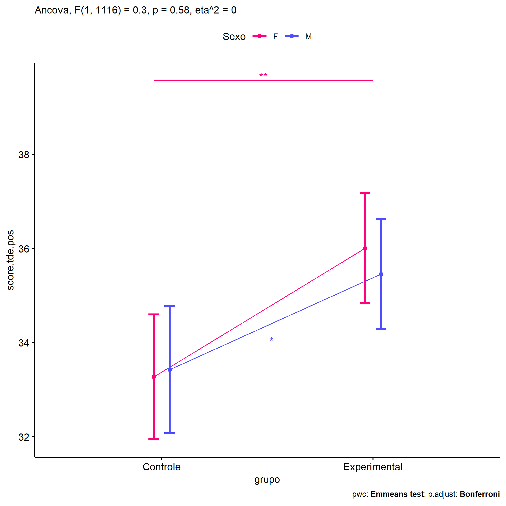<!-- -->

    ## Scale for colour is already present.
    ## Adding another scale for colour, which will replace the existing scale.

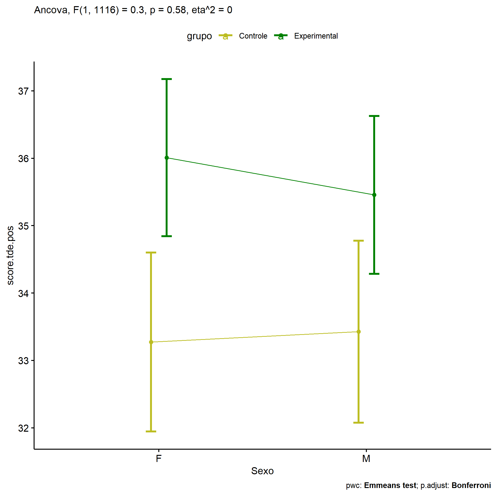<!-- -->

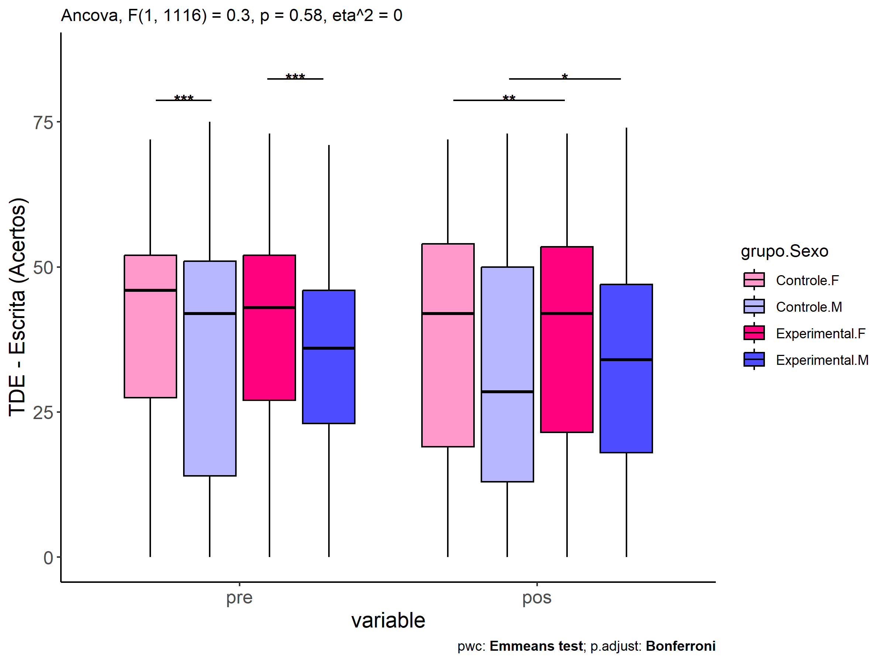<!-- -->

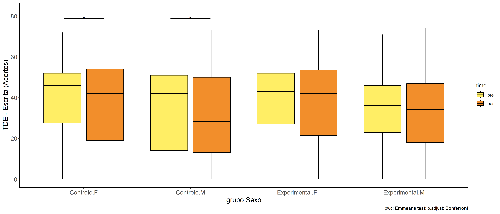<!-- -->

### factores: **grupo:Zona**

| var           | grupo        | Zona   |   n | M (pre) | SE (pre) | M (unadj) | SE (unadj) | M (adj) | SE (adj) |
|:--------------|:-------------|:-------|----:|--------:|---------:|----------:|-----------:|--------:|---------:|
| score.tde.pos | Controle     | Rural  | 243 |  36.181 |    1.259 |    34.243 |      1.380 |  34.462 |    0.669 |
| score.tde.pos | Controle     | Urbana | 109 |  39.468 |    1.727 |    29.835 |      1.951 |  26.939 |    1.001 |
| score.tde.pos | Experimental | Rural  | 284 |  34.592 |    1.036 |    33.627 |      1.141 |  35.352 |    0.620 |
| score.tde.pos | Experimental | Urbana | 167 |  37.850 |    1.287 |    34.108 |      1.462 |  32.745 |    0.807 |

| .y.           | grupo        | Zona   | group1   | group2       | estimate | conf.low | conf.high |    se | statistic | p       | p.adj   | p.adj.signif |
|:--------------|:-------------|:-------|:---------|:-------------|---------:|---------:|----------:|------:|----------:|:--------|:--------|:-------------|
| score.tde.pos |              | Rural  | Controle | Experimental |   -0.890 |   -2.680 |     0.899 | 0.912 |    -0.977 | 0.329   | 0.329   | ns           |
| score.tde.pos |              | Urbana | Controle | Experimental |   -5.806 |   -8.327 |    -3.285 | 1.284 |    -4.521 | \<0.001 | \<0.001 | \*\*\*\*     |
| score.tde.pre |              | Rural  | Controle | Experimental |    1.590 |   -1.508 |     4.687 | 1.578 |     1.007 | 0.314   | 0.314   | ns           |
| score.tde.pre |              | Urbana | Controle | Experimental |    1.618 |   -2.748 |     5.983 | 2.224 |     0.727 | 0.467   | 0.467   | ns           |
| score.tde.pos | Controle     |        | Rural    | Urbana       |    7.523 |    5.160 |     9.886 | 1.204 |     6.249 | \<0.001 | \<0.001 | \*\*\*\*     |
| score.tde.pos | Experimental |        | Rural    | Urbana       |    2.607 |    0.607 |     4.607 | 1.019 |     2.559 | 0.011   | 0.011   | \*           |
| score.tde.pre | Controle     |        | Rural    | Urbana       |   -3.287 |   -7.374 |     0.800 | 2.082 |    -1.579 | 0.115   | 0.115   | ns           |
| score.tde.pre | Experimental |        | Rural    | Urbana       |   -3.259 |   -6.716 |     0.198 | 1.761 |    -1.850 | 0.065   | 0.065   | ns           |

| .y.       | grupo        | Zona   | group1 | group2 | estimate | conf.low | conf.high |    se | statistic | p       | p.adj   | p.adj.signif |
|:----------|:-------------|:-------|:-------|:-------|---------:|---------:|----------:|------:|----------:|:--------|:--------|:-------------|
| score.tde | Controle     | Rural  | pre    | pos    |    1.938 |   -1.456 |     5.333 | 1.730 |     1.120 | 0.263   | 0.263   | ns           |
| score.tde | Controle     | Urbana | pre    | pos    |    9.633 |    4.565 |    14.701 | 2.584 |     3.728 | \<0.001 | \<0.001 | \*\*\*       |
| score.tde | Experimental | Rural  | pre    | pos    |    0.965 |   -2.175 |     4.104 | 1.601 |     0.603 | 0.547   | 0.547   | ns           |
| score.tde | Experimental | Urbana | pre    | pos    |    3.743 |   -0.352 |     7.837 | 2.087 |     1.793 | 0.073   | 0.073   | ns           |

    ## Scale for colour is already present.
    ## Adding another scale for colour, which will replace the existing scale.

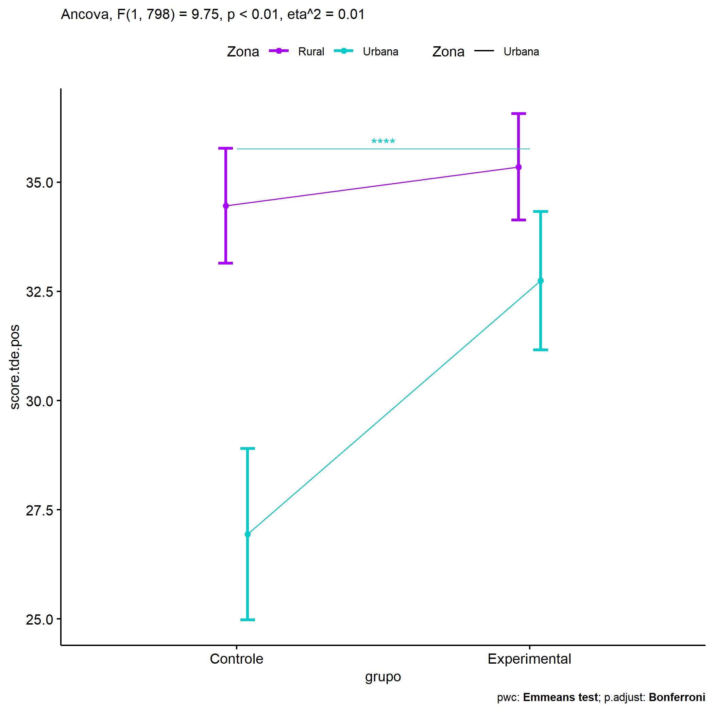<!-- -->

    ## Scale for colour is already present.
    ## Adding another scale for colour, which will replace the existing scale.

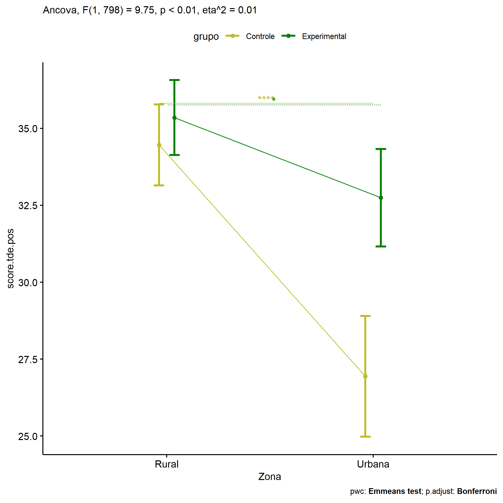<!-- -->

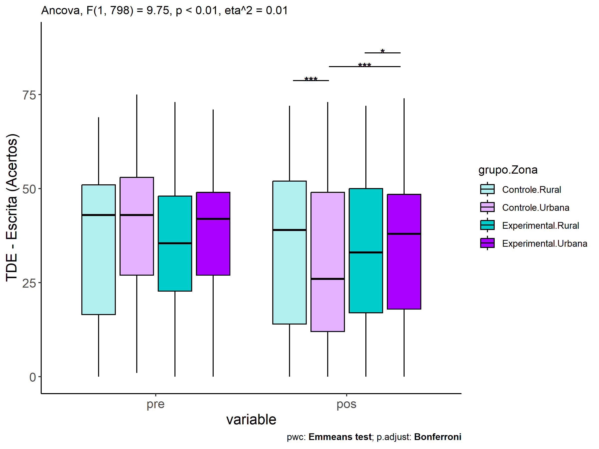<!-- -->

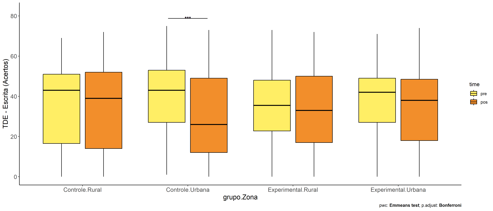<!-- -->

### factores: **grupo:Cor.Raca**

| var           | grupo        | Cor.Raca |   n | M (pre) | SE (pre) | M (unadj) | SE (unadj) | M (adj) | SE (adj) |
|:--------------|:-------------|:---------|----:|--------:|---------:|----------:|-----------:|--------:|---------:|
| score.tde.pos | Controle     | Branca   |  50 |  41.460 |    2.396 |    34.300 |      2.902 |  29.123 |    1.619 |
| score.tde.pos | Controle     | Indígena |  11 |  42.000 |    5.215 |    45.636 |      6.009 |  39.964 |    3.439 |
| score.tde.pos | Controle     | Parda    | 162 |  36.741 |    1.485 |    32.463 |      1.634 |  31.613 |    0.895 |
| score.tde.pos | Experimental | Branca   |  61 |  34.623 |    2.526 |    33.311 |      2.713 |  34.404 |    1.459 |
| score.tde.pos | Experimental | Indígena |  15 |  27.067 |    4.406 |    30.333 |      4.574 |  38.355 |    2.952 |
| score.tde.pos | Experimental | Parda    | 190 |  34.253 |    1.272 |    32.447 |      1.412 |  33.879 |    0.828 |

| .y.           | grupo        | Cor.Raca | group1   | group2       | estimate | conf.low | conf.high |    se | statistic |     p | p.adj | p.adj.signif |
|:--------------|:-------------|:---------|:---------|:-------------|---------:|---------:|----------:|------:|----------:|------:|------:|:-------------|
| score.tde.pos |              | Branca   | Controle | Experimental |   -5.281 |   -9.569 |    -0.994 | 2.182 |    -2.420 | 0.016 | 0.016 | \*           |
| score.tde.pos |              | Indígena | Controle | Experimental |    1.609 |   -7.316 |    10.534 | 4.542 |     0.354 | 0.723 | 0.723 | ns           |
| score.tde.pos |              | Parda    | Controle | Experimental |   -2.266 |   -4.664 |     0.132 | 1.220 |    -1.857 | 0.064 | 0.064 | ns           |
| score.tde.pre |              | Branca   | Controle | Experimental |    6.837 |    0.012 |    13.662 | 3.473 |     1.968 | 0.050 | 0.050 | \*           |
| score.tde.pre |              | Indígena | Controle | Experimental |   14.933 |    0.732 |    29.135 | 7.228 |     2.066 | 0.039 | 0.039 | \*           |
| score.tde.pre |              | Parda    | Controle | Experimental |    2.488 |   -1.338 |     6.314 | 1.947 |     1.278 | 0.202 | 0.202 | ns           |
| score.tde.pos | Controle     |          | Branca   | Indígena     |  -10.841 |  -18.296 |    -3.386 | 3.794 |    -2.857 | 0.004 | 0.013 | \*           |
| score.tde.pos | Controle     |          | Branca   | Parda        |   -2.491 |   -6.122 |     1.141 | 1.848 |    -1.348 | 0.178 | 0.535 | ns           |
| score.tde.pos | Controle     |          | Indígena | Parda        |    8.351 |    1.370 |    15.332 | 3.553 |     2.350 | 0.019 | 0.057 | ns           |
| score.tde.pos | Experimental |          | Branca   | Indígena     |   -3.951 |  -10.416 |     2.514 | 3.290 |    -1.201 | 0.230 | 0.691 | ns           |
| score.tde.pos | Experimental |          | Branca   | Parda        |    0.525 |   -2.770 |     3.819 | 1.677 |     0.313 | 0.755 | 1.000 | ns           |
| score.tde.pos | Experimental |          | Indígena | Parda        |    4.475 |   -1.542 |    10.493 | 3.062 |     1.461 | 0.145 | 0.434 | ns           |
| score.tde.pre | Controle     |          | Branca   | Indígena     |   -0.540 |  -12.454 |    11.374 | 6.064 |    -0.089 | 0.929 | 1.000 | ns           |
| score.tde.pre | Controle     |          | Branca   | Parda        |    4.719 |   -1.069 |    10.507 | 2.946 |     1.602 | 0.110 | 0.329 | ns           |
| score.tde.pre | Controle     |          | Indígena | Parda        |    5.259 |   -5.888 |    16.406 | 5.673 |     0.927 | 0.354 | 1.000 | ns           |
| score.tde.pre | Experimental |          | Branca   | Indígena     |    7.556 |   -2.754 |    17.867 | 5.247 |     1.440 | 0.151 | 0.452 | ns           |
| score.tde.pre | Experimental |          | Branca   | Parda        |    0.370 |   -4.895 |     5.635 | 2.679 |     0.138 | 0.890 | 1.000 | ns           |
| score.tde.pre | Experimental |          | Indígena | Parda        |   -7.186 |  -16.781 |     2.409 | 4.883 |    -1.472 | 0.142 | 0.425 | ns           |

| .y.       | grupo        | Cor.Raca | group1 | group2 | estimate | conf.low | conf.high |    se | statistic |     p | p.adj | p.adj.signif |
|:----------|:-------------|:---------|:-------|:-------|---------:|---------:|----------:|------:|----------:|------:|------:|:-------------|
| score.tde | Controle     | Branca   | pre    | pos    |    7.160 |   -0.389 |    14.709 | 3.847 |     1.861 | 0.063 | 0.063 | ns           |
| score.tde | Controle     | Indígena | pre    | pos    |   -3.636 |  -19.730 |    12.457 | 8.201 |    -0.443 | 0.658 | 0.658 | ns           |
| score.tde | Controle     | Parda    | pre    | pos    |    4.278 |    0.084 |     8.471 | 2.137 |     2.002 | 0.046 | 0.046 | \*           |
| score.tde | Experimental | Branca   | pre    | pos    |    1.311 |   -5.523 |     8.146 | 3.483 |     0.377 | 0.707 | 0.707 | ns           |
| score.tde | Experimental | Indígena | pre    | pos    |   -3.267 |  -17.048 |    10.515 | 7.023 |    -0.465 | 0.642 | 0.642 | ns           |
| score.tde | Experimental | Parda    | pre    | pos    |    1.805 |   -2.067 |     5.678 | 1.973 |     0.915 | 0.360 | 0.360 | ns           |

    ## Scale for colour is already present.
    ## Adding another scale for colour, which will replace the existing scale.

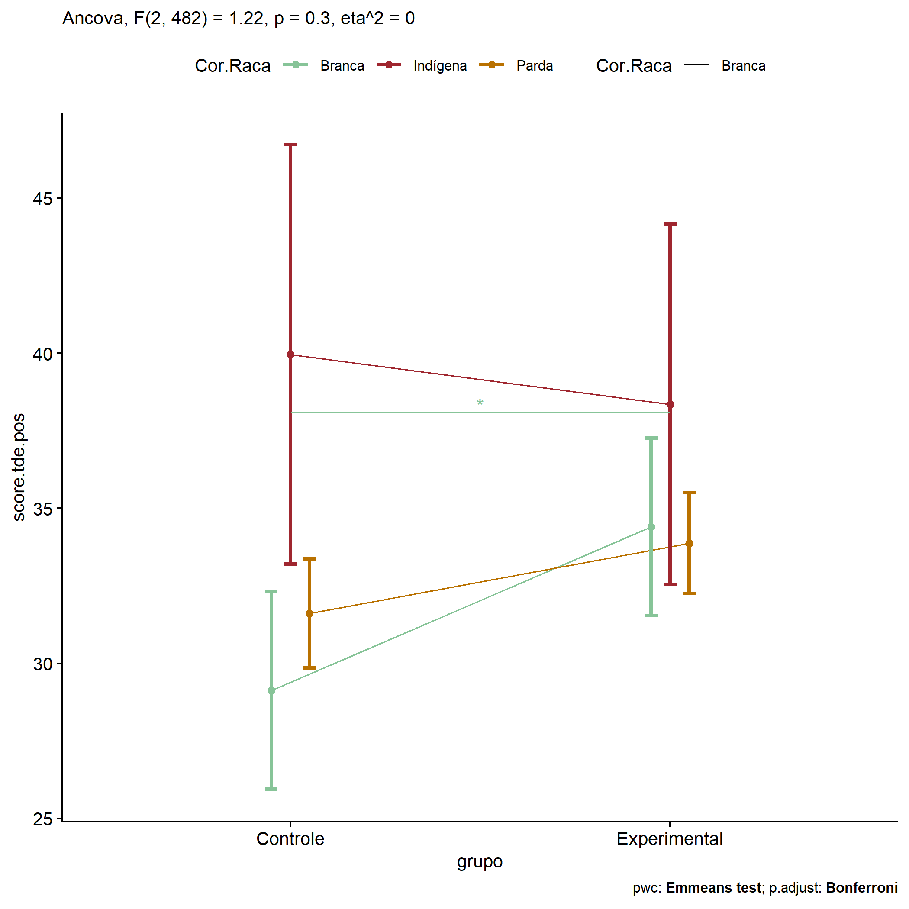<!-- -->

    ## Scale for colour is already present.
    ## Adding another scale for colour, which will replace the existing scale.

<!-- -->

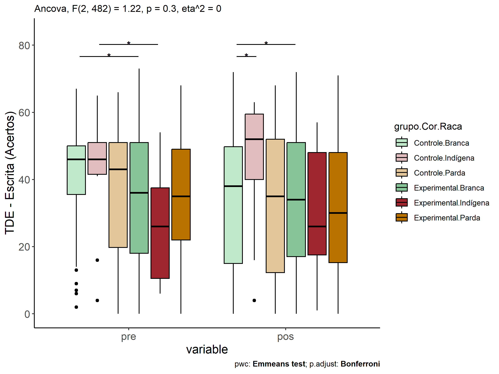<!-- -->

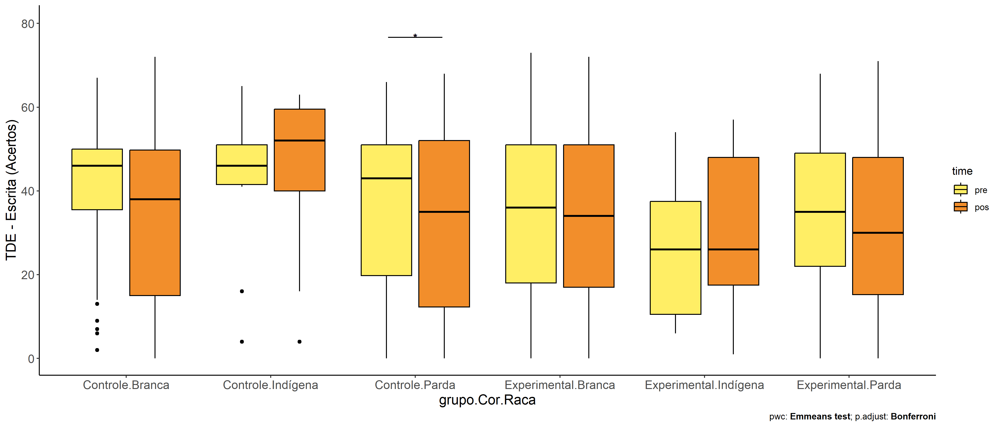<!-- -->

### factores: **grupo:score.tde.quintile**

| var           | grupo        | score.tde.quintile |   n | M (pre) | SE (pre) | M (unadj) | SE (unadj) | M (adj) | SE (adj) |
|:--------------|:-------------|:-------------------|----:|--------:|---------:|----------:|-----------:|--------:|---------:|
| score.tde.pos | Controle     | 1st quintile       | 113 |   9.230 |    0.523 |     8.522 |      0.808 |  37.046 |    2.325 |
| score.tde.pos | Controle     | 2nd quintile       |  59 |  24.542 |    0.492 |    19.966 |      1.686 |  32.835 |    1.666 |
| score.tde.pos | Controle     | 3rd quintile       |  54 |  38.815 |    0.409 |    30.185 |      2.082 |  28.463 |    1.437 |
| score.tde.pos | Controle     | 4th quintile       | 135 |  47.370 |    0.222 |    43.215 |      0.978 |  32.746 |    1.190 |
| score.tde.pos | Controle     | 5th quintile       | 124 |  58.621 |    0.482 |    54.806 |      0.979 |  32.835 |    1.876 |
| score.tde.pos | Experimental | 1st quintile       | 112 |   9.777 |    0.515 |    11.384 |      0.898 |  39.349 |    2.290 |
| score.tde.pos | Experimental | 2nd quintile       | 117 |  25.855 |    0.316 |    24.675 |      1.128 |  36.203 |    1.292 |
| score.tde.pos | Experimental | 3rd quintile       | 141 |  37.383 |    0.268 |    34.872 |      1.096 |  34.614 |    0.886 |
| score.tde.pos | Experimental | 4th quintile       | 132 |  46.697 |    0.217 |    45.030 |      0.924 |  35.250 |    1.166 |
| score.tde.pos | Experimental | 5th quintile       | 134 |  58.336 |    0.434 |    55.791 |      0.917 |  34.111 |    1.839 |

| .y.           | grupo        | score.tde.quintile | group1       | group2       | estimate | conf.low | conf.high |    se | statistic | p       | p.adj   | p.adj.signif |
|:--------------|:-------------|:-------------------|:-------------|:-------------|---------:|---------:|----------:|------:|----------:|:--------|:--------|:-------------|
| score.tde.pos |              | 1st quintile       | Controle     | Experimental |   -2.303 |   -5.055 |     0.450 | 1.403 |    -1.642 | 0.101   | 0.101   | ns           |
| score.tde.pos |              | 2nd quintile       | Controle     | Experimental |   -3.367 |   -6.668 |    -0.067 | 1.682 |    -2.002 | 0.046   | 0.046   | \*           |
| score.tde.pos |              | 3rd quintile       | Controle     | Experimental |   -6.151 |   -9.460 |    -2.842 | 1.686 |    -3.647 | \<0.001 | \<0.001 | \*\*\*       |
| score.tde.pos |              | 4th quintile       | Controle     | Experimental |   -2.504 |   -5.032 |     0.024 | 1.288 |    -1.944 | 0.052   | 0.052   | ns           |
| score.tde.pos |              | 5th quintile       | Controle     | Experimental |   -1.276 |   -3.848 |     1.295 | 1.311 |    -0.974 | 0.33    | 0.33    | ns           |
| score.tde.pre |              | 1st quintile       | Controle     | Experimental |   -0.547 |   -1.641 |     0.548 | 0.558 |    -0.980 | 0.327   | 0.327   | ns           |
| score.tde.pre |              | 2nd quintile       | Controle     | Experimental |   -1.312 |   -2.623 |    -0.002 | 0.668 |    -1.965 | 0.05    | 0.05    | \*           |
| score.tde.pre |              | 3rd quintile       | Controle     | Experimental |    1.432 |    0.118 |     2.745 | 0.669 |     2.139 | 0.033   | 0.033   | \*           |
| score.tde.pre |              | 4th quintile       | Controle     | Experimental |    0.673 |   -0.331 |     1.678 | 0.512 |     1.315 | 0.189   | 0.189   | ns           |
| score.tde.pre |              | 5th quintile       | Controle     | Experimental |    0.285 |   -0.738 |     1.308 | 0.521 |     0.547 | 0.584   | 0.584   | ns           |
| score.tde.pos | Controle     |                    | 1st quintile | 2nd quintile |    4.211 |    0.196 |     8.225 | 2.046 |     2.058 | 0.04    | 0.398   | ns           |
| score.tde.pos | Controle     |                    | 1st quintile | 3rd quintile |    8.583 |    3.031 |    14.134 | 2.829 |     3.034 | 0.002   | 0.025   | \*           |
| score.tde.pos | Controle     |                    | 1st quintile | 4th quintile |    4.300 |   -1.927 |    10.527 | 3.174 |     1.355 | 0.176   | 1       | ns           |
| score.tde.pos | Controle     |                    | 1st quintile | 5th quintile |    4.211 |   -3.575 |    11.997 | 3.968 |     1.061 | 0.289   | 1       | ns           |
| score.tde.pos | Controle     |                    | 2nd quintile | 3rd quintile |    4.372 |   -0.050 |     8.795 | 2.254 |     1.940 | 0.053   | 0.527   | ns           |
| score.tde.pos | Controle     |                    | 2nd quintile | 4th quintile |    0.090 |   -4.578 |     4.757 | 2.379 |     0.038 | 0.97    | 1       | ns           |
| score.tde.pos | Controle     |                    | 2nd quintile | 5th quintile |    0.000 |   -6.007 |     6.007 | 3.061 |     0.000 | 1       | 1       | ns           |
| score.tde.pos | Controle     |                    | 3rd quintile | 4th quintile |   -4.283 |   -7.838 |    -0.727 | 1.812 |    -2.364 | 0.018   | 0.183   | ns           |
| score.tde.pos | Controle     |                    | 3rd quintile | 5th quintile |   -4.372 |   -8.834 |     0.090 | 2.274 |    -1.923 | 0.055   | 0.548   | ns           |
| score.tde.pos | Controle     |                    | 4th quintile | 5th quintile |   -0.090 |   -3.149 |     2.970 | 1.559 |    -0.057 | 0.954   | 1       | ns           |
| score.tde.pos | Experimental |                    | 1st quintile | 2nd quintile |    3.146 |   -0.474 |     6.766 | 1.845 |     1.705 | 0.088   | 0.884   | ns           |
| score.tde.pos | Experimental |                    | 1st quintile | 3rd quintile |    4.735 |   -0.114 |     9.584 | 2.471 |     1.916 | 0.056   | 0.556   | ns           |
| score.tde.pos | Experimental |                    | 1st quintile | 4th quintile |    4.099 |   -1.974 |    10.172 | 3.095 |     1.324 | 0.186   | 1       | ns           |
| score.tde.pos | Experimental |                    | 1st quintile | 5th quintile |    5.237 |   -2.419 |    12.893 | 3.902 |     1.342 | 0.18    | 1       | ns           |
| score.tde.pos | Experimental |                    | 2nd quintile | 3rd quintile |    1.589 |   -1.505 |     4.682 | 1.577 |     1.008 | 0.314   | 1       | ns           |
| score.tde.pos | Experimental |                    | 2nd quintile | 4th quintile |    0.953 |   -3.094 |     5.000 | 2.063 |     0.462 | 0.644   | 1       | ns           |
| score.tde.pos | Experimental |                    | 2nd quintile | 5th quintile |    2.091 |   -3.379 |     7.561 | 2.788 |     0.750 | 0.453   | 1       | ns           |
| score.tde.pos | Experimental |                    | 3rd quintile | 4th quintile |   -0.636 |   -3.490 |     2.218 | 1.455 |    -0.437 | 0.662   | 1       | ns           |
| score.tde.pos | Experimental |                    | 3rd quintile | 5th quintile |    0.502 |   -3.474 |     4.479 | 2.027 |     0.248 | 0.804   | 1       | ns           |
| score.tde.pos | Experimental |                    | 4th quintile | 5th quintile |    1.138 |   -1.923 |     4.199 | 1.560 |     0.730 | 0.466   | 1       | ns           |
| score.tde.pre | Controle     |                    | 1st quintile | 2nd quintile |  -15.312 |  -16.631 |   -13.994 | 0.672 |   -22.789 | \<0.001 | \<0.001 | \*\*\*\*     |
| score.tde.pre | Controle     |                    | 1st quintile | 3rd quintile |  -29.585 |  -30.943 |   -28.227 | 0.692 |   -42.749 | \<0.001 | \<0.001 | \*\*\*\*     |
| score.tde.pre | Controle     |                    | 1st quintile | 4th quintile |  -38.140 |  -39.187 |   -37.094 | 0.533 |   -71.506 | \<0.001 | \<0.001 | \*\*\*\*     |
| score.tde.pre | Controle     |                    | 1st quintile | 5th quintile |  -49.391 |  -50.458 |   -48.323 | 0.544 |   -90.783 | \<0.001 | \<0.001 | \*\*\*\*     |
| score.tde.pre | Controle     |                    | 2nd quintile | 3rd quintile |  -14.272 |  -15.818 |   -12.727 | 0.788 |   -18.116 | \<0.001 | \<0.001 | \*\*\*\*     |
| score.tde.pre | Controle     |                    | 2nd quintile | 4th quintile |  -22.828 |  -24.109 |   -21.547 | 0.653 |   -34.966 | \<0.001 | \<0.001 | \*\*\*\*     |
| score.tde.pre | Controle     |                    | 2nd quintile | 5th quintile |  -34.079 |  -35.377 |   -32.780 | 0.662 |   -51.508 | \<0.001 | \<0.001 | \*\*\*\*     |
| score.tde.pre | Controle     |                    | 3rd quintile | 4th quintile |   -8.556 |   -9.877 |    -7.234 | 0.674 |   -12.702 | \<0.001 | \<0.001 | \*\*\*\*     |
| score.tde.pre | Controle     |                    | 3rd quintile | 5th quintile |  -19.806 |  -21.144 |   -18.468 | 0.682 |   -29.039 | \<0.001 | \<0.001 | \*\*\*\*     |
| score.tde.pre | Controle     |                    | 4th quintile | 5th quintile |  -11.251 |  -12.272 |   -10.230 | 0.520 |   -21.621 | \<0.001 | \<0.001 | \*\*\*\*     |
| score.tde.pre | Experimental |                    | 1st quintile | 2nd quintile |  -16.078 |  -17.163 |   -14.993 | 0.553 |   -29.073 | \<0.001 | \<0.001 | \*\*\*\*     |
| score.tde.pre | Experimental |                    | 1st quintile | 3rd quintile |  -27.606 |  -28.645 |   -26.567 | 0.529 |   -52.137 | \<0.001 | \<0.001 | \*\*\*\*     |
| score.tde.pre | Experimental |                    | 1st quintile | 4th quintile |  -36.920 |  -37.975 |   -35.866 | 0.537 |   -68.698 | \<0.001 | \<0.001 | \*\*\*\*     |
| score.tde.pre | Experimental |                    | 1st quintile | 5th quintile |  -48.559 |  -49.610 |   -47.508 | 0.536 |   -90.666 | \<0.001 | \<0.001 | \*\*\*\*     |
| score.tde.pre | Experimental |                    | 2nd quintile | 3rd quintile |  -11.528 |  -12.555 |   -10.502 | 0.523 |   -22.036 | \<0.001 | \<0.001 | \*\*\*\*     |
| score.tde.pre | Experimental |                    | 2nd quintile | 4th quintile |  -20.842 |  -21.884 |   -19.800 | 0.531 |   -39.238 | \<0.001 | \<0.001 | \*\*\*\*     |
| score.tde.pre | Experimental |                    | 2nd quintile | 5th quintile |  -32.481 |  -33.520 |   -31.443 | 0.529 |   -61.365 | \<0.001 | \<0.001 | \*\*\*\*     |
| score.tde.pre | Experimental |                    | 3rd quintile | 4th quintile |   -9.314 |  -10.308 |    -8.320 | 0.507 |   -18.384 | \<0.001 | \<0.001 | \*\*\*\*     |
| score.tde.pre | Experimental |                    | 3rd quintile | 5th quintile |  -20.953 |  -21.943 |   -19.963 | 0.505 |   -41.516 | \<0.001 | \<0.001 | \*\*\*\*     |
| score.tde.pre | Experimental |                    | 4th quintile | 5th quintile |  -11.639 |  -12.645 |   -10.632 | 0.513 |   -22.688 | \<0.001 | \<0.001 | \*\*\*\*     |

| .y.       | grupo        | score.tde.quintile | group1 | group2 | estimate | conf.low | conf.high |    se | statistic | p       | p.adj   | p.adj.signif |
|:----------|:-------------|:-------------------|:-------|:-------|---------:|---------:|----------:|------:|----------:|:--------|:--------|:-------------|
| score.tde | Controle     | 1st quintile       | pre    | pos    |    0.708 |   -1.523 |     2.939 | 1.138 |     0.622 | 0.534   | 0.534   | ns           |
| score.tde | Controle     | 2nd quintile       | pre    | pos    |    4.576 |    1.488 |     7.664 | 1.575 |     2.906 | 0.004   | 0.004   | \*\*         |
| score.tde | Controle     | 3rd quintile       | pre    | pos    |    8.630 |    5.402 |    11.857 | 1.646 |     5.243 | \<0.001 | \<0.001 | \*\*\*\*     |
| score.tde | Controle     | 4th quintile       | pre    | pos    |    4.156 |    2.114 |     6.197 | 1.041 |     3.992 | \<0.001 | \<0.001 | \*\*\*\*     |
| score.tde | Controle     | 5th quintile       | pre    | pos    |    3.815 |    1.685 |     5.944 | 1.086 |     3.512 | \<0.001 | \<0.001 | \*\*\*       |
| score.tde | Experimental | 1st quintile       | pre    | pos    |   -1.607 |   -3.848 |     0.634 | 1.143 |    -1.406 | 0.16    | 0.16    | ns           |
| score.tde | Experimental | 2nd quintile       | pre    | pos    |    1.179 |   -1.013 |     3.372 | 1.118 |     1.055 | 0.292   | 0.292   | ns           |
| score.tde | Experimental | 3rd quintile       | pre    | pos    |    2.511 |    0.513 |     4.508 | 1.019 |     2.465 | 0.014   | 0.014   | \*           |
| score.tde | Experimental | 4th quintile       | pre    | pos    |    1.667 |   -0.398 |     3.731 | 1.053 |     1.583 | 0.114   | 0.114   | ns           |
| score.tde | Experimental | 5th quintile       | pre    | pos    |    2.545 |    0.496 |     4.594 | 1.045 |     2.436 | 0.015   | 0.015   | \*           |

    ## Scale for colour is already present.
    ## Adding another scale for colour, which will replace the existing scale.

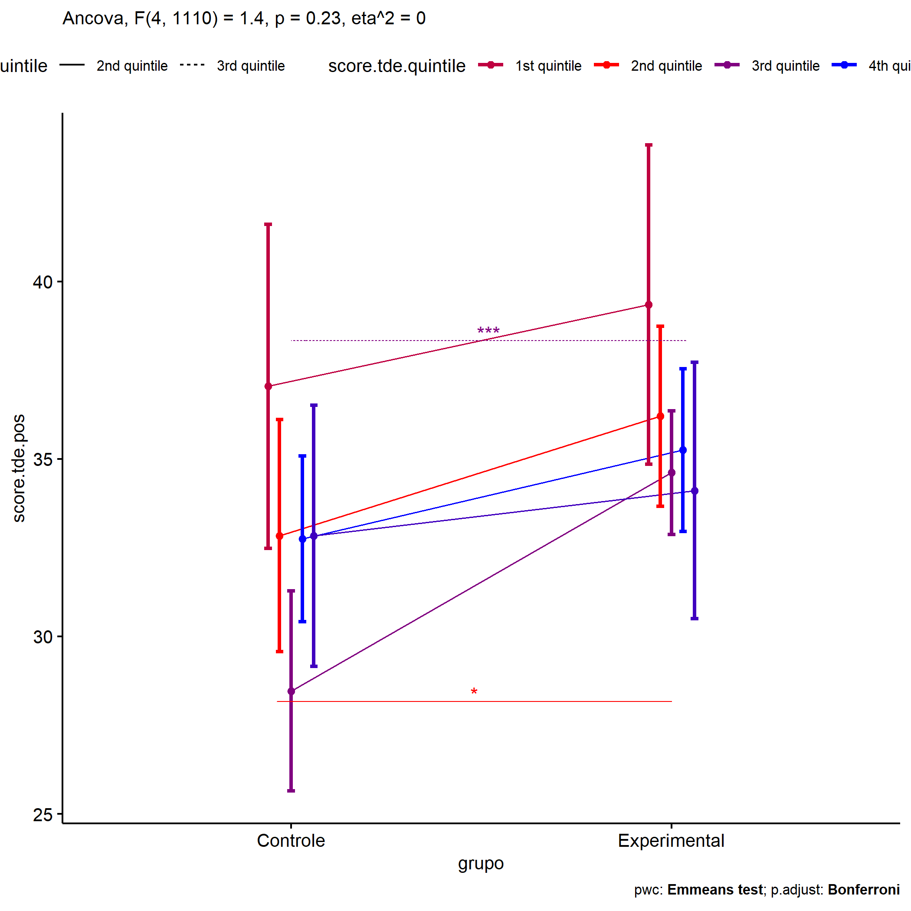<!-- -->

    ## Scale for colour is already present.
    ## Adding another scale for colour, which will replace the existing scale.

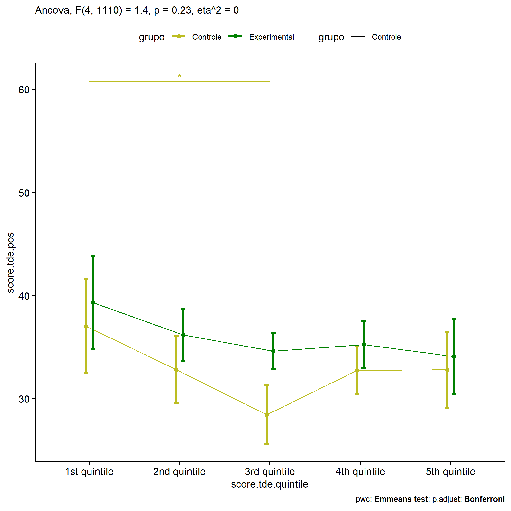<!-- -->

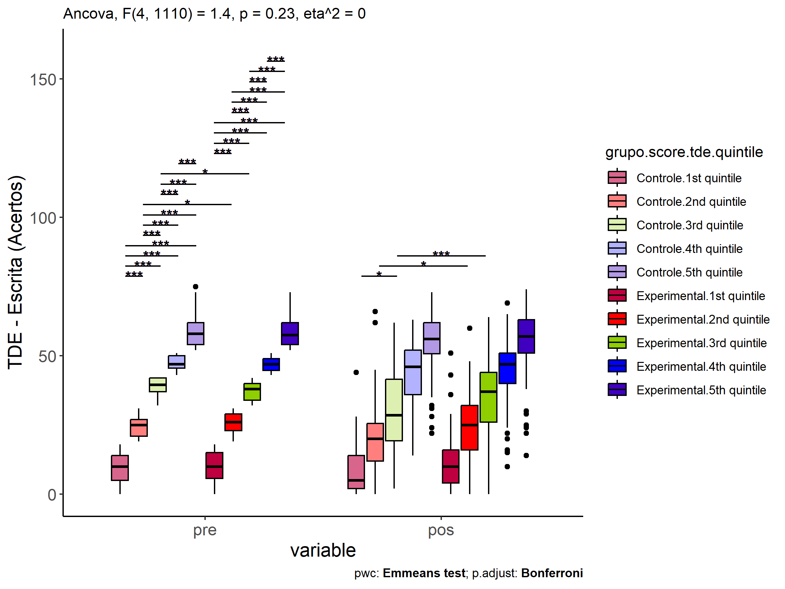<!-- -->

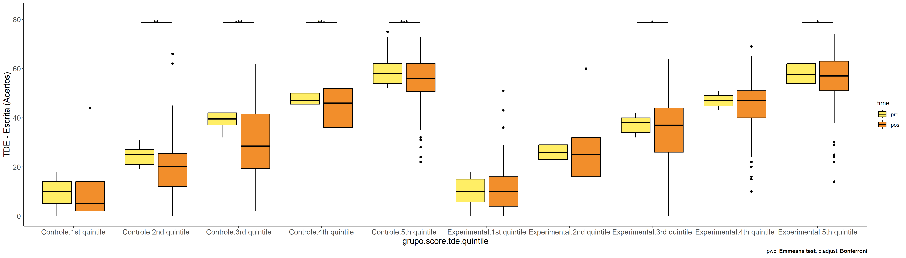<!-- -->
