ANCOVA in Vocabulario (acertos) (Vocabulario (acertos))
================
Geiser C. Challco <geiser@alumni.usp.br>

- [Descriptive Statistics of Initial
  Data](#descriptive-statistics-of-initial-data)
- [Checking of Assumptions](#checking-of-assumptions)
  - [Assumption: Normality distribution of
    data](#assumption-normality-distribution-of-data)
  - [Assumption: Homogeneity of data
    distribution](#assumption-homogeneity-of-data-distribution)
- [Computation of ANCOVA test and Pairwise
  Comparison](#computation-of-ancova-test-and-pairwise-comparison)
  - [ANCOVA tests for one factor](#ancova-tests-for-one-factor)
  - [ANCOVA tests for two factors](#ancova-tests-for-two-factors)
  - [Pairwise comparisons for one factor:
    **grupo**](#pairwise-comparisons-for-one-factor-grupo)
  - [Pairwise comparisons for two
    factors](#pairwise-comparisons-for-two-factors)
    - [factores: **grupo:Sexo**](#factores-gruposexo)
    - [factores: **grupo:Zona**](#factores-grupozona)
    - [factores: **grupo:Cor.Raca**](#factores-grupocorraca)
    - [factores: **grupo:Serie**](#factores-gruposerie)

**NOTE**

- Teste ANCOVA para determinar se houve diferenças significativas no
  Vocabulario (acertos) (medido usando pre- e pos-testes).
- ANCOVA test to determine whether there were significant differences in
  Vocabulario (acertos) (measured using pre- and post-tests).

# Descriptive Statistics of Initial Data

| grupo        | Sexo | Zona   | Cor.Raca | Serie | variable  |   n |   mean | median | min | max |    sd |    se |     ci |   iqr |
|:-------------|:-----|:-------|:---------|:------|:----------|----:|-------:|-------:|----:|----:|------:|------:|-------:|------:|
| Controle     | F    |        |          |       | vocab.pre |  39 | 12.692 |   14.0 |   6 |  16 | 2.993 | 0.479 |  0.970 |  4.00 |
| Controle     | M    |        |          |       | vocab.pre |  63 | 12.317 |   13.0 |   4 |  16 | 2.983 | 0.376 |  0.751 |  4.00 |
| Experimental | F    |        |          |       | vocab.pre |  52 | 12.692 |   13.0 |   1 |  16 | 3.153 | 0.437 |  0.878 |  4.25 |
| Experimental | M    |        |          |       | vocab.pre |  54 | 13.037 |   14.0 |   5 |  16 | 2.774 | 0.378 |  0.757 |  4.00 |
| Controle     | F    |        |          |       | vocab.pos |  39 | 15.974 |   16.0 |   4 |  29 | 5.348 | 0.856 |  1.734 |  6.00 |
| Controle     | M    |        |          |       | vocab.pos |  63 | 14.571 |   15.0 |   2 |  25 | 5.254 | 0.662 |  1.323 |  7.50 |
| Experimental | F    |        |          |       | vocab.pos |  52 | 18.269 |   18.5 |   2 |  33 | 6.604 | 0.916 |  1.839 |  9.50 |
| Experimental | M    |        |          |       | vocab.pos |  54 | 17.389 |   16.0 |   5 |  42 | 7.560 | 1.029 |  2.063 |  9.00 |
| Controle     |      | Rural  |          |       | vocab.pre |  51 | 12.706 |   14.0 |   4 |  16 | 2.962 | 0.415 |  0.833 |  4.00 |
| Controle     |      | Urbana |          |       | vocab.pre |  19 | 12.368 |   12.0 |   6 |  16 | 2.650 | 0.608 |  1.277 |  3.50 |
| Controle     |      |        |          |       | vocab.pre |  32 | 12.125 |   12.0 |   5 |  16 | 3.230 | 0.571 |  1.165 |  4.00 |
| Experimental |      | Rural  |          |       | vocab.pre |  51 | 12.431 |   13.0 |   5 |  16 | 2.900 | 0.406 |  0.816 |  4.00 |
| Experimental |      | Urbana |          |       | vocab.pre |  27 | 13.444 |   15.0 |   1 |  16 | 3.166 | 0.609 |  1.253 |  3.00 |
| Experimental |      |        |          |       | vocab.pre |  28 | 13.107 |   14.0 |   6 |  16 | 2.833 | 0.535 |  1.098 |  5.25 |
| Controle     |      | Rural  |          |       | vocab.pos |  51 | 14.686 |   15.0 |   2 |  26 | 5.652 | 0.791 |  1.590 |  8.00 |
| Controle     |      | Urbana |          |       | vocab.pos |  19 | 14.895 |   14.0 |   7 |  23 | 4.370 | 1.003 |  2.106 |  5.50 |
| Controle     |      |        |          |       | vocab.pos |  32 | 15.906 |   16.5 |   5 |  29 | 5.312 | 0.939 |  1.915 |  5.50 |
| Experimental |      | Rural  |          |       | vocab.pos |  51 | 17.843 |   18.0 |   2 |  42 | 8.088 | 1.133 |  2.275 | 11.00 |
| Experimental |      | Urbana |          |       | vocab.pos |  27 | 17.741 |   16.0 |   9 |  28 | 5.606 | 1.079 |  2.218 |  8.50 |
| Experimental |      |        |          |       | vocab.pos |  28 | 17.857 |   17.0 |   7 |  33 | 6.626 | 1.252 |  2.569 |  7.50 |
| Controle     |      |        | Branca   |       | vocab.pre |   6 | 11.333 |   11.5 |   8 |  15 | 2.582 | 1.054 |  2.710 |  3.25 |
| Controle     |      |        | Indígena |       | vocab.pre |   2 | 15.000 |   15.0 |  15 |  15 | 0.000 | 0.000 |  0.000 |  0.00 |
| Controle     |      |        | Parda    |       | vocab.pre |  36 | 12.861 |   13.0 |   7 |  16 | 2.576 | 0.429 |  0.872 |  3.00 |
| Controle     |      |        |          |       | vocab.pre |  58 | 12.241 |   13.0 |   4 |  16 | 3.246 | 0.426 |  0.854 |  4.00 |
| Experimental |      |        | Branca   |       | vocab.pre |   5 | 14.400 |   15.0 |  12 |  16 | 1.817 | 0.812 |  2.256 |  3.00 |
| Experimental |      |        | Indígena |       | vocab.pre |   7 | 14.286 |   14.0 |  12 |  16 | 1.496 | 0.565 |  1.384 |  2.00 |
| Experimental |      |        | Parda    |       | vocab.pre |  41 | 12.488 |   13.0 |   1 |  16 | 3.370 | 0.526 |  1.064 |  4.00 |
| Experimental |      |        | Preta    |       | vocab.pre |   1 | 10.000 |   10.0 |  10 |  10 |       |       |        |  0.00 |
| Experimental |      |        |          |       | vocab.pre |  52 | 12.885 |   13.0 |   5 |  16 | 2.791 | 0.387 |  0.777 |  4.00 |
| Controle     |      |        | Branca   |       | vocab.pos |   6 | 14.833 |   14.0 |  10 |  20 | 4.708 | 1.922 |  4.941 |  8.25 |
| Controle     |      |        | Indígena |       | vocab.pos |   2 | 19.500 |   19.5 |  18 |  21 | 2.121 | 1.500 | 19.059 |  1.50 |
| Controle     |      |        | Parda    |       | vocab.pos |  36 | 14.167 |   15.0 |   3 |  24 | 5.096 | 0.849 |  1.724 |  5.25 |
| Controle     |      |        |          |       | vocab.pos |  58 | 15.569 |   16.0 |   2 |  29 | 5.522 | 0.725 |  1.452 |  6.75 |
| Experimental |      |        | Branca   |       | vocab.pos |   5 | 15.600 |   16.0 |   9 |  23 | 6.107 | 2.731 |  7.583 | 10.00 |
| Experimental |      |        | Indígena |       | vocab.pos |   7 | 17.143 |   18.0 |  13 |  21 | 3.132 | 1.184 |  2.897 |  4.00 |
| Experimental |      |        | Parda    |       | vocab.pos |  41 | 19.366 |   19.0 |   7 |  42 | 8.018 | 1.252 |  2.531 | 11.00 |
| Experimental |      |        | Preta    |       | vocab.pos |   1 | 13.000 |   13.0 |  13 |  13 |       |       |        |  0.00 |
| Experimental |      |        |          |       | vocab.pos |  52 | 17.000 |   16.0 |   2 |  33 | 6.730 | 0.933 |  1.874 | 10.00 |
| Controle     |      |        |          | 6 ano | vocab.pre |  50 | 12.140 |   12.5 |   4 |  16 | 2.942 | 0.416 |  0.836 |  3.75 |
| Controle     |      |        |          | 7 ano | vocab.pre |  32 | 12.500 |   13.5 |   5 |  16 | 3.059 | 0.541 |  1.103 |  4.00 |
| Controle     |      |        |          | 8 ano | vocab.pre |  13 | 12.308 |   13.0 |   6 |  16 | 3.276 | 0.909 |  1.980 |  4.00 |
| Controle     |      |        |          | 9 ano | vocab.pre |   7 | 14.857 |   15.0 |  13 |  16 | 1.069 | 0.404 |  0.989 |  1.00 |
| Experimental |      |        |          | 6 ano | vocab.pre |  48 | 12.667 |   13.0 |   6 |  16 | 2.747 | 0.396 |  0.798 |  5.25 |
| Experimental |      |        |          | 7 ano | vocab.pre |  30 | 13.533 |   14.0 |   1 |  16 | 3.401 | 0.621 |  1.270 |  3.00 |
| Experimental |      |        |          | 8 ano | vocab.pre |  19 | 11.842 |   12.0 |   6 |  16 | 2.949 | 0.677 |  1.421 |  5.00 |
| Experimental |      |        |          | 9 ano | vocab.pre |   9 | 13.889 |   15.0 |  11 |  16 | 1.833 | 0.611 |  1.409 |  2.00 |
| Controle     |      |        |          | 6 ano | vocab.pos |  50 | 14.200 |   15.0 |   2 |  26 | 4.949 | 0.700 |  1.406 |  6.00 |
| Controle     |      |        |          | 7 ano | vocab.pos |  32 | 16.594 |   16.5 |   7 |  26 | 4.983 | 0.881 |  1.797 |  7.00 |
| Controle     |      |        |          | 8 ano | vocab.pos |  13 | 13.077 |   14.0 |   3 |  25 | 6.034 | 1.674 |  3.646 |  6.00 |
| Controle     |      |        |          | 9 ano | vocab.pos |   7 | 18.571 |   19.0 |  12 |  29 | 5.623 | 2.125 |  5.200 |  5.00 |
| Experimental |      |        |          | 6 ano | vocab.pos |  48 | 17.958 |   16.5 |   2 |  42 | 7.423 | 1.071 |  2.155 |  9.25 |
| Experimental |      |        |          | 7 ano | vocab.pos |  30 | 16.900 |   18.0 |   5 |  29 | 6.326 | 1.155 |  2.362 | 10.00 |
| Experimental |      |        |          | 8 ano | vocab.pos |  19 | 16.947 |   16.0 |   7 |  33 | 6.696 | 1.536 |  3.227 |  8.00 |
| Experimental |      |        |          | 9 ano | vocab.pos |   9 | 22.000 |   21.0 |   8 |  37 | 8.047 | 2.682 |  6.185 |  6.00 |

# Checking of Assumptions

## Assumption: Normality distribution of data

| var       |   n |  skewness |  kurtosis | symmetry | statistic | method     |         p | p.signif | normality |
|:----------|----:|----------:|----------:|:---------|----------:|:-----------|----------:|:---------|:----------|
| vocab.pos | 208 | 0.5538085 | 1.2756135 | NO       | 18.276726 | D’Agostino | 0.0001075 | \*\*     | \-        |
| vocab.pos | 148 | 0.5184680 | 1.2171544 | NO       | 12.813037 | D’Agostino | 0.0016508 | \*       | QQ        |
| vocab.pos |  98 | 0.4899463 | 1.3616815 | YES      |  9.794798 | D’Agostino | 0.0074660 | \*\*     | NO        |
| vocab.pos | 208 | 0.4985281 | 0.9673658 | YES      | 14.197751 | D’Agostino | 0.0008260 | \*\*     | \-        |

## Assumption: Homogeneity of data distribution

| var       | method         | formula                    |   n | DFn.df1 | DFd.df2 | statistic |         p | p.signif |
|:----------|:---------------|:---------------------------|----:|--------:|--------:|----------:|----------:|:---------|
| vocab.pos | Levene’s test  | `.res`~`grupo`\*`Sexo`     | 208 |       3 |     204 |  2.181207 | 0.0913908 | ns       |
| vocab.pos | Anova’s slopes | `.res`~`grupo`\*`Sexo`     | 208 |       3 |     200 |  1.071000 | 0.3630000 | ns       |
| vocab.pos | Levene’s test  | `.res`~`grupo`\*`Zona`     | 148 |       3 |     144 |  2.158921 | 0.0954680 | ns       |
| vocab.pos | Anova’s slopes | `.res`~`grupo`\*`Zona`     | 148 |       3 |     140 |  2.162000 | 0.0950000 | ns       |
| vocab.pos | Levene’s test  | `.res`~`grupo`\*`Cor.Raca` |  98 |       6 |      91 |  1.911939 | 0.0872238 | ns       |
| vocab.pos | Anova’s slopes | `.res`~`grupo`\*`Cor.Raca` |  98 |       4 |      86 |  0.186000 | 0.9450000 | ns       |
| vocab.pos | Levene’s test  | `.res`~`grupo`\*`Serie`    | 208 |       7 |     200 |  1.053657 | 0.3950724 | ns       |
| vocab.pos | Anova’s slopes | `.res`~`grupo`\*`Serie`    | 208 |       7 |     192 |  0.787000 | 0.5990000 | ns       |

# Computation of ANCOVA test and Pairwise Comparison

## ANCOVA tests for one factor

|     | Effect    | DFn | DFd |     SSn |      SSd |      F | p       |   ges | p\<.05 |
|:----|:----------|----:|----:|--------:|---------:|-------:|:--------|------:|:-------|
| 1   | vocab.pre |   1 | 205 | 566.323 | 7553.085 | 15.371 | \<0.001 | 0.070 | \*     |
| 2   | grupo     |   1 | 205 | 319.576 | 7553.085 |  8.674 | 0.004   | 0.041 | \*     |
| 4   | Sexo      |   1 | 205 |  98.734 | 7773.926 |  2.604 | 0.108   | 0.013 |        |
| 6   | Zona      |   1 | 145 |   0.027 | 5873.660 |  0.001 | 0.98    | 0.000 |        |
| 8   | Cor.Raca  |   3 |  93 |  36.470 | 4147.908 |  0.273 | 0.845   | 0.009 |        |
| 10  | Serie     |   3 | 203 | 180.418 | 7692.242 |  1.587 | 0.194   | 0.023 |        |

## ANCOVA tests for two factors

|     | Effect         | DFn | DFd |     SSn |      SSd |      F | p       |   ges | p\<.05 |
|:----|:---------------|----:|----:|--------:|---------:|-------:|:--------|------:|:-------|
| 1   | vocab.pre      |   1 | 203 | 563.191 | 7488.276 | 15.268 | \<0.001 | 0.070 | \*     |
| 4   | grupo:Sexo     |   1 | 203 |   0.184 | 7488.276 |  0.005 | 0.944   | 0.000 |        |
| 8   | grupo:Zona     |   1 | 143 |  10.286 | 5538.494 |  0.266 | 0.607   | 0.002 |        |
| 12  | grupo:Cor.Raca |   2 |  90 | 155.357 | 3582.698 |  1.951 | 0.148   | 0.042 |        |
| 16  | grupo:Serie    |   3 | 199 | 166.499 | 7202.762 |  1.533 | 0.207   | 0.023 |        |

## Pairwise comparisons for one factor: **grupo**

| var       | grupo        |   n | M (pre) | SE (pre) | M (unadj) | SE (unadj) | M (adj) | SE (adj) |
|:----------|:-------------|----:|--------:|---------:|----------:|-----------:|--------:|---------:|
| vocab.pos | Controle     | 102 |  12.461 |    0.295 |    15.108 |      0.526 |  15.224 |    0.602 |
| vocab.pos | Experimental | 106 |  12.868 |    0.287 |    17.821 |      0.688 |  17.709 |    0.590 |

| .y.       | group1   | group2       | estimate | conf.low | conf.high |    se | statistic |     p | p.adj | p.adj.signif |
|:----------|:---------|:-------------|---------:|---------:|----------:|------:|----------:|------:|------:|:-------------|
| vocab.pos | Controle | Experimental |   -2.485 |   -4.149 |    -0.822 | 0.844 |    -2.945 | 0.004 | 0.004 | \*\*         |
| vocab.pre | Controle | Experimental |   -0.407 |   -1.218 |     0.404 | 0.412 |    -0.989 | 0.324 | 0.324 | ns           |

| .y.   | grupo        | group1 | group2 | estimate | conf.low | conf.high |    se | statistic | p       | p.adj   | p.adj.signif |
|:------|:-------------|:-------|:-------|---------:|---------:|----------:|------:|----------:|:--------|:--------|:-------------|
| vocab | Controle     | pre    | pos    |   -2.647 |   -3.999 |    -1.296 | 0.688 |    -3.850 | \<0.001 | \<0.001 | \*\*\*       |
| vocab | Experimental | pre    | pos    |   -4.953 |   -6.279 |    -3.627 | 0.674 |    -7.343 | \<0.001 | \<0.001 | \*\*\*\*     |

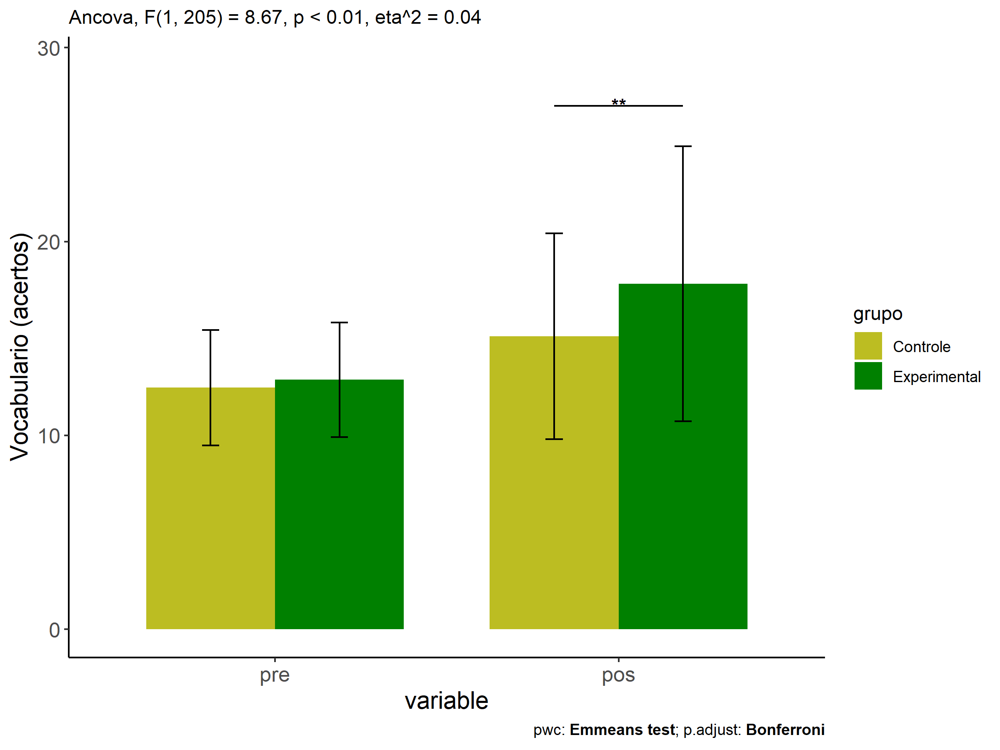<!-- -->

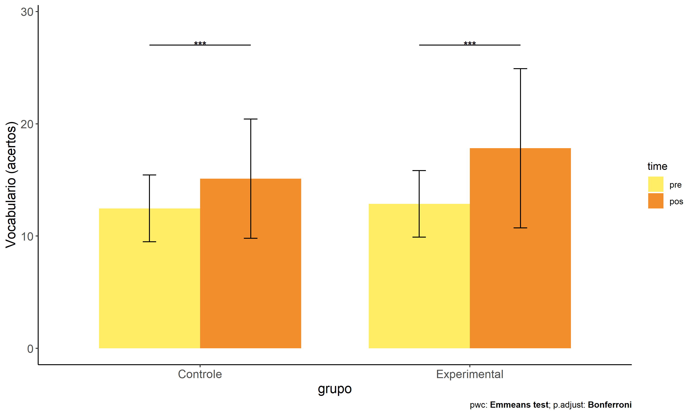<!-- -->

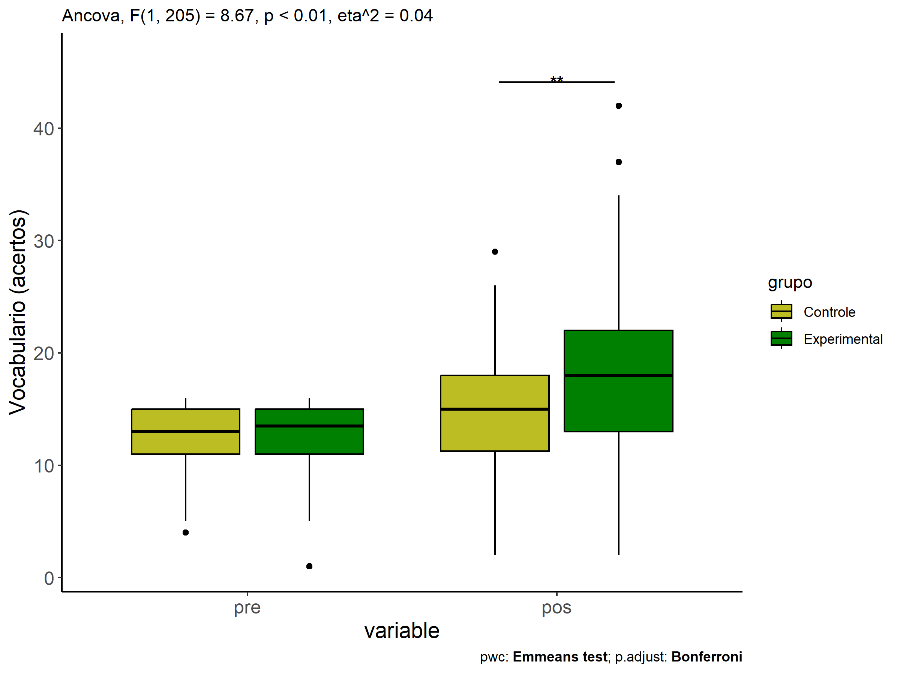<!-- -->

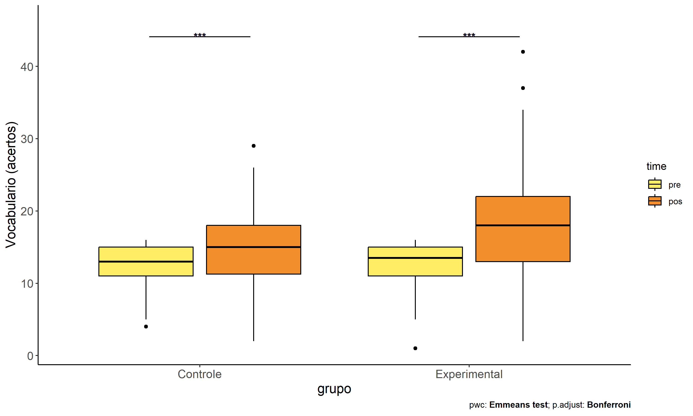<!-- -->

## Pairwise comparisons for two factors

### factores: **grupo:Sexo**

| var       | grupo        | Sexo |   n | M (pre) | SE (pre) | M (unadj) | SE (unadj) | M (adj) | SE (adj) |
|:----------|:-------------|:-----|----:|--------:|---------:|----------:|-----------:|--------:|---------:|
| vocab.pos | Controle     | F    |  39 |  12.692 |    0.479 |    15.974 |      0.856 |  15.961 |    0.973 |
| vocab.pos | Controle     | M    |  63 |  12.317 |    0.376 |    14.571 |      0.662 |  14.767 |    0.767 |
| vocab.pos | Experimental | F    |  52 |  12.692 |    0.437 |    18.269 |      0.916 |  18.256 |    0.842 |
| vocab.pos | Experimental | M    |  54 |  13.037 |    0.378 |    17.389 |      1.029 |  17.183 |    0.828 |

| .y.       | grupo        | Sexo | group1   | group2       | estimate | conf.low | conf.high |    se | statistic |     p | p.adj | p.adj.signif |
|:----------|:-------------|:-----|:---------|:-------------|---------:|---------:|----------:|------:|----------:|------:|------:|:-------------|
| vocab.pos |              | F    | Controle | Experimental |   -2.295 |   -4.832 |     0.242 | 1.287 |    -1.784 | 0.076 | 0.076 | ns           |
| vocab.pos |              | M    | Controle | Experimental |   -2.416 |   -4.646 |    -0.186 | 1.131 |    -2.136 | 0.034 | 0.034 | \*           |
| vocab.pre |              | F    | Controle | Experimental |    0.000 |   -1.243 |     1.243 | 0.630 |     0.000 | 1.000 | 1.000 | ns           |
| vocab.pre |              | M    | Controle | Experimental |   -0.720 |   -1.808 |     0.369 | 0.552 |    -1.304 | 0.194 | 0.194 | ns           |
| vocab.pos | Controle     |      | F        | M            |    1.194 |   -1.249 |     3.636 | 1.239 |     0.964 | 0.336 | 0.336 | ns           |
| vocab.pos | Experimental |      | F        | M            |    1.073 |   -1.256 |     3.402 | 1.181 |     0.908 | 0.365 | 0.365 | ns           |
| vocab.pre | Controle     |      | F        | M            |    0.375 |   -0.821 |     1.570 | 0.606 |     0.618 | 0.537 | 0.537 | ns           |
| vocab.pre | Experimental |      | F        | M            |   -0.345 |   -1.485 |     0.795 | 0.578 |    -0.596 | 0.552 | 0.552 | ns           |

| .y.   | grupo        | Sexo | group1 | group2 | estimate | conf.low | conf.high |    se | statistic | p       | p.adj   | p.adj.signif |
|:------|:-------------|:-----|:-------|:-------|---------:|---------:|----------:|------:|----------:|:--------|:--------|:-------------|
| vocab | Controle     | F    | pre    | pos    |   -3.282 |   -5.470 |    -1.094 | 1.113 |    -2.948 | 0.003   | 0.003   | \*\*         |
| vocab | Controle     | M    | pre    | pos    |   -2.254 |   -3.976 |    -0.532 | 0.876 |    -2.574 | 0.01    | 0.01    | \*           |
| vocab | Experimental | F    | pre    | pos    |   -5.577 |   -7.472 |    -3.682 | 0.964 |    -5.785 | \<0.001 | \<0.001 | \*\*\*\*     |
| vocab | Experimental | M    | pre    | pos    |   -4.352 |   -6.211 |    -2.492 | 0.946 |    -4.600 | \<0.001 | \<0.001 | \*\*\*\*     |

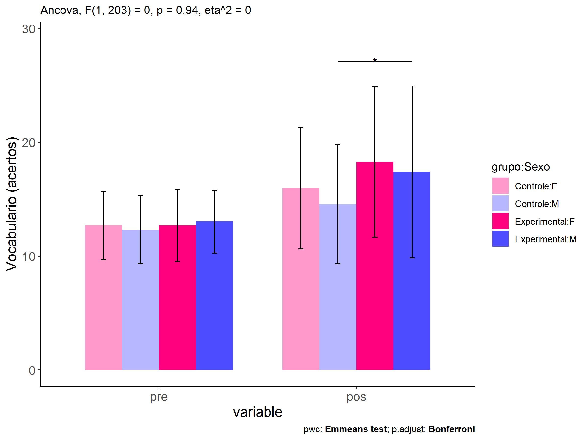<!-- -->

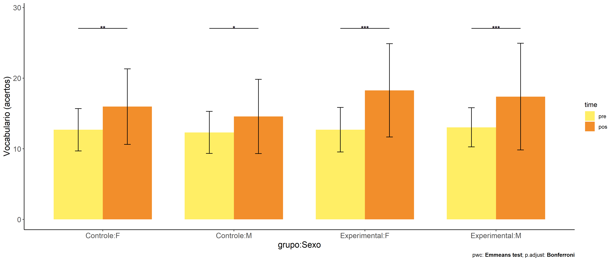<!-- -->

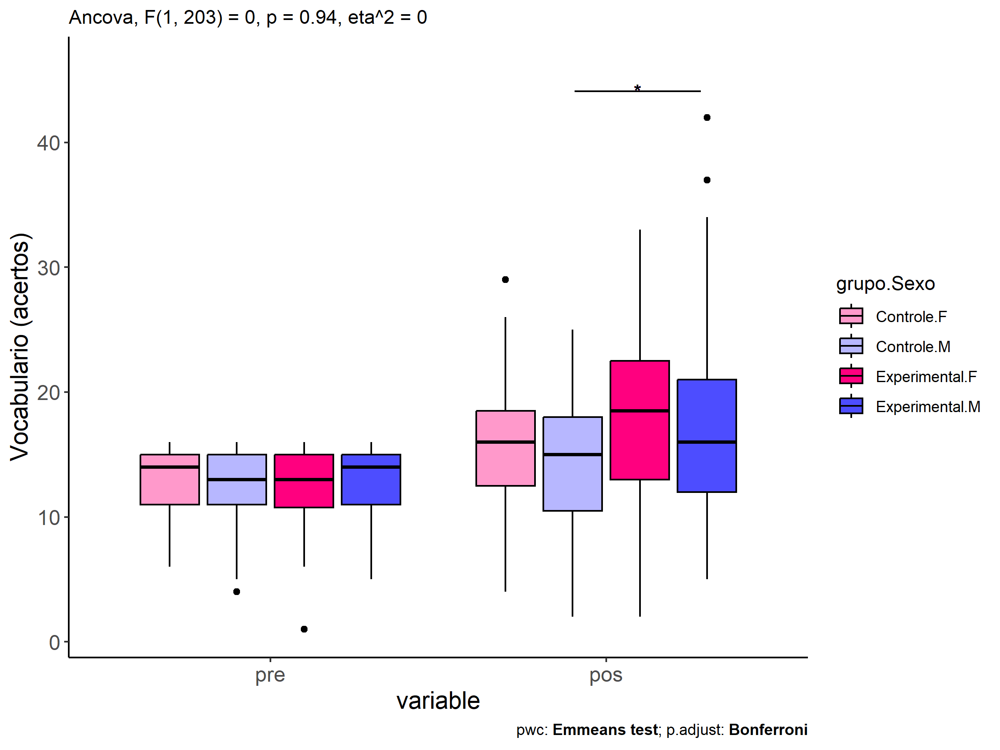<!-- -->

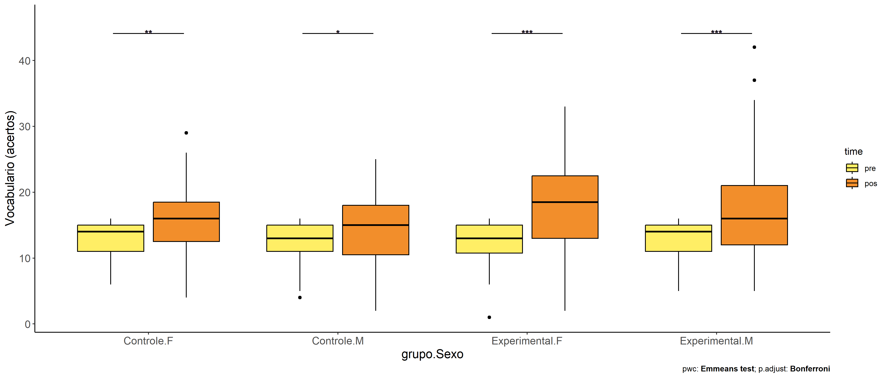<!-- -->

### factores: **grupo:Zona**

| var       | grupo        | Zona   |   n | M (pre) | SE (pre) | M (unadj) | SE (unadj) | M (adj) | SE (adj) |
|:----------|:-------------|:-------|----:|--------:|---------:|----------:|-----------:|--------:|---------:|
| vocab.pos | Controle     | Rural  |  51 |  12.706 |    0.415 |    14.686 |      0.791 |  14.684 |    0.871 |
| vocab.pos | Controle     | Urbana |  19 |  12.368 |    0.608 |    14.895 |      1.003 |  15.104 |    1.429 |
| vocab.pos | Experimental | Rural  |  51 |  12.431 |    0.406 |    17.843 |      1.133 |  18.013 |    0.873 |
| vocab.pos | Experimental | Urbana |  27 |  13.444 |    0.609 |    17.741 |      1.079 |  17.276 |    1.205 |

| .y.       | grupo        | Zona   | group1   | group2       | estimate | conf.low | conf.high |    se | statistic |     p | p.adj | p.adj.signif |
|:----------|:-------------|:-------|:---------|:-------------|---------:|---------:|----------:|------:|----------:|------:|------:|:-------------|
| vocab.pos |              | Rural  | Controle | Experimental |   -3.329 |   -5.767 |    -0.891 | 1.233 |    -2.699 | 0.008 | 0.008 | \*\*         |
| vocab.pos |              | Urbana | Controle | Experimental |   -2.171 |   -5.874 |     1.532 | 1.873 |    -1.159 | 0.248 | 0.248 | ns           |
| vocab.pre |              | Rural  | Controle | Experimental |    0.275 |   -0.877 |     1.426 | 0.583 |     0.471 | 0.638 | 0.638 | ns           |
| vocab.pre |              | Urbana | Controle | Experimental |   -1.076 |   -2.817 |     0.665 | 0.881 |    -1.221 | 0.224 | 0.224 | ns           |
| vocab.pos | Controle     |        | Rural    | Urbana       |   -0.420 |   -3.729 |     2.888 | 1.674 |    -0.251 | 0.802 | 0.802 | ns           |
| vocab.pos | Experimental |        | Rural    | Urbana       |    0.738 |   -2.211 |     3.687 | 1.492 |     0.495 | 0.622 | 0.622 | ns           |
| vocab.pre | Controle     |        | Rural    | Urbana       |    0.337 |   -1.225 |     1.900 | 0.791 |     0.427 | 0.670 | 0.670 | ns           |
| vocab.pre | Experimental |        | Rural    | Urbana       |   -1.013 |   -2.397 |     0.371 | 0.700 |    -1.447 | 0.150 | 0.150 | ns           |

| .y.   | grupo        | Zona   | group1 | group2 | estimate | conf.low | conf.high |    se | statistic | p       | p.adj   | p.adj.signif |
|:------|:-------------|:-------|:-------|:-------|---------:|---------:|----------:|------:|----------:|:--------|:--------|:-------------|
| vocab | Controle     | Rural  | pre    | pos    |   -1.980 |   -3.939 |    -0.021 | 0.995 |    -1.990 | 0.048   | 0.048   | \*           |
| vocab | Controle     | Urbana | pre    | pos    |   -2.526 |   -5.736 |     0.683 | 1.631 |    -1.549 | 0.122   | 0.122   | ns           |
| vocab | Experimental | Rural  | pre    | pos    |   -5.412 |   -7.371 |    -3.453 | 0.995 |    -5.437 | \<0.001 | \<0.001 | \*\*\*\*     |
| vocab | Experimental | Urbana | pre    | pos    |   -4.296 |   -6.989 |    -1.604 | 1.368 |    -3.141 | 0.002   | 0.002   | \*\*         |

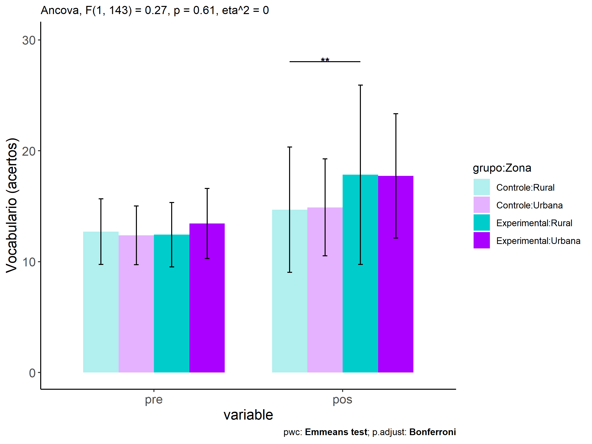<!-- -->

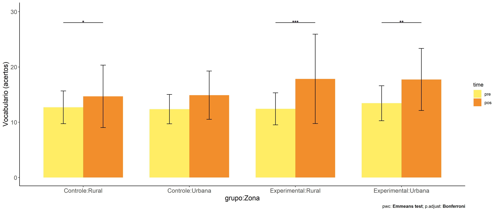<!-- -->

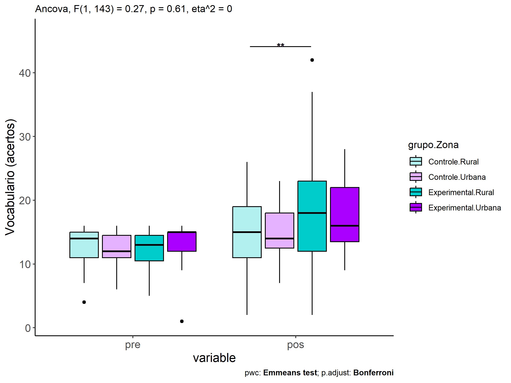<!-- -->

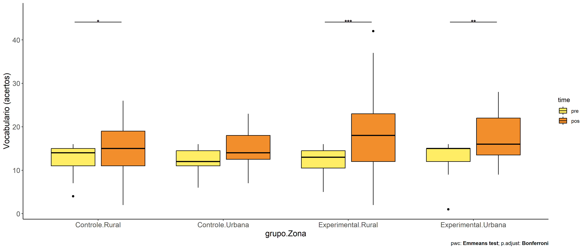<!-- -->

### factores: **grupo:Cor.Raca**

| var       | grupo        | Cor.Raca |   n | M (pre) | SE (pre) | M (unadj) | SE (unadj) | M (adj) | SE (adj) |
|:----------|:-------------|:---------|----:|--------:|---------:|----------:|-----------:|--------:|---------:|
| vocab.pos | Controle     | Branca   |   6 |  11.333 |    1.054 |    14.833 |      1.922 |  15.626 |    2.611 |
| vocab.pos | Controle     | Parda    |  36 |  12.861 |    0.429 |    14.167 |      0.849 |  14.128 |    1.057 |
| vocab.pos | Experimental | Branca   |   5 |  14.400 |    0.812 |    15.600 |      2.731 |  14.723 |    2.860 |
| vocab.pos | Experimental | Indígena |   7 |  14.286 |    0.565 |    17.143 |      1.184 |  16.328 |    2.422 |
| vocab.pos | Experimental | Parda    |  41 |  12.488 |    0.526 |    19.366 |      1.252 |  19.530 |    0.993 |

|     | .y.       | grupo        | Cor.Raca | group1   | group2       | estimate | conf.low | conf.high |    se | statistic | p       | p.adj   | p.adj.signif |
|:----|:----------|:-------------|:---------|:---------|:-------------|---------:|---------:|----------:|------:|----------:|:--------|:--------|:-------------|
| 1   | vocab.pos |              | Branca   | Controle | Experimental |    0.903 |   -6.856 |     8.662 | 3.905 |     0.231 | 0.818   | 0.818   | ns           |
| 3   | vocab.pos |              | Parda    | Controle | Experimental |   -5.402 |   -8.285 |    -2.520 | 1.451 |    -3.724 | \<0.001 | \<0.001 | \*\*\*       |
| 4   | vocab.pre |              | Branca   | Controle | Experimental |   -3.067 |   -6.531 |     0.398 | 1.744 |    -1.758 | 0.082   | 0.082   | ns           |
| 6   | vocab.pre |              | Parda    | Controle | Experimental |    0.373 |   -0.934 |     1.680 | 0.658 |     0.568 | 0.572   | 0.572   | ns           |
| 8   | vocab.pos | Controle     |          | Branca   | Parda        |    1.498 |   -4.102 |     7.098 | 2.818 |     0.532 | 0.596   | 0.596   | ns           |
| 10  | vocab.pos | Experimental |          | Branca   | Indígena     |   -1.605 |   -8.982 |     5.772 | 3.713 |    -0.432 | 0.667   | 1       | ns           |
| 11  | vocab.pos | Experimental |          | Branca   | Parda        |   -4.807 |  -10.840 |     1.226 | 3.036 |    -1.583 | 0.117   | 0.351   | ns           |
| 12  | vocab.pos | Experimental |          | Indígena | Parda        |   -3.202 |   -8.420 |     2.017 | 2.626 |    -1.219 | 0.226   | 0.678   | ns           |
| 14  | vocab.pre | Controle     |          | Branca   | Parda        |   -1.528 |   -4.051 |     0.995 | 1.270 |    -1.203 | 0.232   | 0.232   | ns           |
| 16  | vocab.pre | Experimental |          | Branca   | Indígena     |    0.114 |   -3.236 |     3.465 | 1.686 |     0.068 | 0.946   | 1       | ns           |
| 17  | vocab.pre | Experimental |          | Branca   | Parda        |    1.912 |   -0.798 |     4.623 | 1.364 |     1.402 | 0.164   | 0.493   | ns           |
| 18  | vocab.pre | Experimental |          | Indígena | Parda        |    1.798 |   -0.542 |     4.138 | 1.178 |     1.526 | 0.13    | 0.391   | ns           |

| .y.   | grupo        | Cor.Raca | group1 | group2 | estimate | conf.low | conf.high |    se | statistic | p       | p.adj   | p.adj.signif |
|:------|:-------------|:---------|:-------|:-------|---------:|---------:|----------:|------:|----------:|:--------|:--------|:-------------|
| vocab | Controle     | Branca   | pre    | pos    |   -3.500 |   -9.225 |     2.225 | 2.901 |    -1.206 | 0.229   | 0.229   | ns           |
| vocab | Controle     | Parda    | pre    | pos    |   -1.306 |   -3.643 |     1.032 | 1.185 |    -1.102 | 0.272   | 0.272   | ns           |
| vocab | Experimental | Branca   | pre    | pos    |   -1.200 |   -7.472 |     5.072 | 3.178 |    -0.378 | 0.706   | 0.706   | ns           |
| vocab | Experimental | Indígena | pre    | pos    |   -2.857 |   -8.158 |     2.443 | 2.686 |    -1.064 | 0.289   | 0.289   | ns           |
| vocab | Experimental | Parda    | pre    | pos    |   -6.878 |   -9.068 |    -4.688 | 1.110 |    -6.197 | \<0.001 | \<0.001 | \*\*\*\*     |

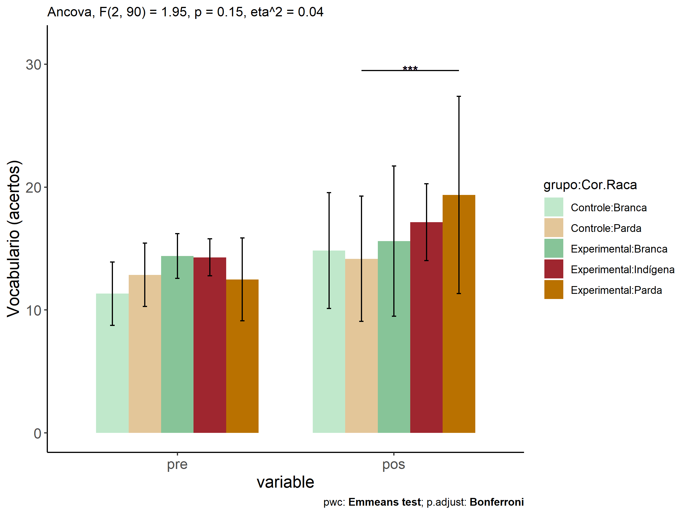<!-- -->

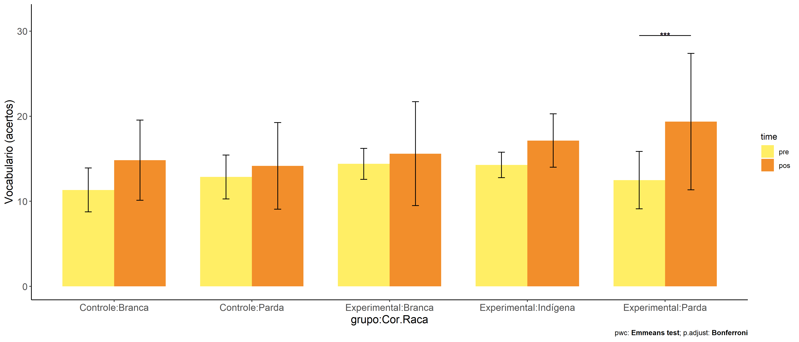<!-- -->

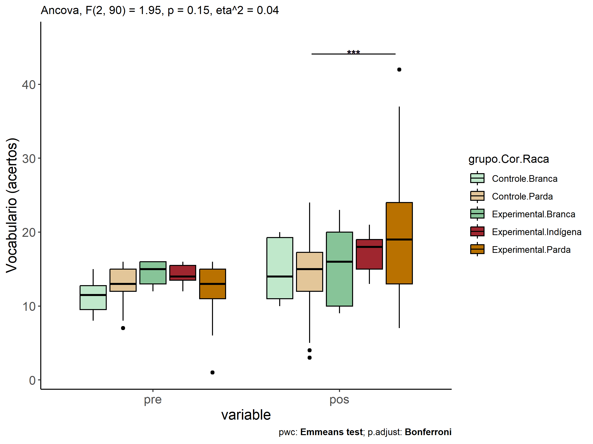<!-- -->

<!-- -->

### factores: **grupo:Serie**

| var       | grupo        | Serie |   n | M (pre) | SE (pre) | M (unadj) | SE (unadj) | M (adj) | SE (adj) |
|:----------|:-------------|:------|----:|--------:|---------:|----------:|-----------:|--------:|---------:|
| vocab.pos | Controle     | 6 ano |  50 |  12.140 |    0.416 |    14.200 |      0.700 |  14.476 |    0.854 |
| vocab.pos | Controle     | 7 ano |  32 |  12.500 |    0.541 |    16.594 |      0.881 |  16.682 |    1.064 |
| vocab.pos | Controle     | 8 ano |  13 |  12.308 |    0.909 |    13.077 |      1.674 |  13.265 |    1.669 |
| vocab.pos | Controle     | 9 ano |   7 |  14.857 |    0.404 |    18.571 |      2.125 |  17.429 |    2.296 |
| vocab.pos | Experimental | 6 ano |  48 |  12.667 |    0.396 |    17.958 |      1.071 |  17.959 |    0.868 |
| vocab.pos | Experimental | 7 ano |  30 |  13.533 |    0.621 |    16.900 |      1.155 |  16.449 |    1.106 |
| vocab.pos | Experimental | 8 ano |  19 |  11.842 |    0.677 |    16.947 |      1.536 |  17.378 |    1.385 |
| vocab.pos | Experimental | 9 ano |   9 |  13.889 |    0.611 |    22.000 |      2.682 |  21.363 |    2.013 |

| .y.       | grupo        | Serie | group1   | group2       | estimate | conf.low | conf.high |    se | statistic |     p | p.adj | p.adj.signif |
|:----------|:-------------|:------|:---------|:-------------|---------:|---------:|----------:|------:|----------:|------:|------:|:-------------|
| vocab.pos |              | 6 ano | Controle | Experimental |   -3.484 |   -5.886 |    -1.081 | 1.218 |    -2.860 | 0.005 | 0.005 | \*\*         |
| vocab.pos |              | 7 ano | Controle | Experimental |    0.233 |   -2.796 |     3.262 | 1.536 |     0.152 | 0.880 | 0.880 | ns           |
| vocab.pos |              | 8 ano | Controle | Experimental |   -4.113 |   -8.386 |     0.159 | 2.167 |    -1.899 | 0.059 | 0.059 | ns           |
| vocab.pos |              | 9 ano | Controle | Experimental |   -3.934 |   -9.919 |     2.051 | 3.035 |    -1.296 | 0.196 | 0.196 | ns           |
| vocab.pre |              | 6 ano | Controle | Experimental |   -0.527 |   -1.696 |     0.643 | 0.593 |    -0.888 | 0.376 | 0.376 | ns           |
| vocab.pre |              | 7 ano | Controle | Experimental |   -1.033 |   -2.504 |     0.438 | 0.746 |    -1.385 | 0.168 | 0.168 | ns           |
| vocab.pre |              | 8 ano | Controle | Experimental |    0.466 |   -1.618 |     2.549 | 1.057 |     0.441 | 0.660 | 0.660 | ns           |
| vocab.pre |              | 9 ano | Controle | Experimental |    0.968 |   -1.949 |     3.885 | 1.479 |     0.655 | 0.514 | 0.514 | ns           |
| vocab.pos | Controle     |       | 6 ano    | 7 ano        |   -2.206 |   -4.894 |     0.482 | 1.363 |    -1.618 | 0.107 | 0.643 | ns           |
| vocab.pos | Controle     |       | 6 ano    | 8 ano        |    1.211 |   -2.483 |     4.904 | 1.873 |     0.646 | 0.519 | 1.000 | ns           |
| vocab.pos | Controle     |       | 6 ano    | 9 ano        |   -2.954 |   -7.804 |     1.897 | 2.460 |    -1.201 | 0.231 | 1.000 | ns           |
| vocab.pos | Controle     |       | 7 ano    | 8 ano        |    3.416 |   -0.486 |     7.319 | 1.979 |     1.726 | 0.086 | 0.515 | ns           |
| vocab.pos | Controle     |       | 7 ano    | 9 ano        |   -0.748 |   -5.744 |     4.248 | 2.533 |    -0.295 | 0.768 | 1.000 | ns           |
| vocab.pos | Controle     |       | 8 ano    | 9 ano        |   -4.164 |   -9.774 |     1.445 | 2.845 |    -1.464 | 0.145 | 0.869 | ns           |
| vocab.pos | Experimental |       | 6 ano    | 7 ano        |    1.511 |   -1.262 |     4.283 | 1.406 |     1.074 | 0.284 | 1.000 | ns           |
| vocab.pos | Experimental |       | 6 ano    | 8 ano        |    0.581 |   -2.643 |     3.805 | 1.635 |     0.355 | 0.723 | 1.000 | ns           |
| vocab.pos | Experimental |       | 6 ano    | 9 ano        |   -3.404 |   -7.727 |     0.920 | 2.193 |    -1.553 | 0.122 | 0.733 | ns           |
| vocab.pos | Experimental |       | 7 ano    | 8 ano        |   -0.930 |   -4.442 |     2.582 | 1.781 |    -0.522 | 0.602 | 1.000 | ns           |
| vocab.pos | Experimental |       | 7 ano    | 9 ano        |   -4.914 |   -9.425 |    -0.404 | 2.287 |    -2.149 | 0.033 | 0.197 | ns           |
| vocab.pos | Experimental |       | 8 ano    | 9 ano        |   -3.985 |   -8.821 |     0.852 | 2.452 |    -1.625 | 0.106 | 0.635 | ns           |
| vocab.pre | Controle     |       | 6 ano    | 7 ano        |   -0.360 |   -1.670 |     0.950 | 0.665 |    -0.542 | 0.589 | 1.000 | ns           |
| vocab.pre | Controle     |       | 6 ano    | 8 ano        |   -0.168 |   -1.970 |     1.634 | 0.914 |    -0.184 | 0.855 | 1.000 | ns           |
| vocab.pre | Controle     |       | 6 ano    | 9 ano        |   -2.717 |   -5.053 |    -0.381 | 1.185 |    -2.294 | 0.023 | 0.137 | ns           |
| vocab.pre | Controle     |       | 7 ano    | 8 ano        |    0.192 |   -1.711 |     2.096 | 0.965 |     0.199 | 0.842 | 1.000 | ns           |
| vocab.pre | Controle     |       | 7 ano    | 9 ano        |   -2.357 |   -4.772 |     0.058 | 1.225 |    -1.925 | 0.056 | 0.334 | ns           |
| vocab.pre | Controle     |       | 8 ano    | 9 ano        |   -2.549 |   -5.263 |     0.164 | 1.376 |    -1.853 | 0.065 | 0.392 | ns           |
| vocab.pre | Experimental |       | 6 ano    | 7 ano        |   -0.867 |   -2.214 |     0.480 | 0.683 |    -1.269 | 0.206 | 1.000 | ns           |
| vocab.pre | Experimental |       | 6 ano    | 8 ano        |    0.825 |   -0.744 |     2.393 | 0.796 |     1.036 | 0.301 | 1.000 | ns           |
| vocab.pre | Experimental |       | 6 ano    | 9 ano        |   -1.222 |   -3.325 |     0.880 | 1.066 |    -1.146 | 0.253 | 1.000 | ns           |
| vocab.pre | Experimental |       | 7 ano    | 8 ano        |    1.691 |   -0.006 |     3.388 | 0.861 |     1.965 | 0.051 | 0.305 | ns           |
| vocab.pre | Experimental |       | 7 ano    | 9 ano        |   -0.356 |   -2.555 |     1.844 | 1.116 |    -0.319 | 0.750 | 1.000 | ns           |
| vocab.pre | Experimental |       | 8 ano    | 9 ano        |   -2.047 |   -4.389 |     0.295 | 1.188 |    -1.723 | 0.086 | 0.518 | ns           |

| .y.   | grupo        | Serie | group1 | group2 | estimate | conf.low | conf.high |    se | statistic | p       | p.adj   | p.adj.signif |
|:------|:-------------|:------|:-------|:-------|---------:|---------:|----------:|------:|----------:|:--------|:--------|:-------------|
| vocab | Controle     | 6 ano | pre    | pos    |   -2.060 |   -3.966 |    -0.154 | 0.969 |    -2.125 | 0.034   | 0.034   | \*           |
| vocab | Controle     | 7 ano | pre    | pos    |   -4.094 |   -6.476 |    -1.712 | 1.212 |    -3.379 | \<0.001 | \<0.001 | \*\*\*       |
| vocab | Controle     | 8 ano | pre    | pos    |   -0.769 |   -4.506 |     2.968 | 1.901 |    -0.405 | 0.686   | 0.686   | ns           |
| vocab | Controle     | 9 ano | pre    | pos    |   -3.714 |   -8.807 |     1.378 | 2.591 |    -1.434 | 0.152   | 0.152   | ns           |
| vocab | Experimental | 6 ano | pre    | pos    |   -5.292 |   -7.236 |    -3.347 | 0.989 |    -5.349 | \<0.001 | \<0.001 | \*\*\*\*     |
| vocab | Experimental | 7 ano | pre    | pos    |   -3.367 |   -5.827 |    -0.907 | 1.251 |    -2.690 | 0.007   | 0.007   | \*\*         |
| vocab | Experimental | 8 ano | pre    | pos    |   -5.105 |   -8.196 |    -2.014 | 1.572 |    -3.247 | 0.001   | 0.001   | \*\*         |
| vocab | Experimental | 9 ano | pre    | pos    |   -8.111 |  -12.602 |    -3.620 | 2.285 |    -3.550 | \<0.001 | \<0.001 | \*\*\*       |

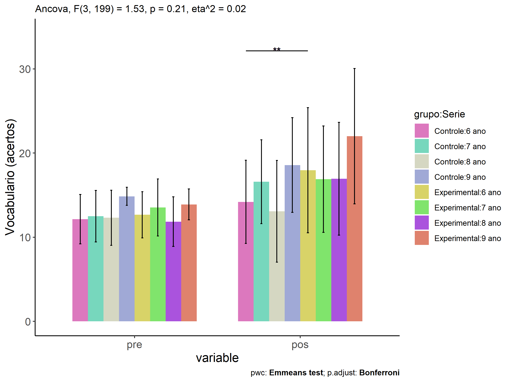<!-- -->

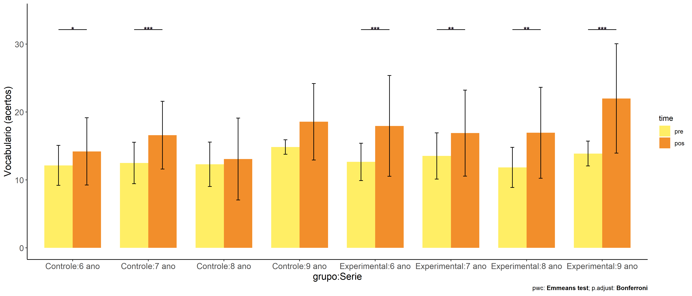<!-- -->

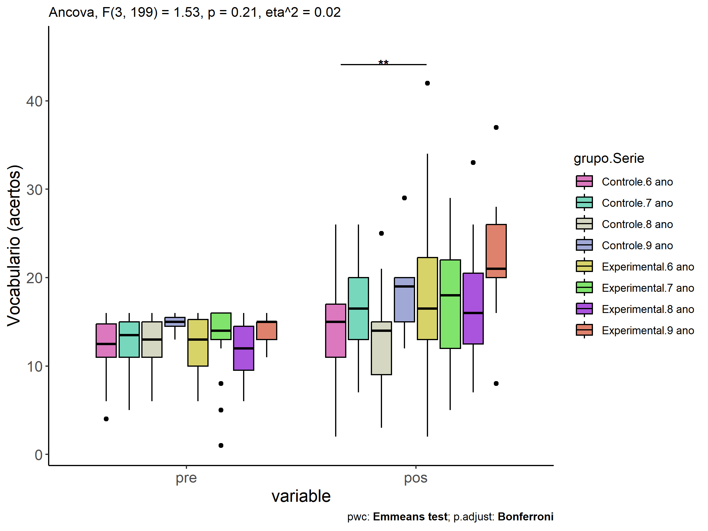<!-- -->

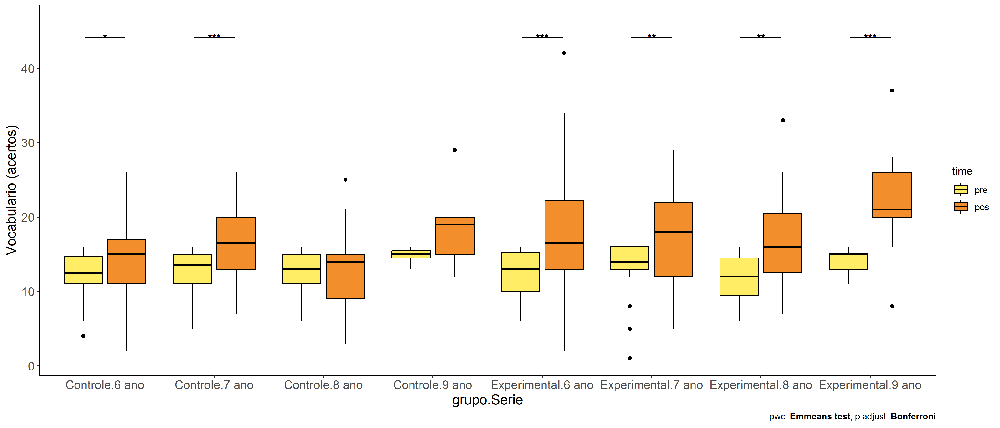<!-- -->
