ANCOVA in Vocabulario (acertos) (Vocabulario (acertos))
================
Geiser C. Challco <geiser@alumni.usp.br>

- [Descriptive Statistics of Initial
  Data](#descriptive-statistics-of-initial-data)
- [Checking of Assumptions](#checking-of-assumptions)
  - [Assumption: Normality distribution of
    data](#assumption-normality-distribution-of-data)
  - [Assumption: Homogeneity of data
    distribution](#assumption-homogeneity-of-data-distribution)
- [Computation of ANCOVA test and Pairwise
  Comparison](#computation-of-ancova-test-and-pairwise-comparison)
  - [ANCOVA tests for one factor](#ancova-tests-for-one-factor)
  - [ANCOVA tests for two factors](#ancova-tests-for-two-factors)
  - [Pairwise comparisons for one factor:
    **grupo**](#pairwise-comparisons-for-one-factor-grupo)
  - [Pairwise comparisons for two
    factors](#pairwise-comparisons-for-two-factors)
    - [factores: **grupo:Sexo**](#factores-gruposexo)
    - [factores: **grupo:Zona**](#factores-grupozona)
    - [factores: **grupo:Cor.Raca**](#factores-grupocorraca)
    - [factores: **grupo:Serie**](#factores-gruposerie)

**NOTE**

- Teste ANCOVA para determinar se houve diferenças significativas no
  Vocabulario (acertos) (medido usando pre- e pos-testes).
- ANCOVA test to determine whether there were significant differences in
  Vocabulario (acertos) (measured using pre- and post-tests).

# Descriptive Statistics of Initial Data

| grupo        | Sexo | Zona   | Cor.Raca | Serie | variable  |   n |   mean | median | min | max |    sd |    se |    ci |   iqr |
|:-------------|:-----|:-------|:---------|:------|:----------|----:|-------:|-------:|----:|----:|------:|------:|------:|------:|
| Controle     | F    |        |          |       | vocab.pre |  77 | 26.169 |   26.0 |  23 |  29 | 1.860 | 0.212 | 0.422 |  3.00 |
| Controle     | M    |        |          |       | vocab.pre |  52 | 25.558 |   25.0 |  23 |  29 | 1.904 | 0.264 | 0.530 |  3.00 |
| Experimental | F    |        |          |       | vocab.pre |  98 | 26.265 |   27.0 |  23 |  29 | 1.966 | 0.199 | 0.394 |  3.00 |
| Experimental | M    |        |          |       | vocab.pre |  84 | 26.167 |   26.0 |  23 |  29 | 2.029 | 0.221 | 0.440 |  3.00 |
| Controle     | F    |        |          |       | vocab.pos |  77 | 27.818 |   28.0 |   8 |  40 | 5.891 | 0.671 | 1.337 |  7.00 |
| Controle     | M    |        |          |       | vocab.pos |  52 | 25.788 |   26.5 |   7 |  37 | 6.421 | 0.890 | 1.788 |  8.00 |
| Experimental | F    |        |          |       | vocab.pos |  98 | 28.153 |   28.5 |   8 |  44 | 6.486 | 0.655 | 1.300 |  7.75 |
| Experimental | M    |        |          |       | vocab.pos |  84 | 27.298 |   27.0 |   7 |  42 | 6.870 | 0.750 | 1.491 |  9.00 |
| Controle     |      | Rural  |          |       | vocab.pre |  70 | 25.886 |   26.0 |  23 |  29 | 1.923 | 0.230 | 0.458 |  2.00 |
| Controle     |      | Urbana |          |       | vocab.pre |  23 | 26.304 |   26.0 |  23 |  29 | 2.032 | 0.424 | 0.879 |  3.00 |
| Controle     |      |        |          |       | vocab.pre |  36 | 25.750 |   26.0 |  23 |  29 | 1.763 | 0.294 | 0.596 |  2.00 |
| Experimental |      | Rural  |          |       | vocab.pre |  73 | 26.274 |   26.0 |  23 |  29 | 1.850 | 0.217 | 0.432 |  3.00 |
| Experimental |      | Urbana |          |       | vocab.pre |  50 | 26.400 |   27.0 |  23 |  29 | 2.070 | 0.293 | 0.588 |  3.00 |
| Experimental |      |        |          |       | vocab.pre |  59 | 26.000 |   26.0 |  23 |  29 | 2.101 | 0.274 | 0.547 |  3.00 |
| Controle     |      | Rural  |          |       | vocab.pos |  70 | 27.286 |   28.0 |   8 |  38 | 6.153 | 0.735 | 1.467 |  8.00 |
| Controle     |      | Urbana |          |       | vocab.pos |  23 | 27.174 |   28.0 |   7 |  40 | 6.499 | 1.355 | 2.811 |  5.50 |
| Controle     |      |        |          |       | vocab.pos |  36 | 26.333 |   27.0 |  12 |  40 | 6.104 | 1.017 | 2.065 |  6.00 |
| Experimental |      | Rural  |          |       | vocab.pos |  73 | 28.370 |   28.0 |  15 |  42 | 6.380 | 0.747 | 1.489 |  8.00 |
| Experimental |      | Urbana |          |       | vocab.pos |  50 | 28.380 |   29.0 |  14 |  37 | 5.573 | 0.788 | 1.584 |  7.75 |
| Experimental |      |        |          |       | vocab.pos |  59 | 26.475 |   27.0 |   7 |  44 | 7.695 | 1.002 | 2.005 | 10.00 |
| Controle     |      |        | Branca   |       | vocab.pre |  16 | 26.438 |   26.0 |  24 |  29 | 1.632 | 0.408 | 0.869 |  3.00 |
| Controle     |      |        | Indígena |       | vocab.pre |   8 | 25.250 |   24.5 |  23 |  29 | 2.188 | 0.773 | 1.829 |  3.25 |
| Controle     |      |        | Parda    |       | vocab.pre |  35 | 25.971 |   26.0 |  23 |  29 | 1.823 | 0.308 | 0.626 |  2.50 |
| Controle     |      |        |          |       | vocab.pre |  70 | 25.857 |   26.0 |  23 |  29 | 1.958 | 0.234 | 0.467 |  2.00 |
| Experimental |      |        | Amarela  |       | vocab.pre |   1 | 23.000 |   23.0 |  23 |  23 |       |       |       |  0.00 |
| Experimental |      |        | Branca   |       | vocab.pre |  22 | 26.455 |   27.0 |  23 |  29 | 2.176 | 0.464 | 0.965 |  3.75 |
| Experimental |      |        | Indígena |       | vocab.pre |   4 | 26.500 |   26.5 |  25 |  28 | 1.291 | 0.645 | 2.054 |  1.50 |
| Experimental |      |        | Parda    |       | vocab.pre |  44 | 26.159 |   26.0 |  23 |  29 | 1.976 | 0.298 | 0.601 |  3.25 |
| Experimental |      |        |          |       | vocab.pre | 111 | 26.216 |   26.0 |  23 |  29 | 1.984 | 0.188 | 0.373 |  3.00 |
| Controle     |      |        | Branca   |       | vocab.pos |  16 | 26.312 |   26.0 |  19 |  37 | 4.771 | 1.193 | 2.542 |  5.75 |
| Controle     |      |        | Indígena |       | vocab.pos |   8 | 29.250 |   28.5 |  20 |  38 | 5.800 | 2.051 | 4.849 |  5.75 |
| Controle     |      |        | Parda    |       | vocab.pos |  35 | 28.343 |   29.0 |   8 |  40 | 6.624 | 1.120 | 2.275 |  7.00 |
| Controle     |      |        |          |       | vocab.pos |  70 | 26.229 |   27.0 |   7 |  38 | 6.193 | 0.740 | 1.477 |  7.50 |
| Experimental |      |        | Amarela  |       | vocab.pos |   1 | 26.000 |   26.0 |  26 |  26 |       |       |       |  0.00 |
| Experimental |      |        | Branca   |       | vocab.pos |  22 | 25.318 |   26.5 |  15 |  37 | 7.227 | 1.541 | 3.204 | 12.25 |
| Experimental |      |        | Indígena |       | vocab.pos |   4 | 33.250 |   33.5 |  27 |  39 | 4.924 | 2.462 | 7.836 |  3.75 |
| Experimental |      |        | Parda    |       | vocab.pos |  44 | 28.159 |   28.0 |  14 |  42 | 6.720 | 1.013 | 2.043 |  7.25 |
| Experimental |      |        |          |       | vocab.pos | 111 | 27.901 |   28.0 |   7 |  44 | 6.506 | 0.618 | 1.224 |  7.00 |
| Controle     |      |        |          | 6 ano | vocab.pre |  33 | 25.061 |   25.0 |  23 |  29 | 1.767 | 0.308 | 0.626 |  2.00 |
| Controle     |      |        |          | 7 ano | vocab.pre |  39 | 26.256 |   26.0 |  23 |  29 | 1.846 | 0.296 | 0.598 |  2.50 |
| Controle     |      |        |          | 8 ano | vocab.pre |  33 | 26.061 |   26.0 |  23 |  29 | 1.749 | 0.304 | 0.620 |  2.00 |
| Controle     |      |        |          | 9 ano | vocab.pre |  24 | 26.375 |   27.0 |  23 |  29 | 2.060 | 0.421 | 0.870 |  3.00 |
| Experimental |      |        |          | 6 ano | vocab.pre |  40 | 26.050 |   26.0 |  23 |  29 | 2.075 | 0.328 | 0.664 |  4.00 |
| Experimental |      |        |          | 7 ano | vocab.pre |  54 | 26.093 |   26.0 |  23 |  29 | 1.730 | 0.235 | 0.472 |  2.00 |
| Experimental |      |        |          | 8 ano | vocab.pre |  46 | 26.152 |   26.0 |  23 |  29 | 2.241 | 0.330 | 0.665 |  4.00 |
| Experimental |      |        |          | 9 ano | vocab.pre |  42 | 26.619 |   27.0 |  23 |  29 | 1.950 | 0.301 | 0.608 |  3.00 |
| Controle     |      |        |          | 6 ano | vocab.pos |  33 | 25.091 |   25.0 |   9 |  38 | 5.897 | 1.027 | 2.091 |  7.00 |
| Controle     |      |        |          | 7 ano | vocab.pos |  39 | 27.410 |   28.0 |   7 |  38 | 5.798 | 0.928 | 1.879 |  7.00 |
| Controle     |      |        |          | 8 ano | vocab.pos |  33 | 28.030 |   29.0 |   8 |  40 | 7.007 | 1.220 | 2.484 |  6.00 |
| Controle     |      |        |          | 9 ano | vocab.pos |  24 | 27.542 |   27.5 |  14 |  37 | 5.664 | 1.156 | 2.392 |  5.50 |
| Experimental |      |        |          | 6 ano | vocab.pos |  40 | 27.400 |   30.0 |  13 |  44 | 7.815 | 1.236 | 2.499 | 12.25 |
| Experimental |      |        |          | 7 ano | vocab.pos |  54 | 27.074 |   27.0 |   7 |  37 | 5.987 | 0.815 | 1.634 |  6.00 |
| Experimental |      |        |          | 8 ano | vocab.pos |  46 | 26.413 |   27.0 |   8 |  35 | 5.924 | 0.873 | 1.759 |  8.00 |
| Experimental |      |        |          | 9 ano | vocab.pos |  42 | 30.452 |   30.0 |  14 |  42 | 6.538 | 1.009 | 2.037 |  9.50 |

# Checking of Assumptions

## Assumption: Normality distribution of data

| var       |   n |   skewness |  kurtosis | symmetry | statistic | method     |         p | p.signif | normality |
|:----------|----:|-----------:|----------:|:---------|----------:|:-----------|----------:|:---------|:----------|
| vocab.pos | 311 | -0.5549126 | 0.7316745 | NO       | 20.141098 | D’Agostino | 0.0000423 | \*\*\*   | \-        |
| vocab.pos | 216 | -0.6089382 | 0.6472014 | NO       | 15.997149 | D’Agostino | 0.0003359 | \*\*     | \-        |
| vocab.pos | 130 | -0.5238514 | 0.5436984 | NO       |  8.233705 | D’Agostino | 0.0162957 | ns       | QQ        |
| vocab.pos | 311 | -0.6530282 | 0.6772674 | NO       | 24.511287 | D’Agostino | 0.0000048 | \*\*\*\* | \-        |

## Assumption: Homogeneity of data distribution

| var       | method         | formula                    |   n | DFn.df1 | DFd.df2 | statistic |         p | p.signif |
|:----------|:---------------|:---------------------------|----:|--------:|--------:|----------:|----------:|:---------|
| vocab.pos | Levene’s test  | `.res`~`grupo`\*`Sexo`     | 311 |       3 |     307 | 0.8652015 | 0.4594399 | ns       |
| vocab.pos | Anova’s slopes | `.res`~`grupo`\*`Sexo`     | 311 |       3 |     303 | 0.8490000 | 0.4680000 | ns       |
| vocab.pos | Levene’s test  | `.res`~`grupo`\*`Zona`     | 216 |       3 |     212 | 0.4265392 | 0.7341798 | ns       |
| vocab.pos | Anova’s slopes | `.res`~`grupo`\*`Zona`     | 216 |       3 |     208 | 0.0490000 | 0.9860000 | ns       |
| vocab.pos | Levene’s test  | `.res`~`grupo`\*`Cor.Raca` | 130 |       6 |     123 | 1.0637971 | 0.3880068 | ns       |
| vocab.pos | Anova’s slopes | `.res`~`grupo`\*`Cor.Raca` | 130 |       5 |     117 | 1.9020000 | 0.0990000 | ns       |
| vocab.pos | Levene’s test  | `.res`~`grupo`\*`Serie`    | 311 |       7 |     303 | 1.1953267 | 0.3050898 | ns       |
| vocab.pos | Anova’s slopes | `.res`~`grupo`\*`Serie`    | 311 |       7 |     295 | 1.5770000 | 0.1420000 | ns       |

# Computation of ANCOVA test and Pairwise Comparison

## ANCOVA tests for one factor

|     | Effect    | DFn | DFd |     SSn |       SSd |      F | p       |   ges | p\<.05 |
|:----|:----------|----:|----:|--------:|----------:|-------:|:--------|------:|:-------|
| 1   | vocab.pre |   1 | 308 | 620.912 | 12278.451 | 15.575 | \<0.001 | 0.048 | \*     |
| 2   | grupo     |   1 | 308 |  22.073 | 12278.451 |  0.554 | 0.457   | 0.002 |        |
| 4   | Sexo      |   1 | 308 |  88.450 | 12212.073 |  2.231 | 0.136   | 0.007 |        |
| 6   | Zona      |   1 | 213 |   0.257 |  7518.676 |  0.007 | 0.932   | 0.000 |        |
| 8   | Cor.Raca  |   3 | 125 | 343.462 |  4878.276 |  2.934 | 0.036   | 0.066 | \*     |
| 10  | Serie     |   3 | 306 | 235.851 | 12064.673 |  1.994 | 0.115   | 0.019 |        |

## ANCOVA tests for two factors

|     | Effect         | DFn | DFd |     SSn |       SSd |      F | p       |   ges | p\<.05 |
|:----|:---------------|----:|----:|--------:|----------:|-------:|:--------|------:|:-------|
| 1   | vocab.pre      |   1 | 306 | 566.743 | 12171.648 | 14.248 | \<0.001 | 0.044 | \*     |
| 4   | grupo:Sexo     |   1 | 306 |  12.228 | 12171.648 |  0.307 | 0.58    | 0.001 |        |
| 8   | grupo:Zona     |   1 | 211 |   1.390 |  7477.449 |  0.039 | 0.843   | 0.000 |        |
| 12  | grupo:Cor.Raca |   2 | 122 |  32.237 |  4843.799 |  0.406 | 0.667   | 0.007 |        |
| 16  | grupo:Serie    |   3 | 302 | 204.746 | 11844.277 |  1.740 | 0.159   | 0.017 |        |

## Pairwise comparisons for one factor: **grupo**

| var       | grupo        |   n | M (pre) | SE (pre) | M (unadj) | SE (unadj) | M (adj) | SE (adj) |
|:----------|:-------------|----:|--------:|---------:|----------:|-----------:|--------:|---------:|
| vocab.pos | Controle     | 129 |  25.922 |    0.167 |    27.000 |      0.543 |  27.126 |    0.557 |
| vocab.pos | Experimental | 182 |  26.220 |    0.148 |    27.758 |      0.494 |  27.669 |    0.469 |

| .y.       | group1   | group2       | estimate | conf.low | conf.high |    se | statistic |     p | p.adj | p.adj.signif |
|:----------|:---------|:-------------|---------:|---------:|----------:|------:|----------:|------:|------:|:-------------|
| vocab.pos | Controle | Experimental |   -0.542 |   -1.976 |     0.892 | 0.729 |    -0.744 | 0.457 | 0.457 | ns           |
| vocab.pre | Controle | Experimental |   -0.297 |   -0.739 |     0.145 | 0.225 |    -1.324 | 0.187 | 0.187 | ns           |

| .y.   | grupo        | group1 | group2 | estimate | conf.low | conf.high |    se | statistic |     p | p.adj | p.adj.signif |
|:------|:-------------|:-------|:-------|---------:|---------:|----------:|------:|----------:|------:|------:|:-------------|
| vocab | Controle     | pre    | pos    |   -1.078 |   -2.244 |     0.089 | 0.594 |    -1.813 | 0.070 | 0.070 | ns           |
| vocab | Experimental | pre    | pos    |   -1.538 |   -2.521 |    -0.556 | 0.500 |    -3.075 | 0.002 | 0.002 | \*\*         |

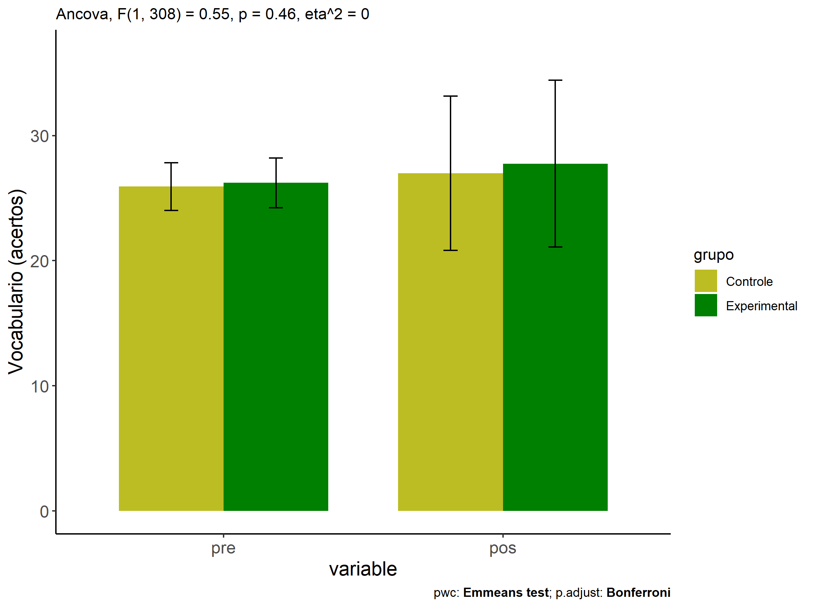<!-- -->

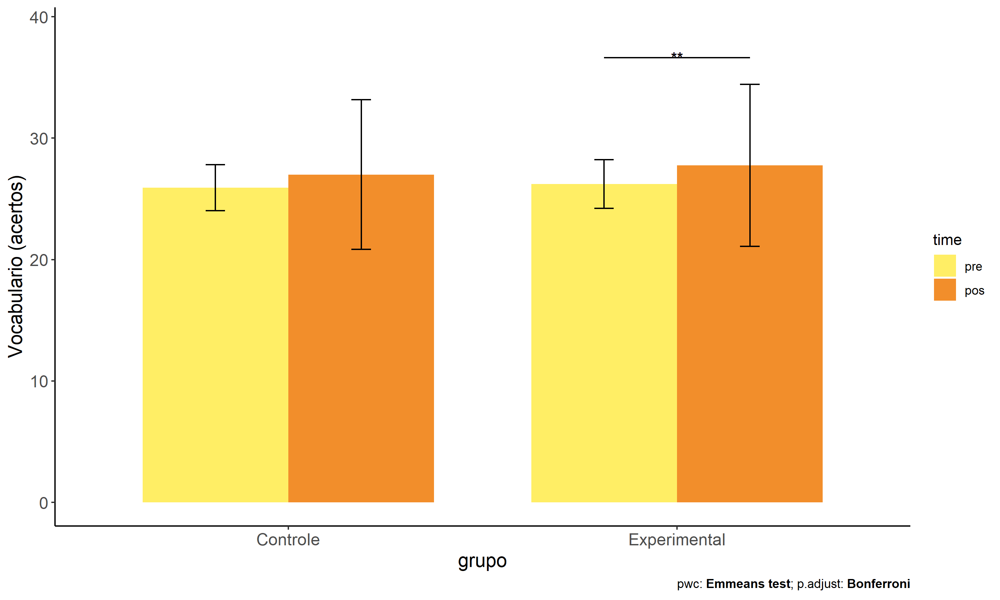<!-- -->

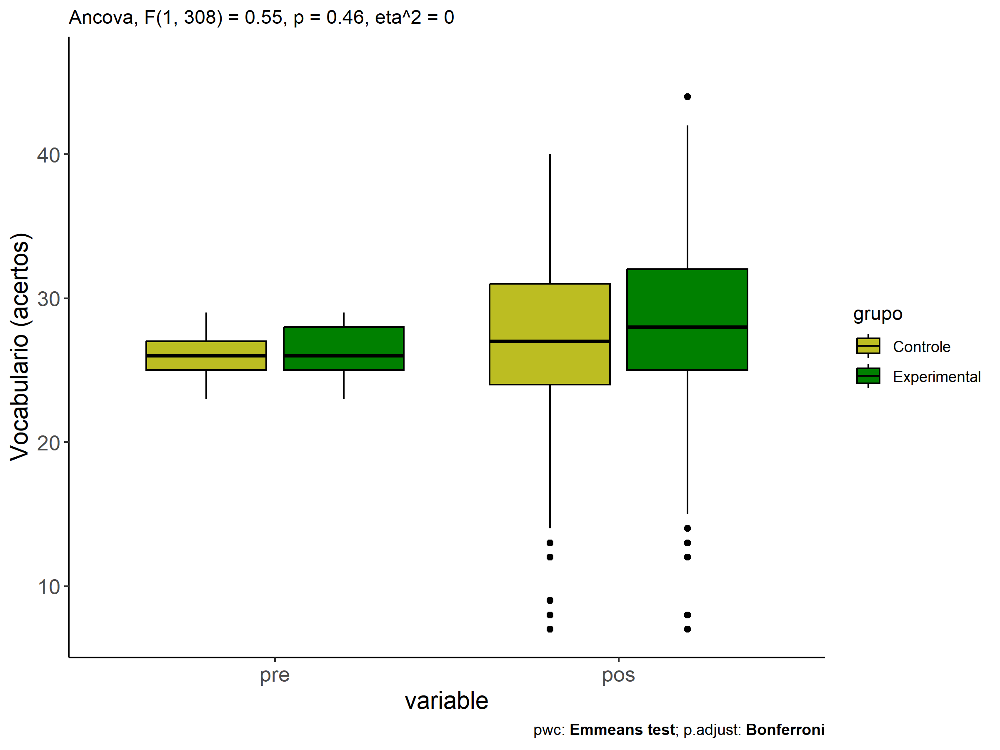<!-- -->

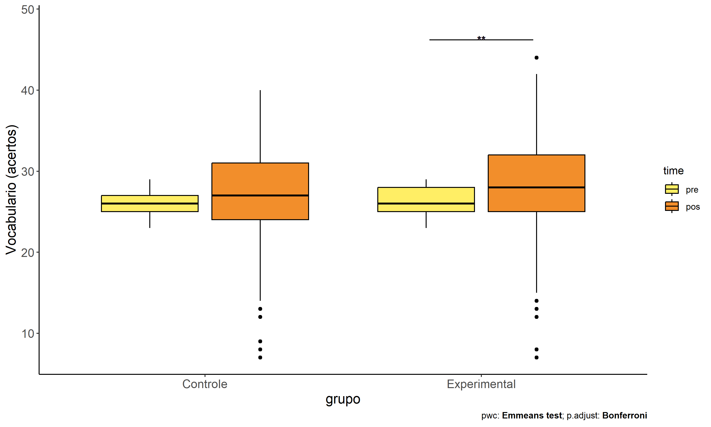<!-- -->

## Pairwise comparisons for two factors

### factores: **grupo:Sexo**

| var       | grupo        | Sexo |   n | M (pre) | SE (pre) | M (unadj) | SE (unadj) | M (adj) | SE (adj) |
|:----------|:-------------|:-----|----:|--------:|---------:|----------:|-----------:|--------:|---------:|
| vocab.pos | Controle     | F    |  77 |  26.169 |    0.212 |    27.818 |      0.671 |  27.768 |    0.719 |
| vocab.pos | Controle     | M    |  52 |  25.558 |    0.264 |    25.788 |      0.890 |  26.164 |    0.880 |
| vocab.pos | Experimental | F    |  98 |  26.265 |    0.199 |    28.153 |      0.655 |  28.035 |    0.638 |
| vocab.pos | Experimental | M    |  84 |  26.167 |    0.221 |    27.298 |      0.750 |  27.249 |    0.688 |

| .y.       | grupo        | Sexo | group1   | group2       | estimate | conf.low | conf.high |    se | statistic |     p | p.adj | p.adj.signif |
|:----------|:-------------|:-----|:---------|:-------------|---------:|---------:|----------:|------:|----------:|------:|------:|:-------------|
| vocab.pos |              | F    | Controle | Experimental |   -0.268 |   -2.158 |     1.623 | 0.961 |    -0.279 | 0.781 | 0.781 | ns           |
| vocab.pos |              | M    | Controle | Experimental |   -1.084 |   -3.285 |     1.117 | 1.119 |    -0.969 | 0.333 | 0.333 | ns           |
| vocab.pre |              | F    | Controle | Experimental |   -0.096 |   -0.680 |     0.487 | 0.297 |    -0.325 | 0.745 | 0.745 | ns           |
| vocab.pre |              | M    | Controle | Experimental |   -0.609 |   -1.285 |     0.067 | 0.344 |    -1.772 | 0.077 | 0.077 | ns           |
| vocab.pos | Controle     |      | F        | M            |    1.603 |   -0.635 |     3.842 | 1.138 |     1.409 | 0.160 | 0.160 | ns           |
| vocab.pos | Experimental |      | F        | M            |    0.787 |   -1.059 |     2.632 | 0.938 |     0.839 | 0.402 | 0.402 | ns           |
| vocab.pre | Controle     |      | F        | M            |    0.611 |   -0.077 |     1.299 | 0.350 |     1.748 | 0.081 | 0.081 | ns           |
| vocab.pre | Experimental |      | F        | M            |    0.099 |   -0.471 |     0.668 | 0.290 |     0.341 | 0.734 | 0.734 | ns           |

| .y.   | grupo        | Sexo | group1 | group2 | estimate | conf.low | conf.high |    se | statistic |     p | p.adj | p.adj.signif |
|:------|:-------------|:-----|:-------|:-------|---------:|---------:|----------:|------:|----------:|------:|------:|:-------------|
| vocab | Controle     | F    | pre    | pos    |   -1.649 |   -3.155 |    -0.143 | 0.767 |    -2.151 | 0.032 | 0.032 | \*           |
| vocab | Controle     | M    | pre    | pos    |   -0.231 |   -2.063 |     1.602 | 0.933 |    -0.247 | 0.805 | 0.805 | ns           |
| vocab | Experimental | F    | pre    | pos    |   -1.888 |   -3.223 |    -0.553 | 0.680 |    -2.777 | 0.006 | 0.006 | \*\*         |
| vocab | Experimental | M    | pre    | pos    |   -1.131 |   -2.573 |     0.311 | 0.734 |    -1.540 | 0.124 | 0.124 | ns           |

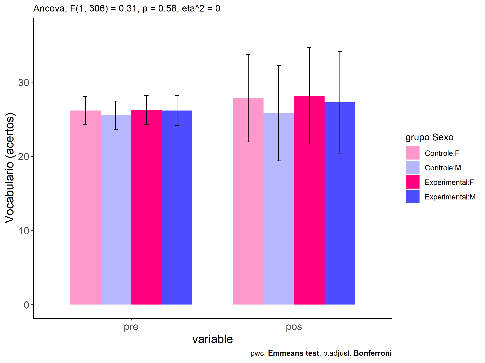<!-- -->

<!-- -->

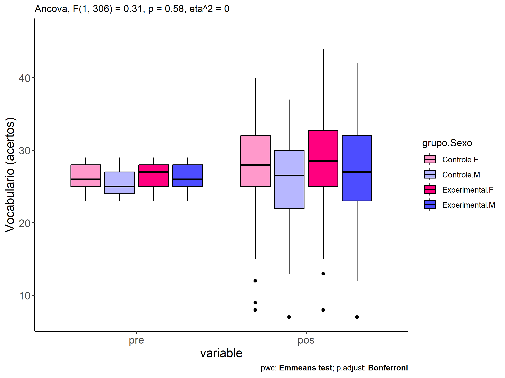<!-- -->

<!-- -->

### factores: **grupo:Zona**

| var       | grupo        | Zona   |   n | M (pre) | SE (pre) | M (unadj) | SE (unadj) | M (adj) | SE (adj) |
|:----------|:-------------|:-------|----:|--------:|---------:|----------:|-----------:|--------:|---------:|
| vocab.pos | Controle     | Rural  |  70 |  25.886 |    0.230 |    27.286 |      0.735 |  27.522 |    0.714 |
| vocab.pos | Controle     | Urbana |  23 |  26.304 |    0.424 |    27.174 |      1.355 |  27.075 |    1.242 |
| vocab.pos | Experimental | Rural  |  73 |  26.274 |    0.217 |    28.370 |      0.747 |  28.295 |    0.697 |
| vocab.pos | Experimental | Urbana |  50 |  26.400 |    0.293 |    28.380 |      0.788 |  28.204 |    0.843 |

| .y.       | grupo        | Zona   | group1   | group2       | estimate | conf.low | conf.high |    se | statistic |     p | p.adj | p.adj.signif |
|:----------|:-------------|:-------|:---------|:-------------|---------:|---------:|----------:|------:|----------:|------:|------:|:-------------|
| vocab.pos |              | Rural  | Controle | Experimental |   -0.773 |   -2.742 |     1.197 | 0.999 |    -0.773 | 0.440 | 0.440 | ns           |
| vocab.pos |              | Urbana | Controle | Experimental |   -1.129 |   -4.086 |     1.828 | 1.500 |    -0.753 | 0.452 | 0.452 | ns           |
| vocab.pre |              | Rural  | Controle | Experimental |   -0.388 |   -1.030 |     0.253 | 0.325 |    -1.193 | 0.234 | 0.234 | ns           |
| vocab.pre |              | Urbana | Controle | Experimental |   -0.096 |   -1.062 |     0.871 | 0.490 |    -0.195 | 0.845 | 0.845 | ns           |
| vocab.pos | Controle     |        | Rural    | Urbana       |    0.448 |   -2.378 |     3.274 | 1.433 |     0.312 | 0.755 | 0.755 | ns           |
| vocab.pos | Experimental |        | Rural    | Urbana       |    0.091 |   -2.064 |     2.246 | 1.093 |     0.083 | 0.934 | 0.934 | ns           |
| vocab.pre | Controle     |        | Rural    | Urbana       |   -0.419 |   -1.340 |     0.503 | 0.468 |    -0.895 | 0.372 | 0.372 | ns           |
| vocab.pre | Experimental |        | Rural    | Urbana       |   -0.126 |   -0.830 |     0.578 | 0.357 |    -0.353 | 0.725 | 0.725 | ns           |

| .y.   | grupo        | Zona   | group1 | group2 | estimate | conf.low | conf.high |    se | statistic |     p | p.adj | p.adj.signif |
|:------|:-------------|:-------|:-------|:-------|---------:|---------:|----------:|------:|----------:|------:|------:|:-------------|
| vocab | Controle     | Rural  | pre    | pos    |   -1.400 |   -2.913 |     0.113 | 0.770 |    -1.818 | 0.070 | 0.070 | ns           |
| vocab | Controle     | Urbana | pre    | pos    |   -0.870 |   -3.510 |     1.771 | 1.343 |    -0.647 | 0.518 | 0.518 | ns           |
| vocab | Experimental | Rural  | pre    | pos    |   -2.096 |   -3.578 |    -0.614 | 0.754 |    -2.780 | 0.006 | 0.006 | \*\*         |
| vocab | Experimental | Urbana | pre    | pos    |   -1.980 |   -3.771 |    -0.189 | 0.911 |    -2.173 | 0.030 | 0.030 | \*           |

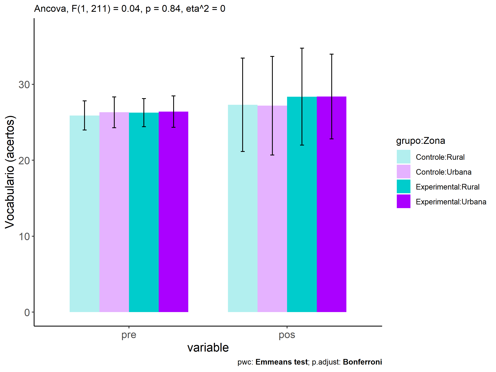<!-- -->

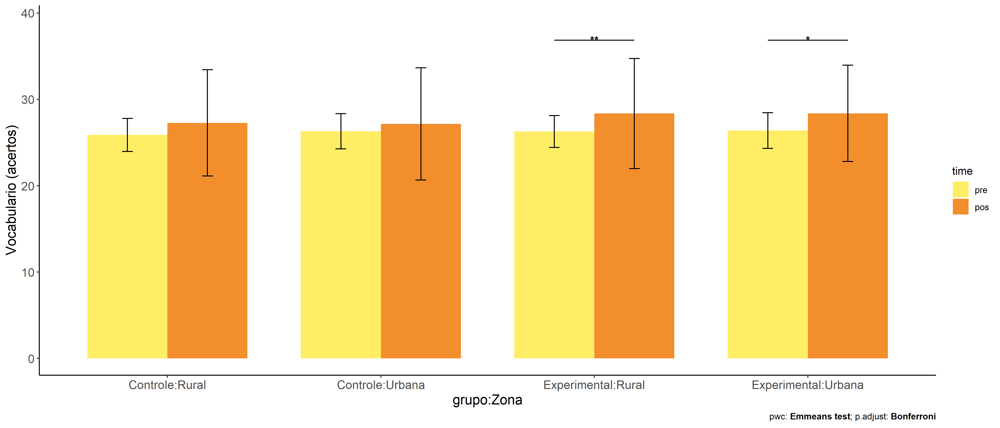<!-- -->

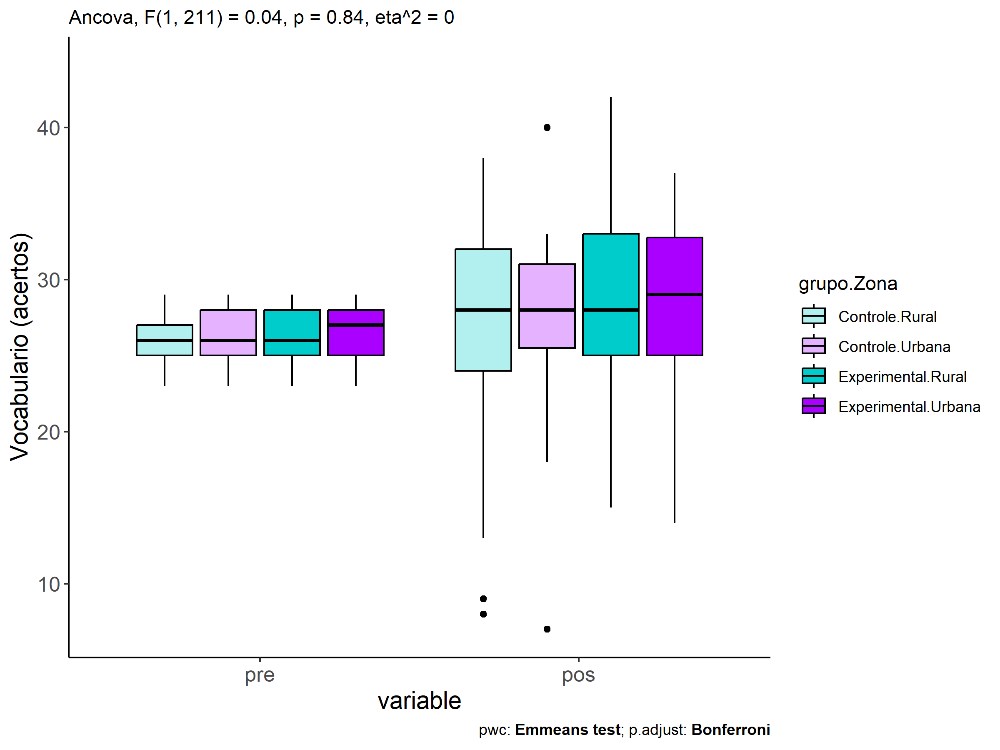<!-- -->

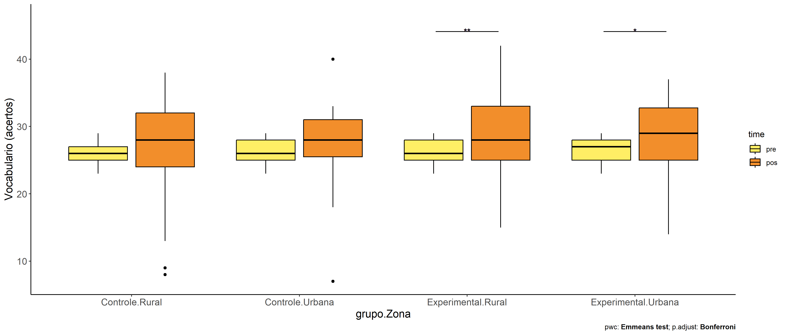<!-- -->

### factores: **grupo:Cor.Raca**

| var       | grupo        | Cor.Raca |   n | M (pre) | SE (pre) | M (unadj) | SE (unadj) | M (adj) | SE (adj) |
|:----------|:-------------|:---------|----:|--------:|---------:|----------:|-----------:|--------:|---------:|
| vocab.pos | Controle     | Branca   |  16 |  26.438 |    0.408 |    26.312 |      1.193 |  26.059 |    1.588 |
| vocab.pos | Controle     | Indígena |   8 |  25.250 |    0.773 |    29.250 |      2.051 |  29.995 |    2.258 |
| vocab.pos | Controle     | Parda    |  35 |  25.971 |    0.308 |    28.343 |      1.120 |  28.481 |    1.073 |
| vocab.pos | Experimental | Branca   |  22 |  26.455 |    0.464 |    25.318 |      1.541 |  25.050 |    1.356 |
| vocab.pos | Experimental | Parda    |  44 |  26.159 |    0.298 |    28.159 |      1.013 |  28.140 |    0.956 |

|     | .y.       | grupo        | Cor.Raca | group1   | group2       | estimate | conf.low | conf.high |    se | statistic |     p | p.adj | p.adj.signif |
|:----|:----------|:-------------|:---------|:---------|:-------------|---------:|---------:|----------:|------:|----------:|------:|------:|:-------------|
| 1   | vocab.pos |              | Branca   | Controle | Experimental |    1.009 |   -3.118 |     5.135 | 2.084 |     0.484 | 0.629 | 0.629 | ns           |
| 3   | vocab.pos |              | Parda    | Controle | Experimental |    0.341 |   -2.505 |     3.188 | 1.438 |     0.238 | 0.813 | 0.813 | ns           |
| 4   | vocab.pre |              | Branca   | Controle | Experimental |   -0.017 |   -1.282 |     1.248 | 0.639 |    -0.027 | 0.979 | 0.979 | ns           |
| 6   | vocab.pre |              | Parda    | Controle | Experimental |   -0.188 |   -1.060 |     0.684 | 0.440 |    -0.426 | 0.671 | 0.671 | ns           |
| 7   | vocab.pos | Controle     |          | Branca   | Indígena     |   -3.936 |   -9.418 |     1.547 | 2.769 |    -1.421 | 0.158 | 0.474 | ns           |
| 8   | vocab.pos | Controle     |          | Branca   | Parda        |   -2.422 |   -6.222 |     1.378 | 1.919 |    -1.262 | 0.209 | 0.628 | ns           |
| 9   | vocab.pos | Controle     |          | Indígena | Parda        |    1.513 |   -3.426 |     6.453 | 2.495 |     0.607 | 0.545 | 1.000 | ns           |
| 11  | vocab.pos | Experimental |          | Branca   | Parda        |   -3.089 |   -6.373 |     0.195 | 1.658 |    -1.863 | 0.065 | 0.065 | ns           |
| 13  | vocab.pre | Controle     |          | Branca   | Indígena     |    1.188 |   -0.480 |     2.855 | 0.842 |     1.410 | 0.161 | 0.483 | ns           |
| 14  | vocab.pre | Controle     |          | Branca   | Parda        |    0.466 |   -0.696 |     1.628 | 0.587 |     0.794 | 0.429 | 1.000 | ns           |
| 15  | vocab.pre | Controle     |          | Indígena | Parda        |   -0.721 |   -2.230 |     0.787 | 0.762 |    -0.947 | 0.346 | 1.000 | ns           |
| 17  | vocab.pre | Experimental |          | Branca   | Parda        |    0.295 |   -0.710 |     1.301 | 0.508 |     0.582 | 0.562 | 0.562 | ns           |

| .y.   | grupo        | Cor.Raca | group1 | group2 | estimate | conf.low | conf.high |    se | statistic |     p | p.adj | p.adj.signif |
|:------|:-------------|:---------|:-------|:-------|---------:|---------:|----------:|------:|----------:|------:|------:|:-------------|
| vocab | Controle     | Branca   | pre    | pos    |    0.125 |   -3.228 |     3.478 | 1.702 |     0.073 | 0.942 | 0.942 | ns           |
| vocab | Controle     | Indígena | pre    | pos    |   -4.000 |   -8.741 |     0.741 | 2.407 |    -1.662 | 0.098 | 0.098 | ns           |
| vocab | Controle     | Parda    | pre    | pos    |   -2.371 |   -4.638 |    -0.105 | 1.151 |    -2.061 | 0.040 | 0.040 | \*           |
| vocab | Experimental | Branca   | pre    | pos    |    1.136 |   -1.723 |     3.995 | 1.451 |     0.783 | 0.434 | 0.434 | ns           |
| vocab | Experimental | Parda    | pre    | pos    |   -2.000 |   -4.022 |     0.022 | 1.026 |    -1.949 | 0.052 | 0.052 | ns           |

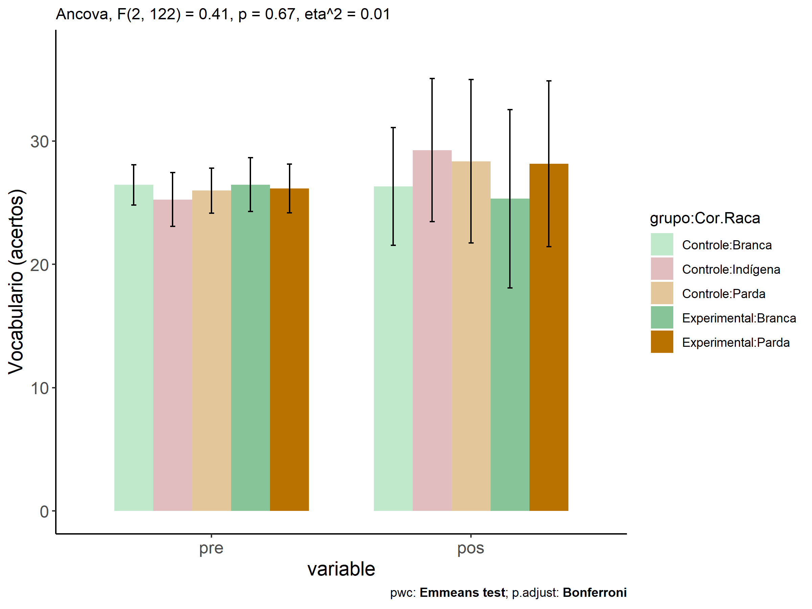<!-- -->

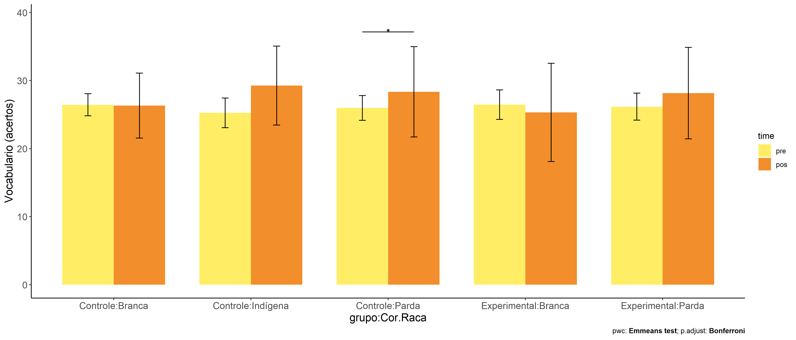<!-- -->

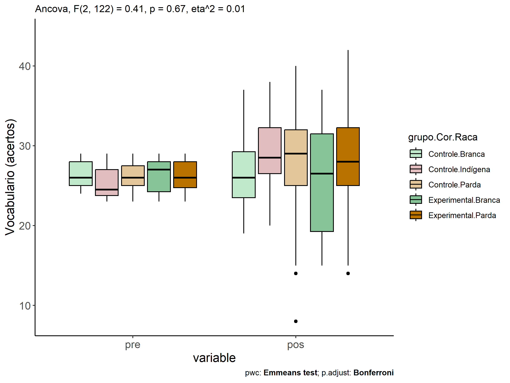<!-- -->

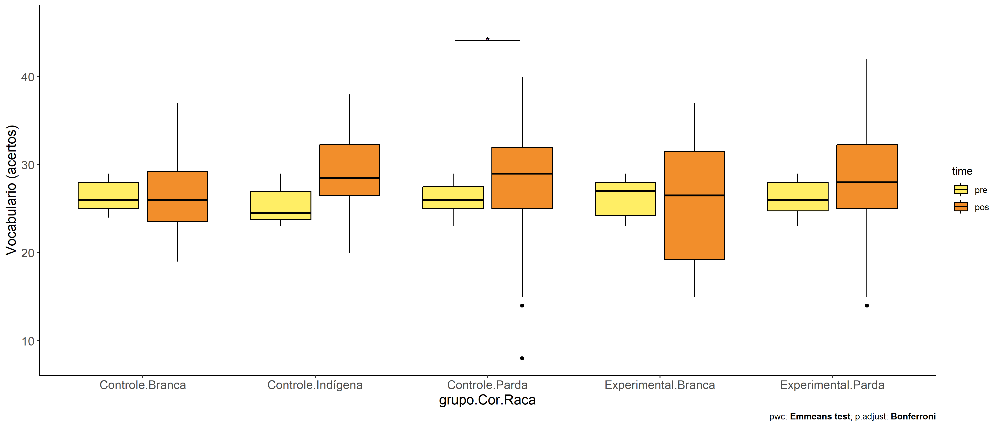<!-- -->

### factores: **grupo:Serie**

| var       | grupo        | Serie |   n | M (pre) | SE (pre) | M (unadj) | SE (unadj) | M (adj) | SE (adj) |
|:----------|:-------------|:------|----:|--------:|---------:|----------:|-----------:|--------:|---------:|
| vocab.pos | Controle     | 6 ano |  33 |  25.061 |    0.308 |    25.091 |      1.027 |  25.756 |    1.107 |
| vocab.pos | Controle     | 7 ano |  39 |  26.256 |    0.296 |    27.410 |      0.928 |  27.307 |    1.003 |
| vocab.pos | Controle     | 8 ano |  33 |  26.061 |    0.304 |    28.030 |      1.220 |  28.053 |    1.090 |
| vocab.pos | Controle     | 9 ano |  24 |  26.375 |    0.421 |    27.542 |      1.156 |  27.363 |    1.279 |
| vocab.pos | Experimental | 6 ano |  40 |  26.050 |    0.328 |    27.400 |      1.236 |  27.430 |    0.990 |
| vocab.pos | Experimental | 7 ano |  54 |  26.093 |    0.235 |    27.074 |      0.815 |  27.077 |    0.852 |
| vocab.pos | Experimental | 8 ano |  46 |  26.152 |    0.330 |    26.413 |      0.873 |  26.377 |    0.923 |
| vocab.pos | Experimental | 9 ano |  42 |  26.619 |    0.301 |    30.452 |      1.009 |  30.117 |    0.971 |

| .y.       | grupo        | Serie | group1   | group2       | estimate | conf.low | conf.high |    se | statistic |     p | p.adj | p.adj.signif |
|:----------|:-------------|:------|:---------|:-------------|---------:|---------:|----------:|------:|----------:|------:|------:|:-------------|
| vocab.pos |              | 6 ano | Controle | Experimental |   -1.673 |   -4.594 |     1.247 | 1.484 |    -1.128 | 0.260 | 0.260 | ns           |
| vocab.pos |              | 7 ano | Controle | Experimental |    0.231 |   -2.359 |     2.821 | 1.316 |     0.175 | 0.861 | 0.861 | ns           |
| vocab.pos |              | 8 ano | Controle | Experimental |    1.676 |   -1.135 |     4.488 | 1.429 |     1.173 | 0.242 | 0.242 | ns           |
| vocab.pos |              | 9 ano | Controle | Experimental |   -2.754 |   -5.909 |     0.401 | 1.603 |    -1.718 | 0.087 | 0.087 | ns           |
| vocab.pre |              | 6 ano | Controle | Experimental |   -0.989 |   -1.884 |    -0.094 | 0.455 |    -2.176 | 0.030 | 0.030 | \*           |
| vocab.pre |              | 7 ano | Controle | Experimental |    0.164 |   -0.636 |     0.963 | 0.406 |     0.403 | 0.687 | 0.687 | ns           |
| vocab.pre |              | 8 ano | Controle | Experimental |   -0.092 |   -0.960 |     0.777 | 0.441 |    -0.208 | 0.836 | 0.836 | ns           |
| vocab.pre |              | 9 ano | Controle | Experimental |   -0.244 |   -1.218 |     0.730 | 0.495 |    -0.493 | 0.622 | 0.622 | ns           |
| vocab.pos | Controle     |       | 6 ano    | 7 ano        |   -1.551 |   -4.499 |     1.396 | 1.498 |    -1.036 | 0.301 | 1.000 | ns           |
| vocab.pos | Controle     |       | 6 ano    | 8 ano        |   -2.297 |   -5.353 |     0.759 | 1.553 |    -1.479 | 0.140 | 0.841 | ns           |
| vocab.pos | Controle     |       | 6 ano    | 9 ano        |   -1.606 |   -4.947 |     1.735 | 1.698 |    -0.946 | 0.345 | 1.000 | ns           |
| vocab.pos | Controle     |       | 7 ano    | 8 ano        |   -0.746 |   -3.662 |     2.170 | 1.482 |    -0.503 | 0.615 | 1.000 | ns           |
| vocab.pos | Controle     |       | 7 ano    | 9 ano        |   -0.055 |   -3.253 |     3.142 | 1.625 |    -0.034 | 0.973 | 1.000 | ns           |
| vocab.pos | Controle     |       | 8 ano    | 9 ano        |    0.691 |   -2.617 |     3.999 | 1.681 |     0.411 | 0.681 | 1.000 | ns           |
| vocab.pos | Experimental |       | 6 ano    | 7 ano        |    0.353 |   -2.218 |     2.924 | 1.306 |     0.270 | 0.787 | 1.000 | ns           |
| vocab.pos | Experimental |       | 6 ano    | 8 ano        |    1.053 |   -1.612 |     3.717 | 1.354 |     0.777 | 0.438 | 1.000 | ns           |
| vocab.pos | Experimental |       | 6 ano    | 9 ano        |   -2.687 |   -5.417 |     0.044 | 1.388 |    -1.936 | 0.054 | 0.323 | ns           |
| vocab.pos | Experimental |       | 7 ano    | 8 ano        |    0.699 |   -1.773 |     3.172 | 1.257 |     0.557 | 0.578 | 1.000 | ns           |
| vocab.pos | Experimental |       | 7 ano    | 9 ano        |   -3.040 |   -5.583 |    -0.497 | 1.292 |    -2.353 | 0.019 | 0.116 | ns           |
| vocab.pos | Experimental |       | 8 ano    | 9 ano        |   -3.739 |   -6.375 |    -1.104 | 1.339 |    -2.792 | 0.006 | 0.033 | \*           |
| vocab.pre | Controle     |       | 6 ano    | 7 ano        |   -1.196 |   -2.096 |    -0.296 | 0.457 |    -2.614 | 0.009 | 0.056 | ns           |
| vocab.pre | Controle     |       | 6 ano    | 8 ano        |   -1.000 |   -1.937 |    -0.063 | 0.476 |    -2.101 | 0.037 | 0.219 | ns           |
| vocab.pre | Controle     |       | 6 ano    | 9 ano        |   -1.314 |   -2.335 |    -0.294 | 0.519 |    -2.534 | 0.012 | 0.071 | ns           |
| vocab.pre | Controle     |       | 7 ano    | 8 ano        |    0.196 |   -0.704 |     1.096 | 0.457 |     0.428 | 0.669 | 1.000 | ns           |
| vocab.pre | Controle     |       | 7 ano    | 9 ano        |   -0.119 |   -1.106 |     0.869 | 0.502 |    -0.236 | 0.813 | 1.000 | ns           |
| vocab.pre | Controle     |       | 8 ano    | 9 ano        |   -0.314 |   -1.335 |     0.706 | 0.519 |    -0.606 | 0.545 | 1.000 | ns           |
| vocab.pre | Experimental |       | 6 ano    | 7 ano        |   -0.043 |   -0.836 |     0.751 | 0.403 |    -0.106 | 0.916 | 1.000 | ns           |
| vocab.pre | Experimental |       | 6 ano    | 8 ano        |   -0.102 |   -0.925 |     0.721 | 0.418 |    -0.244 | 0.807 | 1.000 | ns           |
| vocab.pre | Experimental |       | 6 ano    | 9 ano        |   -0.569 |   -1.410 |     0.272 | 0.427 |    -1.332 | 0.184 | 1.000 | ns           |
| vocab.pre | Experimental |       | 7 ano    | 8 ano        |   -0.060 |   -0.823 |     0.704 | 0.388 |    -0.154 | 0.878 | 1.000 | ns           |
| vocab.pre | Experimental |       | 7 ano    | 9 ano        |   -0.526 |   -1.309 |     0.256 | 0.398 |    -1.323 | 0.187 | 1.000 | ns           |
| vocab.pre | Experimental |       | 8 ano    | 9 ano        |   -0.467 |   -1.279 |     0.345 | 0.413 |    -1.131 | 0.259 | 1.000 | ns           |

| .y.   | grupo        | Serie | group1 | group2 | estimate | conf.low | conf.high |    se | statistic | p       | p.adj   | p.adj.signif |
|:------|:-------------|:------|:-------|:-------|---------:|---------:|----------:|------:|----------:|:--------|:--------|:-------------|
| vocab | Controle     | 6 ano | pre    | pos    |   -0.030 |   -2.308 |     2.247 | 1.160 |    -0.026 | 0.979   | 0.979   | ns           |
| vocab | Controle     | 7 ano | pre    | pos    |   -1.154 |   -3.249 |     0.941 | 1.067 |    -1.082 | 0.28    | 0.28    | ns           |
| vocab | Controle     | 8 ano | pre    | pos    |   -1.970 |   -4.247 |     0.308 | 1.160 |    -1.699 | 0.09    | 0.09    | ns           |
| vocab | Controle     | 9 ano | pre    | pos    |   -1.167 |   -3.837 |     1.504 | 1.360 |    -0.858 | 0.391   | 0.391   | ns           |
| vocab | Experimental | 6 ano | pre    | pos    |   -1.350 |   -3.418 |     0.718 | 1.053 |    -1.282 | 0.2     | 0.2     | ns           |
| vocab | Experimental | 7 ano | pre    | pos    |   -0.981 |   -2.762 |     0.799 | 0.906 |    -1.083 | 0.279   | 0.279   | ns           |
| vocab | Experimental | 8 ano | pre    | pos    |   -0.261 |   -2.190 |     1.668 | 0.982 |    -0.266 | 0.791   | 0.791   | ns           |
| vocab | Experimental | 9 ano | pre    | pos    |   -3.833 |   -5.852 |    -1.815 | 1.028 |    -3.729 | \<0.001 | \<0.001 | \*\*\*       |

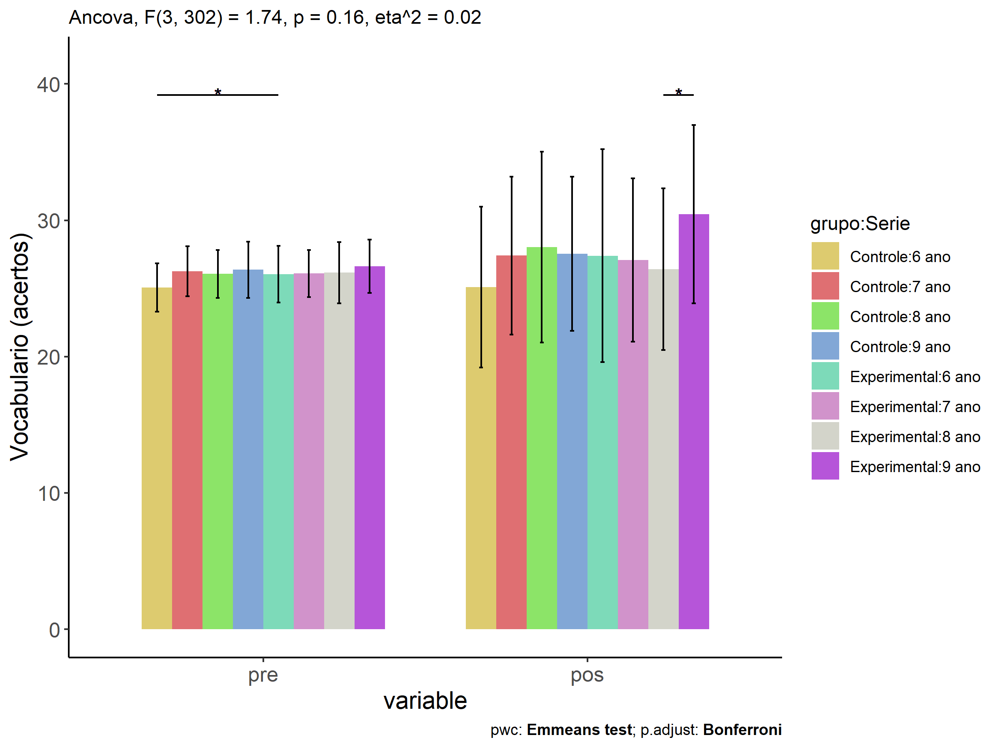<!-- -->

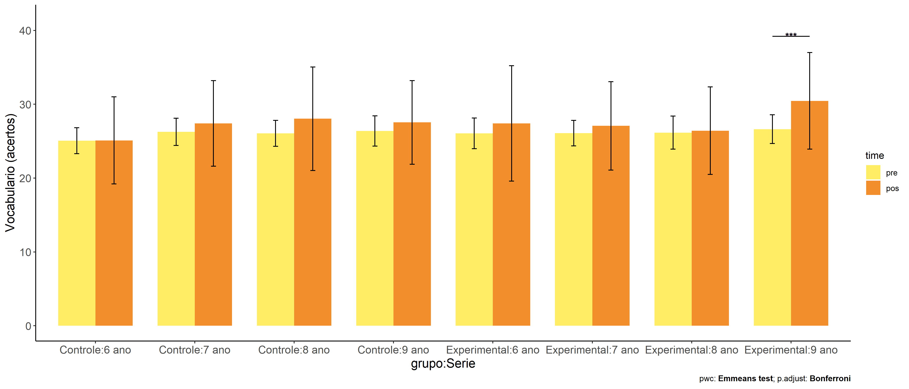<!-- -->

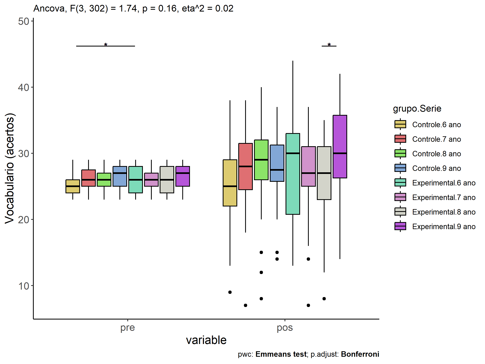<!-- -->

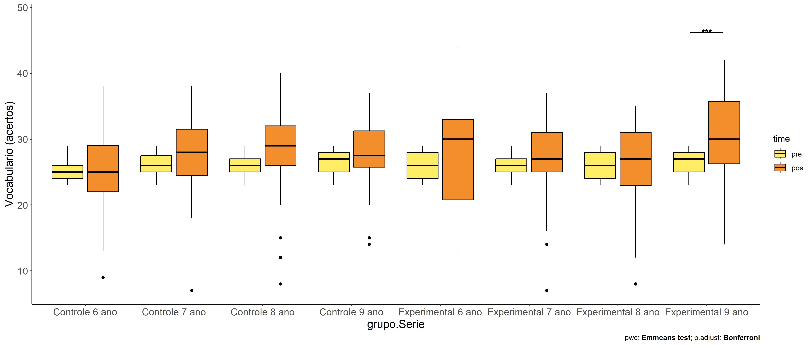<!-- -->
