ANCOVA in Vocabulario (acertos) (Vocabulario (acertos))
================
Geiser C. Challco <geiser@alumni.usp.br>

- [Descriptive Statistics of Initial
  Data](#descriptive-statistics-of-initial-data)
- [Checking of Assumptions](#checking-of-assumptions)
  - [Assumption: Normality distribution of
    data](#assumption-normality-distribution-of-data)
  - [Assumption: Homogeneity of data
    distribution](#assumption-homogeneity-of-data-distribution)
- [Computation of ANCOVA test and Pairwise
  Comparison](#computation-of-ancova-test-and-pairwise-comparison)
  - [ANCOVA tests for one factor](#ancova-tests-for-one-factor)
  - [ANCOVA tests for two factors](#ancova-tests-for-two-factors)
  - [Pairwise comparisons for one factor:
    **grupo**](#pairwise-comparisons-for-one-factor-grupo)
  - [Pairwise comparisons for two
    factors](#pairwise-comparisons-for-two-factors)
    - [factores: **grupo:Sexo**](#factores-gruposexo)
    - [factores: **grupo:Zona**](#factores-grupozona)
    - [factores: **grupo:Cor.Raca**](#factores-grupocorraca)
    - [factores: **grupo:Serie**](#factores-gruposerie)

**NOTE**

- Teste ANCOVA para determinar se houve diferenças significativas no
  Vocabulario (acertos) (medido usando pre- e pos-testes).
- ANCOVA test to determine whether there were significant differences in
  Vocabulario (acertos) (measured using pre- and post-tests).

# Descriptive Statistics of Initial Data

| grupo        | Sexo | Zona   | Cor.Raca | Serie | variable  |   n |   mean | median | min | max |    sd |    se |    ci |  iqr |
|:-------------|:-----|:-------|:---------|:------|:----------|----:|-------:|-------:|----:|----:|------:|------:|------:|-----:|
| Controle     | F    |        |          |       | vocab.pre |  47 | 32.277 |   32.0 |  30 |  34 | 1.378 | 0.201 | 0.405 | 2.50 |
| Controle     | M    |        |          |       | vocab.pre |  44 | 32.227 |   32.5 |  30 |  34 | 1.583 | 0.239 | 0.481 | 3.00 |
| Experimental | F    |        |          |       | vocab.pre |  80 | 31.812 |   32.0 |  30 |  34 | 1.351 | 0.151 | 0.301 | 2.00 |
| Experimental | M    |        |          |       | vocab.pre |  78 | 31.705 |   31.5 |  30 |  34 | 1.460 | 0.165 | 0.329 | 3.00 |
| Controle     | F    |        |          |       | vocab.pos |  47 | 33.915 |   34.0 |  25 |  44 | 4.201 | 0.613 | 1.233 | 6.00 |
| Controle     | M    |        |          |       | vocab.pos |  44 | 33.841 |   34.0 |  12 |  42 | 6.191 | 0.933 | 1.882 | 6.50 |
| Experimental | F    |        |          |       | vocab.pos |  80 | 32.638 |   33.0 |  12 |  45 | 5.309 | 0.594 | 1.181 | 6.25 |
| Experimental | M    |        |          |       | vocab.pos |  78 | 29.705 |   31.0 |   1 |  40 | 7.064 | 0.800 | 1.593 | 7.00 |
| Controle     |      | Rural  |          |       | vocab.pre |  48 | 31.917 |   32.0 |  30 |  34 | 1.514 | 0.218 | 0.439 | 3.00 |
| Controle     |      | Urbana |          |       | vocab.pre |  21 | 32.381 |   33.0 |  30 |  34 | 1.431 | 0.312 | 0.651 | 3.00 |
| Controle     |      |        |          |       | vocab.pre |  22 | 32.864 |   33.0 |  30 |  34 | 1.246 | 0.266 | 0.552 | 2.00 |
| Experimental |      | Rural  |          |       | vocab.pre |  64 | 31.688 |   31.5 |  30 |  34 | 1.468 | 0.183 | 0.367 | 3.00 |
| Experimental |      | Urbana |          |       | vocab.pre |  36 | 31.944 |   32.0 |  30 |  34 | 1.585 | 0.264 | 0.536 | 3.00 |
| Experimental |      |        |          |       | vocab.pre |  58 | 31.724 |   32.0 |  30 |  34 | 1.211 | 0.159 | 0.318 | 2.00 |
| Controle     |      | Rural  |          |       | vocab.pos |  48 | 34.875 |   34.0 |  24 |  44 | 4.639 | 0.670 | 1.347 | 6.50 |
| Controle     |      | Urbana |          |       | vocab.pos |  21 | 32.667 |   32.0 |  12 |  42 | 5.927 | 1.293 | 2.698 | 5.00 |
| Controle     |      |        |          |       | vocab.pos |  22 | 32.864 |   33.5 |  15 |  40 | 5.540 | 1.181 | 2.456 | 4.50 |
| Experimental |      | Rural  |          |       | vocab.pos |  64 | 30.609 |   31.0 |   1 |  40 | 6.306 | 0.788 | 1.575 | 7.00 |
| Experimental |      | Urbana |          |       | vocab.pos |  36 | 31.861 |   32.5 |  14 |  39 | 5.910 | 0.985 | 2.000 | 7.25 |
| Experimental |      |        |          |       | vocab.pos |  58 | 31.414 |   32.0 |   3 |  45 | 6.806 | 0.894 | 1.789 | 6.00 |
| Controle     |      |        | Branca   |       | vocab.pre |  13 | 32.462 |   33.0 |  30 |  34 | 1.330 | 0.369 | 0.804 | 1.00 |
| Controle     |      |        | Indígena |       | vocab.pre |   2 | 33.500 |   33.5 |  33 |  34 | 0.707 | 0.500 | 6.353 | 0.50 |
| Controle     |      |        | Parda    |       | vocab.pre |  33 | 32.394 |   33.0 |  30 |  34 | 1.345 | 0.234 | 0.477 | 3.00 |
| Controle     |      |        |          |       | vocab.pre |  43 | 32.023 |   32.0 |  30 |  34 | 1.611 | 0.246 | 0.496 | 4.00 |
| Experimental |      |        | Branca   |       | vocab.pre |  12 | 32.000 |   32.0 |  30 |  34 | 1.348 | 0.389 | 0.857 | 2.00 |
| Experimental |      |        | Indígena |       | vocab.pre |   5 | 32.400 |   32.0 |  31 |  34 | 1.517 | 0.678 | 1.883 | 3.00 |
| Experimental |      |        | Parda    |       | vocab.pre |  45 | 31.556 |   31.0 |  30 |  34 | 1.455 | 0.217 | 0.437 | 3.00 |
| Experimental |      |        |          |       | vocab.pre |  96 | 31.792 |   32.0 |  30 |  34 | 1.383 | 0.141 | 0.280 | 3.00 |
| Controle     |      |        | Branca   |       | vocab.pos |  13 | 35.154 |   35.0 |  27 |  41 | 3.848 | 1.067 | 2.325 | 3.00 |
| Controle     |      |        | Indígena |       | vocab.pos |   2 | 38.000 |   38.0 |  38 |  38 | 0.000 | 0.000 | 0.000 | 0.00 |
| Controle     |      |        | Parda    |       | vocab.pos |  33 | 34.152 |   34.0 |  15 |  42 | 5.106 | 0.889 | 1.810 | 5.00 |
| Controle     |      |        |          |       | vocab.pos |  43 | 33.093 |   33.0 |  12 |  44 | 5.698 | 0.869 | 1.754 | 7.00 |
| Experimental |      |        | Branca   |       | vocab.pos |  12 | 31.667 |   30.5 |  24 |  40 | 5.416 | 1.563 | 3.441 | 7.25 |
| Experimental |      |        | Indígena |       | vocab.pos |   5 | 34.000 |   34.0 |  32 |  36 | 1.581 | 0.707 | 1.963 | 2.00 |
| Experimental |      |        | Parda    |       | vocab.pos |  45 | 29.644 |   31.0 |   1 |  45 | 8.236 | 1.228 | 2.474 | 7.00 |
| Experimental |      |        |          |       | vocab.pos |  96 | 31.708 |   33.0 |  12 |  40 | 5.540 | 0.565 | 1.123 | 6.25 |
| Controle     |      |        |          | 6 ano | vocab.pre |  19 | 31.895 |   32.0 |  30 |  34 | 1.663 | 0.382 | 0.802 | 3.50 |
| Controle     |      |        |          | 7 ano | vocab.pre |  23 | 32.261 |   32.0 |  30 |  34 | 1.544 | 0.322 | 0.668 | 3.00 |
| Controle     |      |        |          | 8 ano | vocab.pre |  18 | 32.278 |   32.5 |  30 |  34 | 1.526 | 0.360 | 0.759 | 3.00 |
| Controle     |      |        |          | 9 ano | vocab.pre |  31 | 32.452 |   33.0 |  30 |  34 | 1.287 | 0.231 | 0.472 | 1.00 |
| Experimental |      |        |          | 6 ano | vocab.pre |  28 | 31.571 |   31.5 |  30 |  34 | 1.317 | 0.249 | 0.511 | 3.00 |
| Experimental |      |        |          | 7 ano | vocab.pre |  44 | 31.750 |   32.0 |  30 |  34 | 1.512 | 0.228 | 0.460 | 3.00 |
| Experimental |      |        |          | 8 ano | vocab.pre |  37 | 31.757 |   32.0 |  30 |  34 | 1.362 | 0.224 | 0.454 | 2.00 |
| Experimental |      |        |          | 9 ano | vocab.pre |  49 | 31.878 |   32.0 |  30 |  34 | 1.409 | 0.201 | 0.405 | 2.00 |
| Controle     |      |        |          | 6 ano | vocab.pos |  19 | 32.579 |   33.0 |  24 |  39 | 3.687 | 0.846 | 1.777 | 3.00 |
| Controle     |      |        |          | 7 ano | vocab.pos |  23 | 34.435 |   34.0 |  27 |  41 | 3.678 | 0.767 | 1.591 | 5.00 |
| Controle     |      |        |          | 8 ano | vocab.pos |  18 | 32.667 |   33.0 |  15 |  42 | 5.881 | 1.386 | 2.925 | 6.25 |
| Controle     |      |        |          | 9 ano | vocab.pos |  31 | 34.968 |   36.0 |  12 |  44 | 6.395 | 1.149 | 2.346 | 7.50 |
| Experimental |      |        |          | 6 ano | vocab.pos |  28 | 30.393 |   30.5 |  14 |  38 | 5.080 | 0.960 | 1.970 | 4.50 |
| Experimental |      |        |          | 7 ano | vocab.pos |  44 | 30.750 |   31.0 |  15 |  40 | 5.109 | 0.770 | 1.553 | 7.00 |
| Experimental |      |        |          | 8 ano | vocab.pos |  37 | 32.568 |   34.0 |  18 |  40 | 5.378 | 0.884 | 1.793 | 7.00 |
| Experimental |      |        |          | 9 ano | vocab.pos |  49 | 31.000 |   33.0 |   1 |  45 | 8.478 | 1.211 | 2.435 | 8.00 |

# Checking of Assumptions

## Assumption: Normality distribution of data

| var       |   n |  skewness | kurtosis | symmetry | statistic | method     |   p | p.signif | normality |
|:----------|----:|----------:|---------:|:---------|----------:|:-----------|----:|:---------|:----------|
| vocab.pos | 249 | -1.473484 | 4.412088 | NO       |  87.81708 | D’Agostino |   0 | \*\*\*\* | \-        |
| vocab.pos | 169 | -1.421531 | 4.508907 | NO       |  62.18228 | D’Agostino |   0 | \*\*\*\* | QQ        |
| vocab.pos | 110 | -1.615479 | 5.675247 | NO       |  53.11790 | D’Agostino |   0 | \*\*\*\* | QQ        |
| vocab.pos | 249 | -1.573905 | 4.952867 | NO       |  95.84773 | D’Agostino |   0 | \*\*\*\* | \-        |

## Assumption: Homogeneity of data distribution

| var       | method         | formula                    |   n | DFn.df1 | DFd.df2 | statistic |         p | p.signif |
|:----------|:---------------|:---------------------------|----:|--------:|--------:|----------:|----------:|:---------|
| vocab.pos | Levene’s test  | `.res`~`grupo`\*`Sexo`     | 249 |       3 |     245 | 1.2577115 | 0.2895196 | ns       |
| vocab.pos | Anova’s slopes | `.res`~`grupo`\*`Sexo`     | 249 |       3 |     241 | 0.7510000 | 0.5230000 | ns       |
| vocab.pos | Levene’s test  | `.res`~`grupo`\*`Zona`     | 169 |       3 |     165 | 0.4021363 | 0.7516493 | ns       |
| vocab.pos | Anova’s slopes | `.res`~`grupo`\*`Zona`     | 169 |       3 |     161 | 0.5240000 | 0.6670000 | ns       |
| vocab.pos | Levene’s test  | `.res`~`grupo`\*`Cor.Raca` | 110 |       5 |     104 | 1.5831968 | 0.1712819 | ns       |
| vocab.pos | Anova’s slopes | `.res`~`grupo`\*`Cor.Raca` | 110 |       5 |      98 | 0.6160000 | 0.6880000 | ns       |
| vocab.pos | Levene’s test  | `.res`~`grupo`\*`Serie`    | 249 |       7 |     241 | 1.5395435 | 0.1545626 | ns       |
| vocab.pos | Anova’s slopes | `.res`~`grupo`\*`Serie`    | 249 |       7 |     233 | 0.6080000 | 0.7490000 | ns       |

# Computation of ANCOVA test and Pairwise Comparison

## ANCOVA tests for one factor

|     | Effect    | DFn | DFd |     SSn |      SSd |     F |     p |   ges | p\<.05 |
|:----|:----------|----:|----:|--------:|---------:|------:|------:|------:|:-------|
| 1   | vocab.pre |   1 | 246 | 189.423 | 8678.551 | 5.369 | 0.021 | 0.021 | \*     |
| 2   | grupo     |   1 | 246 | 320.050 | 8678.551 | 9.072 | 0.003 | 0.036 | \*     |
| 4   | Sexo      |   1 | 246 | 212.239 | 8786.362 | 5.942 | 0.015 | 0.024 | \*     |
| 6   | Zona      |   1 | 166 |   9.833 | 5748.785 | 0.284 | 0.595 | 0.002 |        |
| 8   | Cor.Raca  |   2 | 106 |  92.136 | 4670.489 | 1.046 | 0.355 | 0.019 |        |
| 10  | Serie     |   3 | 244 |  41.307 | 8957.294 | 0.375 | 0.771 | 0.005 |        |

## ANCOVA tests for two factors

|     | Effect         | DFn | DFd |     SSn |      SSd |     F |     p |   ges | p\<.05 |
|:----|:---------------|----:|----:|--------:|---------:|------:|------:|------:|:-------|
| 1   | vocab.pre      |   1 | 244 | 174.563 | 8353.688 | 5.099 | 0.025 | 0.020 | \*     |
| 4   | grupo:Sexo     |   1 | 244 | 115.044 | 8353.688 | 3.360 | 0.068 | 0.014 |        |
| 8   | grupo:Zona     |   1 | 164 | 115.453 | 5282.733 | 3.584 | 0.060 | 0.021 |        |
| 12  | grupo:Cor.Raca |   2 | 103 |   3.646 | 4289.688 | 0.044 | 0.957 | 0.001 |        |
| 16  | grupo:Serie    |   3 | 240 | 127.471 | 8497.760 | 1.200 | 0.310 | 0.015 |        |

## Pairwise comparisons for one factor: **grupo**

| var       | grupo        |   n | M (pre) | SE (pre) | M (unadj) | SE (unadj) | M (adj) | SE (adj) |
|:----------|:-------------|----:|--------:|---------:|----------:|-----------:|--------:|---------:|
| vocab.pos | Controle     |  91 |  32.253 |    0.154 |    33.879 |      0.548 |  33.687 |    0.628 |
| vocab.pos | Experimental | 158 |  31.759 |    0.112 |    31.190 |      0.508 |  31.300 |    0.475 |

| .y.       | group1   | group2       | estimate | conf.low | conf.high |    se | statistic |     p | p.adj | p.adj.signif |
|:----------|:---------|:-------------|---------:|---------:|----------:|------:|----------:|------:|------:|:-------------|
| vocab.pos | Controle | Experimental |    2.387 |    0.826 |     3.948 | 0.792 |     3.012 | 0.003 | 0.003 | \*\*         |
| vocab.pre | Controle | Experimental |    0.493 |    0.123 |     0.864 | 0.188 |     2.624 | 0.009 | 0.009 | \*\*         |

| .y.   | grupo        | group1 | group2 | estimate | conf.low | conf.high |    se | statistic |     p | p.adj | p.adj.signif |
|:------|:-------------|:-------|:-------|---------:|---------:|----------:|------:|----------:|------:|------:|:-------------|
| vocab | Controle     | pre    | pos    |   -1.626 |   -2.895 |    -0.358 | 0.646 |    -2.519 | 0.012 | 0.012 | \*           |
| vocab | Experimental | pre    | pos    |    0.570 |   -0.393 |     1.532 | 0.490 |     1.162 | 0.246 | 0.246 | ns           |

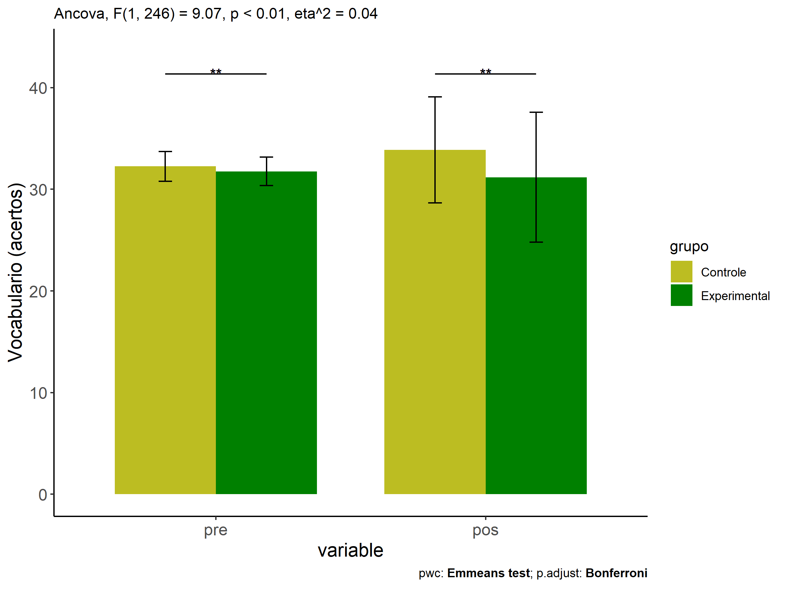<!-- -->

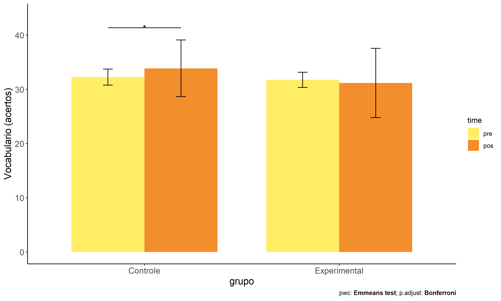<!-- -->

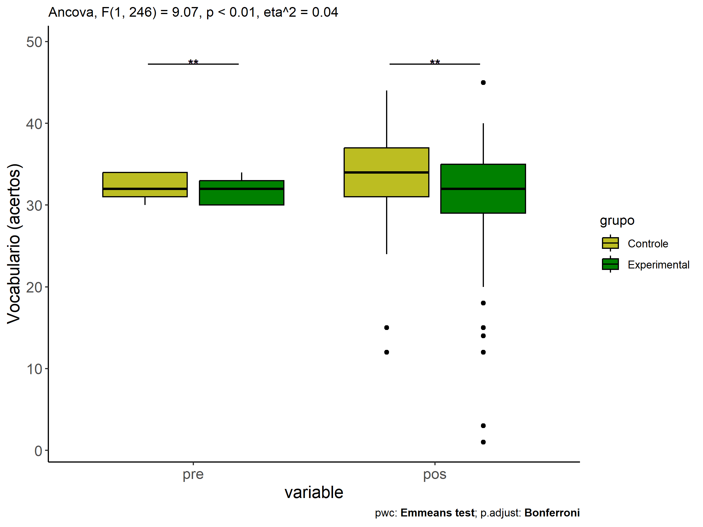<!-- -->

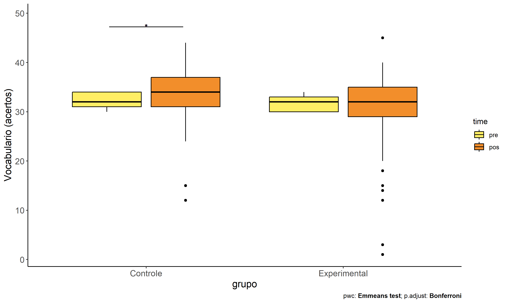<!-- -->

## Pairwise comparisons for two factors

### factores: **grupo:Sexo**

| var       | grupo        | Sexo |   n | M (pre) | SE (pre) | M (unadj) | SE (unadj) | M (adj) | SE (adj) |
|:----------|:-------------|:-----|----:|--------:|---------:|----------:|-----------:|--------:|---------:|
| vocab.pos | Controle     | F    |  47 |  32.277 |    0.201 |    33.915 |      0.613 |  33.717 |    0.858 |
| vocab.pos | Controle     | M    |  44 |  32.227 |    0.239 |    33.841 |      0.933 |  33.672 |    0.885 |
| vocab.pos | Experimental | F    |  80 |  31.812 |    0.151 |    32.638 |      0.594 |  32.712 |    0.655 |
| vocab.pos | Experimental | M    |  78 |  31.705 |    0.165 |    29.705 |      0.800 |  29.843 |    0.665 |

| .y.       | grupo        | Sexo | group1   | group2       | estimate | conf.low | conf.high |    se | statistic | p       | p.adj   | p.adj.signif |
|:----------|:-------------|:-----|:---------|:-------------|---------:|---------:|----------:|------:|----------:|:--------|:--------|:-------------|
| vocab.pos |              | F    | Controle | Experimental |    1.004 |   -1.127 |     3.136 | 1.082 |     0.928 | 0.354   | 0.354   | ns           |
| vocab.pos |              | M    | Controle | Experimental |    3.828 |    1.639 |     6.018 | 1.112 |     3.444 | \<0.001 | \<0.001 | \*\*\*       |
| vocab.pre |              | F    | Controle | Experimental |    0.464 |   -0.055 |     0.983 | 0.263 |     1.761 | 0.079   | 0.079   | ns           |
| vocab.pre |              | M    | Controle | Experimental |    0.522 |   -0.010 |     1.055 | 0.270 |     1.932 | 0.055   | 0.055   | ns           |
| vocab.pos | Controle     |      | F        | M            |    0.045 |   -2.373 |     2.463 | 1.227 |     0.037 | 0.971   | 0.971   | ns           |
| vocab.pos | Experimental |      | F        | M            |    2.869 |    1.034 |     4.704 | 0.931 |     3.080 | 0.002   | 0.002   | \*\*         |
| vocab.pre | Controle     |      | F        | M            |    0.049 |   -0.543 |     0.642 | 0.301 |     0.164 | 0.87    | 0.87    | ns           |
| vocab.pre | Experimental |      | F        | M            |    0.107 |   -0.342 |     0.557 | 0.228 |     0.471 | 0.638   | 0.638   | ns           |

| .y.   | grupo        | Sexo | group1 | group2 | estimate | conf.low | conf.high |    se | statistic |     p | p.adj | p.adj.signif |
|:------|:-------------|:-----|:-------|:-------|---------:|---------:|----------:|------:|----------:|------:|------:|:-------------|
| vocab | Controle     | F    | pre    | pos    |   -1.638 |   -3.378 |     0.102 | 0.886 |    -1.850 | 0.065 | 0.065 | ns           |
| vocab | Controle     | M    | pre    | pos    |   -1.614 |   -3.412 |     0.185 | 0.915 |    -1.763 | 0.079 | 0.079 | ns           |
| vocab | Experimental | F    | pre    | pos    |   -0.825 |   -2.159 |     0.509 | 0.679 |    -1.215 | 0.225 | 0.225 | ns           |
| vocab | Experimental | M    | pre    | pos    |    2.000 |    0.649 |     3.351 | 0.687 |     2.909 | 0.004 | 0.004 | \*\*         |

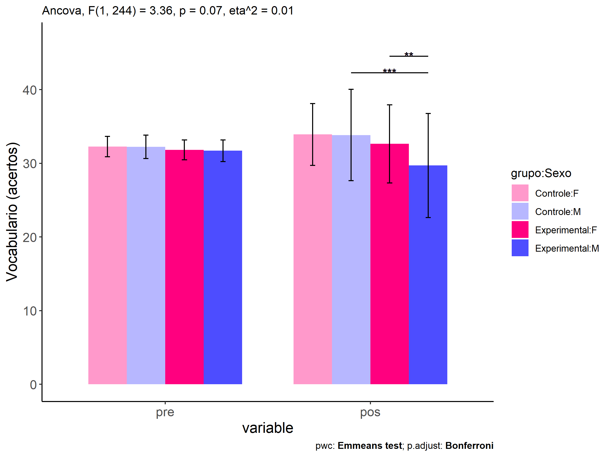<!-- -->

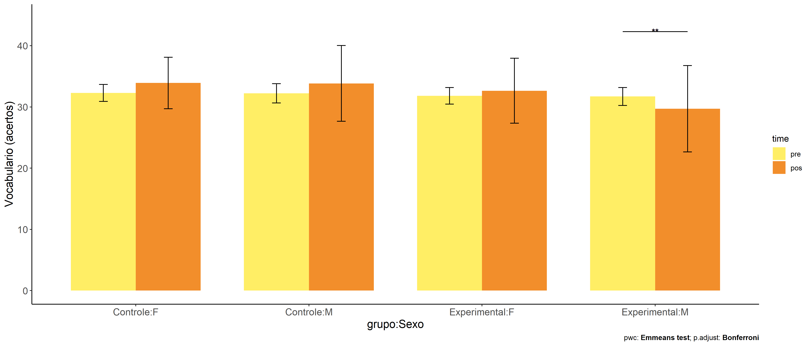<!-- -->

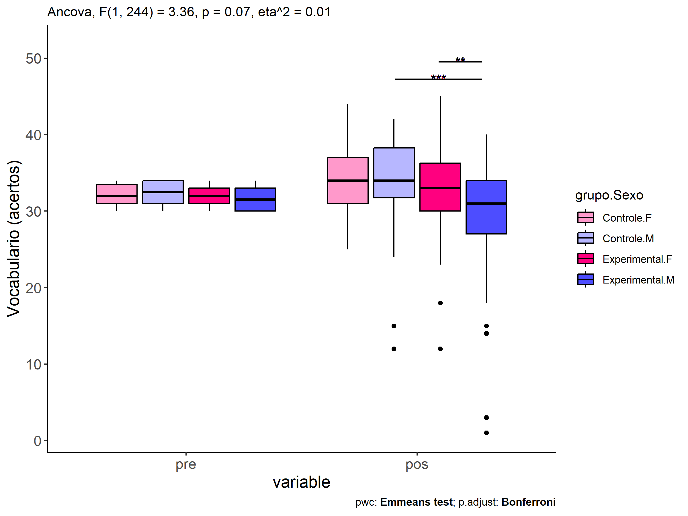<!-- -->

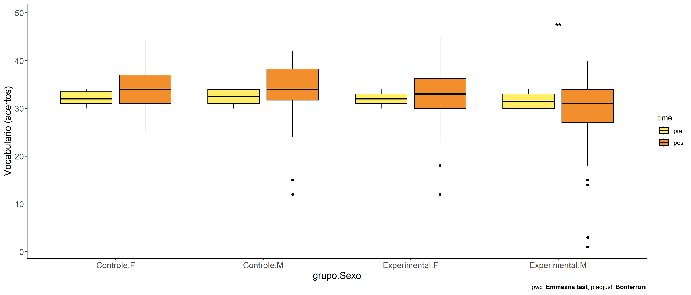<!-- -->

### factores: **grupo:Zona**

| var       | grupo        | Zona   |   n | M (pre) | SE (pre) | M (unadj) | SE (unadj) | M (adj) | SE (adj) |
|:----------|:-------------|:-------|----:|--------:|---------:|----------:|-----------:|--------:|---------:|
| vocab.pos | Controle     | Rural  |  48 |  31.917 |    0.218 |    34.875 |      0.670 |  34.860 |    0.819 |
| vocab.pos | Controle     | Urbana |  21 |  32.381 |    0.312 |    32.667 |      1.293 |  32.348 |    1.247 |
| vocab.pos | Experimental | Rural  |  64 |  31.688 |    0.183 |    30.609 |      0.788 |  30.744 |    0.712 |
| vocab.pos | Experimental | Urbana |  36 |  31.944 |    0.264 |    31.861 |      0.985 |  31.828 |    0.946 |

| .y.       | grupo        | Zona   | group1   | group2       | estimate | conf.low | conf.high |    se | statistic | p       | p.adj   | p.adj.signif |
|:----------|:-------------|:-------|:---------|:-------------|---------:|---------:|----------:|------:|----------:|:--------|:--------|:-------------|
| vocab.pos |              | Rural  | Controle | Experimental |    4.116 |    1.972 |     6.260 | 1.086 |     3.791 | \<0.001 | \<0.001 | \*\*\*       |
| vocab.pos |              | Urbana | Controle | Experimental |    0.521 |   -2.567 |     3.608 | 1.564 |     0.333 | 0.74    | 0.74    | ns           |
| vocab.pre |              | Rural  | Controle | Experimental |    0.229 |   -0.337 |     0.795 | 0.287 |     0.799 | 0.425   | 0.425   | ns           |
| vocab.pre |              | Urbana | Controle | Experimental |    0.437 |   -0.378 |     1.251 | 0.412 |     1.058 | 0.291   | 0.291   | ns           |
| vocab.pos | Controle     |        | Rural    | Urbana       |    2.512 |   -0.433 |     5.456 | 1.491 |     1.684 | 0.094   | 0.094   | ns           |
| vocab.pos | Experimental |        | Rural    | Urbana       |   -1.084 |   -3.423 |     1.256 | 1.185 |    -0.915 | 0.362   | 0.362   | ns           |
| vocab.pre | Controle     |        | Rural    | Urbana       |   -0.464 |   -1.240 |     0.312 | 0.393 |    -1.181 | 0.239   | 0.239   | ns           |
| vocab.pre | Experimental |        | Rural    | Urbana       |   -0.257 |   -0.875 |     0.361 | 0.313 |    -0.821 | 0.413   | 0.413   | ns           |

| .y.   | grupo        | Zona   | group1 | group2 | estimate | conf.low | conf.high |    se | statistic | p       | p.adj   | p.adj.signif |
|:------|:-------------|:-------|:-------|:-------|---------:|---------:|----------:|------:|----------:|:--------|:--------|:-------------|
| vocab | Controle     | Rural  | pre    | pos    |   -2.958 |   -4.644 |    -1.273 | 0.857 |    -3.453 | \<0.001 | \<0.001 | \*\*\*       |
| vocab | Controle     | Urbana | pre    | pos    |   -0.286 |   -2.834 |     2.262 | 1.295 |    -0.221 | 0.826   | 0.826   | ns           |
| vocab | Experimental | Rural  | pre    | pos    |    1.078 |   -0.381 |     2.538 | 0.742 |     1.453 | 0.147   | 0.147   | ns           |
| vocab | Experimental | Urbana | pre    | pos    |    0.083 |   -1.863 |     2.029 | 0.989 |     0.084 | 0.933   | 0.933   | ns           |

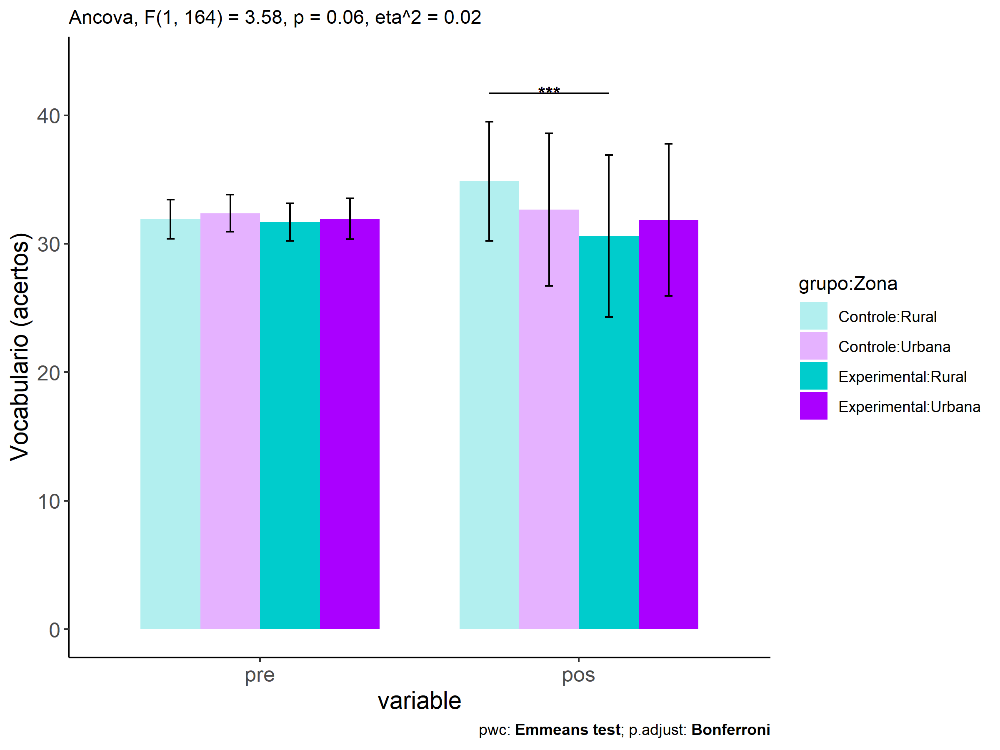<!-- -->

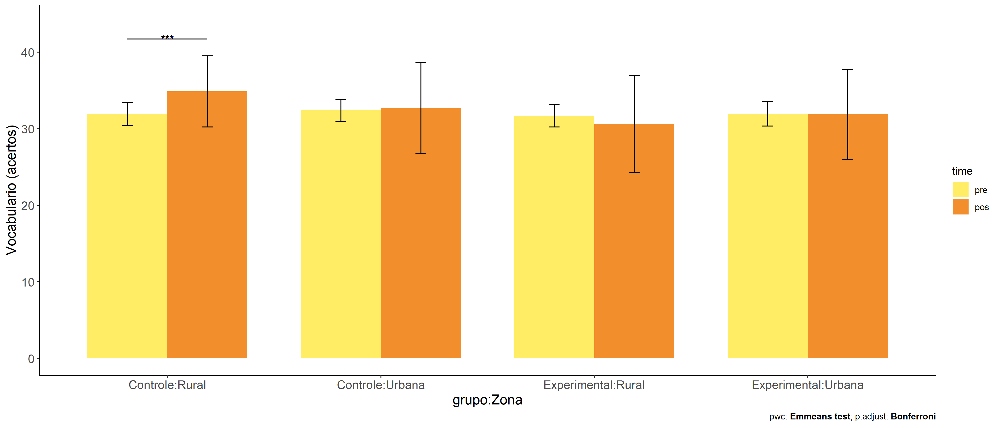<!-- -->

<!-- -->

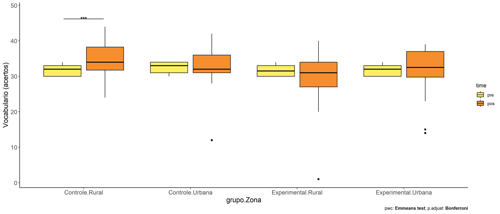<!-- -->

### factores: **grupo:Cor.Raca**

| var       | grupo        | Cor.Raca |   n | M (pre) | SE (pre) | M (unadj) | SE (unadj) | M (adj) | SE (adj) |
|:----------|:-------------|:---------|----:|--------:|---------:|----------:|-----------:|--------:|---------:|
| vocab.pos | Controle     | Branca   |  13 |  32.462 |    0.369 |    35.154 |      1.067 |  34.954 |    1.810 |
| vocab.pos | Controle     | Parda    |  33 |  32.394 |    0.234 |    34.152 |      0.889 |  33.982 |    1.142 |
| vocab.pos | Experimental | Branca   |  12 |  32.000 |    0.389 |    31.667 |      1.563 |  31.671 |    1.872 |
| vocab.pos | Experimental | Indígena |   5 |  32.400 |    0.678 |    34.000 |      0.707 |  33.827 |    2.906 |
| vocab.pos | Experimental | Parda    |  45 |  31.556 |    0.217 |    29.644 |      1.228 |  29.845 |    0.989 |

|     | .y.       | grupo        | Cor.Raca | group1   | group2       | estimate | conf.low | conf.high |    se | statistic |     p | p.adj | p.adj.signif |
|:----|:----------|:-------------|:---------|:---------|:-------------|---------:|---------:|----------:|------:|----------:|------:|------:|:-------------|
| 1   | vocab.pos |              | Branca   | Controle | Experimental |    3.283 |   -1.883 |     8.449 | 2.605 |     1.261 | 0.210 | 0.210 | ns           |
| 3   | vocab.pos |              | Parda    | Controle | Experimental |    4.137 |    1.092 |     7.181 | 1.535 |     2.695 | 0.008 | 0.008 | \*\*         |
| 4   | vocab.pre |              | Branca   | Controle | Experimental |    0.462 |   -0.649 |     1.572 | 0.560 |     0.824 | 0.412 | 0.412 | ns           |
| 6   | vocab.pre |              | Parda    | Controle | Experimental |    0.838 |    0.203 |     1.474 | 0.320 |     2.616 | 0.010 | 0.010 | \*           |
| 8   | vocab.pos | Controle     |          | Branca   | Parda        |    0.972 |   -3.240 |     5.185 | 2.124 |     0.458 | 0.648 | 0.648 | ns           |
| 10  | vocab.pos | Experimental |          | Branca   | Indígena     |   -2.157 |   -9.013 |     4.700 | 3.457 |    -0.624 | 0.534 | 1.000 | ns           |
| 11  | vocab.pos | Experimental |          | Branca   | Parda        |    1.826 |   -2.373 |     6.024 | 2.117 |     0.863 | 0.390 | 1.000 | ns           |
| 12  | vocab.pos | Experimental |          | Indígena | Parda        |    3.982 |   -2.129 |    10.094 | 3.081 |     1.292 | 0.199 | 0.597 | ns           |
| 14  | vocab.pre | Controle     |          | Branca   | Parda        |    0.068 |   -0.841 |     0.976 | 0.458 |     0.148 | 0.883 | 0.883 | ns           |
| 16  | vocab.pre | Experimental |          | Branca   | Indígena     |   -0.400 |   -1.876 |     1.076 | 0.744 |    -0.537 | 0.592 | 1.000 | ns           |
| 17  | vocab.pre | Experimental |          | Branca   | Parda        |    0.444 |   -0.457 |     1.346 | 0.454 |     0.978 | 0.330 | 0.991 | ns           |
| 18  | vocab.pre | Experimental |          | Indígena | Parda        |    0.844 |   -0.463 |     2.152 | 0.659 |     1.281 | 0.203 | 0.609 | ns           |

| .y.   | grupo        | Cor.Raca | group1 | group2 | estimate | conf.low | conf.high |    se | statistic |     p | p.adj | p.adj.signif |
|:------|:-------------|:---------|:-------|:-------|---------:|---------:|----------:|------:|----------:|------:|------:|:-------------|
| vocab | Controle     | Branca   | pre    | pos    |   -2.692 |   -6.319 |     0.934 | 1.839 |    -1.464 | 0.145 | 0.145 | ns           |
| vocab | Controle     | Parda    | pre    | pos    |   -1.758 |   -4.034 |     0.519 | 1.154 |    -1.522 | 0.129 | 0.129 | ns           |
| vocab | Experimental | Branca   | pre    | pos    |    0.333 |   -3.441 |     4.108 | 1.915 |     0.174 | 0.862 | 0.862 | ns           |
| vocab | Experimental | Indígena | pre    | pos    |   -1.600 |   -7.447 |     4.247 | 2.966 |    -0.539 | 0.590 | 0.590 | ns           |
| vocab | Experimental | Parda    | pre    | pos    |    1.911 |   -0.038 |     3.860 | 0.989 |     1.933 | 0.055 | 0.055 | ns           |

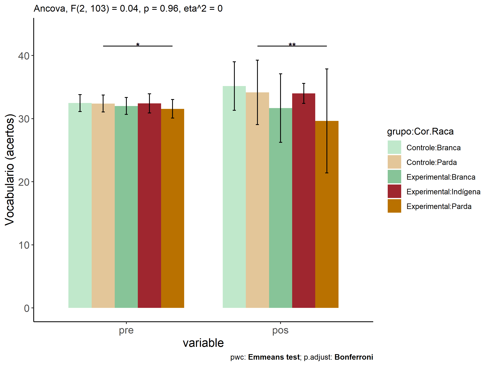<!-- -->

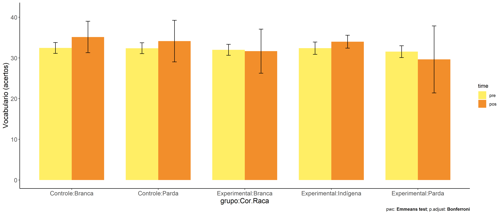<!-- -->

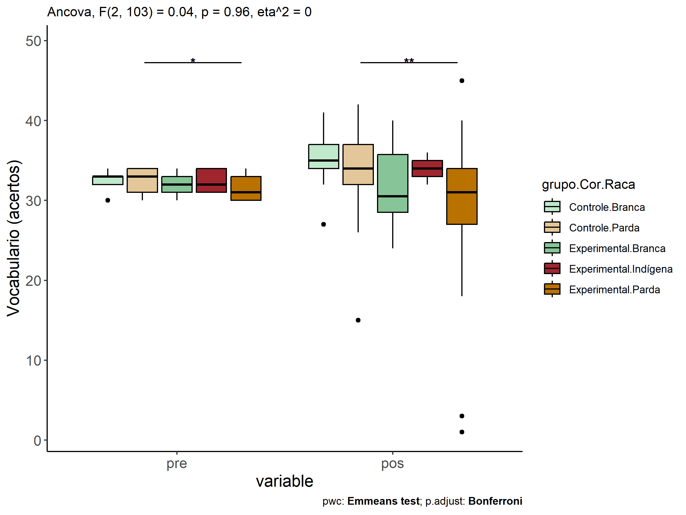<!-- -->

<!-- -->

### factores: **grupo:Serie**

| var       | grupo        | Serie |   n | M (pre) | SE (pre) | M (unadj) | SE (unadj) | M (adj) | SE (adj) |
|:----------|:-------------|:------|----:|--------:|---------:|----------:|-----------:|--------:|---------:|
| vocab.pos | Controle     | 6 ano |  19 |  31.895 |    0.382 |    32.579 |      0.846 |  32.605 |    1.365 |
| vocab.pos | Controle     | 7 ano |  23 |  32.261 |    0.322 |    34.435 |      0.767 |  34.248 |    1.244 |
| vocab.pos | Controle     | 8 ano |  18 |  32.278 |    0.360 |    32.667 |      1.386 |  32.470 |    1.405 |
| vocab.pos | Controle     | 9 ano |  31 |  32.452 |    0.231 |    34.968 |      1.149 |  34.669 |    1.077 |
| vocab.pos | Experimental | 6 ano |  28 |  31.571 |    0.249 |    30.393 |      0.960 |  30.608 |    1.129 |
| vocab.pos | Experimental | 7 ano |  44 |  31.750 |    0.228 |    30.750 |      0.770 |  30.861 |    0.898 |
| vocab.pos | Experimental | 8 ano |  37 |  31.757 |    0.224 |    32.568 |      0.884 |  32.674 |    0.979 |
| vocab.pos | Experimental | 9 ano |  49 |  31.878 |    0.201 |    31.000 |      1.211 |  31.036 |    0.850 |

| .y.       | grupo        | Serie | group1   | group2       | estimate | conf.low | conf.high |    se | statistic |     p | p.adj | p.adj.signif |
|:----------|:-------------|:------|:---------|:-------------|---------:|---------:|----------:|------:|----------:|------:|------:|:-------------|
| vocab.pos |              | 6 ano | Controle | Experimental |    1.998 |   -1.491 |     5.486 | 1.771 |     1.128 | 0.260 | 0.260 | ns           |
| vocab.pos |              | 7 ano | Controle | Experimental |    3.387 |    0.359 |     6.415 | 1.537 |     2.203 | 0.029 | 0.029 | \*           |
| vocab.pos |              | 8 ano | Controle | Experimental |   -0.205 |   -3.584 |     3.175 | 1.716 |    -0.119 | 0.905 | 0.905 | ns           |
| vocab.pos |              | 9 ano | Controle | Experimental |    3.633 |    0.926 |     6.340 | 1.374 |     2.644 | 0.009 | 0.009 | \*\*         |
| vocab.pre |              | 6 ano | Controle | Experimental |    0.323 |   -0.519 |     1.166 | 0.428 |     0.756 | 0.450 | 0.450 | ns           |
| vocab.pre |              | 7 ano | Controle | Experimental |    0.511 |   -0.218 |     1.240 | 0.370 |     1.380 | 0.169 | 0.169 | ns           |
| vocab.pre |              | 8 ano | Controle | Experimental |    0.521 |   -0.293 |     1.335 | 0.413 |     1.260 | 0.209 | 0.209 | ns           |
| vocab.pre |              | 9 ano | Controle | Experimental |    0.574 |   -0.076 |     1.224 | 0.330 |     1.739 | 0.083 | 0.083 | ns           |
| vocab.pos | Controle     |       | 6 ano    | 7 ano        |   -1.642 |   -5.281 |     1.997 | 1.847 |    -0.889 | 0.375 | 1.000 | ns           |
| vocab.pos | Controle     |       | 6 ano    | 8 ano        |    0.136 |   -3.725 |     3.996 | 1.960 |     0.069 | 0.945 | 1.000 | ns           |
| vocab.pos | Controle     |       | 6 ano    | 9 ano        |   -2.064 |   -5.492 |     1.364 | 1.740 |    -1.186 | 0.237 | 1.000 | ns           |
| vocab.pos | Controle     |       | 7 ano    | 8 ano        |    1.778 |   -1.911 |     5.467 | 1.873 |     0.949 | 0.343 | 1.000 | ns           |
| vocab.pos | Controle     |       | 7 ano    | 9 ano        |   -0.422 |   -3.649 |     2.806 | 1.638 |    -0.257 | 0.797 | 1.000 | ns           |
| vocab.pos | Controle     |       | 8 ano    | 9 ano        |   -2.200 |   -5.674 |     1.275 | 1.764 |    -1.247 | 0.214 | 1.000 | ns           |
| vocab.pos | Experimental |       | 6 ano    | 7 ano        |   -0.253 |   -3.088 |     2.582 | 1.439 |    -0.176 | 0.861 | 1.000 | ns           |
| vocab.pos | Experimental |       | 6 ano    | 8 ano        |   -2.067 |   -5.004 |     0.871 | 1.491 |    -1.386 | 0.167 | 1.000 | ns           |
| vocab.pos | Experimental |       | 6 ano    | 9 ano        |   -0.429 |   -3.210 |     2.353 | 1.412 |    -0.304 | 0.762 | 1.000 | ns           |
| vocab.pos | Experimental |       | 7 ano    | 8 ano        |   -1.814 |   -4.428 |     0.801 | 1.327 |    -1.366 | 0.173 | 1.000 | ns           |
| vocab.pos | Experimental |       | 7 ano    | 9 ano        |   -0.176 |   -2.611 |     2.260 | 1.236 |    -0.142 | 0.887 | 1.000 | ns           |
| vocab.pos | Experimental |       | 8 ano    | 9 ano        |    1.638 |   -0.916 |     4.192 | 1.296 |     1.264 | 0.208 | 1.000 | ns           |
| vocab.pre | Controle     |       | 6 ano    | 7 ano        |   -0.366 |   -1.245 |     0.512 | 0.446 |    -0.821 | 0.412 | 1.000 | ns           |
| vocab.pre | Controle     |       | 6 ano    | 8 ano        |   -0.383 |   -1.315 |     0.549 | 0.473 |    -0.810 | 0.419 | 1.000 | ns           |
| vocab.pre | Controle     |       | 6 ano    | 9 ano        |   -0.557 |   -1.382 |     0.269 | 0.419 |    -1.329 | 0.185 | 1.000 | ns           |
| vocab.pre | Controle     |       | 7 ano    | 8 ano        |   -0.017 |   -0.909 |     0.875 | 0.453 |    -0.037 | 0.970 | 1.000 | ns           |
| vocab.pre | Controle     |       | 7 ano    | 9 ano        |   -0.191 |   -0.971 |     0.589 | 0.396 |    -0.482 | 0.630 | 1.000 | ns           |
| vocab.pre | Controle     |       | 8 ano    | 9 ano        |   -0.174 |   -1.014 |     0.666 | 0.426 |    -0.408 | 0.684 | 1.000 | ns           |
| vocab.pre | Experimental |       | 6 ano    | 7 ano        |   -0.179 |   -0.864 |     0.506 | 0.348 |    -0.514 | 0.608 | 1.000 | ns           |
| vocab.pre | Experimental |       | 6 ano    | 8 ano        |   -0.185 |   -0.895 |     0.524 | 0.360 |    -0.514 | 0.607 | 1.000 | ns           |
| vocab.pre | Experimental |       | 6 ano    | 9 ano        |   -0.306 |   -0.977 |     0.365 | 0.341 |    -0.898 | 0.370 | 1.000 | ns           |
| vocab.pre | Experimental |       | 7 ano    | 8 ano        |   -0.007 |   -0.639 |     0.625 | 0.321 |    -0.021 | 0.983 | 1.000 | ns           |
| vocab.pre | Experimental |       | 7 ano    | 9 ano        |   -0.128 |   -0.716 |     0.461 | 0.299 |    -0.427 | 0.670 | 1.000 | ns           |
| vocab.pre | Experimental |       | 8 ano    | 9 ano        |   -0.121 |   -0.738 |     0.496 | 0.313 |    -0.386 | 0.700 | 1.000 | ns           |

| .y.   | grupo        | Serie | group1 | group2 | estimate | conf.low | conf.high |    se | statistic |     p | p.adj | p.adj.signif |
|:------|:-------------|:------|:-------|:-------|---------:|---------:|----------:|------:|----------:|------:|------:|:-------------|
| vocab | Controle     | 6 ano | pre    | pos    |   -0.684 |   -3.464 |     2.096 | 1.415 |    -0.484 | 0.629 | 0.629 | ns           |
| vocab | Controle     | 7 ano | pre    | pos    |   -2.174 |   -4.701 |     0.353 | 1.286 |    -1.691 | 0.092 | 0.092 | ns           |
| vocab | Controle     | 8 ano | pre    | pos    |   -0.389 |   -3.245 |     2.467 | 1.454 |    -0.268 | 0.789 | 0.789 | ns           |
| vocab | Controle     | 9 ano | pre    | pos    |   -2.516 |   -4.693 |    -0.340 | 1.108 |    -2.272 | 0.024 | 0.024 | \*           |
| vocab | Experimental | 6 ano | pre    | pos    |    1.179 |   -1.111 |     3.469 | 1.165 |     1.011 | 0.312 | 0.312 | ns           |
| vocab | Experimental | 7 ano | pre    | pos    |    1.000 |   -0.827 |     2.827 | 0.930 |     1.076 | 0.283 | 0.283 | ns           |
| vocab | Experimental | 8 ano | pre    | pos    |   -0.811 |   -2.803 |     1.181 | 1.014 |    -0.800 | 0.424 | 0.424 | ns           |
| vocab | Experimental | 9 ano | pre    | pos    |    0.878 |   -0.854 |     2.609 | 0.881 |     0.996 | 0.320 | 0.320 | ns           |

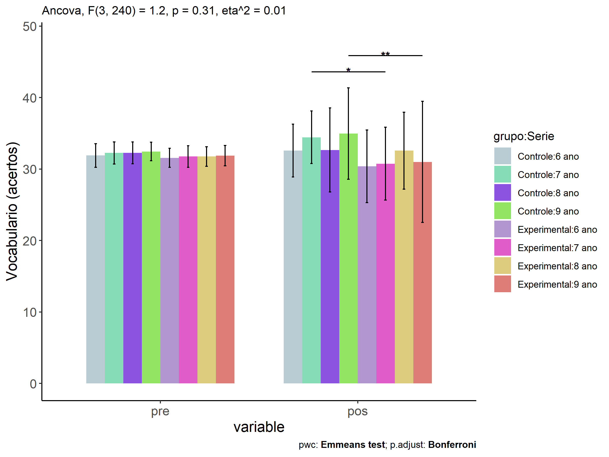<!-- -->

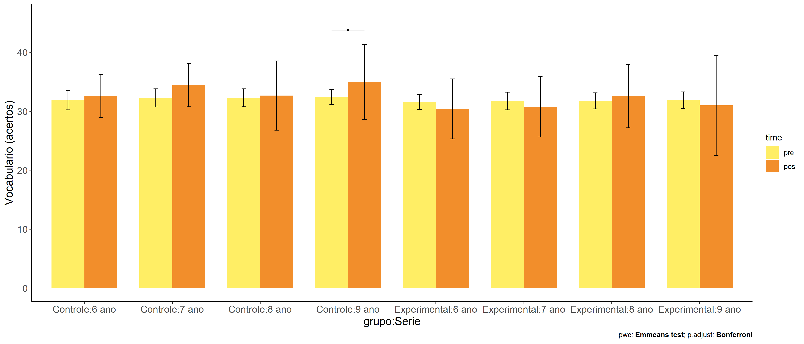<!-- -->

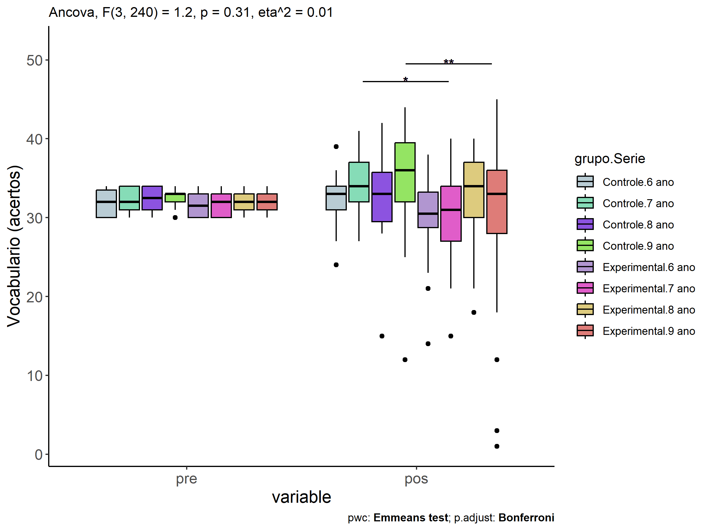<!-- -->

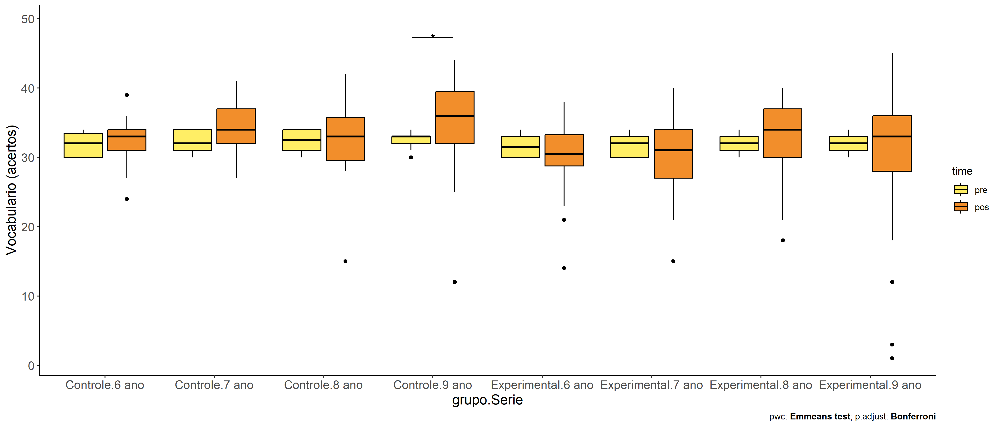<!-- -->
