ANCOVA in Vocabulario (acertos) (Vocabulario (acertos))
================
Geiser C. Challco <geiser@alumni.usp.br>

- [Descriptive Statistics of Initial
  Data](#descriptive-statistics-of-initial-data)
- [Checking of Assumptions](#checking-of-assumptions)
  - [Assumption: Normality distribution of
    data](#assumption-normality-distribution-of-data)
  - [Assumption: Homogeneity of data
    distribution](#assumption-homogeneity-of-data-distribution)
- [Computation of ANCOVA test and Pairwise
  Comparison](#computation-of-ancova-test-and-pairwise-comparison)
  - [ANCOVA tests for one factor](#ancova-tests-for-one-factor)
  - [ANCOVA tests for two factors](#ancova-tests-for-two-factors)
  - [Pairwise comparisons for one factor:
    **grupo**](#pairwise-comparisons-for-one-factor-grupo)
  - [Pairwise comparisons for two
    factors](#pairwise-comparisons-for-two-factors)
    - [factores: **grupo:Sexo**](#factores-gruposexo)
    - [factores: **grupo:Zona**](#factores-grupozona)
    - [factores: **grupo:Cor.Raca**](#factores-grupocorraca)
    - [factores: **grupo:vocab.quintile**](#factores-grupovocabquintile)

**NOTE**

- Teste ANCOVA para determinar se houve diferenças significativas no
  Vocabulario (acertos) (medido usando pre- e pos-testes).
- ANCOVA test to determine whether there were significant differences in
  Vocabulario (acertos) (measured using pre- and post-tests).

# Descriptive Statistics of Initial Data

| grupo        | Sexo | Zona   | Cor.Raca | vocab.quintile | variable  |   n |   mean | median | min | max |     sd |    se |     ci |   iqr |
|:-------------|:-----|:-------|:---------|:---------------|:----------|----:|-------:|-------:|----:|----:|-------:|------:|-------:|------:|
| Controle     | F    |        |          |                | vocab.pre |  65 | 22.846 |   23.0 |   7 |  39 |  8.275 | 1.026 |  2.050 | 14.00 |
| Controle     | M    |        |          |                | vocab.pre |  81 | 20.148 |   18.0 |   4 |  41 |  8.804 | 0.978 |  1.947 | 13.00 |
| Experimental | F    |        |          |                | vocab.pre |  88 | 24.261 |   25.5 |   6 |  43 |  8.732 | 0.931 |  1.850 | 12.25 |
| Experimental | M    |        |          |                | vocab.pre |  77 | 21.584 |   20.0 |   6 |  38 |  8.152 | 0.929 |  1.850 | 12.00 |
| Controle     | F    |        |          |                | vocab.pos |  65 | 24.723 |   25.0 |   4 |  39 |  8.438 | 1.047 |  2.091 | 14.00 |
| Controle     | M    |        |          |                | vocab.pos |  81 | 20.556 |   19.0 |   2 |  40 |  9.098 | 1.011 |  2.012 | 14.00 |
| Experimental | F    |        |          |                | vocab.pos |  88 | 26.432 |   27.0 |   2 |  44 |  9.156 | 0.976 |  1.940 | 14.00 |
| Experimental | M    |        |          |                | vocab.pos |  77 | 23.013 |   21.0 |   6 |  42 |  8.908 | 1.015 |  2.022 | 14.00 |
| Controle     |      | Rural  |          |                | vocab.pre |  97 | 22.134 |   23.0 |   4 |  39 |  8.309 | 0.844 |  1.675 | 13.00 |
| Controle     |      | Urbana |          |                | vocab.pre |  28 | 23.214 |   21.5 |  10 |  41 | 10.082 | 1.905 |  3.910 | 18.25 |
| Controle     |      |        |          |                | vocab.pre |  21 | 15.238 |   14.0 |   6 |  25 |  5.157 | 1.125 |  2.347 |  7.00 |
| Experimental |      | Rural  |          |                | vocab.pre |  85 | 21.941 |   22.0 |   6 |  43 |  8.324 | 0.903 |  1.796 | 14.00 |
| Experimental |      | Urbana |          |                | vocab.pre |  38 | 24.316 |   25.5 |   9 |  38 |  8.737 | 1.417 |  2.872 | 13.50 |
| Experimental |      |        |          |                | vocab.pre |  42 | 24.000 |   24.0 |   9 |  39 |  8.737 | 1.348 |  2.723 | 13.50 |
| Controle     |      | Rural  |          |                | vocab.pos |  97 | 22.928 |   24.0 |   2 |  40 |  9.275 | 0.942 |  1.869 | 15.00 |
| Controle     |      | Urbana |          |                | vocab.pos |  28 | 24.821 |   23.0 |   9 |  38 |  8.710 | 1.646 |  3.377 | 14.00 |
| Controle     |      |        |          |                | vocab.pos |  21 | 16.810 |   17.0 |   5 |  28 |  5.706 | 1.245 |  2.597 |  5.00 |
| Experimental |      | Rural  |          |                | vocab.pos |  85 | 23.741 |   23.0 |   2 |  42 |  8.580 | 0.931 |  1.851 | 12.00 |
| Experimental |      | Urbana |          |                | vocab.pos |  38 | 26.158 |   25.0 |   9 |  41 |  9.579 | 1.554 |  3.149 | 16.50 |
| Experimental |      |        |          |                | vocab.pos |  42 | 25.857 |   27.0 |   8 |  44 |  9.894 | 1.527 |  3.083 | 16.50 |
| Controle     |      |        | Branca   |                | vocab.pre |  22 | 23.000 |   24.5 |   8 |  36 |  7.400 | 1.578 |  3.281 |  5.75 |
| Controle     |      |        | Indígena |                | vocab.pre |   2 | 24.000 |   24.0 |  23 |  25 |  1.414 | 1.000 | 12.706 |  1.00 |
| Controle     |      |        | Parda    |                | vocab.pre |  42 | 21.405 |   19.5 |   7 |  39 |  9.240 | 1.426 |  2.879 | 16.00 |
| Controle     |      |        | Preta    |                | vocab.pre |   1 | 19.000 |   19.0 |  19 |  19 |        |       |        |  0.00 |
| Controle     |      |        |          |                | vocab.pre |  79 | 20.823 |   19.0 |   4 |  41 |  8.837 | 0.994 |  1.979 | 13.00 |
| Experimental |      |        | Branca   |                | vocab.pre |  18 | 25.500 |   25.5 |  12 |  38 |  8.053 | 1.898 |  4.005 | 11.25 |
| Experimental |      |        | Indígena |                | vocab.pre |  13 | 21.000 |   22.0 |  12 |  34 |  7.506 | 2.082 |  4.536 | 13.00 |
| Experimental |      |        | Parda    |                | vocab.pre |  44 | 21.795 |   21.5 |   6 |  35 |  8.154 | 1.229 |  2.479 | 13.25 |
| Experimental |      |        | Preta    |                | vocab.pre |   1 | 10.000 |   10.0 |  10 |  10 |        |       |        |  0.00 |
| Experimental |      |        |          |                | vocab.pre |  89 | 23.551 |   23.0 |   9 |  43 |  8.865 | 0.940 |  1.867 | 14.00 |
| Controle     |      |        | Branca   |                | vocab.pos |  22 | 23.727 |   24.5 |  10 |  37 |  8.282 | 1.766 |  3.672 | 12.00 |
| Controle     |      |        | Indígena |                | vocab.pos |   2 | 30.000 |   30.0 |  29 |  31 |  1.414 | 1.000 | 12.706 |  1.00 |
| Controle     |      |        | Parda    |                | vocab.pos |  42 | 22.167 |   21.0 |   4 |  39 |  9.845 | 1.519 |  3.068 | 18.00 |
| Controle     |      |        | Preta    |                | vocab.pos |   1 | 24.000 |   24.0 |  24 |  24 |        |       |        |  0.00 |
| Controle     |      |        |          |                | vocab.pos |  79 | 21.962 |   21.0 |   2 |  40 |  8.926 | 1.004 |  1.999 | 11.50 |
| Experimental |      |        | Branca   |                | vocab.pos |  18 | 24.333 |   21.0 |   6 |  41 | 11.314 | 2.667 |  5.626 | 18.50 |
| Experimental |      |        | Indígena |                | vocab.pos |  13 | 24.308 |   23.0 |  13 |  39 |  8.625 | 2.392 |  5.212 | 15.00 |
| Experimental |      |        | Parda    |                | vocab.pos |  44 | 24.477 |   25.0 |   9 |  42 |  8.188 | 1.234 |  2.489 | 12.25 |
| Experimental |      |        | Preta    |                | vocab.pos |   1 | 13.000 |   13.0 |  13 |  13 |        |       |        |  0.00 |
| Experimental |      |        |          |                | vocab.pos |  89 | 25.326 |   25.0 |   2 |  44 |  9.340 | 0.990 |  1.968 | 14.00 |
| Controle     |      |        |          | 1st quintile   | vocab.pre |  50 | 12.140 |   12.5 |   4 |  16 |  2.942 | 0.416 |  0.836 |  3.75 |
| Controle     |      |        |          | 2nd quintile   | vocab.pre |  31 | 19.226 |   19.0 |  17 |  22 |  1.802 | 0.324 |  0.661 |  3.00 |
| Controle     |      |        |          | 3rd quintile   | vocab.pre |  33 | 25.061 |   25.0 |  23 |  29 |  1.767 | 0.308 |  0.626 |  2.00 |
| Controle     |      |        |          | 4th quintile   | vocab.pre |  19 | 31.895 |   32.0 |  30 |  34 |  1.663 | 0.382 |  0.802 |  3.50 |
| Controle     |      |        |          | 5th quintile   | vocab.pre |  13 | 37.000 |   37.0 |  35 |  41 |  1.871 | 0.519 |  1.131 |  3.00 |
| Experimental |      |        |          | 1st quintile   | vocab.pre |  48 | 12.667 |   13.0 |   6 |  16 |  2.747 | 0.396 |  0.798 |  5.25 |
| Experimental |      |        |          | 2nd quintile   | vocab.pre |  32 | 19.781 |   20.0 |  17 |  22 |  1.736 | 0.307 |  0.626 |  3.00 |
| Experimental |      |        |          | 3rd quintile   | vocab.pre |  40 | 26.050 |   26.0 |  23 |  29 |  2.075 | 0.328 |  0.664 |  4.00 |
| Experimental |      |        |          | 4th quintile   | vocab.pre |  28 | 31.571 |   31.5 |  30 |  34 |  1.317 | 0.249 |  0.511 |  3.00 |
| Experimental |      |        |          | 5th quintile   | vocab.pre |  17 | 37.059 |   37.0 |  35 |  43 |  2.076 | 0.503 |  1.067 |  3.00 |
| Controle     |      |        |          | 1st quintile   | vocab.pos |  50 | 14.200 |   15.0 |   2 |  26 |  4.949 | 0.700 |  1.406 |  6.00 |
| Controle     |      |        |          | 2nd quintile   | vocab.pos |  31 | 20.484 |   21.0 |  10 |  29 |  5.072 | 0.911 |  1.860 |  7.50 |
| Controle     |      |        |          | 3rd quintile   | vocab.pos |  33 | 25.091 |   25.0 |   9 |  38 |  5.897 | 1.027 |  2.091 |  7.00 |
| Controle     |      |        |          | 4th quintile   | vocab.pos |  19 | 32.579 |   33.0 |  24 |  39 |  3.687 | 0.846 |  1.777 |  3.00 |
| Controle     |      |        |          | 5th quintile   | vocab.pos |  13 | 36.923 |   37.0 |  33 |  40 |  2.060 | 0.571 |  1.245 |  2.00 |
| Experimental |      |        |          | 1st quintile   | vocab.pos |  48 | 17.958 |   16.5 |   2 |  42 |  7.423 | 1.071 |  2.155 |  9.25 |
| Experimental |      |        |          | 2nd quintile   | vocab.pos |  32 | 20.594 |   21.0 |   6 |  35 |  5.780 | 1.022 |  2.084 |  6.25 |
| Experimental |      |        |          | 3rd quintile   | vocab.pos |  40 | 27.400 |   30.0 |  13 |  44 |  7.815 | 1.236 |  2.499 | 12.25 |
| Experimental |      |        |          | 4th quintile   | vocab.pos |  28 | 30.393 |   30.5 |  14 |  38 |  5.080 | 0.960 |  1.970 |  4.50 |
| Experimental |      |        |          | 5th quintile   | vocab.pos |  17 | 37.059 |   40.0 |  21 |  43 |  6.057 | 1.469 |  3.114 |  5.00 |

# Checking of Assumptions

## Assumption: Normality distribution of data

| var       |   n |   skewness | kurtosis | symmetry | statistic | method     |         p | p.signif | normality |
|:----------|----:|-----------:|---------:|:---------|----------:|:-----------|----------:|:---------|:----------|
| vocab.pos | 311 | -0.0150403 | 1.646750 | YES      |  14.66520 | D’Agostino | 0.0006539 | \*\*     | \-        |
| vocab.pos | 248 | -0.1200423 | 1.536575 | YES      |  12.03081 | D’Agostino | 0.0024409 | \*       | \-        |
| vocab.pos | 143 |  0.2962292 | 2.451745 | YES      |  15.10520 | D’Agostino | 0.0005247 | \*\*     | QQ        |
| vocab.pos | 311 | -0.0961736 | 1.213062 | YES      |  10.68485 | D’Agostino | 0.0047843 | \*       | \-        |

## Assumption: Homogeneity of data distribution

| var       | method         | formula                          |   n | DFn.df1 | DFd.df2 | statistic |         p | p.signif |
|:----------|:---------------|:---------------------------------|----:|--------:|--------:|----------:|----------:|:---------|
| vocab.pos | Levene’s test  | `.res`~`grupo`\*`Sexo`           | 311 |       3 |     307 |  2.895554 | 0.0354300 | ns       |
| vocab.pos | Anova’s slopes | `.res`~`grupo`\*`Sexo`           | 311 |       3 |     303 |  1.146000 | 0.3310000 | ns       |
| vocab.pos | Levene’s test  | `.res`~`grupo`\*`Zona`           | 248 |       3 |     244 |  2.518902 | 0.0586674 | ns       |
| vocab.pos | Anova’s slopes | `.res`~`grupo`\*`Zona`           | 248 |       3 |     240 |  2.613000 | 0.0520000 | ns       |
| vocab.pos | Levene’s test  | `.res`~`grupo`\*`Cor.Raca`       | 143 |       7 |     135 |  1.906101 | 0.0731804 | ns       |
| vocab.pos | Anova’s slopes | `.res`~`grupo`\*`Cor.Raca`       | 143 |       5 |     129 |  2.228000 | 0.0550000 | ns       |
| vocab.pos | Levene’s test  | `.res`~`grupo`\*`vocab.quintile` | 311 |       9 |     301 |  2.625356 | 0.0061768 | \*       |
| vocab.pos | Anova’s slopes | `.res`~`grupo`\*`vocab.quintile` | 311 |       9 |     291 |  0.381000 | 0.9440000 | ns       |

# Computation of ANCOVA test and Pairwise Comparison

## ANCOVA tests for one factor

|     | Effect         | DFn | DFd |       SSn |       SSd |       F | p       |   ges | p\<.05 |
|:----|:---------------|----:|----:|----------:|----------:|--------:|:--------|------:|:-------|
| 1   | vocab.pre      |   1 | 308 | 14881.445 | 10728.479 | 427.226 | \<0.001 | 0.581 | \*     |
| 2   | grupo          |   1 | 308 |    89.959 | 10728.479 |   2.583 | 0.109   | 0.008 |        |
| 4   | Sexo           |   1 | 308 |   221.398 | 10597.041 |   6.435 | 0.012   | 0.020 | \*     |
| 6   | Zona           |   1 | 245 |    32.895 |  8209.229 |   0.982 | 0.323   | 0.004 |        |
| 8   | Cor.Raca       |   3 | 138 |   143.089 |  4489.565 |   1.466 | 0.227   | 0.031 |        |
| 10  | vocab.quintile |   4 | 305 |   183.234 | 10635.204 |   1.314 | 0.265   | 0.017 |        |

## ANCOVA tests for two factors

|     | Effect               | DFn | DFd |       SSn |       SSd |       F | p       |   ges | p\<.05 |
|:----|:---------------------|----:|----:|----------:|----------:|--------:|:--------|------:|:-------|
| 1   | vocab.pre            |   1 | 306 | 13987.621 | 10515.972 | 407.020 | \<0.001 | 0.571 | \*     |
| 4   | grupo:Sexo           |   1 | 306 |    10.288 | 10515.972 |   0.299 | 0.585   | 0.001 |        |
| 8   | grupo:Zona           |   1 | 243 |     3.223 |  8163.466 |   0.096 | 0.757   | 0.000 |        |
| 12  | grupo:Cor.Raca       |   3 | 134 |   117.532 |  4360.232 |   1.204 | 0.311   | 0.026 |        |
| 16  | grupo:vocab.quintile |   4 | 300 |   287.202 | 10241.651 |   2.103 | 0.08    | 0.027 |        |

## Pairwise comparisons for one factor: **grupo**

| var       | grupo        |   n | M (pre) | SE (pre) | M (unadj) | SE (unadj) | M (adj) | SE (adj) |
|:----------|:-------------|----:|--------:|---------:|----------:|-----------:|--------:|---------:|
| vocab.pos | Controle     | 146 |  21.349 |    0.716 |    22.411 |      0.747 |  23.123 |     0.49 |
| vocab.pos | Experimental | 165 |  23.012 |    0.665 |    24.836 |      0.714 |  24.206 |     0.46 |

| .y.       | group1   | group2       | estimate | conf.low | conf.high |    se | statistic |     p | p.adj | p.adj.signif |
|:----------|:---------|:-------------|---------:|---------:|----------:|------:|----------:|------:|------:|:-------------|
| vocab.pos | Controle | Experimental |   -1.083 |   -2.408 |     0.243 | 0.674 |    -1.607 | 0.109 | 0.109 | ns           |
| vocab.pre | Controle | Experimental |   -1.663 |   -3.584 |     0.259 | 0.976 |    -1.703 | 0.090 | 0.090 | ns           |

| .y.   | grupo        | group1 | group2 | estimate | conf.low | conf.high |    se | statistic |     p | p.adj | p.adj.signif |
|:------|:-------------|:-------|:-------|---------:|---------:|----------:|------:|----------:|------:|------:|:-------------|
| vocab | Controle     | pre    | pos    |   -1.062 |   -3.096 |     0.973 | 1.036 |    -1.025 | 0.306 | 0.306 | ns           |
| vocab | Experimental | pre    | pos    |   -1.824 |   -3.738 |     0.090 | 0.975 |    -1.872 | 0.062 | 0.062 | ns           |

    ## Scale for colour is already present.
    ## Adding another scale for colour, which will replace the existing scale.

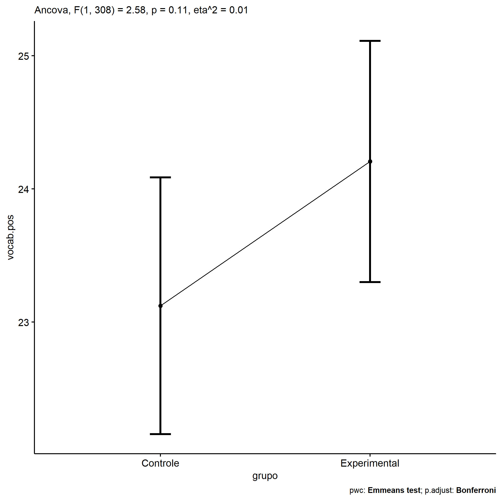<!-- -->

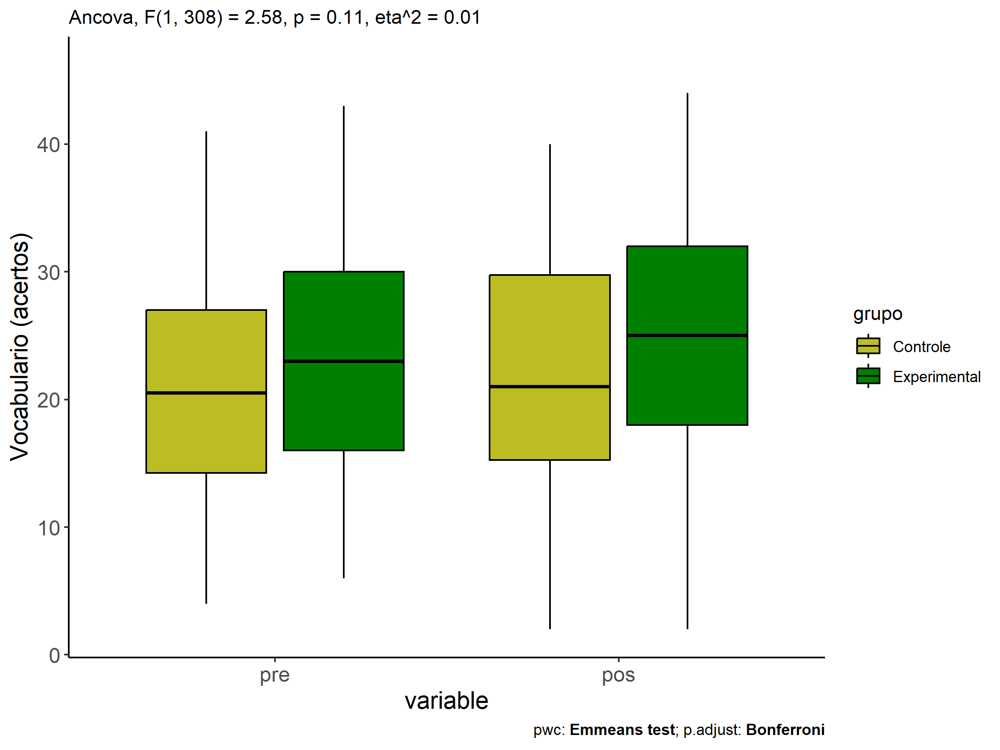<!-- -->

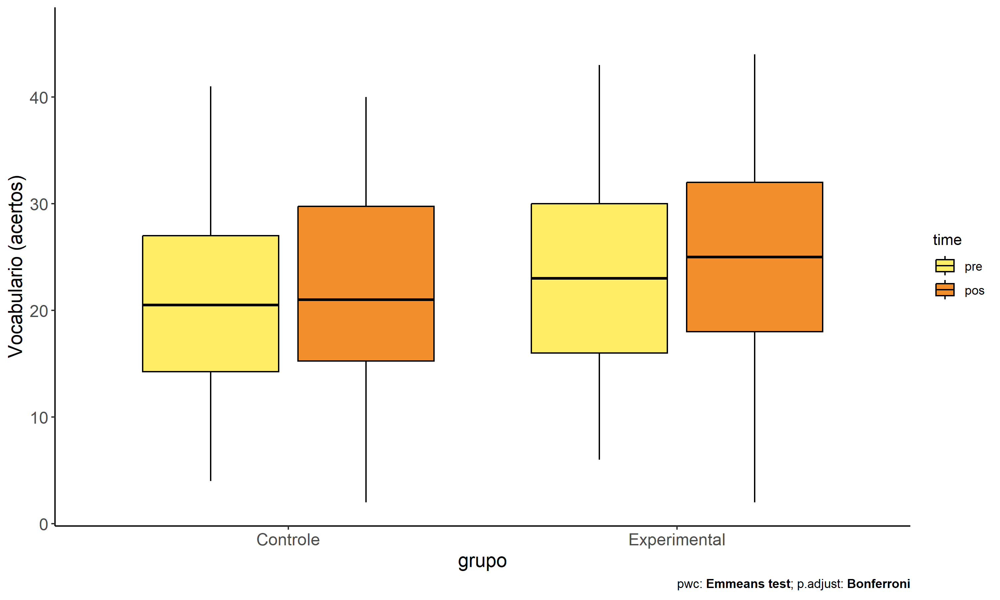<!-- -->

## Pairwise comparisons for two factors

### factores: **grupo:Sexo**

| var       | grupo        | Sexo |   n | M (pre) | SE (pre) | M (unadj) | SE (unadj) | M (adj) | SE (adj) |
|:----------|:-------------|:-----|----:|--------:|---------:|----------:|-----------:|--------:|---------:|
| vocab.pos | Controle     | F    |  65 |  22.846 |    1.026 |    24.723 |      1.047 |  24.236 |    0.728 |
| vocab.pos | Controle     | M    |  81 |  20.148 |    0.978 |    20.556 |      1.011 |  22.207 |    0.656 |
| vocab.pos | Experimental | F    |  88 |  24.261 |    0.931 |    26.432 |      0.976 |  24.823 |    0.630 |
| vocab.pos | Experimental | M    |  77 |  21.584 |    0.929 |    23.013 |      1.015 |  23.526 |    0.669 |

| .y.       | grupo        | Sexo | group1   | group2       | estimate | conf.low | conf.high |    se | statistic |     p | p.adj | p.adj.signif |
|:----------|:-------------|:-----|:---------|:-------------|---------:|---------:|----------:|------:|----------:|------:|------:|:-------------|
| vocab.pos |              | F    | Controle | Experimental |   -0.587 |   -2.477 |     1.303 | 0.960 |    -0.611 | 0.541 | 0.541 | ns           |
| vocab.pos |              | M    | Controle | Experimental |   -1.319 |   -3.158 |     0.520 | 0.935 |    -1.411 | 0.159 | 0.159 | ns           |
| vocab.pre |              | F    | Controle | Experimental |   -1.415 |   -4.156 |     1.326 | 1.393 |    -1.016 | 0.310 | 0.310 | ns           |
| vocab.pre |              | M    | Controle | Experimental |   -1.436 |   -4.103 |     1.231 | 1.355 |    -1.060 | 0.290 | 0.290 | ns           |
| vocab.pos | Controle     |      | F        | M            |    2.029 |    0.097 |     3.961 | 0.982 |     2.066 | 0.040 | 0.040 | \*           |
| vocab.pos | Experimental |      | F        | M            |    1.297 |   -0.515 |     3.109 | 0.921 |     1.409 | 0.160 | 0.160 | ns           |
| vocab.pre | Controle     |      | F        | M            |    2.698 |   -0.093 |     5.489 | 1.418 |     1.902 | 0.058 | 0.058 | ns           |
| vocab.pre | Experimental |      | F        | M            |    2.677 |    0.062 |     5.292 | 1.329 |     2.014 | 0.045 | 0.045 | \*           |

| .y.   | grupo        | Sexo | group1 | group2 | estimate | conf.low | conf.high |    se | statistic |     p | p.adj | p.adj.signif |
|:------|:-------------|:-----|:-------|:-------|---------:|---------:|----------:|------:|----------:|------:|------:|:-------------|
| vocab | Controle     | F    | pre    | pos    |   -1.877 |   -4.883 |     1.130 | 1.531 |    -1.226 | 0.221 | 0.221 | ns           |
| vocab | Controle     | M    | pre    | pos    |   -0.407 |   -3.101 |     2.286 | 1.371 |    -0.297 | 0.767 | 0.767 | ns           |
| vocab | Experimental | F    | pre    | pos    |   -2.170 |   -4.754 |     0.413 | 1.316 |    -1.650 | 0.100 | 0.100 | ns           |
| vocab | Experimental | M    | pre    | pos    |   -1.429 |   -4.191 |     1.334 | 1.407 |    -1.016 | 0.310 | 0.310 | ns           |

    ## Scale for colour is already present.
    ## Adding another scale for colour, which will replace the existing scale.

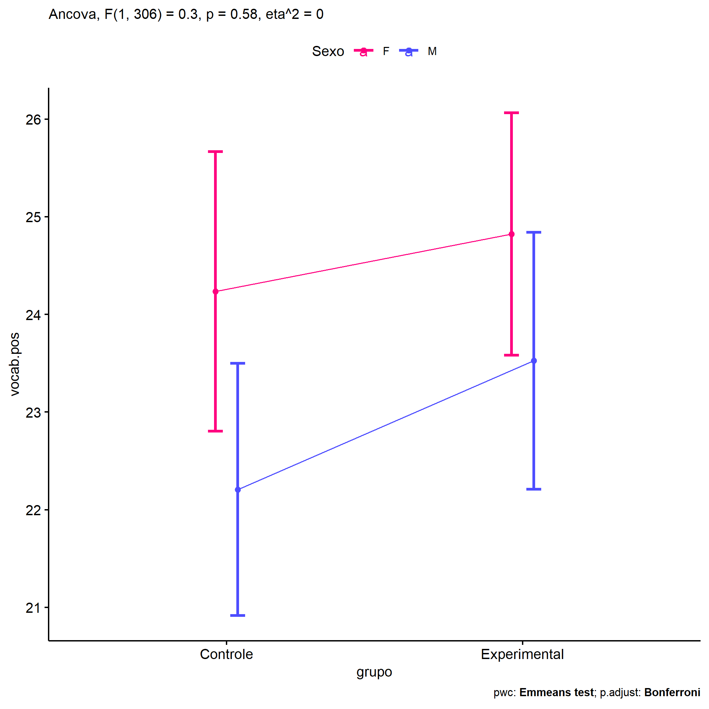<!-- -->

    ## Scale for colour is already present.
    ## Adding another scale for colour, which will replace the existing scale.

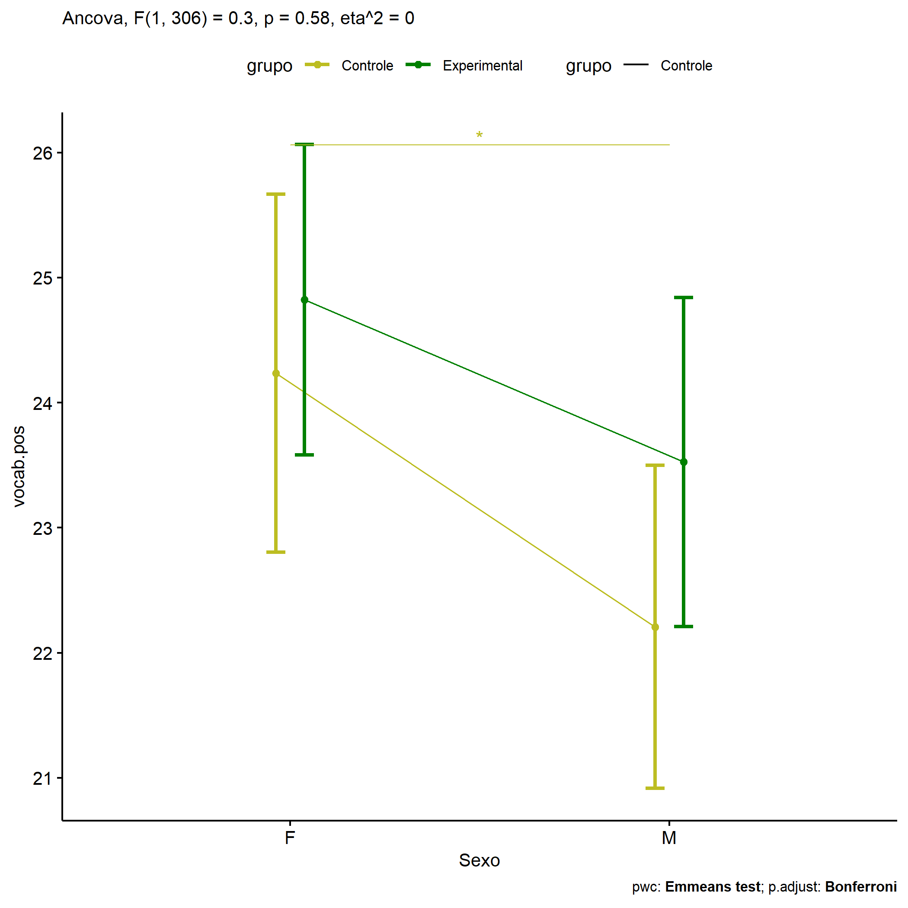<!-- -->

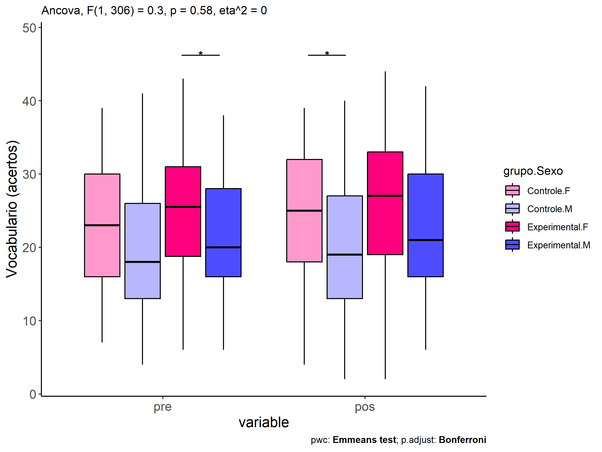<!-- -->

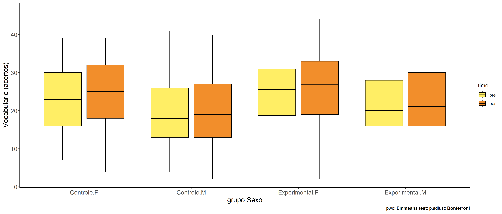<!-- -->

### factores: **grupo:Zona**

| var       | grupo        | Zona   |   n | M (pre) | SE (pre) | M (unadj) | SE (unadj) | M (adj) | SE (adj) |
|:----------|:-------------|:-------|----:|--------:|---------:|----------:|-----------:|--------:|---------:|
| vocab.pos | Controle     | Rural  |  97 |  22.134 |    0.844 |    22.928 |      0.942 |  23.243 |    0.589 |
| vocab.pos | Controle     | Urbana |  28 |  23.214 |    1.905 |    24.821 |      1.646 |  24.265 |    1.096 |
| vocab.pos | Experimental | Rural  |  85 |  21.941 |    0.903 |    23.741 |      0.931 |  24.211 |    0.629 |
| vocab.pos | Experimental | Urbana |  38 |  24.316 |    1.417 |    26.158 |      1.554 |  24.713 |    0.943 |

| .y.       | grupo        | Zona   | group1   | group2       | estimate | conf.low | conf.high |    se | statistic |     p | p.adj | p.adj.signif |
|:----------|:-------------|:-------|:---------|:-------------|---------:|---------:|----------:|------:|----------:|------:|------:|:-------------|
| vocab.pos |              | Rural  | Controle | Experimental |   -0.969 |   -2.665 |     0.727 | 0.861 |    -1.125 | 0.262 | 0.262 | ns           |
| vocab.pos |              | Urbana | Controle | Experimental |   -0.448 |   -3.293 |     2.397 | 1.444 |    -0.310 | 0.757 | 0.757 | ns           |
| vocab.pre |              | Rural  | Controle | Experimental |    0.193 |   -2.322 |     2.708 | 1.277 |     0.151 | 0.880 | 0.880 | ns           |
| vocab.pre |              | Urbana | Controle | Experimental |   -1.102 |   -5.317 |     3.114 | 2.140 |    -0.515 | 0.607 | 0.607 | ns           |
| vocab.pos | Controle     |        | Rural    | Urbana       |   -1.022 |   -3.473 |     1.429 | 1.244 |    -0.822 | 0.412 | 0.412 | ns           |
| vocab.pos | Experimental |        | Rural    | Urbana       |   -0.501 |   -2.738 |     1.736 | 1.136 |    -0.441 | 0.659 | 0.659 | ns           |
| vocab.pre | Controle     |        | Rural    | Urbana       |   -1.080 |   -4.711 |     2.551 | 1.843 |    -0.586 | 0.558 | 0.558 | ns           |
| vocab.pre | Experimental |        | Rural    | Urbana       |   -2.375 |   -5.678 |     0.928 | 1.677 |    -1.416 | 0.158 | 0.158 | ns           |

| .y.   | grupo        | Zona   | group1 | group2 | estimate | conf.low | conf.high |    se | statistic |     p | p.adj | p.adj.signif |
|:------|:-------------|:-------|:-------|:-------|---------:|---------:|----------:|------:|----------:|------:|------:|:-------------|
| vocab | Controle     | Rural  | pre    | pos    |   -0.794 |   -3.280 |     1.693 | 1.265 |    -0.627 | 0.531 | 0.531 | ns           |
| vocab | Controle     | Urbana | pre    | pos    |   -1.607 |   -6.235 |     3.021 | 2.355 |    -0.682 | 0.495 | 0.495 | ns           |
| vocab | Experimental | Rural  | pre    | pos    |   -1.800 |   -4.456 |     0.856 | 1.352 |    -1.331 | 0.184 | 0.184 | ns           |
| vocab | Experimental | Urbana | pre    | pos    |   -1.842 |   -5.815 |     2.131 | 2.022 |    -0.911 | 0.363 | 0.363 | ns           |

    ## Scale for colour is already present.
    ## Adding another scale for colour, which will replace the existing scale.

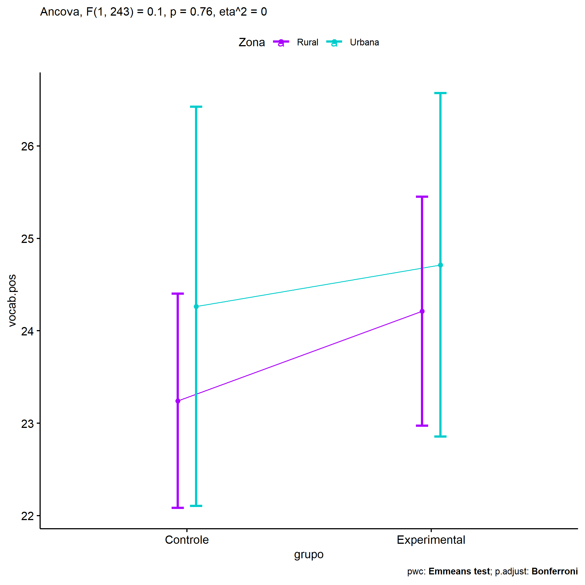<!-- -->

    ## Scale for colour is already present.
    ## Adding another scale for colour, which will replace the existing scale.

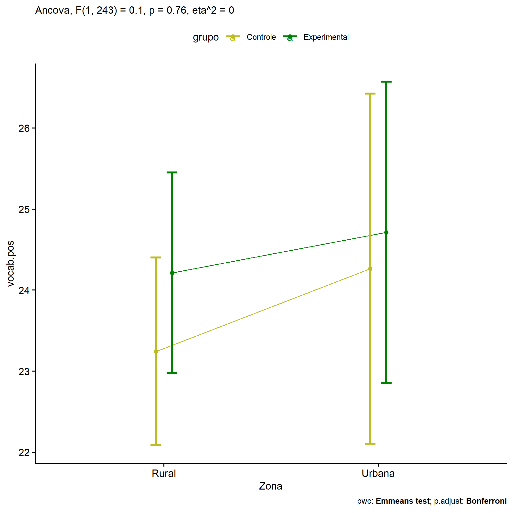<!-- -->

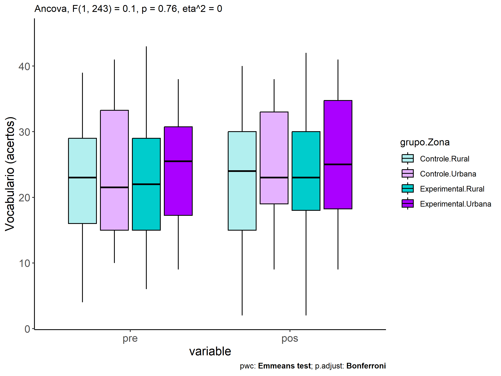<!-- -->

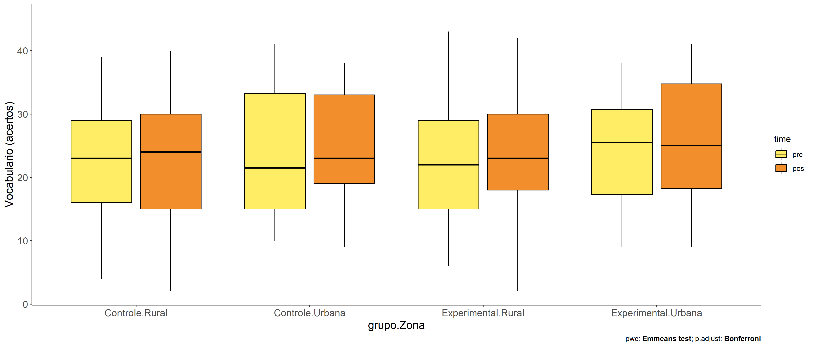<!-- -->

### factores: **grupo:Cor.Raca**

| var       | grupo        | Cor.Raca |   n | M (pre) | SE (pre) | M (unadj) | SE (unadj) | M (adj) | SE (adj) |
|:----------|:-------------|:---------|----:|--------:|---------:|----------:|-----------:|--------:|---------:|
| vocab.pos | Controle     | Branca   |  22 |  23.000 |    1.578 |    23.727 |      1.766 |  23.096 |    1.221 |
| vocab.pos | Controle     | Parda    |  42 |  21.405 |    1.426 |    22.167 |      1.519 |  22.921 |    0.885 |
| vocab.pos | Experimental | Branca   |  18 |  25.500 |    1.898 |    24.333 |      2.667 |  21.531 |    1.363 |
| vocab.pos | Experimental | Indígena |  13 |  21.000 |    2.082 |    24.308 |      2.392 |  25.414 |    1.590 |
| vocab.pos | Experimental | Parda    |  44 |  21.795 |    1.229 |    24.477 |      1.234 |  24.892 |    0.864 |

|     | .y.       | grupo        | Cor.Raca | group1   | group2       | estimate | conf.low | conf.high |    se | statistic |     p | p.adj | p.adj.signif |
|:----|:----------|:-------------|:---------|:---------|:-------------|---------:|---------:|----------:|------:|----------:|------:|------:|:-------------|
| 1   | vocab.pos |              | Branca   | Controle | Experimental |    1.565 |   -2.046 |     5.177 | 1.826 |     0.857 | 0.393 | 0.393 | ns           |
| 3   | vocab.pos |              | Parda    | Controle | Experimental |   -1.971 |   -4.415 |     0.472 | 1.235 |    -1.596 | 0.113 | 0.113 | ns           |
| 4   | vocab.pre |              | Branca   | Controle | Experimental |   -2.500 |   -7.733 |     2.733 | 2.646 |    -0.945 | 0.346 | 0.346 | ns           |
| 6   | vocab.pre |              | Parda    | Controle | Experimental |   -0.391 |   -3.943 |     3.161 | 1.796 |    -0.218 | 0.828 | 0.828 | ns           |
| 8   | vocab.pos | Controle     |          | Branca   | Parda        |    0.175 |   -2.811 |     3.162 | 1.510 |     0.116 | 0.908 | 0.908 | ns           |
| 10  | vocab.pos | Experimental |          | Branca   | Indígena     |   -3.883 |   -8.038 |     0.273 | 2.101 |    -1.848 | 0.067 | 0.201 | ns           |
| 11  | vocab.pos | Experimental |          | Branca   | Parda        |   -3.361 |   -6.560 |    -0.163 | 1.617 |    -2.079 | 0.040 | 0.119 | ns           |
| 12  | vocab.pos | Experimental |          | Indígena | Parda        |    0.521 |   -3.055 |     4.098 | 1.808 |     0.288 | 0.774 | 1.000 | ns           |
| 14  | vocab.pre | Controle     |          | Branca   | Parda        |    1.595 |   -2.738 |     5.929 | 2.191 |     0.728 | 0.468 | 0.468 | ns           |
| 16  | vocab.pre | Experimental |          | Branca   | Indígena     |    4.500 |   -1.493 |    10.493 | 3.030 |     1.485 | 0.140 | 0.420 | ns           |
| 17  | vocab.pre | Experimental |          | Branca   | Parda        |    3.705 |   -0.903 |     8.312 | 2.329 |     1.590 | 0.114 | 0.342 | ns           |
| 18  | vocab.pre | Experimental |          | Indígena | Parda        |   -0.795 |   -5.993 |     4.402 | 2.628 |    -0.303 | 0.763 | 1.000 | ns           |

| .y.   | grupo        | Cor.Raca | group1 | group2 | estimate | conf.low | conf.high |    se | statistic |     p | p.adj | p.adj.signif |
|:------|:-------------|:---------|:-------|:-------|---------:|---------:|----------:|------:|----------:|------:|------:|:-------------|
| vocab | Controle     | Branca   | pre    | pos    |   -0.727 |   -5.939 |     4.484 | 2.647 |    -0.275 | 0.784 | 0.784 | ns           |
| vocab | Controle     | Parda    | pre    | pos    |   -0.762 |   -4.534 |     3.010 | 1.916 |    -0.398 | 0.691 | 0.691 | ns           |
| vocab | Experimental | Branca   | pre    | pos    |    1.167 |   -4.595 |     6.928 | 2.926 |     0.399 | 0.690 | 0.690 | ns           |
| vocab | Experimental | Indígena | pre    | pos    |   -3.308 |  -10.087 |     3.472 | 3.443 |    -0.961 | 0.338 | 0.338 | ns           |
| vocab | Experimental | Parda    | pre    | pos    |   -2.682 |   -6.367 |     1.003 | 1.872 |    -1.433 | 0.153 | 0.153 | ns           |

    ## Scale for colour is already present.
    ## Adding another scale for colour, which will replace the existing scale.

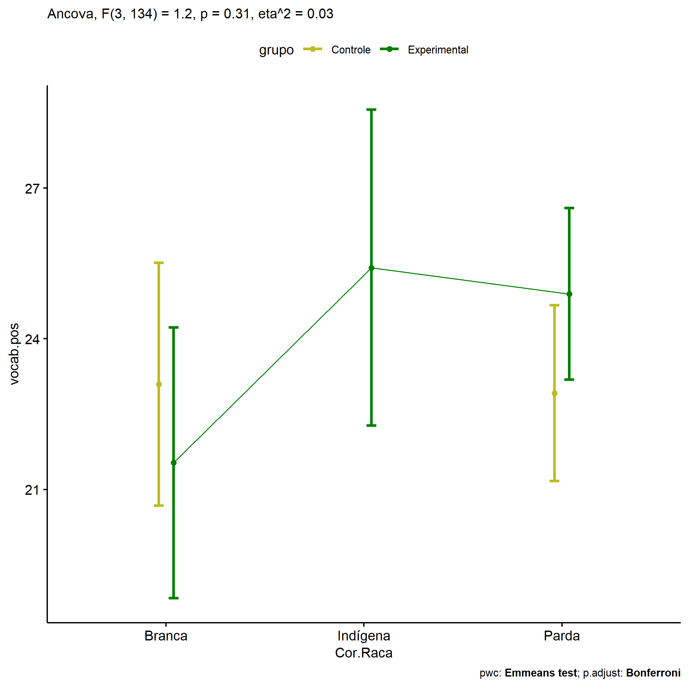<!-- -->

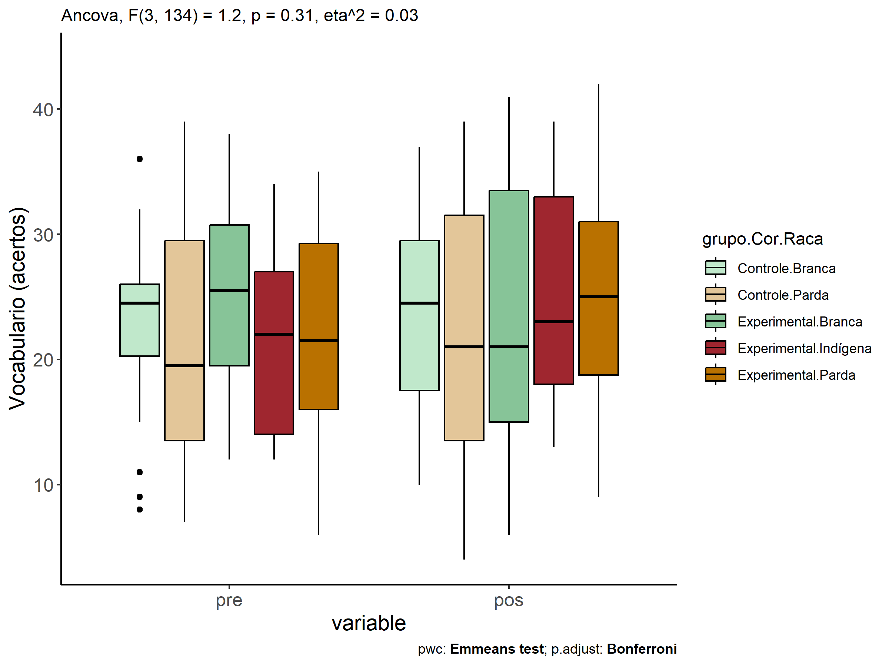<!-- -->

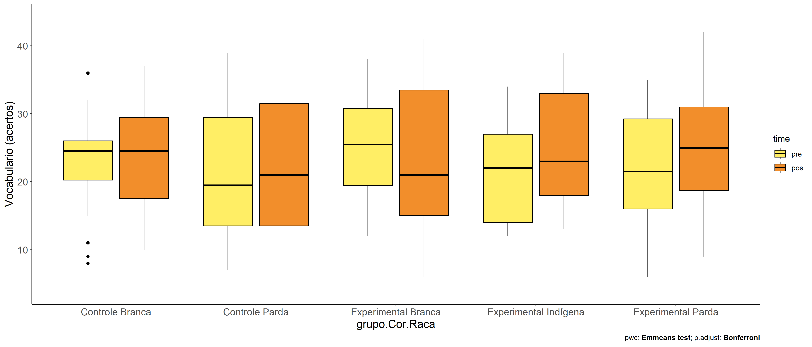<!-- -->

### factores: **grupo:vocab.quintile**

| var       | grupo        | vocab.quintile |   n | M (pre) | SE (pre) | M (unadj) | SE (unadj) | M (adj) | SE (adj) |
|:----------|:-------------|:---------------|----:|--------:|---------:|----------:|-----------:|--------:|---------:|
| vocab.pos | Controle     | 1st quintile   |  50 |  12.140 |    0.416 |    14.200 |      0.700 |  19.700 |    1.758 |
| vocab.pos | Controle     | 2nd quintile   |  31 |  19.226 |    0.324 |    20.484 |      0.911 |  22.122 |    1.147 |
| vocab.pos | Controle     | 3rd quintile   |  33 |  25.061 |    0.308 |    25.091 |      1.027 |  23.549 |    1.106 |
| vocab.pos | Controle     | 4th quintile   |  19 |  31.895 |    0.382 |    32.579 |      0.846 |  27.312 |    2.001 |
| vocab.pos | Controle     | 5th quintile   |  13 |  37.000 |    0.519 |    36.923 |      0.571 |  28.874 |    2.789 |
| vocab.pos | Experimental | 1st quintile   |  48 |  12.667 |    0.396 |    17.958 |      1.071 |  23.171 |    1.695 |
| vocab.pos | Experimental | 2nd quintile   |  32 |  19.781 |    0.307 |    20.594 |      1.022 |  21.929 |    1.099 |
| vocab.pos | Experimental | 3rd quintile   |  40 |  26.050 |    0.328 |    27.400 |      1.236 |  25.319 |    1.095 |
| vocab.pos | Experimental | 4th quintile   |  28 |  31.571 |    0.249 |    30.393 |      0.960 |  25.302 |    1.811 |
| vocab.pos | Experimental | 5th quintile   |  17 |  37.059 |    0.503 |    37.059 |      1.469 |  28.978 |    2.684 |

| .y.       | grupo        | vocab.quintile | group1       | group2       | estimate | conf.low | conf.high |    se | statistic | p       | p.adj   | p.adj.signif |
|:----------|:-------------|:---------------|:-------------|:-------------|---------:|---------:|----------:|------:|----------:|:--------|:--------|:-------------|
| vocab.pos |              | 1st quintile   | Controle     | Experimental |   -3.471 |   -5.800 |    -1.142 | 1.183 |    -2.933 | 0.004   | 0.004   | \*\*         |
| vocab.pos |              | 2nd quintile   | Controle     | Experimental |    0.193 |   -2.710 |     3.095 | 1.475 |     0.131 | 0.896   | 0.896   | ns           |
| vocab.pos |              | 3rd quintile   | Controle     | Experimental |   -1.770 |   -4.490 |     0.951 | 1.382 |    -1.280 | 0.201   | 0.201   | ns           |
| vocab.pos |              | 4th quintile   | Controle     | Experimental |    2.010 |   -1.409 |     5.429 | 1.737 |     1.157 | 0.248   | 0.248   | ns           |
| vocab.pos |              | 5th quintile   | Controle     | Experimental |   -0.104 |   -4.340 |     4.133 | 2.153 |    -0.048 | 0.962   | 0.962   | ns           |
| vocab.pre |              | 1st quintile   | Controle     | Experimental |   -0.527 |   -1.398 |     0.345 | 0.443 |    -1.190 | 0.235   | 0.235   | ns           |
| vocab.pre |              | 2nd quintile   | Controle     | Experimental |   -0.555 |   -1.642 |     0.531 | 0.552 |    -1.006 | 0.315   | 0.315   | ns           |
| vocab.pre |              | 3rd quintile   | Controle     | Experimental |   -0.989 |   -2.003 |     0.025 | 0.515 |    -1.920 | 0.056   | 0.056   | ns           |
| vocab.pre |              | 4th quintile   | Controle     | Experimental |    0.323 |   -0.958 |     1.605 | 0.651 |     0.496 | 0.62    | 0.62    | ns           |
| vocab.pre |              | 5th quintile   | Controle     | Experimental |   -0.059 |   -1.647 |     1.530 | 0.807 |    -0.073 | 0.942   | 0.942   | ns           |
| vocab.pos | Controle     |                | 1st quintile | 2nd quintile |   -2.422 |   -5.813 |     0.970 | 1.723 |    -1.405 | 0.161   | 1       | ns           |
| vocab.pos | Controle     |                | 1st quintile | 3rd quintile |   -3.849 |   -8.531 |     0.834 | 2.379 |    -1.618 | 0.107   | 1       | ns           |
| vocab.pos | Controle     |                | 1st quintile | 4th quintile |   -7.612 |  -14.343 |    -0.881 | 3.420 |    -2.225 | 0.027   | 0.268   | ns           |
| vocab.pos | Controle     |                | 1st quintile | 5th quintile |   -9.174 |  -17.502 |    -0.845 | 4.232 |    -2.168 | 0.031   | 0.31    | ns           |
| vocab.pos | Controle     |                | 2nd quintile | 3rd quintile |   -1.427 |   -4.801 |     1.947 | 1.715 |    -0.832 | 0.406   | 1       | ns           |
| vocab.pos | Controle     |                | 2nd quintile | 4th quintile |   -5.190 |  -10.280 |    -0.100 | 2.587 |    -2.007 | 0.046   | 0.457   | ns           |
| vocab.pos | Controle     |                | 2nd quintile | 5th quintile |   -6.752 |  -13.335 |    -0.168 | 3.345 |    -2.018 | 0.044   | 0.445   | ns           |
| vocab.pos | Controle     |                | 3rd quintile | 4th quintile |   -3.763 |   -7.667 |     0.140 | 1.984 |    -1.897 | 0.059   | 0.588   | ns           |
| vocab.pos | Controle     |                | 3rd quintile | 5th quintile |   -5.325 |  -10.542 |    -0.108 | 2.651 |    -2.009 | 0.045   | 0.455   | ns           |
| vocab.pos | Controle     |                | 4th quintile | 5th quintile |   -1.562 |   -5.979 |     2.856 | 2.245 |    -0.696 | 0.487   | 1       | ns           |
| vocab.pos | Experimental |                | 1st quintile | 2nd quintile |    1.242 |   -2.151 |     4.636 | 1.725 |     0.720 | 0.472   | 1       | ns           |
| vocab.pos | Experimental |                | 1st quintile | 3rd quintile |   -2.147 |   -6.885 |     2.591 | 2.408 |    -0.892 | 0.373   | 1       | ns           |
| vocab.pos | Experimental |                | 1st quintile | 4th quintile |   -2.131 |   -8.469 |     4.208 | 3.221 |    -0.662 | 0.509   | 1       | ns           |
| vocab.pos | Experimental |                | 1st quintile | 5th quintile |   -5.806 |  -13.866 |     2.254 | 4.096 |    -1.418 | 0.157   | 1       | ns           |
| vocab.pos | Experimental |                | 2nd quintile | 3rd quintile |   -3.390 |   -6.711 |    -0.068 | 1.688 |    -2.008 | 0.046   | 0.455   | ns           |
| vocab.pos | Experimental |                | 2nd quintile | 4th quintile |   -3.373 |   -8.018 |     1.271 | 2.360 |    -1.429 | 0.154   | 1       | ns           |
| vocab.pos | Experimental |                | 2nd quintile | 5th quintile |   -7.048 |  -13.311 |    -0.786 | 3.182 |    -2.215 | 0.028   | 0.275   | ns           |
| vocab.pos | Experimental |                | 3rd quintile | 4th quintile |    0.016 |   -3.272 |     3.305 | 1.671 |     0.010 | 0.992   | 1       | ns           |
| vocab.pos | Experimental |                | 3rd quintile | 5th quintile |   -3.659 |   -8.367 |     1.050 | 2.393 |    -1.529 | 0.127   | 1       | ns           |
| vocab.pos | Experimental |                | 4th quintile | 5th quintile |   -3.675 |   -7.581 |     0.230 | 1.985 |    -1.852 | 0.065   | 0.65    | ns           |
| vocab.pre | Controle     |                | 1st quintile | 2nd quintile |   -7.086 |   -8.071 |    -6.100 | 0.501 |   -14.147 | \<0.001 | \<0.001 | \*\*\*\*     |
| vocab.pre | Controle     |                | 1st quintile | 3rd quintile |  -12.921 |  -13.888 |   -11.954 | 0.491 |   -26.293 | \<0.001 | \<0.001 | \*\*\*\*     |
| vocab.pre | Controle     |                | 1st quintile | 4th quintile |  -19.755 |  -20.917 |   -18.593 | 0.590 |   -33.455 | \<0.001 | \<0.001 | \*\*\*\*     |
| vocab.pre | Controle     |                | 1st quintile | 5th quintile |  -24.860 |  -26.202 |   -23.518 | 0.682 |   -36.446 | \<0.001 | \<0.001 | \*\*\*\*     |
| vocab.pre | Controle     |                | 2nd quintile | 3rd quintile |   -5.835 |   -6.913 |    -4.756 | 0.548 |   -10.647 | \<0.001 | \<0.001 | \*\*\*\*     |
| vocab.pre | Controle     |                | 2nd quintile | 4th quintile |  -12.669 |  -13.925 |   -11.413 | 0.638 |   -19.846 | \<0.001 | \<0.001 | \*\*\*\*     |
| vocab.pre | Controle     |                | 2nd quintile | 5th quintile |  -17.774 |  -19.199 |   -16.350 | 0.724 |   -24.551 | \<0.001 | \<0.001 | \*\*\*\*     |
| vocab.pre | Controle     |                | 3rd quintile | 4th quintile |   -6.834 |   -8.076 |    -5.592 | 0.631 |   -10.831 | \<0.001 | \<0.001 | \*\*\*\*     |
| vocab.pre | Controle     |                | 3rd quintile | 5th quintile |  -11.939 |  -13.351 |   -10.528 | 0.717 |   -16.641 | \<0.001 | \<0.001 | \*\*\*\*     |
| vocab.pre | Controle     |                | 4th quintile | 5th quintile |   -5.105 |   -6.657 |    -3.553 | 0.789 |    -6.474 | \<0.001 | \<0.001 | \*\*\*\*     |
| vocab.pre | Experimental |                | 1st quintile | 2nd quintile |   -7.115 |   -8.099 |    -6.131 | 0.500 |   -14.228 | \<0.001 | \<0.001 | \*\*\*\*     |
| vocab.pre | Experimental |                | 1st quintile | 3rd quintile |  -13.383 |  -14.306 |   -12.460 | 0.469 |   -28.532 | \<0.001 | \<0.001 | \*\*\*\*     |
| vocab.pre | Experimental |                | 1st quintile | 4th quintile |  -18.905 |  -19.930 |   -17.879 | 0.521 |   -36.285 | \<0.001 | \<0.001 | \*\*\*\*     |
| vocab.pre | Experimental |                | 1st quintile | 5th quintile |  -24.392 |  -25.609 |   -23.175 | 0.618 |   -39.445 | \<0.001 | \<0.001 | \*\*\*\*     |
| vocab.pre | Experimental |                | 2nd quintile | 3rd quintile |   -6.269 |   -7.291 |    -5.246 | 0.520 |   -12.064 | \<0.001 | \<0.001 | \*\*\*\*     |
| vocab.pre | Experimental |                | 2nd quintile | 4th quintile |  -11.790 |  -12.906 |   -10.674 | 0.567 |   -20.795 | \<0.001 | \<0.001 | \*\*\*\*     |
| vocab.pre | Experimental |                | 2nd quintile | 5th quintile |  -17.278 |  -18.572 |   -15.984 | 0.658 |   -26.275 | \<0.001 | \<0.001 | \*\*\*\*     |
| vocab.pre | Experimental |                | 3rd quintile | 4th quintile |   -5.521 |   -6.584 |    -4.459 | 0.540 |   -10.227 | \<0.001 | \<0.001 | \*\*\*\*     |
| vocab.pre | Experimental |                | 3rd quintile | 5th quintile |  -11.009 |  -12.257 |    -9.761 | 0.634 |   -17.355 | \<0.001 | \<0.001 | \*\*\*\*     |
| vocab.pre | Experimental |                | 4th quintile | 5th quintile |   -5.487 |   -6.813 |    -4.162 | 0.674 |    -8.146 | \<0.001 | \<0.001 | \*\*\*\*     |

| .y.   | grupo        | vocab.quintile | group1 | group2 | estimate | conf.low | conf.high |    se | statistic | p       | p.adj   | p.adj.signif |
|:------|:-------------|:---------------|:-------|:-------|---------:|---------:|----------:|------:|----------:|:--------|:--------|:-------------|
| vocab | Controle     | 1st quintile   | pre    | pos    |   -2.060 |   -3.822 |    -0.298 | 0.897 |    -2.296 | 0.022   | 0.022   | \*           |
| vocab | Controle     | 2nd quintile   | pre    | pos    |   -1.258 |   -3.496 |     0.980 | 1.139 |    -1.104 | 0.27    | 0.27    | ns           |
| vocab | Controle     | 3rd quintile   | pre    | pos    |   -0.030 |   -2.199 |     2.139 | 1.104 |    -0.027 | 0.978   | 0.978   | ns           |
| vocab | Controle     | 4th quintile   | pre    | pos    |   -0.684 |   -3.543 |     2.174 | 1.456 |    -0.470 | 0.638   | 0.638   | ns           |
| vocab | Controle     | 5th quintile   | pre    | pos    |    0.077 |   -3.379 |     3.533 | 1.760 |     0.044 | 0.965   | 0.965   | ns           |
| vocab | Experimental | 1st quintile   | pre    | pos    |   -5.292 |   -7.090 |    -3.493 | 0.916 |    -5.779 | \<0.001 | \<0.001 | \*\*\*\*     |
| vocab | Experimental | 2nd quintile   | pre    | pos    |   -0.813 |   -3.015 |     1.390 | 1.122 |    -0.724 | 0.469   | 0.469   | ns           |
| vocab | Experimental | 3rd quintile   | pre    | pos    |   -1.350 |   -3.320 |     0.620 | 1.003 |    -1.346 | 0.179   | 0.179   | ns           |
| vocab | Experimental | 4th quintile   | pre    | pos    |    1.179 |   -1.176 |     3.533 | 1.199 |     0.983 | 0.326   | 0.326   | ns           |
| vocab | Experimental | 5th quintile   | pre    | pos    |    0.000 |   -3.022 |     3.022 | 1.539 |     0.000 | 1       | 1       | ns           |

    ## Scale for colour is already present.
    ## Adding another scale for colour, which will replace the existing scale.

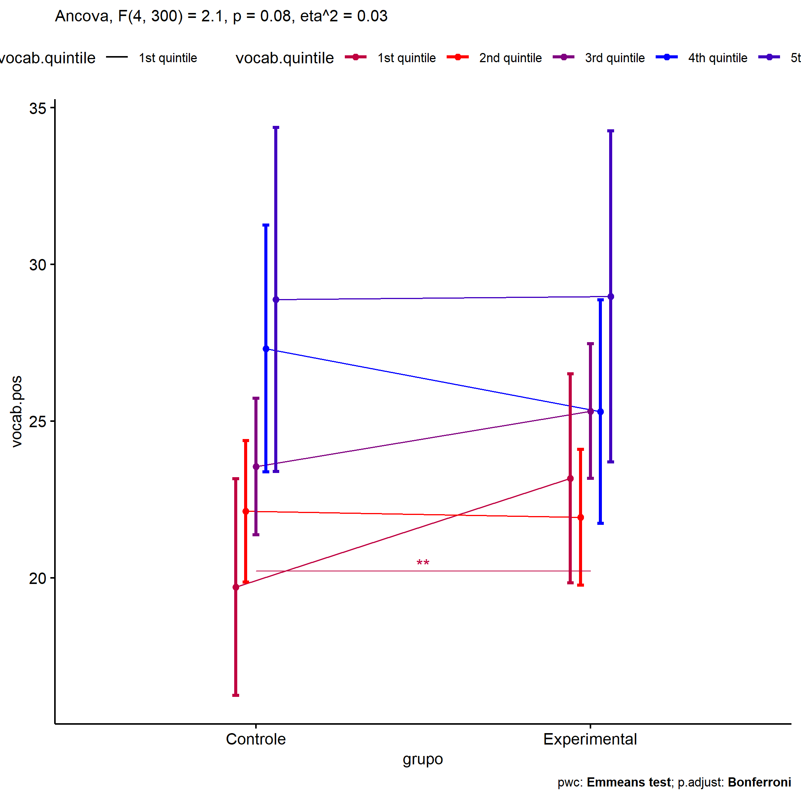<!-- -->

    ## Scale for colour is already present.
    ## Adding another scale for colour, which will replace the existing scale.

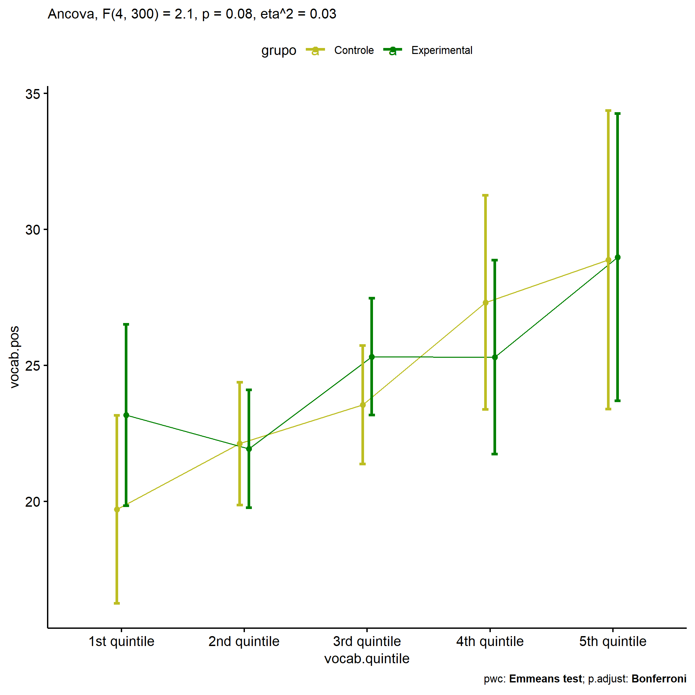<!-- -->

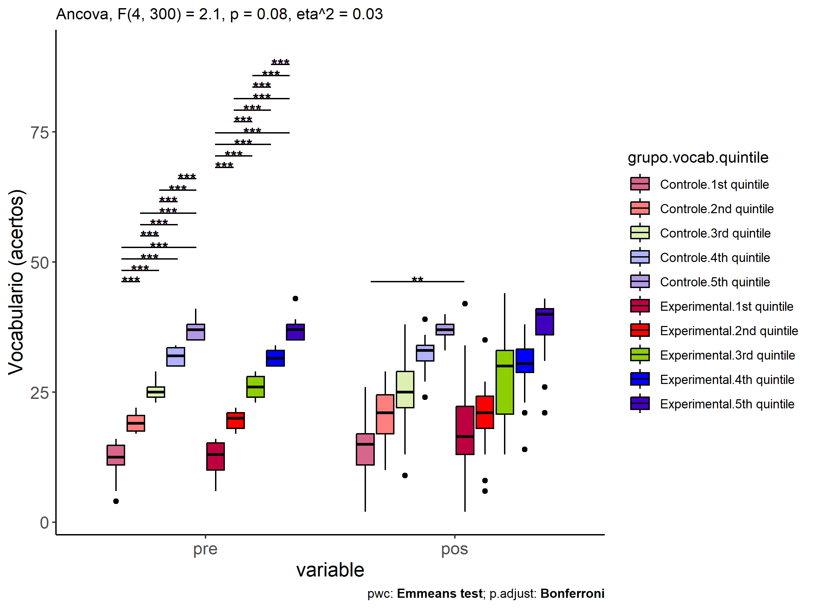<!-- -->

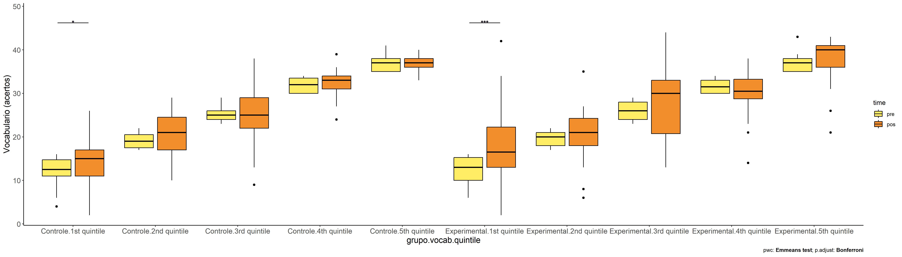<!-- -->
