ANCOVA in Vocabulario (acertos) (Vocabulario (acertos))
================
Geiser C. Challco <geiser@alumni.usp.br>

- [Descriptive Statistics of Initial
  Data](#descriptive-statistics-of-initial-data)
- [Checking of Assumptions](#checking-of-assumptions)
  - [Assumption: Normality distribution of
    data](#assumption-normality-distribution-of-data)
  - [Assumption: Homogeneity of data
    distribution](#assumption-homogeneity-of-data-distribution)
- [Computation of ANCOVA test and Pairwise
  Comparison](#computation-of-ancova-test-and-pairwise-comparison)
  - [ANCOVA tests for one factor](#ancova-tests-for-one-factor)
  - [ANCOVA tests for two factors](#ancova-tests-for-two-factors)
  - [Pairwise comparisons for one factor:
    **grupo**](#pairwise-comparisons-for-one-factor-grupo)
  - [Pairwise comparisons for two
    factors](#pairwise-comparisons-for-two-factors)
    - [factores: **grupo:Sexo**](#factores-gruposexo)
    - [factores: **grupo:Zona**](#factores-grupozona)
    - [factores: **grupo:Cor.Raca**](#factores-grupocorraca)
    - [factores: **grupo:vocab.quintile**](#factores-grupovocabquintile)

**NOTE**

- Teste ANCOVA para determinar se houve diferenças significativas no
  Vocabulario (acertos) (medido usando pre- e pos-testes).
- ANCOVA test to determine whether there were significant differences in
  Vocabulario (acertos) (measured using pre- and post-tests).

# Descriptive Statistics of Initial Data

| grupo        | Sexo | Zona   | Cor.Raca | vocab.quintile | variable  |   n |   mean | median | min | max |     sd |    se |      ci |   iqr |
|:-------------|:-----|:-------|:---------|:---------------|:----------|----:|-------:|-------:|----:|----:|-------:|------:|--------:|------:|
| Controle     | F    |        |          |                | vocab.pre |  85 | 25.718 |   26.0 |   8 |  42 |  8.185 | 0.888 |   1.765 | 14.00 |
| Controle     | M    |        |          |                | vocab.pre |  67 | 22.910 |   21.0 |   5 |  45 |  9.254 | 1.131 |   2.257 | 15.00 |
| Experimental | F    |        |          |                | vocab.pre |  99 | 26.202 |   27.0 |   1 |  43 |  8.281 | 0.832 |   1.652 | 12.00 |
| Experimental | M    |        |          |                | vocab.pre |  98 | 26.837 |   27.0 |   5 |  43 |  8.323 | 0.841 |   1.669 | 12.00 |
| Controle     | F    |        |          |                | vocab.pos |  85 | 27.365 |   28.0 |   7 |  43 |  8.021 | 0.870 |   1.730 | 12.00 |
| Controle     | M    |        |          |                | vocab.pos |  67 | 24.567 |   24.0 |   7 |  45 |  9.589 | 1.171 |   2.339 | 15.50 |
| Experimental | F    |        |          |                | vocab.pos |  99 | 27.677 |   28.0 |   7 |  46 |  7.869 | 0.791 |   1.569 |  9.50 |
| Experimental | M    |        |          |                | vocab.pos |  98 | 25.949 |   26.0 |   5 |  44 |  9.127 | 0.922 |   1.830 | 14.50 |
| Controle     |      | Rural  |          |                | vocab.pre |  77 | 25.065 |   26.0 |   8 |  45 |  8.565 | 0.976 |   1.944 | 14.00 |
| Controle     |      | Urbana |          |                | vocab.pre |  50 | 25.980 |   25.0 |   6 |  42 |  8.625 | 1.220 |   2.451 | 13.50 |
| Controle     |      |        |          |                | vocab.pre |  25 | 19.680 |   19.0 |   5 |  40 |  8.265 | 1.653 |   3.412 | 11.00 |
| Experimental |      | Rural  |          |                | vocab.pre |  92 | 26.630 |   27.0 |   5 |  43 |  8.513 | 0.888 |   1.763 | 11.50 |
| Experimental |      | Urbana |          |                | vocab.pre |  76 | 26.842 |   27.0 |   1 |  43 |  8.201 | 0.941 |   1.874 | 12.00 |
| Experimental |      |        |          |                | vocab.pre |  29 | 25.310 |   25.0 |  13 |  37 |  7.947 | 1.476 |   3.023 | 13.00 |
| Controle     |      | Rural  |          |                | vocab.pos |  77 | 27.104 |   28.0 |  10 |  45 |  8.637 | 0.984 |   1.960 | 14.00 |
| Controle     |      | Urbana |          |                | vocab.pos |  50 | 26.680 |   28.5 |   7 |  40 |  9.041 | 1.279 |   2.569 | 12.75 |
| Controle     |      |        |          |                | vocab.pos |  25 | 22.040 |   20.0 |   9 |  42 |  8.126 | 1.625 |   3.354 | 10.00 |
| Experimental |      | Rural  |          |                | vocab.pos |  92 | 26.587 |   27.0 |   5 |  46 |  8.765 | 0.914 |   1.815 | 12.00 |
| Experimental |      | Urbana |          |                | vocab.pos |  76 | 27.566 |   29.0 |   8 |  44 |  8.385 | 0.962 |   1.916 | 12.00 |
| Experimental |      |        |          |                | vocab.pos |  29 | 25.586 |   26.0 |   7 |  37 |  8.326 | 1.546 |   3.167 | 14.00 |
| Controle     |      |        | Branca   |                | vocab.pre |  22 | 26.273 |   27.0 |  12 |  45 |  8.172 | 1.742 |   3.623 | 11.75 |
| Controle     |      |        | Indígena |                | vocab.pre |   8 | 24.250 |   25.5 |  15 |  33 |  6.386 | 2.258 |   5.339 |  5.75 |
| Controle     |      |        | Parda    |                | vocab.pre |  44 | 22.591 |   21.0 |   9 |  38 |  8.478 | 1.278 |   2.578 | 15.25 |
| Controle     |      |        |          |                | vocab.pre |  78 | 25.064 |   25.5 |   5 |  42 |  9.217 | 1.044 |   2.078 | 13.00 |
| Experimental |      |        | Branca   |                | vocab.pre |  12 | 26.667 |   27.5 |  15 |  37 |  6.972 | 2.013 |   4.430 |  8.75 |
| Experimental |      |        | Indígena |                | vocab.pre |   2 | 24.000 |   24.0 |  16 |  32 | 11.314 | 8.000 | 101.650 |  8.00 |
| Experimental |      |        | Parda    |                | vocab.pre |  53 | 24.396 |   25.0 |   1 |  42 |  8.654 | 1.189 |   2.385 | 12.00 |
| Experimental |      |        |          |                | vocab.pre | 130 | 27.408 |   27.5 |   5 |  43 |  8.140 | 0.714 |   1.413 | 11.75 |
| Controle     |      |        | Branca   |                | vocab.pos |  22 | 28.000 |   29.0 |  13 |  45 |  7.910 | 1.686 |   3.507 | 10.00 |
| Controle     |      |        | Indígena |                | vocab.pos |   8 | 28.875 |   27.5 |  18 |  38 |  7.717 | 2.728 |   6.452 | 12.50 |
| Controle     |      |        | Parda    |                | vocab.pos |  44 | 25.545 |   26.0 |   7 |  40 |  9.598 | 1.447 |   2.918 | 16.50 |
| Controle     |      |        |          |                | vocab.pos |  78 | 25.654 |   25.5 |   7 |  43 |  8.756 | 0.991 |   1.974 | 13.00 |
| Experimental |      |        | Branca   |                | vocab.pos |  12 | 24.000 |   23.0 |   9 |  37 |  7.160 | 2.067 |   4.550 |  6.75 |
| Experimental |      |        | Indígena |                | vocab.pos |   2 | 26.500 |   26.5 |  18 |  35 | 12.021 | 8.500 | 108.003 |  8.50 |
| Experimental |      |        | Parda    |                | vocab.pos |  53 | 25.396 |   26.0 |   7 |  40 |  7.510 | 1.032 |   2.070 |  9.00 |
| Experimental |      |        |          |                | vocab.pos | 130 | 27.662 |   29.0 |   5 |  46 |  8.961 | 0.786 |   1.555 | 12.00 |
| Controle     |      |        |          | 1st quintile   | vocab.pre |  32 | 12.500 |   13.5 |   5 |  16 |  3.059 | 0.541 |   1.103 |  4.00 |
| Controle     |      |        |          | 2nd quintile   | vocab.pre |  35 | 19.686 |   20.0 |  17 |  22 |  1.510 | 0.255 |   0.519 |  2.00 |
| Controle     |      |        |          | 3rd quintile   | vocab.pre |  39 | 26.256 |   26.0 |  23 |  29 |  1.846 | 0.296 |   0.598 |  2.50 |
| Controle     |      |        |          | 4th quintile   | vocab.pre |  23 | 32.261 |   32.0 |  30 |  34 |  1.544 | 0.322 |   0.668 |  3.00 |
| Controle     |      |        |          | 5th quintile   | vocab.pre |  23 | 37.652 |   37.0 |  35 |  45 |  2.347 | 0.489 |   1.015 |  1.50 |
| Experimental |      |        |          | 1st quintile   | vocab.pre |  30 | 13.533 |   14.0 |   1 |  16 |  3.401 | 0.621 |   1.270 |  3.00 |
| Experimental |      |        |          | 2nd quintile   | vocab.pre |  34 | 19.824 |   20.0 |  17 |  22 |  1.642 | 0.282 |   0.573 |  3.00 |
| Experimental |      |        |          | 3rd quintile   | vocab.pre |  54 | 26.093 |   26.0 |  23 |  29 |  1.730 | 0.235 |   0.472 |  2.00 |
| Experimental |      |        |          | 4th quintile   | vocab.pre |  44 | 31.750 |   32.0 |  30 |  34 |  1.512 | 0.228 |   0.460 |  3.00 |
| Experimental |      |        |          | 5th quintile   | vocab.pre |  35 | 38.229 |   37.0 |  35 |  43 |  2.315 | 0.391 |   0.795 |  2.50 |
| Controle     |      |        |          | 1st quintile   | vocab.pos |  32 | 16.594 |   16.5 |   7 |  26 |  4.983 | 0.881 |   1.797 |  7.00 |
| Controle     |      |        |          | 2nd quintile   | vocab.pos |  35 | 22.057 |   21.0 |  11 |  36 |  6.097 | 1.031 |   2.094 |  8.00 |
| Controle     |      |        |          | 3rd quintile   | vocab.pos |  39 | 27.410 |   28.0 |   7 |  38 |  5.798 | 0.928 |   1.879 |  7.00 |
| Controle     |      |        |          | 4th quintile   | vocab.pos |  23 | 34.435 |   34.0 |  27 |  41 |  3.678 | 0.767 |   1.591 |  5.00 |
| Controle     |      |        |          | 5th quintile   | vocab.pos |  23 | 35.130 |   37.0 |  11 |  45 |  7.238 | 1.509 |   3.130 |  4.50 |
| Experimental |      |        |          | 1st quintile   | vocab.pos |  30 | 16.900 |   18.0 |   5 |  29 |  6.326 | 1.155 |   2.362 | 10.00 |
| Experimental |      |        |          | 2nd quintile   | vocab.pos |  34 | 20.706 |   21.0 |   8 |  34 |  5.808 | 0.996 |   2.026 |  8.00 |
| Experimental |      |        |          | 3rd quintile   | vocab.pos |  54 | 27.074 |   27.0 |   7 |  37 |  5.987 | 0.815 |   1.634 |  6.00 |
| Experimental |      |        |          | 4th quintile   | vocab.pos |  44 | 30.750 |   31.0 |  15 |  40 |  5.109 | 0.770 |   1.553 |  7.00 |
| Experimental |      |        |          | 5th quintile   | vocab.pos |  35 | 35.914 |   37.0 |  17 |  46 |  5.938 | 1.004 |   2.040 |  4.50 |

# Checking of Assumptions

## Assumption: Normality distribution of data

| var       |   n |   skewness |  kurtosis | symmetry | statistic | method     |         p | p.signif | normality |
|:----------|----:|-----------:|----------:|:---------|----------:|:-----------|----------:|:---------|:----------|
| vocab.pos | 349 | -0.7727999 | 1.9891341 | NO       | 49.057112 | D’Agostino | 0.0000000 | \*\*\*\* | \-        |
| vocab.pos | 295 | -0.8727347 | 2.4286828 | NO       | 51.762949 | D’Agostino | 0.0000000 | \*\*\*\* | \-        |
| vocab.pos | 141 |  0.0040270 | 0.4730527 | YES      |  1.910539 | D’Agostino | 0.3847084 | ns       | QQ        |
| vocab.pos | 349 | -0.7540285 | 1.7763541 | NO       | 45.566493 | D’Agostino | 0.0000000 | \*\*\*\* | \-        |

## Assumption: Homogeneity of data distribution

| var       | method         | formula                          |   n | DFn.df1 | DFd.df2 | statistic |         p | p.signif |
|:----------|:---------------|:---------------------------------|----:|--------:|--------:|----------:|----------:|:---------|
| vocab.pos | Levene’s test  | `.res`~`grupo`\*`Sexo`           | 349 |       3 |     345 | 1.5437413 | 0.2029367 | ns       |
| vocab.pos | Anova’s slopes | `.res`~`grupo`\*`Sexo`           | 349 |       3 |     341 | 0.6810000 | 0.5640000 | ns       |
| vocab.pos | Levene’s test  | `.res`~`grupo`\*`Zona`           | 295 |       3 |     291 | 0.6435386 | 0.5875815 | ns       |
| vocab.pos | Anova’s slopes | `.res`~`grupo`\*`Zona`           | 295 |       3 |     287 | 0.5740000 | 0.6330000 | ns       |
| vocab.pos | Levene’s test  | `.res`~`grupo`\*`Cor.Raca`       | 141 |       5 |     135 | 0.2846328 | 0.9208519 | ns       |
| vocab.pos | Anova’s slopes | `.res`~`grupo`\*`Cor.Raca`       | 141 |       5 |     129 | 2.0550000 | 0.0750000 | ns       |
| vocab.pos | Levene’s test  | `.res`~`grupo`\*`vocab.quintile` | 349 |       9 |     339 | 0.8375312 | 0.5819252 | ns       |
| vocab.pos | Anova’s slopes | `.res`~`grupo`\*`vocab.quintile` | 349 |       9 |     329 | 1.1400000 | 0.3340000 | ns       |

# Computation of ANCOVA test and Pairwise Comparison

## ANCOVA tests for one factor

|     | Effect         | DFn | DFd |       SSn |       SSd |       F | p       |   ges | p\<.05 |
|:----|:---------------|----:|----:|----------:|----------:|--------:|:--------|------:|:-------|
| 1   | vocab.pre      |   1 | 346 | 15379.020 | 10681.770 | 498.152 | \<0.001 | 0.590 | \*     |
| 2   | grupo          |   1 | 346 |    70.257 | 10681.770 |   2.276 | 0.132   | 0.007 |        |
| 4   | Sexo           |   1 | 346 |   215.535 | 10536.492 |   7.078 | 0.008   | 0.020 | \*     |
| 6   | Zona           |   1 | 292 |     0.283 |  9212.457 |   0.009 | 0.925   | 0.000 |        |
| 8   | Cor.Raca       |   2 | 137 |    96.633 |  3905.774 |   1.695 | 0.187   | 0.024 |        |
| 10  | vocab.quintile |   4 | 343 |    73.662 | 10678.365 |   0.592 | 0.669   | 0.007 |        |

## ANCOVA tests for two factors

|     | Effect               | DFn | DFd |       SSn |       SSd |       F | p       |   ges | p\<.05 |
|:----|:---------------------|----:|----:|----------:|----------:|--------:|:--------|------:|:-------|
| 1   | vocab.pre            |   1 | 344 | 15196.014 | 10424.530 | 501.455 | \<0.001 | 0.593 | \*     |
| 4   | grupo:Sexo           |   1 | 344 |    55.894 | 10424.530 |   1.844 | 0.175   | 0.005 |        |
| 8   | grupo:Zona           |   1 | 290 |    67.000 |  9083.949 |   2.139 | 0.145   | 0.007 |        |
| 12  | grupo:Cor.Raca       |   2 | 134 |    44.468 |  3696.961 |   0.806 | 0.449   | 0.012 |        |
| 16  | grupo:vocab.quintile |   4 | 338 |   128.812 | 10470.032 |   1.040 | 0.387   | 0.012 |        |

## Pairwise comparisons for one factor: **grupo**

| var       | grupo        |   n | M (pre) | SE (pre) | M (unadj) | SE (unadj) | M (adj) | SE (adj) |
|:----------|:-------------|----:|--------:|---------:|----------:|-----------:|--------:|---------:|
| vocab.pos | Controle     | 152 |  24.480 |     0.71 |    26.132 |      0.716 |  27.033 |    0.452 |
| vocab.pos | Experimental | 197 |  26.518 |     0.59 |    26.817 |      0.608 |  26.122 |    0.397 |

| .y.       | group1   | group2       | estimate | conf.low | conf.high |    se | statistic |     p | p.adj | p.adj.signif |
|:----------|:---------|:-------------|---------:|---------:|----------:|------:|----------:|------:|------:|:-------------|
| vocab.pos | Controle | Experimental |    0.911 |   -0.277 |     2.099 | 0.604 |     1.509 | 0.132 | 0.132 | ns           |
| vocab.pre | Controle | Experimental |   -2.038 |   -3.841 |    -0.234 | 0.917 |    -2.222 | 0.027 | 0.027 | \*           |

| .y.   | grupo        | group1 | group2 | estimate | conf.low | conf.high |    se | statistic |     p | p.adj | p.adj.signif |
|:------|:-------------|:-------|:-------|---------:|---------:|----------:|------:|----------:|------:|------:|:-------------|
| vocab | Controle     | pre    | pos    |   -1.651 |   -3.584 |     0.281 | 0.984 |    -1.678 | 0.094 | 0.094 | ns           |
| vocab | Experimental | pre    | pos    |   -0.299 |   -1.997 |     1.398 | 0.865 |    -0.346 | 0.729 | 0.729 | ns           |

    ## Scale for colour is already present.
    ## Adding another scale for colour, which will replace the existing scale.

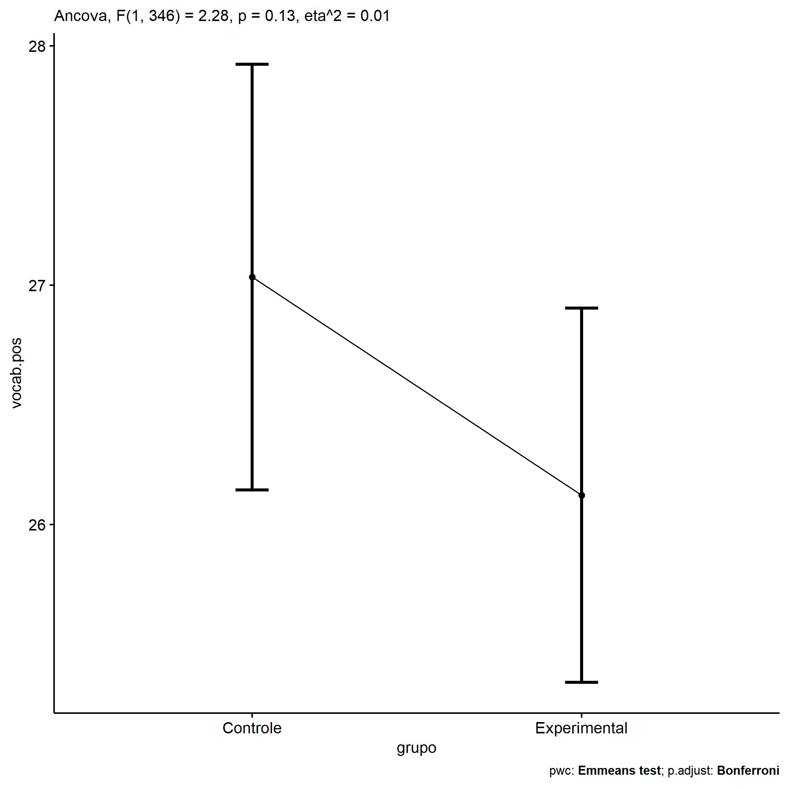<!-- -->

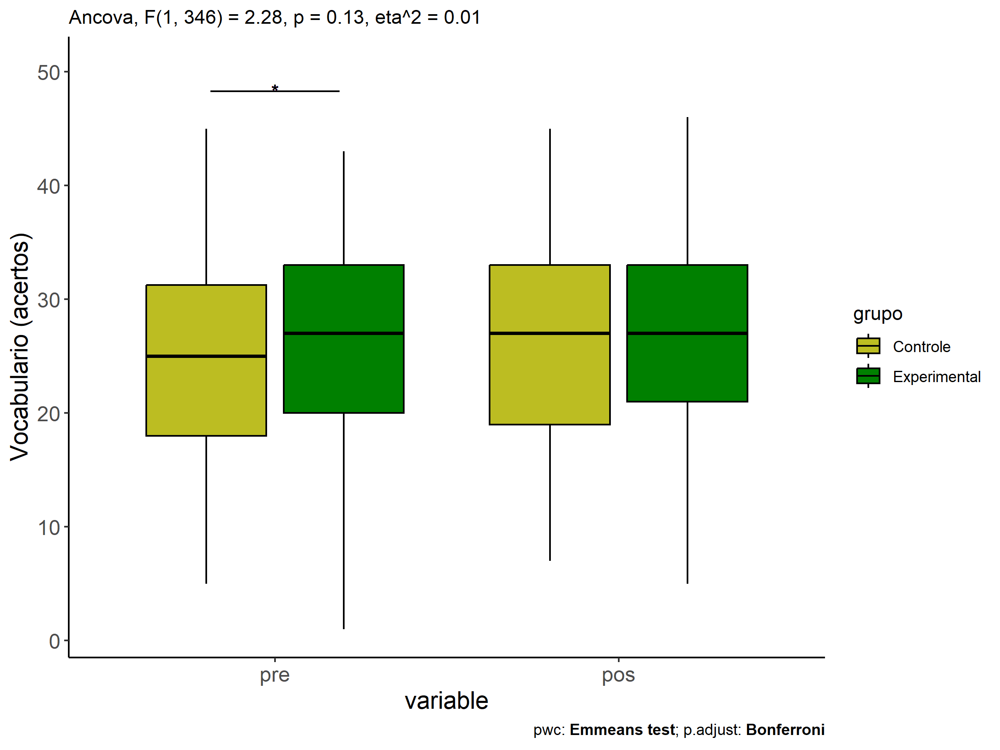<!-- -->

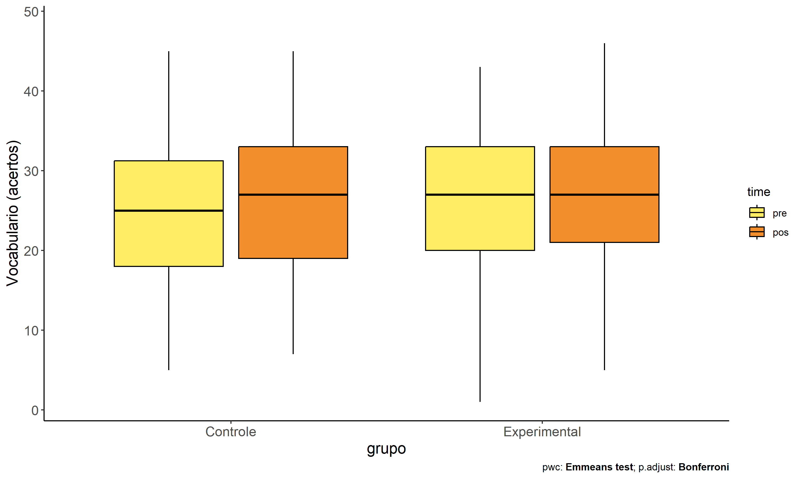<!-- -->

## Pairwise comparisons for two factors

### factores: **grupo:Sexo**

| var       | grupo        | Sexo |   n | M (pre) | SE (pre) | M (unadj) | SE (unadj) | M (adj) | SE (adj) |
|:----------|:-------------|:-----|----:|--------:|---------:|----------:|-----------:|--------:|---------:|
| vocab.pos | Controle     | F    |  85 |  25.718 |    0.888 |    27.365 |      0.870 |  27.296 |    0.597 |
| vocab.pos | Controle     | M    |  67 |  22.910 |    1.131 |    24.567 |      1.171 |  26.700 |    0.679 |
| vocab.pos | Experimental | F    |  99 |  26.202 |    0.832 |    27.677 |      0.791 |  27.229 |    0.554 |
| vocab.pos | Experimental | M    |  98 |  26.837 |    0.841 |    25.949 |      0.922 |  25.003 |    0.558 |

| .y.       | grupo        | Sexo | group1   | group2       | estimate | conf.low | conf.high |    se | statistic |     p | p.adj | p.adj.signif |
|:----------|:-------------|:-----|:---------|:-------------|---------:|---------:|----------:|------:|----------:|------:|------:|:-------------|
| vocab.pos |              | F    | Controle | Experimental |    0.068 |   -1.534 |     1.669 | 0.814 |     0.083 | 0.934 | 0.934 | ns           |
| vocab.pos |              | M    | Controle | Experimental |    1.697 |   -0.041 |     3.434 | 0.883 |     1.921 | 0.056 | 0.056 | ns           |
| vocab.pre |              | F    | Controle | Experimental |   -0.484 |   -2.946 |     1.977 | 1.252 |    -0.387 | 0.699 | 0.699 | ns           |
| vocab.pre |              | M    | Controle | Experimental |   -3.926 |   -6.565 |    -1.287 | 1.342 |    -2.926 | 0.004 | 0.004 | \*\*         |
| vocab.pos | Controle     |      | F        | M            |    0.596 |   -1.183 |     2.376 | 0.905 |     0.659 | 0.510 | 0.510 | ns           |
| vocab.pos | Experimental |      | F        | M            |    2.225 |    0.682 |     3.769 | 0.785 |     2.836 | 0.005 | 0.005 | \*\*         |
| vocab.pre | Controle     |      | F        | M            |    2.807 |    0.087 |     5.527 | 1.383 |     2.030 | 0.043 | 0.043 | \*           |
| vocab.pre | Experimental |      | F        | M            |   -0.635 |   -3.007 |     1.738 | 1.206 |    -0.526 | 0.599 | 0.599 | ns           |

| .y.   | grupo        | Sexo | group1 | group2 | estimate | conf.low | conf.high |    se | statistic |     p | p.adj | p.adj.signif |
|:------|:-------------|:-----|:-------|:-------|---------:|---------:|----------:|------:|----------:|------:|------:|:-------------|
| vocab | Controle     | F    | pre    | pos    |   -1.647 |   -4.219 |     0.925 | 1.310 |    -1.257 | 0.209 | 0.209 | ns           |
| vocab | Controle     | M    | pre    | pos    |   -1.657 |   -4.554 |     1.241 | 1.476 |    -1.123 | 0.262 | 0.262 | ns           |
| vocab | Experimental | F    | pre    | pos    |   -1.475 |   -3.858 |     0.909 | 1.214 |    -1.215 | 0.225 | 0.225 | ns           |
| vocab | Experimental | M    | pre    | pos    |    0.888 |   -1.508 |     3.283 | 1.220 |     0.728 | 0.467 | 0.467 | ns           |

    ## Scale for colour is already present.
    ## Adding another scale for colour, which will replace the existing scale.

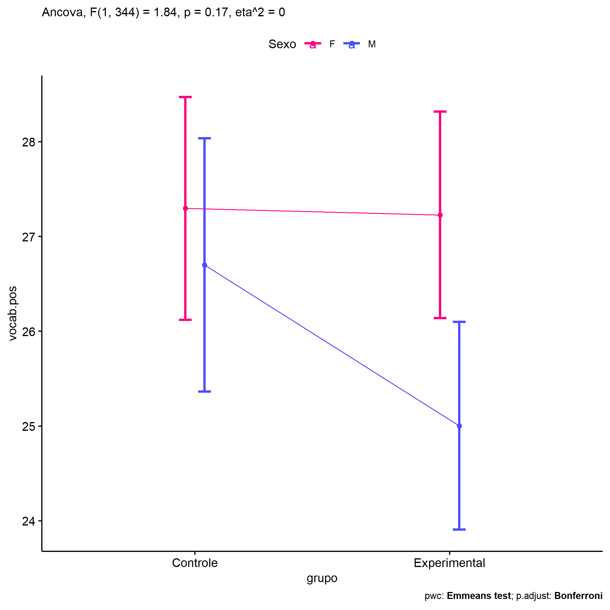<!-- -->

    ## Scale for colour is already present.
    ## Adding another scale for colour, which will replace the existing scale.

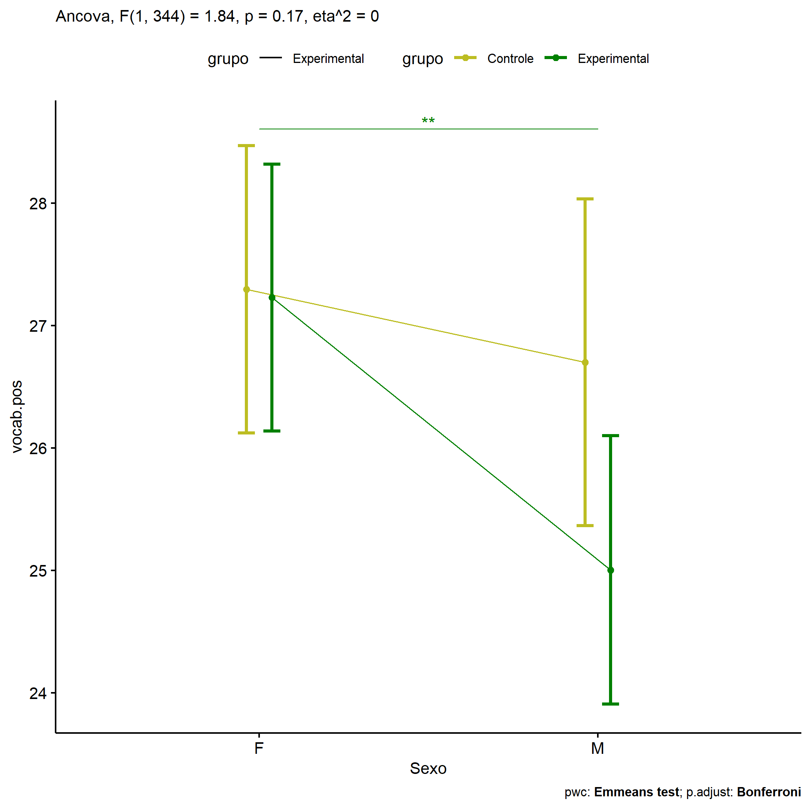<!-- -->

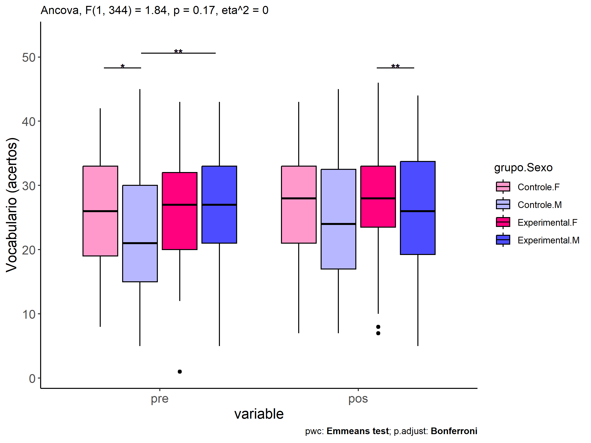<!-- -->

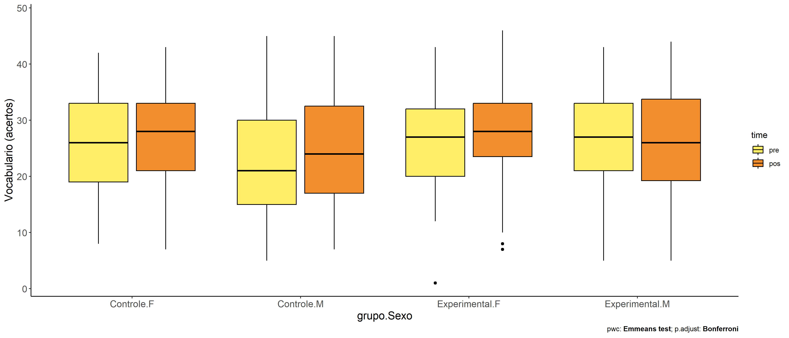<!-- -->

### factores: **grupo:Zona**

| var       | grupo        | Zona   |   n | M (pre) | SE (pre) | M (unadj) | SE (unadj) | M (adj) | SE (adj) |
|:----------|:-------------|:-------|----:|--------:|---------:|----------:|-----------:|--------:|---------:|
| vocab.pos | Controle     | Rural  |  77 |  25.065 |    0.976 |    27.104 |      0.984 |  27.968 |    0.639 |
| vocab.pos | Controle     | Urbana |  50 |  25.980 |    1.220 |    26.680 |      1.279 |  26.826 |    0.792 |
| vocab.pos | Experimental | Rural  |  92 |  26.630 |    0.888 |    26.587 |      0.914 |  26.222 |    0.584 |
| vocab.pos | Experimental | Urbana |  76 |  26.842 |    0.941 |    27.566 |      0.962 |  27.035 |    0.643 |

| .y.       | grupo        | Zona   | group1   | group2       | estimate | conf.low | conf.high |    se | statistic |     p | p.adj | p.adj.signif |
|:----------|:-------------|:-------|:---------|:-------------|---------:|---------:|----------:|------:|----------:|------:|------:|:-------------|
| vocab.pos |              | Rural  | Controle | Experimental |    1.746 |    0.040 |     3.451 | 0.867 |     2.015 | 0.045 | 0.045 | \*           |
| vocab.pos |              | Urbana | Controle | Experimental |   -0.209 |   -2.216 |     1.798 | 1.020 |    -0.205 | 0.838 | 0.838 | ns           |
| vocab.pre |              | Rural  | Controle | Experimental |   -1.565 |   -4.139 |     1.008 | 1.308 |    -1.197 | 0.232 | 0.232 | ns           |
| vocab.pre |              | Urbana | Controle | Experimental |   -0.862 |   -3.896 |     2.172 | 1.542 |    -0.559 | 0.576 | 0.576 | ns           |
| vocab.pos | Controle     |        | Rural    | Urbana       |    1.142 |   -0.860 |     3.144 | 1.017 |     1.123 | 0.262 | 0.262 | ns           |
| vocab.pos | Experimental |        | Rural    | Urbana       |   -0.813 |   -2.520 |     0.895 | 0.868 |    -0.937 | 0.350 | 0.350 | ns           |
| vocab.pre | Controle     |        | Rural    | Urbana       |   -0.915 |   -3.942 |     2.111 | 1.538 |    -0.595 | 0.552 | 0.552 | ns           |
| vocab.pre | Experimental |        | Rural    | Urbana       |   -0.212 |   -2.795 |     2.371 | 1.312 |    -0.161 | 0.872 | 0.872 | ns           |

| .y.   | grupo        | Zona   | group1 | group2 | estimate | conf.low | conf.high |    se | statistic |     p | p.adj | p.adj.signif |
|:------|:-------------|:-------|:-------|:-------|---------:|---------:|----------:|------:|----------:|------:|------:|:-------------|
| vocab | Controle     | Rural  | pre    | pos    |   -2.039 |   -4.753 |     0.675 | 1.382 |    -1.475 | 0.141 | 0.141 | ns           |
| vocab | Controle     | Urbana | pre    | pos    |   -0.700 |   -4.068 |     2.668 | 1.715 |    -0.408 | 0.683 | 0.683 | ns           |
| vocab | Experimental | Rural  | pre    | pos    |    0.043 |   -2.440 |     2.527 | 1.264 |     0.034 | 0.973 | 0.973 | ns           |
| vocab | Experimental | Urbana | pre    | pos    |   -0.724 |   -3.456 |     2.008 | 1.391 |    -0.520 | 0.603 | 0.603 | ns           |

    ## Scale for colour is already present.
    ## Adding another scale for colour, which will replace the existing scale.

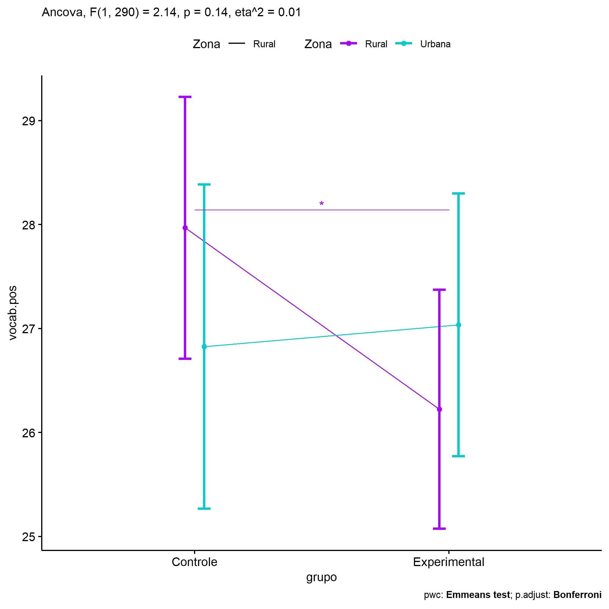<!-- -->

    ## Scale for colour is already present.
    ## Adding another scale for colour, which will replace the existing scale.

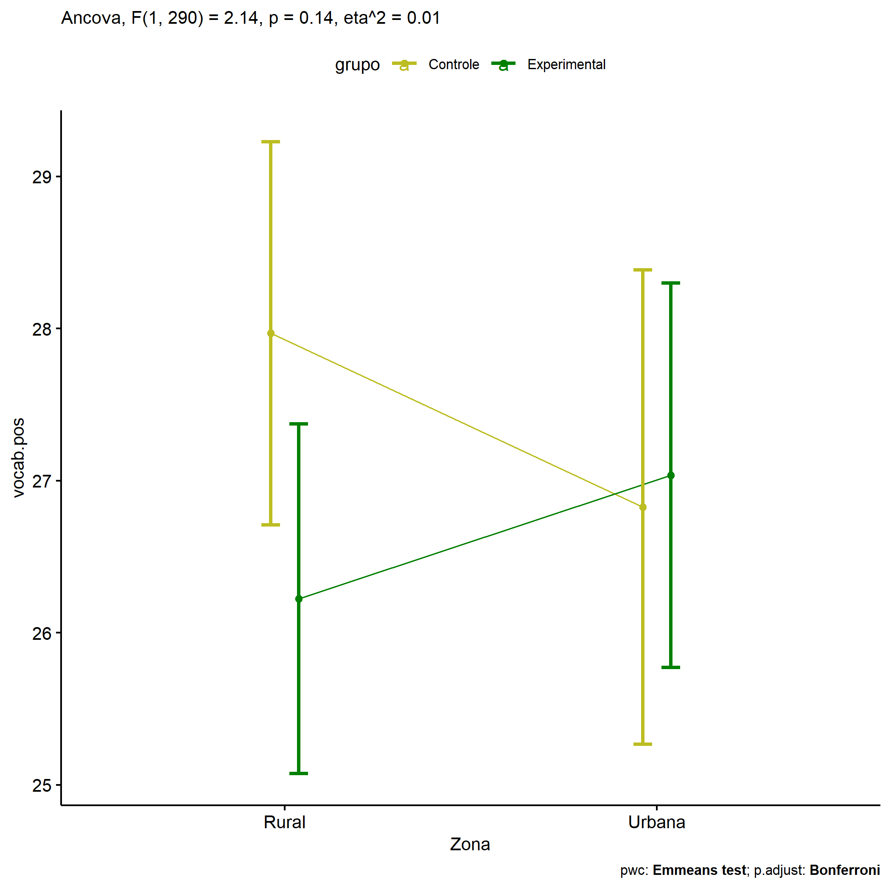<!-- -->

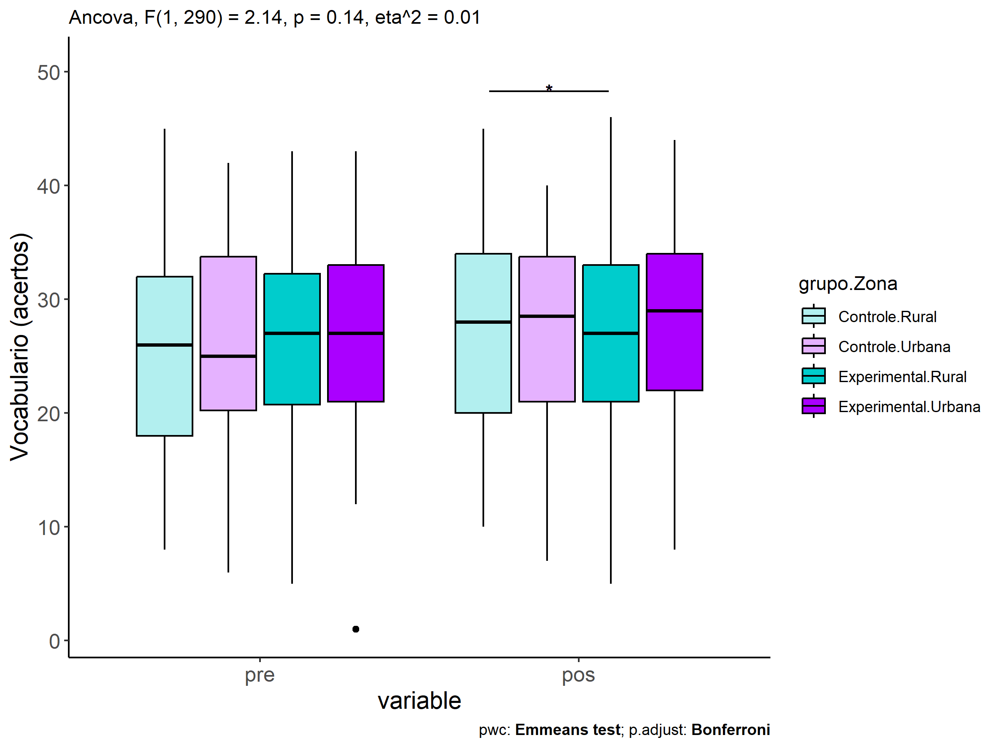<!-- -->

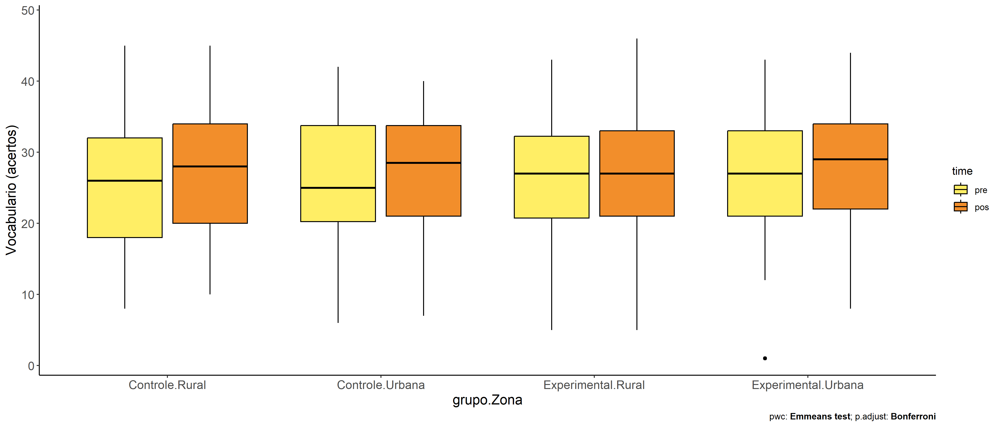<!-- -->

### factores: **grupo:Cor.Raca**

| var       | grupo        | Cor.Raca |   n | M (pre) | SE (pre) | M (unadj) | SE (unadj) | M (adj) | SE (adj) |
|:----------|:-------------|:---------|----:|--------:|---------:|----------:|-----------:|--------:|---------:|
| vocab.pos | Controle     | Branca   |  22 |  26.273 |    1.742 |    28.000 |      1.686 |  26.482 |    1.128 |
| vocab.pos | Controle     | Indígena |   8 |  24.250 |    2.258 |    28.875 |      2.728 |  28.921 |    1.861 |
| vocab.pos | Controle     | Parda    |  44 |  22.591 |    1.278 |    25.545 |      1.447 |  26.874 |    0.799 |
| vocab.pos | Experimental | Branca   |  12 |  26.667 |    2.013 |    24.000 |      2.067 |  22.178 |    1.525 |
| vocab.pos | Experimental | Parda    |  53 |  24.396 |    1.189 |    25.396 |      1.032 |  25.329 |    0.723 |

|     | .y.       | grupo        | Cor.Raca | group1   | group2       | estimate | conf.low | conf.high |    se | statistic |     p | p.adj | p.adj.signif |
|:----|:----------|:-------------|:---------|:---------|:-------------|---------:|---------:|----------:|------:|----------:|------:|------:|:-------------|
| 1   | vocab.pos |              | Branca   | Controle | Experimental |    4.305 |    0.567 |     8.042 | 1.889 |     2.278 | 0.024 | 0.024 | \*           |
| 3   | vocab.pos |              | Parda    | Controle | Experimental |    1.545 |   -0.588 |     3.678 | 1.078 |     1.433 | 0.154 | 0.154 | ns           |
| 4   | vocab.pre |              | Branca   | Controle | Experimental |   -0.394 |   -6.278 |     5.490 | 2.975 |    -0.132 | 0.895 | 0.895 | ns           |
| 6   | vocab.pre |              | Parda    | Controle | Experimental |   -1.805 |   -5.149 |     1.538 | 1.691 |    -1.068 | 0.288 | 0.288 | ns           |
| 7   | vocab.pos | Controle     |          | Branca   | Indígena     |   -2.439 |   -6.743 |     1.866 | 2.176 |    -1.120 | 0.265 | 0.794 | ns           |
| 8   | vocab.pos | Controle     |          | Branca   | Parda        |   -0.392 |   -3.140 |     2.357 | 1.389 |    -0.282 | 0.779 | 1.000 | ns           |
| 9   | vocab.pos | Controle     |          | Indígena | Parda        |    2.047 |   -1.959 |     6.054 | 2.026 |     1.011 | 0.314 | 0.942 | ns           |
| 11  | vocab.pos | Experimental |          | Branca   | Parda        |   -3.151 |   -6.489 |     0.187 | 1.688 |    -1.867 | 0.064 | 0.064 | ns           |
| 13  | vocab.pre | Controle     |          | Branca   | Indígena     |    2.023 |   -4.746 |     8.792 | 3.422 |     0.591 | 0.555 | 1.000 | ns           |
| 14  | vocab.pre | Controle     |          | Branca   | Parda        |    3.682 |   -0.599 |     7.963 | 2.165 |     1.701 | 0.091 | 0.274 | ns           |
| 15  | vocab.pre | Controle     |          | Indígena | Parda        |    1.659 |   -4.642 |     7.961 | 3.186 |     0.521 | 0.603 | 1.000 | ns           |
| 17  | vocab.pre | Experimental |          | Branca   | Parda        |    2.270 |   -2.971 |     7.512 | 2.650 |     0.857 | 0.393 | 0.393 | ns           |

| .y.   | grupo        | Cor.Raca | group1 | group2 | estimate | conf.low | conf.high |    se | statistic |     p | p.adj | p.adj.signif |
|:------|:-------------|:---------|:-------|:-------|---------:|---------:|----------:|------:|----------:|------:|------:|:-------------|
| vocab | Controle     | Branca   | pre    | pos    |   -1.727 |   -6.646 |     3.191 | 2.498 |    -0.691 | 0.490 | 0.490 | ns           |
| vocab | Controle     | Indígena | pre    | pos    |   -4.625 |  -12.781 |     3.531 | 4.143 |    -1.116 | 0.265 | 0.265 | ns           |
| vocab | Controle     | Parda    | pre    | pos    |   -2.955 |   -6.432 |     0.523 | 1.766 |    -1.673 | 0.096 | 0.096 | ns           |
| vocab | Experimental | Branca   | pre    | pos    |    2.667 |   -3.993 |     9.326 | 3.382 |     0.788 | 0.431 | 0.431 | ns           |
| vocab | Experimental | Parda    | pre    | pos    |   -1.000 |   -4.169 |     2.169 | 1.609 |    -0.621 | 0.535 | 0.535 | ns           |

    ## Scale for colour is already present.
    ## Adding another scale for colour, which will replace the existing scale.

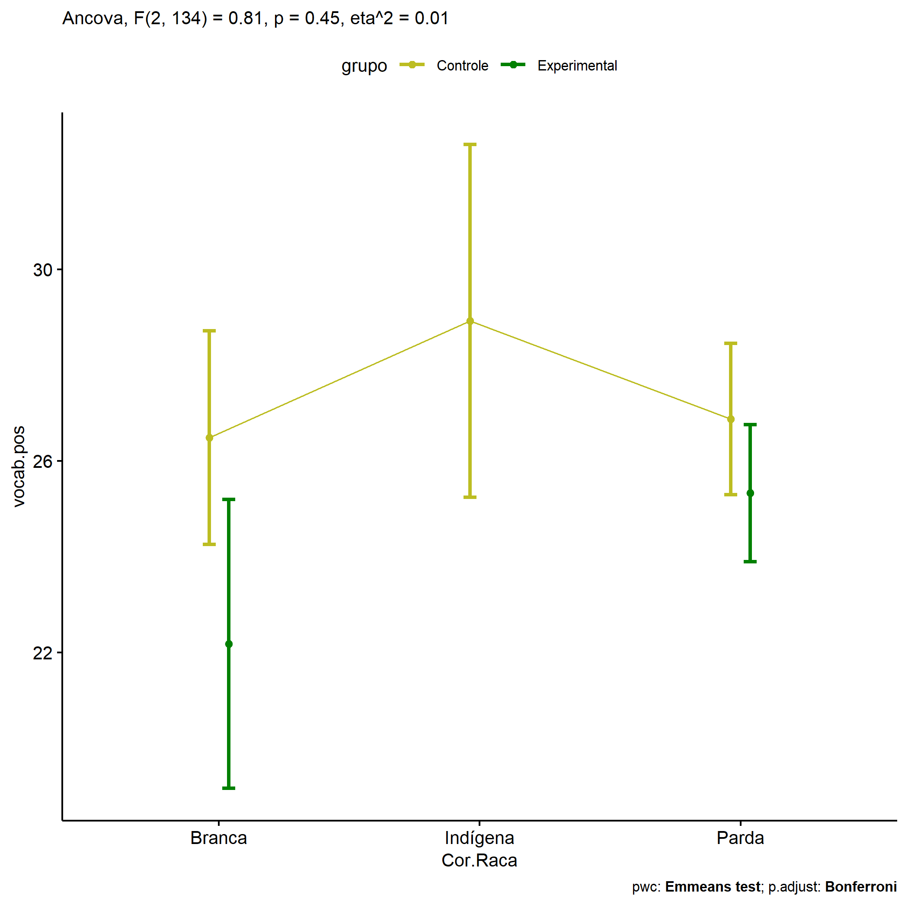<!-- -->

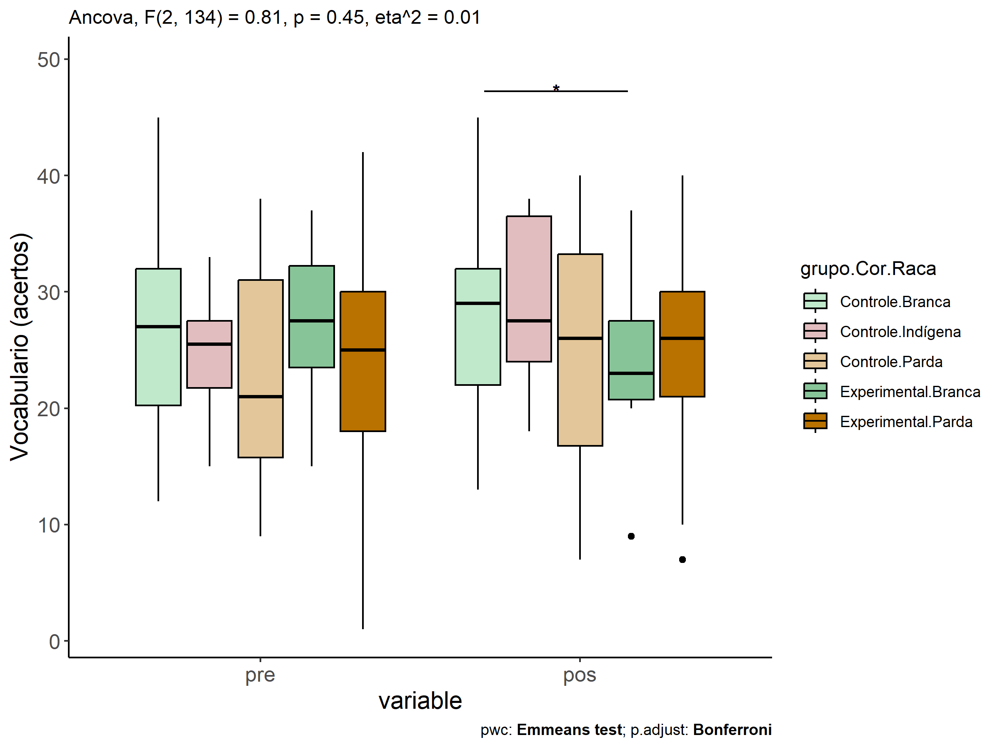<!-- -->

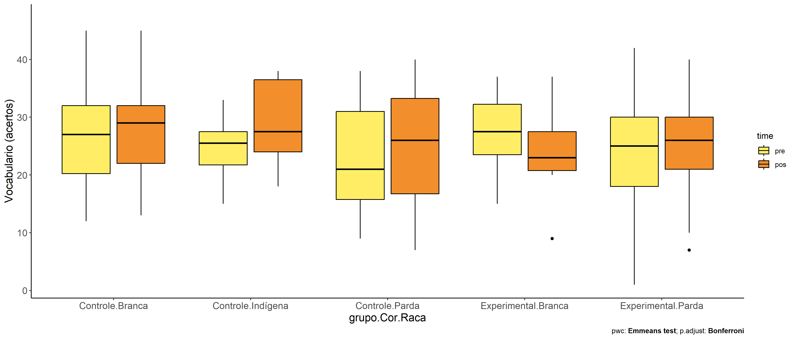<!-- -->

### factores: **grupo:vocab.quintile**

| var       | grupo        | vocab.quintile |   n | M (pre) | SE (pre) | M (unadj) | SE (unadj) | M (adj) | SE (adj) |
|:----------|:-------------|:---------------|----:|--------:|---------:|----------:|-----------:|--------:|---------:|
| vocab.pos | Controle     | 1st quintile   |  32 |  12.500 |    0.541 |    16.594 |      0.881 |  25.991 |    2.109 |
| vocab.pos | Controle     | 2nd quintile   |  35 |  19.686 |    0.255 |    22.057 |      1.031 |  26.312 |    1.264 |
| vocab.pos | Controle     | 3rd quintile   |  39 |  26.256 |    0.296 |    27.410 |      0.928 |  26.962 |    0.896 |
| vocab.pos | Controle     | 4th quintile   |  23 |  32.261 |    0.322 |    34.435 |      0.767 |  29.689 |    1.495 |
| vocab.pos | Controle     | 5th quintile   |  23 |  37.652 |    0.489 |    35.130 |      1.509 |  26.527 |    2.065 |
| vocab.pos | Experimental | 1st quintile   |  30 |  13.533 |    0.621 |    16.900 |      1.155 |  25.558 |    1.997 |
| vocab.pos | Experimental | 2nd quintile   |  34 |  19.824 |    0.282 |    20.706 |      0.996 |  24.862 |    1.262 |
| vocab.pos | Experimental | 3rd quintile   |  54 |  26.093 |    0.235 |    27.074 |      0.815 |  26.743 |    0.760 |
| vocab.pos | Experimental | 4th quintile   |  44 |  31.750 |    0.228 |    30.750 |      0.770 |  26.370 |    1.208 |
| vocab.pos | Experimental | 5th quintile   |  35 |  38.229 |    0.391 |    35.914 |      1.004 |  26.898 |    2.022 |

| .y.       | grupo        | vocab.quintile | group1       | group2       | estimate | conf.low | conf.high |    se | statistic | p       | p.adj   | p.adj.signif |
|:----------|:-------------|:---------------|:-------------|:-------------|---------:|---------:|----------:|------:|----------:|:--------|:--------|:-------------|
| vocab.pos |              | 1st quintile   | Controle     | Experimental |    0.433 |   -2.364 |     3.230 | 1.422 |     0.305 | 0.761   | 0.761   | ns           |
| vocab.pos |              | 2nd quintile   | Controle     | Experimental |    1.450 |   -1.187 |     4.086 | 1.340 |     1.082 | 0.28    | 0.28    | ns           |
| vocab.pos |              | 3rd quintile   | Controle     | Experimental |    0.219 |   -2.082 |     2.520 | 1.170 |     0.187 | 0.852   | 0.852   | ns           |
| vocab.pos |              | 4th quintile   | Controle     | Experimental |    3.319 |    0.499 |     6.140 | 1.434 |     2.315 | 0.021   | 0.021   | \*           |
| vocab.pos |              | 5th quintile   | Controle     | Experimental |   -0.371 |   -3.314 |     2.572 | 1.496 |    -0.248 | 0.804   | 0.804   | ns           |
| vocab.pre |              | 1st quintile   | Controle     | Experimental |   -1.033 |   -2.097 |     0.030 | 0.541 |    -1.911 | 0.057   | 0.057   | ns           |
| vocab.pre |              | 2nd quintile   | Controle     | Experimental |   -0.138 |   -1.145 |     0.870 | 0.512 |    -0.269 | 0.788   | 0.788   | ns           |
| vocab.pre |              | 3rd quintile   | Controle     | Experimental |    0.164 |   -0.715 |     1.043 | 0.447 |     0.366 | 0.714   | 0.714   | ns           |
| vocab.pre |              | 4th quintile   | Controle     | Experimental |    0.511 |   -0.566 |     1.587 | 0.547 |     0.933 | 0.351   | 0.351   | ns           |
| vocab.pre |              | 5th quintile   | Controle     | Experimental |   -0.576 |   -1.700 |     0.547 | 0.571 |    -1.009 | 0.313   | 0.313   | ns           |
| vocab.pos | Controle     |                | 1st quintile | 2nd quintile |   -0.321 |   -3.668 |     3.027 | 1.702 |    -0.188 | 0.851   | 1       | ns           |
| vocab.pos | Controle     |                | 1st quintile | 3rd quintile |   -0.971 |   -5.619 |     3.677 | 2.363 |    -0.411 | 0.681   | 1       | ns           |
| vocab.pos | Controle     |                | 1st quintile | 4th quintile |   -3.698 |   -9.981 |     2.584 | 3.194 |    -1.158 | 0.248   | 1       | ns           |
| vocab.pos | Controle     |                | 1st quintile | 5th quintile |   -0.536 |   -8.177 |     7.105 | 3.885 |    -0.138 | 0.89    | 1       | ns           |
| vocab.pos | Controle     |                | 2nd quintile | 3rd quintile |   -0.651 |   -3.792 |     2.491 | 1.597 |    -0.407 | 0.684   | 1       | ns           |
| vocab.pos | Controle     |                | 2nd quintile | 4th quintile |   -3.378 |   -7.959 |     1.204 | 2.329 |    -1.450 | 0.148   | 1       | ns           |
| vocab.pos | Controle     |                | 2nd quintile | 5th quintile |   -0.215 |   -6.033 |     5.604 | 2.958 |    -0.073 | 0.942   | 1       | ns           |
| vocab.pos | Controle     |                | 3rd quintile | 4th quintile |   -2.727 |   -6.059 |     0.605 | 1.694 |    -1.610 | 0.108   | 1       | ns           |
| vocab.pos | Controle     |                | 3rd quintile | 5th quintile |    0.436 |   -3.857 |     4.729 | 2.183 |     0.200 | 0.842   | 1       | ns           |
| vocab.pos | Controle     |                | 4th quintile | 5th quintile |    3.163 |   -0.400 |     6.726 | 1.811 |     1.746 | 0.082   | 0.817   | ns           |
| vocab.pos | Experimental |                | 1st quintile | 2nd quintile |    0.696 |   -2.562 |     3.953 | 1.656 |     0.420 | 0.675   | 1       | ns           |
| vocab.pos | Experimental |                | 1st quintile | 3rd quintile |   -1.186 |   -5.491 |     3.120 | 2.189 |    -0.542 | 0.588   | 1       | ns           |
| vocab.pos | Experimental |                | 1st quintile | 4th quintile |   -0.813 |   -6.526 |     4.901 | 2.905 |    -0.280 | 0.78    | 1       | ns           |
| vocab.pos | Experimental |                | 1st quintile | 5th quintile |   -1.340 |   -8.761 |     6.081 | 3.773 |    -0.355 | 0.723   | 1       | ns           |
| vocab.pos | Experimental |                | 2nd quintile | 3rd quintile |   -1.882 |   -4.851 |     1.088 | 1.509 |    -1.247 | 0.213   | 1       | ns           |
| vocab.pos | Experimental |                | 2nd quintile | 4th quintile |   -1.509 |   -5.675 |     2.658 | 2.118 |    -0.712 | 0.477   | 1       | ns           |
| vocab.pos | Experimental |                | 2nd quintile | 5th quintile |   -2.036 |   -7.817 |     3.744 | 2.939 |    -0.693 | 0.489   | 1       | ns           |
| vocab.pos | Experimental |                | 3rd quintile | 4th quintile |    0.373 |   -2.355 |     3.101 | 1.387 |     0.269 | 0.788   | 1       | ns           |
| vocab.pos | Experimental |                | 3rd quintile | 5th quintile |   -0.155 |   -4.296 |     3.987 | 2.105 |    -0.073 | 0.941   | 1       | ns           |
| vocab.pos | Experimental |                | 4th quintile | 5th quintile |   -0.528 |   -3.598 |     2.543 | 1.561 |    -0.338 | 0.736   | 1       | ns           |
| vocab.pre | Controle     |                | 1st quintile | 2nd quintile |   -7.186 |   -8.209 |    -6.162 | 0.520 |   -13.811 | \<0.001 | \<0.001 | \*\*\*\*     |
| vocab.pre | Controle     |                | 1st quintile | 3rd quintile |  -13.756 |  -14.754 |   -12.758 | 0.507 |   -27.113 | \<0.001 | \<0.001 | \*\*\*\*     |
| vocab.pre | Controle     |                | 1st quintile | 4th quintile |  -19.761 |  -20.905 |   -18.617 | 0.582 |   -33.982 | \<0.001 | \<0.001 | \*\*\*\*     |
| vocab.pre | Controle     |                | 1st quintile | 5th quintile |  -25.152 |  -26.296 |   -24.008 | 0.582 |   -43.253 | \<0.001 | \<0.001 | \*\*\*\*     |
| vocab.pre | Controle     |                | 2nd quintile | 3rd quintile |   -6.571 |   -7.545 |    -5.596 | 0.495 |   -13.266 | \<0.001 | \<0.001 | \*\*\*\*     |
| vocab.pre | Controle     |                | 2nd quintile | 4th quintile |  -12.575 |  -13.698 |   -11.452 | 0.571 |   -22.023 | \<0.001 | \<0.001 | \*\*\*\*     |
| vocab.pre | Controle     |                | 2nd quintile | 5th quintile |  -17.966 |  -19.090 |   -16.843 | 0.571 |   -31.465 | \<0.001 | \<0.001 | \*\*\*\*     |
| vocab.pre | Controle     |                | 3rd quintile | 4th quintile |   -6.004 |   -7.105 |    -4.904 | 0.559 |   -10.736 | \<0.001 | \<0.001 | \*\*\*\*     |
| vocab.pre | Controle     |                | 3rd quintile | 5th quintile |  -11.396 |  -12.496 |   -10.296 | 0.559 |   -20.377 | \<0.001 | \<0.001 | \*\*\*\*     |
| vocab.pre | Controle     |                | 4th quintile | 5th quintile |   -5.391 |   -6.625 |    -4.157 | 0.627 |    -8.595 | \<0.001 | \<0.001 | \*\*\*\*     |
| vocab.pre | Experimental |                | 1st quintile | 2nd quintile |   -6.290 |   -7.338 |    -5.242 | 0.533 |   -11.805 | \<0.001 | \<0.001 | \*\*\*\*     |
| vocab.pre | Experimental |                | 1st quintile | 3rd quintile |  -12.559 |  -13.512 |   -11.606 | 0.484 |   -25.928 | \<0.001 | \<0.001 | \*\*\*\*     |
| vocab.pre | Experimental |                | 1st quintile | 4th quintile |  -18.217 |  -19.207 |   -17.226 | 0.504 |   -36.168 | \<0.001 | \<0.001 | \*\*\*\*     |
| vocab.pre | Experimental |                | 1st quintile | 5th quintile |  -24.695 |  -25.736 |   -23.654 | 0.529 |   -46.659 | \<0.001 | \<0.001 | \*\*\*\*     |
| vocab.pre | Experimental |                | 2nd quintile | 3rd quintile |   -6.269 |   -7.185 |    -5.353 | 0.466 |   -13.461 | \<0.001 | \<0.001 | \*\*\*\*     |
| vocab.pre | Experimental |                | 2nd quintile | 4th quintile |  -11.926 |  -12.882 |   -10.971 | 0.486 |   -24.554 | \<0.001 | \<0.001 | \*\*\*\*     |
| vocab.pre | Experimental |                | 2nd quintile | 5th quintile |  -18.405 |  -19.413 |   -17.397 | 0.512 |   -35.931 | \<0.001 | \<0.001 | \*\*\*\*     |
| vocab.pre | Experimental |                | 3rd quintile | 4th quintile |   -5.657 |   -6.507 |    -4.808 | 0.432 |   -13.095 | \<0.001 | \<0.001 | \*\*\*\*     |
| vocab.pre | Experimental |                | 3rd quintile | 5th quintile |  -12.136 |  -13.044 |   -11.228 | 0.462 |   -26.290 | \<0.001 | \<0.001 | \*\*\*\*     |
| vocab.pre | Experimental |                | 4th quintile | 5th quintile |   -6.479 |   -7.426 |    -5.531 | 0.482 |   -13.447 | \<0.001 | \<0.001 | \*\*\*\*     |

| .y.   | grupo        | vocab.quintile | group1 | group2 | estimate | conf.low | conf.high |    se | statistic | p       | p.adj   | p.adj.signif |
|:------|:-------------|:---------------|:-------|:-------|---------:|---------:|----------:|------:|----------:|:--------|:--------|:-------------|
| vocab | Controle     | 1st quintile   | pre    | pos    |   -4.094 |   -6.226 |    -1.962 | 1.086 |    -3.770 | \<0.001 | \<0.001 | \*\*\*       |
| vocab | Controle     | 2nd quintile   | pre    | pos    |   -2.371 |   -4.410 |    -0.333 | 1.038 |    -2.284 | 0.023   | 0.023   | \*           |
| vocab | Controle     | 3rd quintile   | pre    | pos    |   -1.154 |   -3.085 |     0.777 | 0.984 |    -1.173 | 0.241   | 0.241   | ns           |
| vocab | Controle     | 4th quintile   | pre    | pos    |   -2.174 |   -4.689 |     0.341 | 1.281 |    -1.697 | 0.09    | 0.09    | ns           |
| vocab | Controle     | 5th quintile   | pre    | pos    |    2.522 |    0.007 |     5.036 | 1.281 |     1.969 | 0.049   | 0.049   | \*           |
| vocab | Experimental | 1st quintile   | pre    | pos    |   -3.367 |   -5.569 |    -1.165 | 1.121 |    -3.002 | 0.003   | 0.003   | \*\*         |
| vocab | Experimental | 2nd quintile   | pre    | pos    |   -0.882 |   -2.951 |     1.186 | 1.053 |    -0.838 | 0.403   | 0.403   | ns           |
| vocab | Experimental | 3rd quintile   | pre    | pos    |   -0.981 |   -2.623 |     0.660 | 0.836 |    -1.174 | 0.241   | 0.241   | ns           |
| vocab | Experimental | 4th quintile   | pre    | pos    |    1.000 |   -0.818 |     2.818 | 0.926 |     1.080 | 0.281   | 0.281   | ns           |
| vocab | Experimental | 5th quintile   | pre    | pos    |    2.314 |    0.276 |     4.353 | 1.038 |     2.229 | 0.026   | 0.026   | \*           |

    ## Scale for colour is already present.
    ## Adding another scale for colour, which will replace the existing scale.

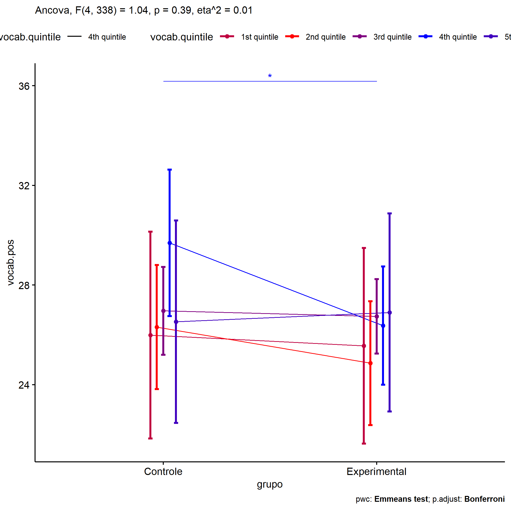<!-- -->

    ## Scale for colour is already present.
    ## Adding another scale for colour, which will replace the existing scale.

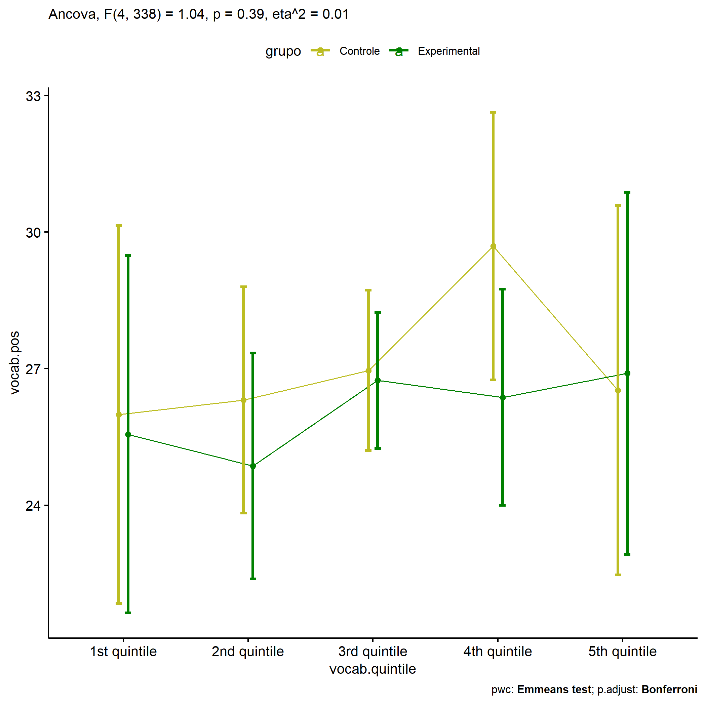<!-- -->

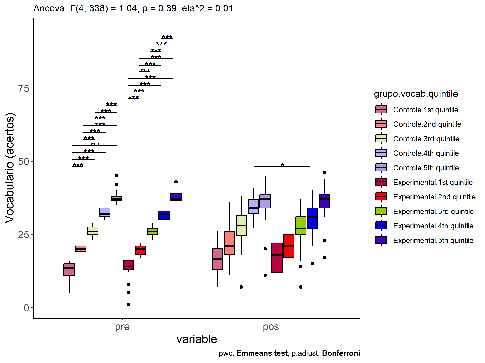<!-- -->

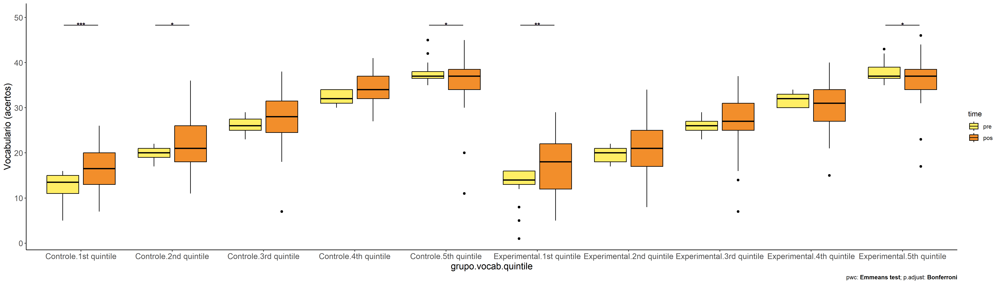<!-- -->
