ANCOVA in Vocabulario (acertos) (Vocabulario (acertos))
================
Geiser C. Challco <geiser@alumni.usp.br>

- [Descriptive Statistics of Initial
  Data](#descriptive-statistics-of-initial-data)
- [Checking of Assumptions](#checking-of-assumptions)
  - [Assumption: Normality distribution of
    data](#assumption-normality-distribution-of-data)
  - [Assumption: Homogeneity of data
    distribution](#assumption-homogeneity-of-data-distribution)
- [Computation of ANCOVA test and Pairwise
  Comparison](#computation-of-ancova-test-and-pairwise-comparison)
  - [ANCOVA tests for one factor](#ancova-tests-for-one-factor)
  - [ANCOVA tests for two factors](#ancova-tests-for-two-factors)
  - [Pairwise comparisons for one factor:
    **grupo**](#pairwise-comparisons-for-one-factor-grupo)
  - [Pairwise comparisons for two
    factors](#pairwise-comparisons-for-two-factors)
    - [factores: **grupo:Sexo**](#factores-gruposexo)
    - [factores: **grupo:Zona**](#factores-grupozona)
    - [factores: **grupo:Cor.Raca**](#factores-grupocorraca)
    - [factores: **grupo:vocab.quintile**](#factores-grupovocabquintile)

**NOTE**

- Teste ANCOVA para determinar se houve diferenças significativas no
  Vocabulario (acertos) (medido usando pre- e pos-testes).
- ANCOVA test to determine whether there were significant differences in
  Vocabulario (acertos) (measured using pre- and post-tests).

# Descriptive Statistics of Initial Data

| grupo        | Sexo | Zona   | Cor.Raca | vocab.quintile | variable  |   n |   mean | median | min | max |     sd |    se |     ci |   iqr |
|:-------------|:-----|:-------|:---------|:---------------|:----------|----:|-------:|-------:|----:|----:|-------:|------:|-------:|------:|
| Controle     | F    |        |          |                | vocab.pre |  53 | 27.868 |   28.0 |   6 |  45 |  8.700 | 1.195 |  2.398 |  9.00 |
| Controle     | M    |        |          |                | vocab.pre |  47 | 26.213 |   25.0 |  12 |  42 |  8.546 | 1.247 |  2.509 | 15.00 |
| Experimental | F    |        |          |                | vocab.pre |  96 | 29.229 |   30.5 |   6 |  43 |  8.921 | 0.911 |  1.808 | 13.00 |
| Experimental | M    |        |          |                | vocab.pre |  85 | 27.082 |   28.0 |   8 |  43 |  7.987 | 0.866 |  1.723 | 11.00 |
| Controle     | F    |        |          |                | vocab.pos |  53 | 28.660 |   31.0 |   0 |  45 | 10.681 | 1.467 |  2.944 | 10.00 |
| Controle     | M    |        |          |                | vocab.pos |  47 | 25.872 |   28.0 |   3 |  44 | 10.642 | 1.552 |  3.124 | 18.00 |
| Experimental | F    |        |          |                | vocab.pos |  96 | 30.438 |   32.0 |   8 |  44 |  9.028 | 0.921 |  1.829 | 14.00 |
| Experimental | M    |        |          |                | vocab.pos |  85 | 27.471 |   29.0 |   7 |  43 |  8.795 | 0.954 |  1.897 | 13.00 |
| Controle     |      | Rural  |          |                | vocab.pre |  38 | 26.711 |   27.0 |   7 |  45 |  8.427 | 1.367 |  2.770 | 10.75 |
| Controle     |      | Urbana |          |                | vocab.pre |  18 | 26.944 |   26.5 |  12 |  41 |  7.635 | 1.800 |  3.797 |  8.50 |
| Controle     |      |        |          |                | vocab.pre |  44 | 27.477 |   27.0 |   6 |  43 |  9.317 | 1.405 |  2.833 | 15.50 |
| Experimental |      | Rural  |          |                | vocab.pre |  56 | 27.804 |   28.5 |   8 |  41 |  8.490 | 1.135 |  2.274 | 13.00 |
| Experimental |      | Urbana |          |                | vocab.pre |  33 | 29.061 |   30.0 |  12 |  39 |  7.976 | 1.388 |  2.828 | 12.00 |
| Experimental |      |        |          |                | vocab.pre |  92 | 28.174 |   29.0 |   6 |  43 |  8.829 | 0.920 |  1.828 | 13.00 |
| Controle     |      | Rural  |          |                | vocab.pos |  38 | 27.868 |   31.0 |   3 |  42 | 10.333 | 1.676 |  3.396 |  9.50 |
| Controle     |      | Urbana |          |                | vocab.pos |  18 | 31.222 |   30.5 |  14 |  45 |  8.063 | 1.900 |  4.009 | 10.00 |
| Controle     |      |        |          |                | vocab.pos |  44 | 25.318 |   27.0 |   0 |  44 | 11.631 | 1.754 |  3.536 | 18.50 |
| Experimental |      | Rural  |          |                | vocab.pos |  56 | 28.446 |   29.0 |   8 |  44 |  9.045 | 1.209 |  2.422 | 13.25 |
| Experimental |      | Urbana |          |                | vocab.pos |  33 | 31.030 |   32.0 |  12 |  43 |  8.687 | 1.512 |  3.080 | 13.00 |
| Experimental |      |        |          |                | vocab.pos |  92 | 28.696 |   30.0 |   7 |  44 |  9.116 | 0.950 |  1.888 | 12.75 |
| Controle     |      |        | Branca   |                | vocab.pre |   3 | 35.667 |   36.0 |  29 |  42 |  6.506 | 3.756 | 16.163 |  6.50 |
| Controle     |      |        | Indígena |                | vocab.pre |   1 | 34.000 |   34.0 |  34 |  34 |        |       |        |  0.00 |
| Controle     |      |        | Parda    |                | vocab.pre |  38 | 27.316 |   27.5 |   7 |  45 |  8.269 | 1.341 |  2.718 | 10.00 |
| Controle     |      |        |          |                | vocab.pre |  58 | 26.379 |   26.5 |   6 |  43 |  8.835 | 1.160 |  2.323 | 14.75 |
| Experimental |      |        | Amarela  |                | vocab.pre |   1 | 23.000 |   23.0 |  23 |  23 |        |       |        |  0.00 |
| Experimental |      |        | Branca   |                | vocab.pre |  19 | 30.000 |   29.0 |  19 |  40 |  6.333 | 1.453 |  3.053 |  9.00 |
| Experimental |      |        | Parda    |                | vocab.pre |  53 | 26.925 |   28.0 |   8 |  43 |  9.713 | 1.334 |  2.677 | 13.00 |
| Experimental |      |        |          |                | vocab.pre | 108 | 28.593 |   29.5 |   6 |  43 |  8.264 | 0.795 |  1.576 | 13.00 |
| Controle     |      |        | Branca   |                | vocab.pos |   3 | 37.000 |   40.0 |  29 |  42 |  7.000 | 4.041 | 17.389 |  6.50 |
| Controle     |      |        | Indígena |                | vocab.pos |   1 | 38.000 |   38.0 |  38 |  38 |        |       |        |  0.00 |
| Controle     |      |        | Parda    |                | vocab.pos |  38 | 26.921 |   31.0 |   0 |  42 | 11.581 | 1.879 |  3.807 | 16.25 |
| Controle     |      |        |          |                | vocab.pos |  58 | 26.948 |   29.0 |   9 |  45 | 10.144 | 1.332 |  2.667 | 14.50 |
| Experimental |      |        | Amarela  |                | vocab.pos |   1 | 26.000 |   26.0 |  26 |  26 |        |       |        |  0.00 |
| Experimental |      |        | Branca   |                | vocab.pos |  19 | 29.474 |   29.0 |  14 |  43 |  8.784 | 2.015 |  4.234 | 12.50 |
| Experimental |      |        | Parda    |                | vocab.pos |  53 | 28.962 |   31.0 |   8 |  44 |  9.567 | 1.314 |  2.637 | 16.00 |
| Experimental |      |        |          |                | vocab.pos | 108 | 29.037 |   30.5 |   7 |  44 |  8.900 | 0.856 |  1.698 | 12.50 |
| Controle     |      |        |          | 1st quintile   | vocab.pre |  13 | 12.308 |   13.0 |   6 |  16 |  3.276 | 0.909 |  1.980 |  4.00 |
| Controle     |      |        |          | 2nd quintile   | vocab.pre |  14 | 19.286 |   19.0 |  17 |  22 |  1.541 | 0.412 |  0.890 |  2.00 |
| Controle     |      |        |          | 3rd quintile   | vocab.pre |  33 | 26.061 |   26.0 |  23 |  29 |  1.749 | 0.304 |  0.620 |  2.00 |
| Controle     |      |        |          | 4th quintile   | vocab.pre |  18 | 32.278 |   32.5 |  30 |  34 |  1.526 | 0.360 |  0.759 |  3.00 |
| Controle     |      |        |          | 5th quintile   | vocab.pre |  22 | 38.091 |   37.0 |  35 |  45 |  3.022 | 0.644 |  1.340 |  4.50 |
| Experimental |      |        |          | 1st quintile   | vocab.pre |  19 | 11.842 |   12.0 |   6 |  16 |  2.949 | 0.677 |  1.421 |  5.00 |
| Experimental |      |        |          | 2nd quintile   | vocab.pre |  28 | 20.321 |   20.5 |  17 |  22 |  1.588 | 0.300 |  0.616 |  3.00 |
| Experimental |      |        |          | 3rd quintile   | vocab.pre |  46 | 26.152 |   26.0 |  23 |  29 |  2.241 | 0.330 |  0.665 |  4.00 |
| Experimental |      |        |          | 4th quintile   | vocab.pre |  37 | 31.757 |   32.0 |  30 |  34 |  1.362 | 0.224 |  0.454 |  2.00 |
| Experimental |      |        |          | 5th quintile   | vocab.pre |  51 | 37.961 |   38.0 |  35 |  43 |  2.315 | 0.324 |  0.651 |  4.00 |
| Controle     |      |        |          | 1st quintile   | vocab.pos |  13 | 13.077 |   14.0 |   3 |  25 |  6.034 | 1.674 |  3.646 |  6.00 |
| Controle     |      |        |          | 2nd quintile   | vocab.pos |  14 | 21.929 |   25.0 |   0 |  37 | 11.146 | 2.979 |  6.435 | 18.00 |
| Controle     |      |        |          | 3rd quintile   | vocab.pos |  33 | 28.030 |   29.0 |   8 |  40 |  7.007 | 1.220 |  2.484 |  6.00 |
| Controle     |      |        |          | 4th quintile   | vocab.pos |  18 | 32.667 |   33.0 |  15 |  42 |  5.881 | 1.386 |  2.925 |  6.25 |
| Controle     |      |        |          | 5th quintile   | vocab.pos |  22 | 33.864 |   39.0 |  10 |  45 | 11.141 | 2.375 |  4.940 | 11.00 |
| Experimental |      |        |          | 1st quintile   | vocab.pos |  19 | 16.947 |   16.0 |   7 |  33 |  6.696 | 1.536 |  3.227 |  8.00 |
| Experimental |      |        |          | 2nd quintile   | vocab.pos |  28 | 21.429 |   21.0 |  12 |  34 |  5.587 | 1.056 |  2.166 |  8.25 |
| Experimental |      |        |          | 3rd quintile   | vocab.pos |  46 | 26.413 |   27.0 |   8 |  35 |  5.924 | 0.873 |  1.759 |  8.00 |
| Experimental |      |        |          | 4th quintile   | vocab.pos |  37 | 32.568 |   34.0 |  18 |  40 |  5.378 | 0.884 |  1.793 |  7.00 |
| Experimental |      |        |          | 5th quintile   | vocab.pos |  51 | 37.549 |   38.0 |  16 |  44 |  5.471 | 0.766 |  1.539 |  6.00 |

# Checking of Assumptions

## Assumption: Normality distribution of data

| var       |   n |   skewness | kurtosis | symmetry | statistic | method     |        p | p.signif | normality |
|:----------|----:|-----------:|---------:|:---------|----------:|:-----------|---------:|:---------|:----------|
| vocab.pos | 281 | -1.1036907 | 2.205608 | NO       |  60.22173 | D’Agostino | 0.00e+00 | \*\*\*\* | \-        |
| vocab.pos | 145 | -0.9172689 | 1.953371 | NO       |  27.56587 | D’Agostino | 1.00e-06 | \*\*\*\* | QQ        |
| vocab.pos | 115 | -0.9156232 | 1.372642 | NO       |  20.23927 | D’Agostino | 4.03e-05 | \*\*\*   | QQ        |
| vocab.pos | 281 | -1.0705808 | 1.920859 | NO       |  55.84082 | D’Agostino | 0.00e+00 | \*\*\*\* | \-        |

## Assumption: Homogeneity of data distribution

| var       | method         | formula                          |   n | DFn.df1 | DFd.df2 | statistic |         p | p.signif |
|:----------|:---------------|:---------------------------------|----:|--------:|--------:|----------:|----------:|:---------|
| vocab.pos | Levene’s test  | `.res`~`grupo`\*`Sexo`           | 281 |       3 |     277 |  4.171284 | 0.0065393 | \*       |
| vocab.pos | Anova’s slopes | `.res`~`grupo`\*`Sexo`           | 281 |       3 |     273 |  0.597000 | 0.6180000 | ns       |
| vocab.pos | Levene’s test  | `.res`~`grupo`\*`Zona`           | 145 |       3 |     141 |  2.021026 | 0.1137084 | ns       |
| vocab.pos | Anova’s slopes | `.res`~`grupo`\*`Zona`           | 145 |       3 |     137 |  0.475000 | 0.7000000 | ns       |
| vocab.pos | Levene’s test  | `.res`~`grupo`\*`Cor.Raca`       | 115 |       5 |     109 |  3.326963 | 0.0077845 | \*       |
| vocab.pos | Anova’s slopes | `.res`~`grupo`\*`Cor.Raca`       | 115 |       3 |     105 |  0.835000 | 0.4770000 | ns       |
| vocab.pos | Levene’s test  | `.res`~`grupo`\*`vocab.quintile` | 281 |       9 |     271 |  2.630961 | 0.0062168 | \*       |
| vocab.pos | Anova’s slopes | `.res`~`grupo`\*`vocab.quintile` | 281 |       9 |     261 |  0.671000 | 0.7350000 | ns       |

# Computation of ANCOVA test and Pairwise Comparison

## ANCOVA tests for one factor

|     | Effect         | DFn | DFd |       SSn |       SSd |       F | p       |   ges | p\<.05 |
|:----|:---------------|----:|----:|----------:|----------:|--------:|:--------|------:|:-------|
| 1   | vocab.pre      |   1 | 278 | 13220.280 | 12752.117 | 288.206 | \<0.001 | 0.509 | \*     |
| 2   | grupo          |   1 | 278 |    39.610 | 12752.117 |   0.864 | 0.354   | 0.003 |        |
| 4   | Sexo           |   1 | 278 |   122.512 | 12669.216 |   2.688 | 0.102   | 0.010 |        |
| 6   | Zona           |   1 | 142 |   144.090 |  5224.776 |   3.916 | 0.05    | 0.027 | \*     |
| 8   | Cor.Raca       |   3 | 110 |    26.467 |  6283.954 |   0.154 | 0.927   | 0.004 |        |
| 10  | vocab.quintile |   4 | 275 |   169.170 | 12622.557 |   0.921 | 0.452   | 0.013 |        |

## ANCOVA tests for two factors

|     | Effect               | DFn | DFd |       SSn |       SSd |       F | p       |   ges | p\<.05 |
|:----|:---------------------|----:|----:|----------:|----------:|--------:|:--------|------:|:-------|
| 1   | vocab.pre            |   1 | 276 | 12754.015 | 12627.908 | 278.756 | \<0.001 | 0.502 | \*     |
| 4   | grupo:Sexo           |   1 | 276 |     0.719 | 12627.908 |   0.016 | 0.9     | 0.000 |        |
| 8   | grupo:Zona           |   1 | 140 |    20.408 |  5177.275 |   0.552 | 0.459   | 0.004 |        |
| 12  | grupo:Cor.Raca       |   1 | 108 |    67.838 |  6137.403 |   1.194 | 0.277   | 0.011 |        |
| 16  | grupo:vocab.quintile |   4 | 270 |   372.266 | 12211.354 |   2.058 | 0.087   | 0.030 |        |

## Pairwise comparisons for one factor: **grupo**

| var       | grupo        |   n | M (pre) | SE (pre) | M (unadj) | SE (unadj) | M (adj) | SE (adj) |
|:----------|:-------------|----:|--------:|---------:|----------:|-----------:|--------:|---------:|
| vocab.pos | Controle     | 100 |  27.090 |    0.862 |    27.350 |       1.07 |  27.935 |    0.678 |
| vocab.pos | Experimental | 181 |  28.221 |    0.635 |    29.044 |       0.67 |  28.721 |    0.504 |

| .y.       | group1   | group2       | estimate | conf.low | conf.high |    se | statistic |     p | p.adj | p.adj.signif |
|:----------|:---------|:-------------|---------:|---------:|----------:|------:|----------:|------:|------:|:-------------|
| vocab.pos | Controle | Experimental |   -0.786 |   -2.450 |     0.879 | 0.846 |    -0.929 | 0.354 | 0.354 | ns           |
| vocab.pre | Controle | Experimental |   -1.131 |   -3.233 |     0.971 | 1.068 |    -1.059 | 0.290 | 0.290 | ns           |

| .y.   | grupo        | group1 | group2 | estimate | conf.low | conf.high |    se | statistic |     p | p.adj | p.adj.signif |
|:------|:-------------|:-------|:-------|---------:|---------:|----------:|------:|----------:|------:|------:|:-------------|
| vocab | Controle     | pre    | pos    |   -0.260 |   -2.795 |     2.275 | 1.290 |    -0.201 | 0.840 | 0.840 | ns           |
| vocab | Experimental | pre    | pos    |   -0.823 |   -2.707 |     1.061 | 0.959 |    -0.858 | 0.391 | 0.391 | ns           |

    ## Scale for colour is already present.
    ## Adding another scale for colour, which will replace the existing scale.

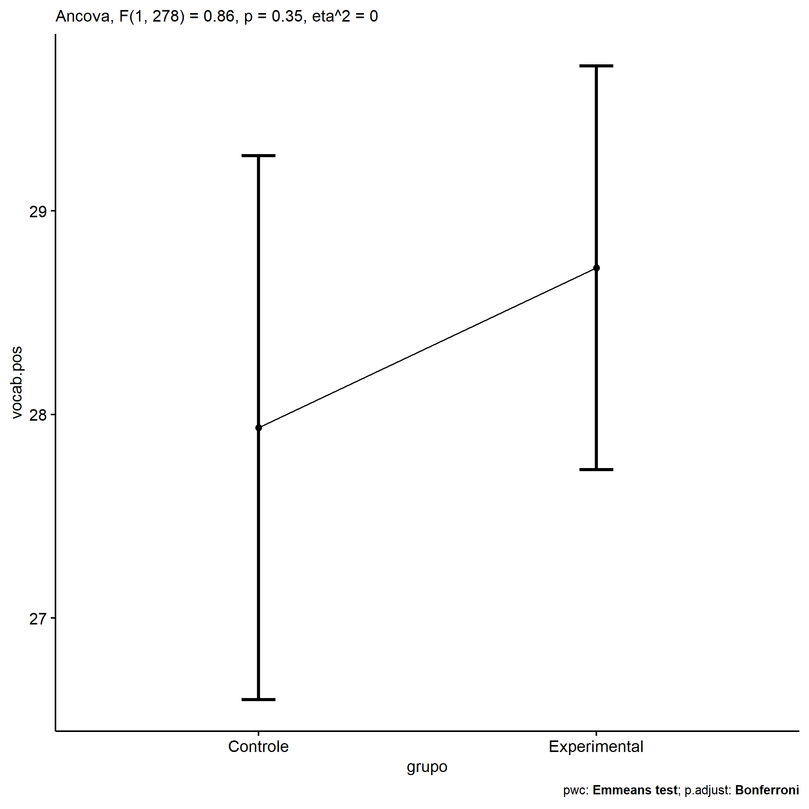<!-- -->

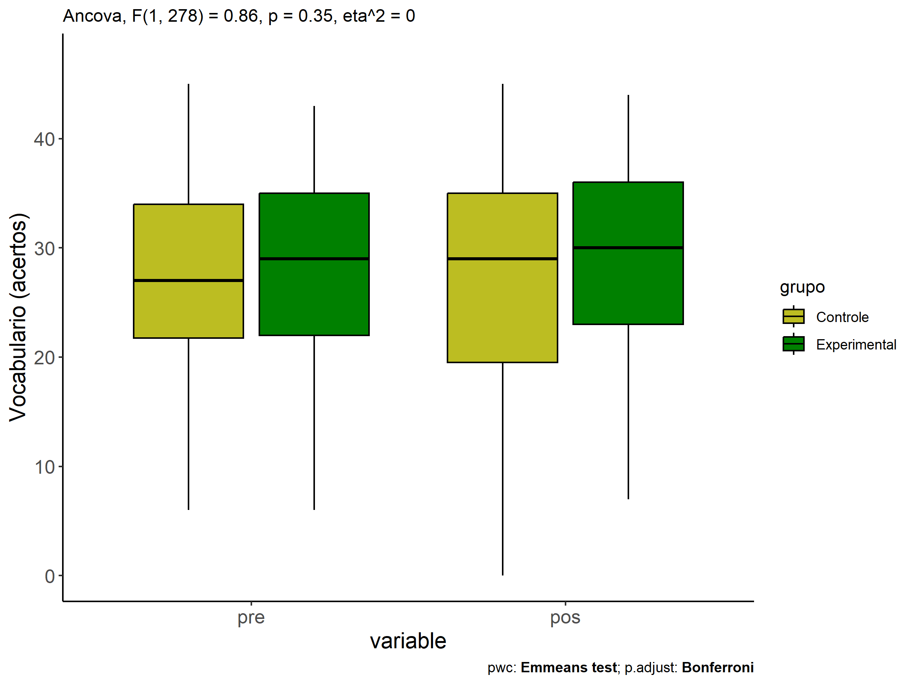<!-- -->

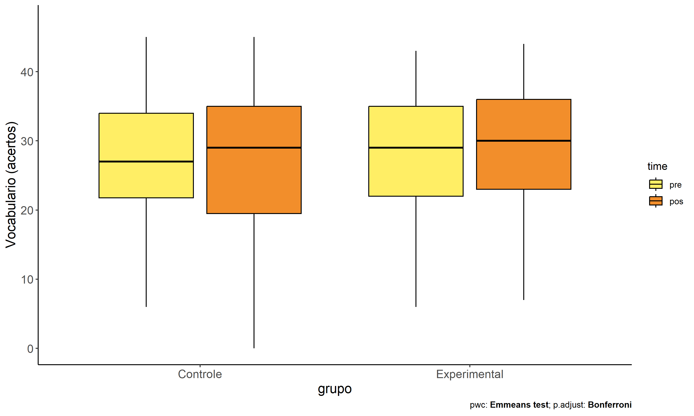<!-- -->

## Pairwise comparisons for two factors

### factores: **grupo:Sexo**

| var       | grupo        | Sexo |   n | M (pre) | SE (pre) | M (unadj) | SE (unadj) | M (adj) | SE (adj) |
|:----------|:-------------|:-----|----:|--------:|---------:|----------:|-----------:|--------:|---------:|
| vocab.pos | Controle     | F    |  53 |  27.868 |    1.195 |    28.660 |      1.467 |  28.621 |    0.929 |
| vocab.pos | Controle     | M    |  47 |  26.213 |    1.247 |    25.872 |      1.552 |  27.148 |    0.990 |
| vocab.pos | Experimental | F    |  96 |  29.229 |    0.911 |    30.438 |      0.921 |  29.317 |    0.694 |
| vocab.pos | Experimental | M    |  85 |  27.082 |    0.866 |    27.471 |      0.954 |  28.055 |    0.735 |

| .y.       | grupo        | Sexo | group1   | group2       | estimate | conf.low | conf.high |    se | statistic |     p | p.adj | p.adj.signif |
|:----------|:-------------|:-----|:---------|:-------------|---------:|---------:|----------:|------:|----------:|------:|------:|:-------------|
| vocab.pos |              | F    | Controle | Experimental |   -0.696 |   -2.978 |     1.586 | 1.159 |    -0.600 | 0.549 | 0.549 | ns           |
| vocab.pos |              | M    | Controle | Experimental |   -0.908 |   -3.329 |     1.514 | 1.230 |    -0.738 | 0.461 | 0.461 | ns           |
| vocab.pre |              | F    | Controle | Experimental |   -1.361 |   -4.239 |     1.517 | 1.462 |    -0.931 | 0.353 | 0.353 | ns           |
| vocab.pre |              | M    | Controle | Experimental |   -0.870 |   -3.926 |     2.187 | 1.553 |    -0.560 | 0.576 | 0.576 | ns           |
| vocab.pos | Controle     |      | F        | M            |    1.473 |   -1.199 |     4.146 | 1.358 |     1.085 | 0.279 | 0.279 | ns           |
| vocab.pos | Experimental |      | F        | M            |    1.262 |   -0.732 |     3.255 | 1.013 |     1.246 | 0.214 | 0.214 | ns           |
| vocab.pre | Controle     |      | F        | M            |    1.655 |   -1.714 |     5.025 | 1.712 |     0.967 | 0.334 | 0.334 | ns           |
| vocab.pre | Experimental |      | F        | M            |    2.147 |   -0.358 |     4.651 | 1.272 |     1.687 | 0.093 | 0.093 | ns           |

| .y.   | grupo        | Sexo | group1 | group2 | estimate | conf.low | conf.high |    se | statistic |     p | p.adj | p.adj.signif |
|:------|:-------------|:-----|:-------|:-------|---------:|---------:|----------:|------:|----------:|------:|------:|:-------------|
| vocab | Controle     | F    | pre    | pos    |   -0.792 |   -4.254 |     2.669 | 1.762 |    -0.450 | 0.653 | 0.653 | ns           |
| vocab | Controle     | M    | pre    | pos    |    0.340 |   -3.336 |     4.016 | 1.871 |     0.182 | 0.856 | 0.856 | ns           |
| vocab | Experimental | F    | pre    | pos    |   -1.208 |   -3.780 |     1.364 | 1.309 |    -0.923 | 0.357 | 0.357 | ns           |
| vocab | Experimental | M    | pre    | pos    |   -0.388 |   -3.122 |     2.345 | 1.392 |    -0.279 | 0.780 | 0.780 | ns           |

    ## Scale for colour is already present.
    ## Adding another scale for colour, which will replace the existing scale.

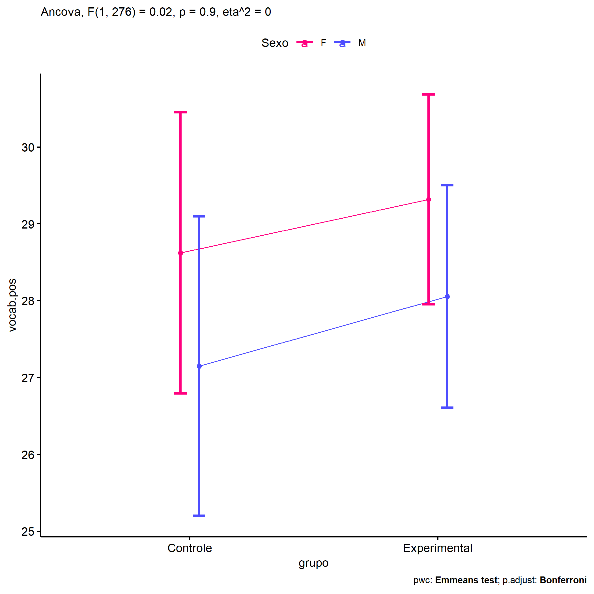<!-- -->

    ## Scale for colour is already present.
    ## Adding another scale for colour, which will replace the existing scale.

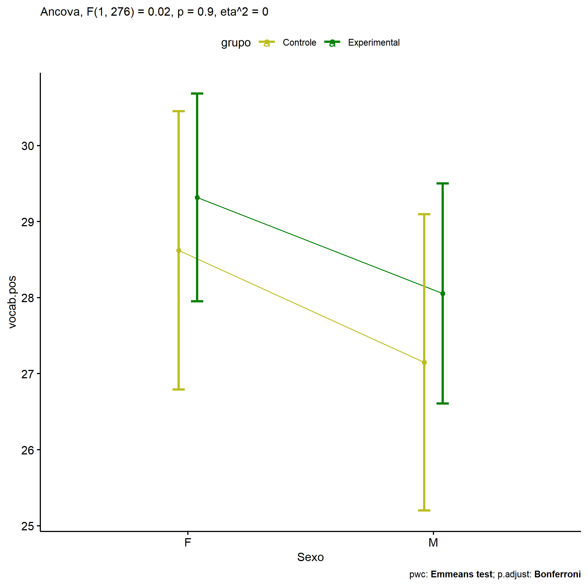<!-- -->

<!-- -->

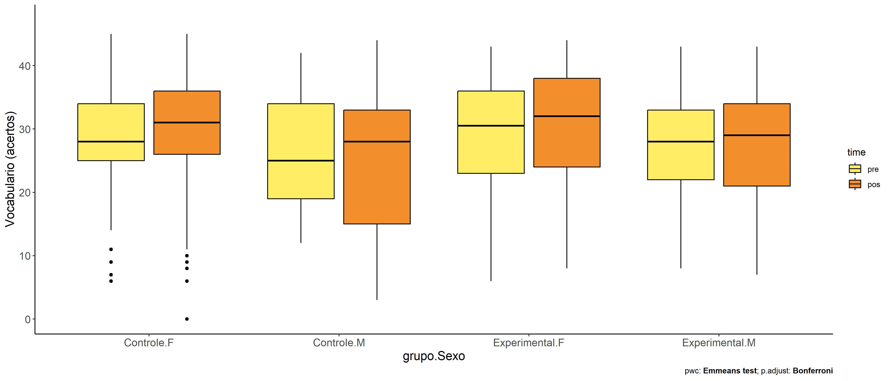<!-- -->

### factores: **grupo:Zona**

| var       | grupo        | Zona   |   n | M (pre) | SE (pre) | M (unadj) | SE (unadj) | M (adj) | SE (adj) |
|:----------|:-------------|:-------|----:|--------:|---------:|----------:|-----------:|--------:|---------:|
| vocab.pos | Controle     | Rural  |  38 |  26.711 |    1.367 |    27.868 |      1.676 |  28.697 |    0.988 |
| vocab.pos | Controle     | Urbana |  18 |  26.944 |    1.800 |    31.222 |      1.900 |  31.854 |    1.434 |
| vocab.pos | Experimental | Rural  |  56 |  27.804 |    1.135 |    28.446 |      1.209 |  28.356 |    0.813 |
| vocab.pos | Experimental | Urbana |  33 |  29.061 |    1.388 |    31.030 |      1.512 |  29.884 |    1.062 |

| .y.       | grupo        | Zona   | group1   | group2       | estimate | conf.low | conf.high |    se | statistic |     p | p.adj | p.adj.signif |
|:----------|:-------------|:-------|:---------|:-------------|---------:|---------:|----------:|------:|----------:|------:|------:|:-------------|
| vocab.pos |              | Rural  | Controle | Experimental |    0.341 |   -2.190 |     2.871 | 1.280 |     0.266 | 0.791 | 0.791 | ns           |
| vocab.pos |              | Urbana | Controle | Experimental |    1.970 |   -1.562 |     5.503 | 1.787 |     1.103 | 0.272 | 0.272 | ns           |
| vocab.pre |              | Rural  | Controle | Experimental |   -1.093 |   -4.525 |     2.339 | 1.736 |    -0.630 | 0.530 | 0.530 | ns           |
| vocab.pre |              | Urbana | Controle | Experimental |   -2.116 |   -6.901 |     2.668 | 2.420 |    -0.874 | 0.383 | 0.383 | ns           |
| vocab.pos | Controle     |        | Rural    | Urbana       |   -3.157 |   -6.597 |     0.283 | 1.740 |    -1.814 | 0.072 | 0.072 | ns           |
| vocab.pos | Experimental |        | Rural    | Urbana       |   -1.528 |   -4.170 |     1.115 | 1.337 |    -1.143 | 0.255 | 0.255 | ns           |
| vocab.pre | Controle     |        | Rural    | Urbana       |   -0.234 |   -4.906 |     4.438 | 2.363 |    -0.099 | 0.921 | 0.921 | ns           |
| vocab.pre | Experimental |        | Rural    | Urbana       |   -1.257 |   -4.840 |     2.326 | 1.813 |    -0.693 | 0.489 | 0.489 | ns           |

| .y.   | grupo        | Zona   | group1 | group2 | estimate | conf.low | conf.high |    se | statistic |     p | p.adj | p.adj.signif |
|:------|:-------------|:-------|:-------|:-------|---------:|---------:|----------:|------:|----------:|------:|------:|:-------------|
| vocab | Controle     | Rural  | pre    | pos    |   -1.158 |   -5.109 |     2.793 | 2.007 |    -0.577 | 0.565 | 0.565 | ns           |
| vocab | Controle     | Urbana | pre    | pos    |   -4.278 |  -10.019 |     1.463 | 2.917 |    -1.467 | 0.144 | 0.144 | ns           |
| vocab | Experimental | Rural  | pre    | pos    |   -0.643 |   -3.898 |     2.612 | 1.654 |    -0.389 | 0.698 | 0.698 | ns           |
| vocab | Experimental | Urbana | pre    | pos    |   -1.970 |   -6.210 |     2.270 | 2.154 |    -0.914 | 0.361 | 0.361 | ns           |

    ## Scale for colour is already present.
    ## Adding another scale for colour, which will replace the existing scale.

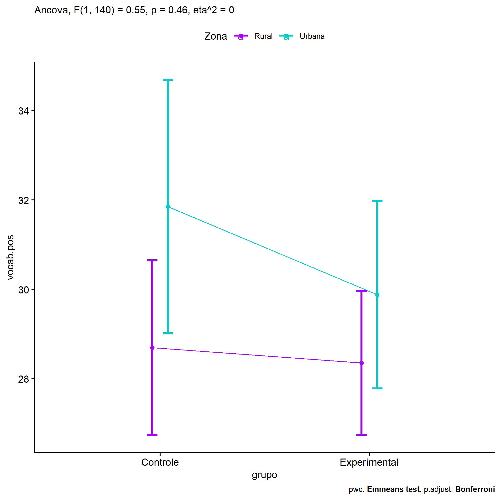<!-- -->

    ## Scale for colour is already present.
    ## Adding another scale for colour, which will replace the existing scale.

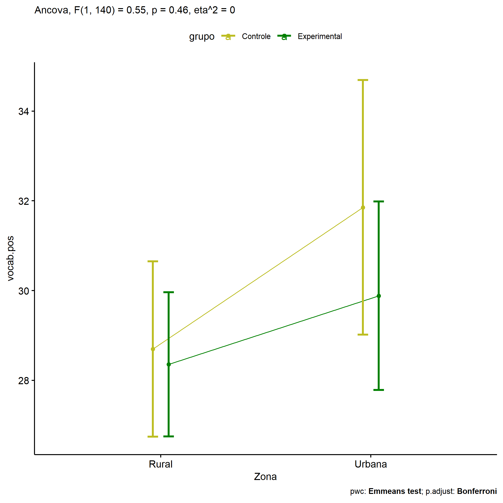<!-- -->

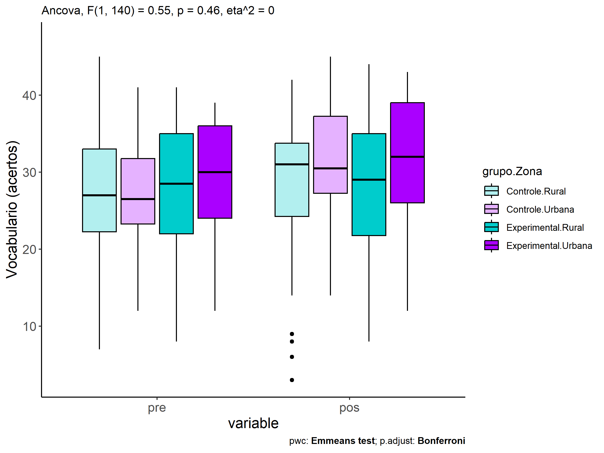<!-- -->

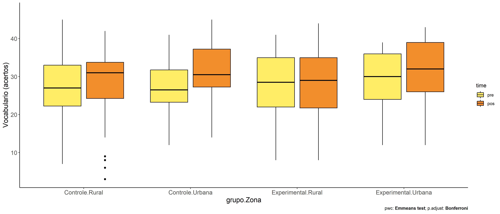<!-- -->

### factores: **grupo:Cor.Raca**

| var       | grupo        | Cor.Raca |   n | M (pre) | SE (pre) | M (unadj) | SE (unadj) | M (adj) | SE (adj) |
|:----------|:-------------|:---------|----:|--------:|---------:|----------:|-----------:|--------:|---------:|
| vocab.pos | Controle     | Parda    |  38 |  27.316 |    1.341 |    26.921 |      1.879 |  27.136 |    1.233 |
| vocab.pos | Experimental | Branca   |  19 |  30.000 |    1.453 |    29.474 |      2.015 |  27.590 |    1.755 |
| vocab.pos | Experimental | Parda    |  53 |  26.925 |    1.334 |    28.962 |      1.314 |  29.483 |    1.045 |

|     | .y.       | grupo        | Cor.Raca | group1   | group2       | estimate | conf.low | conf.high |    se | statistic |     p | p.adj | p.adj.signif |
|:----|:----------|:-------------|:---------|:---------|:-------------|---------:|---------:|----------:|------:|----------:|------:|------:|:-------------|
| 2   | vocab.pos |              | Parda    | Controle | Experimental |   -2.347 |   -5.551 |     0.856 | 1.616 |    -1.453 | 0.149 | 0.149 | ns           |
| 4   | vocab.pre |              | Parda    | Controle | Experimental |    0.391 |   -3.288 |     4.071 | 1.856 |     0.211 | 0.833 | 0.833 | ns           |
| 6   | vocab.pos | Experimental |          | Branca   | Parda        |   -1.894 |   -5.955 |     2.168 | 2.049 |    -0.924 | 0.357 | 0.357 | ns           |
| 8   | vocab.pre | Experimental |          | Branca   | Parda        |    3.075 |   -1.553 |     7.704 | 2.335 |     1.317 | 0.191 | 0.191 | ns           |

| .y.   | grupo        | Cor.Raca | group1 | group2 | estimate | conf.low | conf.high |    se | statistic |     p | p.adj | p.adj.signif |
|:------|:-------------|:---------|:-------|:-------|---------:|---------:|----------:|------:|----------:|------:|------:|:-------------|
| vocab | Controle     | Parda    | pre    | pos    |    0.395 |   -3.896 |     4.686 | 2.177 |     0.181 | 0.856 | 0.856 | ns           |
| vocab | Experimental | Branca   | pre    | pos    |    0.526 |   -5.542 |     6.595 | 3.079 |     0.171 | 0.864 | 0.864 | ns           |
| vocab | Experimental | Parda    | pre    | pos    |   -2.038 |   -5.671 |     1.596 | 1.843 |    -1.105 | 0.270 | 0.270 | ns           |

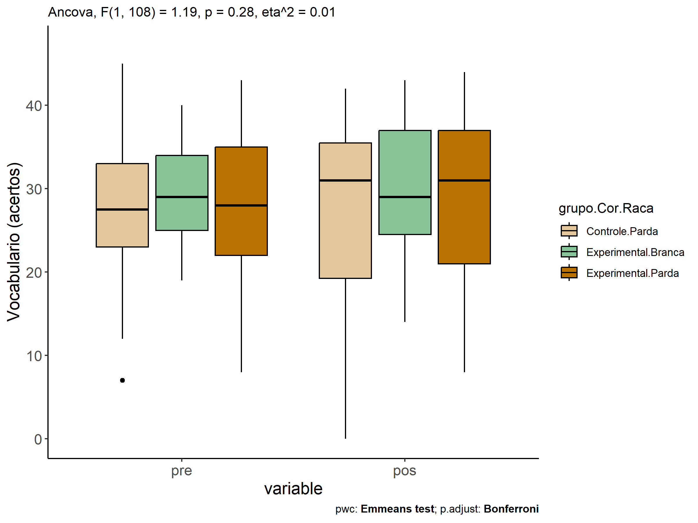<!-- -->

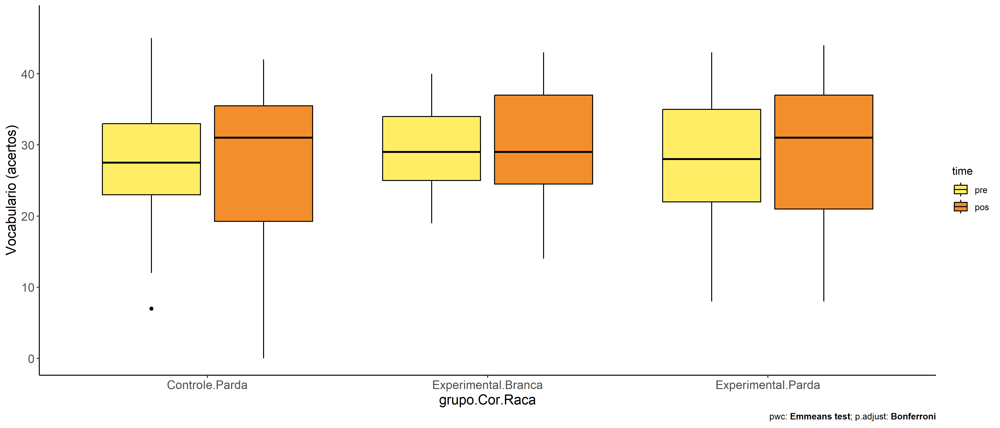<!-- -->

### factores: **grupo:vocab.quintile**

| var       | grupo        | vocab.quintile |   n | M (pre) | SE (pre) | M (unadj) | SE (unadj) | M (adj) | SE (adj) |
|:----------|:-------------|:---------------|----:|--------:|---------:|----------:|-----------:|--------:|---------:|
| vocab.pos | Controle     | 1st quintile   |  13 |  12.308 |    0.909 |    13.077 |      1.674 |  21.466 |    3.467 |
| vocab.pos | Controle     | 2nd quintile   |  14 |  19.286 |    0.412 |    21.929 |      2.979 |  26.543 |    2.411 |
| vocab.pos | Controle     | 3rd quintile   |  33 |  26.061 |    0.304 |    28.030 |      1.220 |  28.981 |    1.217 |
| vocab.pos | Controle     | 4th quintile   |  18 |  32.278 |    0.360 |    32.667 |      1.386 |  30.255 |    1.794 |
| vocab.pos | Controle     | 5th quintile   |  22 |  38.091 |    0.644 |    33.864 |      2.375 |  28.308 |    2.409 |
| vocab.pos | Experimental | 1st quintile   |  19 |  11.842 |    0.677 |    16.947 |      1.536 |  25.588 |    3.382 |
| vocab.pos | Experimental | 2nd quintile   |  28 |  20.321 |    0.300 |    21.429 |      1.056 |  25.483 |    1.900 |
| vocab.pos | Experimental | 3rd quintile   |  46 |  26.152 |    0.330 |    26.413 |      0.873 |  27.314 |    1.040 |
| vocab.pos | Experimental | 4th quintile   |  37 |  31.757 |    0.224 |    32.568 |      0.884 |  30.438 |    1.331 |
| vocab.pos | Experimental | 5th quintile   |  51 |  37.961 |    0.324 |    37.549 |      0.766 |  32.064 |    2.130 |

| .y.       | grupo        | vocab.quintile | group1       | group2       | estimate | conf.low | conf.high |    se | statistic | p       | p.adj   | p.adj.signif |
|:----------|:-------------|:---------------|:-------------|:-------------|---------:|---------:|----------:|------:|----------:|:--------|:--------|:-------------|
| vocab.pos |              | 1st quintile   | Controle     | Experimental |   -4.122 |   -8.891 |     0.647 | 2.422 |    -1.702 | 0.09    | 0.09    | ns           |
| vocab.pos |              | 2nd quintile   | Controle     | Experimental |    1.060 |   -3.291 |     5.411 | 2.210 |     0.480 | 0.632   | 0.632   | ns           |
| vocab.pos |              | 3rd quintile   | Controle     | Experimental |    1.667 |   -1.354 |     4.687 | 1.534 |     1.086 | 0.278   | 0.278   | ns           |
| vocab.pos |              | 4th quintile   | Controle     | Experimental |   -0.183 |   -3.992 |     3.627 | 1.935 |    -0.094 | 0.925   | 0.925   | ns           |
| vocab.pos |              | 5th quintile   | Controle     | Experimental |   -3.756 |   -7.133 |    -0.378 | 1.716 |    -2.189 | 0.029   | 0.029   | \*           |
| vocab.pre |              | 1st quintile   | Controle     | Experimental |    0.466 |   -1.071 |     2.002 | 0.780 |     0.597 | 0.551   | 0.551   | ns           |
| vocab.pre |              | 2nd quintile   | Controle     | Experimental |   -1.036 |   -2.433 |     0.362 | 0.710 |    -1.459 | 0.146   | 0.146   | ns           |
| vocab.pre |              | 3rd quintile   | Controle     | Experimental |   -0.092 |   -1.065 |     0.882 | 0.495 |    -0.185 | 0.853   | 0.853   | ns           |
| vocab.pre |              | 4th quintile   | Controle     | Experimental |    0.521 |   -0.706 |     1.748 | 0.623 |     0.836 | 0.404   | 0.404   | ns           |
| vocab.pre |              | 5th quintile   | Controle     | Experimental |    0.130 |   -0.959 |     1.219 | 0.553 |     0.235 | 0.814   | 0.814   | ns           |
| vocab.pos | Controle     |                | 1st quintile | 2nd quintile |   -5.078 |  -10.797 |     0.641 | 2.905 |    -1.748 | 0.082   | 0.816   | ns           |
| vocab.pos | Controle     |                | 1st quintile | 3rd quintile |   -7.515 |  -14.210 |    -0.821 | 3.400 |    -2.210 | 0.028   | 0.279   | ns           |
| vocab.pos | Controle     |                | 1st quintile | 4th quintile |   -8.789 |  -17.626 |     0.048 | 4.489 |    -1.958 | 0.051   | 0.512   | ns           |
| vocab.pos | Controle     |                | 1st quintile | 5th quintile |   -6.842 |  -17.468 |     3.784 | 5.397 |    -1.268 | 0.206   | 1       | ns           |
| vocab.pos | Controle     |                | 2nd quintile | 3rd quintile |   -2.438 |   -7.352 |     2.477 | 2.496 |    -0.977 | 0.33    | 1       | ns           |
| vocab.pos | Controle     |                | 2nd quintile | 4th quintile |   -3.711 |  -10.456 |     3.033 | 3.426 |    -1.083 | 0.28    | 1       | ns           |
| vocab.pos | Controle     |                | 2nd quintile | 5th quintile |   -1.764 |  -10.080 |     6.551 | 4.224 |    -0.418 | 0.676   | 1       | ns           |
| vocab.pos | Controle     |                | 3rd quintile | 4th quintile |   -1.274 |   -5.787 |     3.239 | 2.292 |    -0.556 | 0.579   | 1       | ns           |
| vocab.pos | Controle     |                | 3rd quintile | 5th quintile |    0.673 |   -5.088 |     6.434 | 2.926 |     0.230 | 0.818   | 1       | ns           |
| vocab.pos | Controle     |                | 4th quintile | 5th quintile |    1.947 |   -2.781 |     6.675 | 2.402 |     0.811 | 0.418   | 1       | ns           |
| vocab.pos | Experimental |                | 1st quintile | 2nd quintile |    0.105 |   -4.933 |     5.143 | 2.559 |     0.041 | 0.967   | 1       | ns           |
| vocab.pos | Experimental |                | 1st quintile | 3rd quintile |   -1.726 |   -8.146 |     4.693 | 3.261 |    -0.529 | 0.597   | 1       | ns           |
| vocab.pos | Experimental |                | 1st quintile | 4th quintile |   -4.850 |  -13.128 |     3.429 | 4.205 |    -1.153 | 0.25    | 1       | ns           |
| vocab.pos | Experimental |                | 1st quintile | 5th quintile |   -6.476 |  -16.796 |     3.845 | 5.242 |    -1.235 | 0.218   | 1       | ns           |
| vocab.pos | Experimental |                | 2nd quintile | 3rd quintile |   -1.831 |   -5.671 |     2.010 | 1.951 |    -0.939 | 0.349   | 1       | ns           |
| vocab.pos | Experimental |                | 2nd quintile | 4th quintile |   -4.954 |  -10.339 |     0.430 | 2.735 |    -1.812 | 0.071   | 0.712   | ns           |
| vocab.pos | Experimental |                | 2nd quintile | 5th quintile |   -6.580 |  -13.826 |     0.666 | 3.680 |    -1.788 | 0.075   | 0.749   | ns           |
| vocab.pos | Experimental |                | 3rd quintile | 4th quintile |   -3.123 |   -6.711 |     0.464 | 1.822 |    -1.714 | 0.088   | 0.877   | ns           |
| vocab.pos | Experimental |                | 3rd quintile | 5th quintile |   -4.749 |   -9.891 |     0.392 | 2.611 |    -1.819 | 0.07    | 0.701   | ns           |
| vocab.pos | Experimental |                | 4th quintile | 5th quintile |   -1.626 |   -5.296 |     2.044 | 1.864 |    -0.872 | 0.384   | 1       | ns           |
| vocab.pre | Controle     |                | 1st quintile | 2nd quintile |   -6.978 |   -8.622 |    -5.334 | 0.835 |    -8.355 | \<0.001 | \<0.001 | \*\*\*\*     |
| vocab.pre | Controle     |                | 1st quintile | 3rd quintile |  -13.753 |  -15.151 |   -12.355 | 0.710 |   -19.369 | \<0.001 | \<0.001 | \*\*\*\*     |
| vocab.pre | Controle     |                | 1st quintile | 4th quintile |  -19.970 |  -21.524 |   -18.416 | 0.789 |   -25.303 | \<0.001 | \<0.001 | \*\*\*\*     |
| vocab.pre | Controle     |                | 1st quintile | 5th quintile |  -25.783 |  -27.277 |   -24.290 | 0.759 |   -33.990 | \<0.001 | \<0.001 | \*\*\*\*     |
| vocab.pre | Controle     |                | 2nd quintile | 3rd quintile |   -6.775 |   -8.137 |    -5.413 | 0.692 |    -9.796 | \<0.001 | \<0.001 | \*\*\*\*     |
| vocab.pre | Controle     |                | 2nd quintile | 4th quintile |  -12.992 |  -14.513 |   -11.471 | 0.773 |   -16.814 | \<0.001 | \<0.001 | \*\*\*\*     |
| vocab.pre | Controle     |                | 2nd quintile | 5th quintile |  -18.805 |  -20.265 |   -17.346 | 0.741 |   -25.367 | \<0.001 | \<0.001 | \*\*\*\*     |
| vocab.pre | Controle     |                | 3rd quintile | 4th quintile |   -6.217 |   -7.468 |    -4.966 | 0.635 |    -9.785 | \<0.001 | \<0.001 | \*\*\*\*     |
| vocab.pre | Controle     |                | 3rd quintile | 5th quintile |  -12.030 |  -13.205 |   -10.855 | 0.597 |   -20.157 | \<0.001 | \<0.001 | \*\*\*\*     |
| vocab.pre | Controle     |                | 4th quintile | 5th quintile |   -5.813 |   -7.170 |    -4.456 | 0.689 |    -8.435 | \<0.001 | \<0.001 | \*\*\*\*     |
| vocab.pre | Experimental |                | 1st quintile | 2nd quintile |   -8.479 |   -9.748 |    -7.210 | 0.645 |   -13.156 | \<0.001 | \<0.001 | \*\*\*\*     |
| vocab.pre | Experimental |                | 1st quintile | 3rd quintile |  -14.310 |  -15.474 |   -13.146 | 0.591 |   -24.199 | \<0.001 | \<0.001 | \*\*\*\*     |
| vocab.pre | Experimental |                | 1st quintile | 4th quintile |  -19.915 |  -21.120 |   -18.710 | 0.612 |   -32.540 | \<0.001 | \<0.001 | \*\*\*\*     |
| vocab.pre | Experimental |                | 1st quintile | 5th quintile |  -26.119 |  -27.266 |   -24.971 | 0.583 |   -44.815 | \<0.001 | \<0.001 | \*\*\*\*     |
| vocab.pre | Experimental |                | 2nd quintile | 3rd quintile |   -5.831 |   -6.854 |    -4.807 | 0.520 |   -11.218 | \<0.001 | \<0.001 | \*\*\*\*     |
| vocab.pre | Experimental |                | 2nd quintile | 4th quintile |  -11.435 |  -12.505 |   -10.366 | 0.543 |   -21.054 | \<0.001 | \<0.001 | \*\*\*\*     |
| vocab.pre | Experimental |                | 2nd quintile | 5th quintile |  -17.639 |  -18.643 |   -16.635 | 0.510 |   -34.585 | \<0.001 | \<0.001 | \*\*\*\*     |
| vocab.pre | Experimental |                | 3rd quintile | 4th quintile |   -5.605 |   -6.547 |    -4.662 | 0.479 |   -11.704 | \<0.001 | \<0.001 | \*\*\*\*     |
| vocab.pre | Experimental |                | 3rd quintile | 5th quintile |  -11.809 |  -12.677 |   -10.941 | 0.441 |   -26.782 | \<0.001 | \<0.001 | \*\*\*\*     |
| vocab.pre | Experimental |                | 4th quintile | 5th quintile |   -6.204 |   -7.126 |    -5.282 | 0.468 |   -13.249 | \<0.001 | \<0.001 | \*\*\*\*     |

| .y.   | grupo        | vocab.quintile | group1 | group2 | estimate | conf.low | conf.high |    se | statistic |     p | p.adj | p.adj.signif |
|:------|:-------------|:---------------|:-------|:-------|---------:|---------:|----------:|------:|----------:|------:|------:|:-------------|
| vocab | Controle     | 1st quintile   | pre    | pos    |   -0.769 |   -4.665 |     3.127 | 1.983 |    -0.388 | 0.698 | 0.698 | ns           |
| vocab | Controle     | 2nd quintile   | pre    | pos    |   -2.643 |   -6.397 |     1.111 | 1.911 |    -1.383 | 0.167 | 0.167 | ns           |
| vocab | Controle     | 3rd quintile   | pre    | pos    |   -1.970 |   -4.415 |     0.476 | 1.245 |    -1.582 | 0.114 | 0.114 | ns           |
| vocab | Controle     | 4th quintile   | pre    | pos    |   -0.389 |   -3.700 |     2.922 | 1.686 |    -0.231 | 0.818 | 0.818 | ns           |
| vocab | Controle     | 5th quintile   | pre    | pos    |    4.227 |    1.232 |     7.222 | 1.525 |     2.773 | 0.006 | 0.006 | \*\*         |
| vocab | Experimental | 1st quintile   | pre    | pos    |   -5.105 |   -8.328 |    -1.883 | 1.641 |    -3.112 | 0.002 | 0.002 | \*\*         |
| vocab | Experimental | 2nd quintile   | pre    | pos    |   -1.107 |   -3.762 |     1.548 | 1.351 |    -0.819 | 0.413 | 0.413 | ns           |
| vocab | Experimental | 3rd quintile   | pre    | pos    |   -0.261 |   -2.332 |     1.810 | 1.054 |    -0.247 | 0.805 | 0.805 | ns           |
| vocab | Experimental | 4th quintile   | pre    | pos    |   -0.811 |   -3.120 |     1.499 | 1.176 |    -0.690 | 0.491 | 0.491 | ns           |
| vocab | Experimental | 5th quintile   | pre    | pos    |    0.412 |   -1.555 |     2.379 | 1.001 |     0.411 | 0.681 | 0.681 | ns           |

    ## Scale for colour is already present.
    ## Adding another scale for colour, which will replace the existing scale.

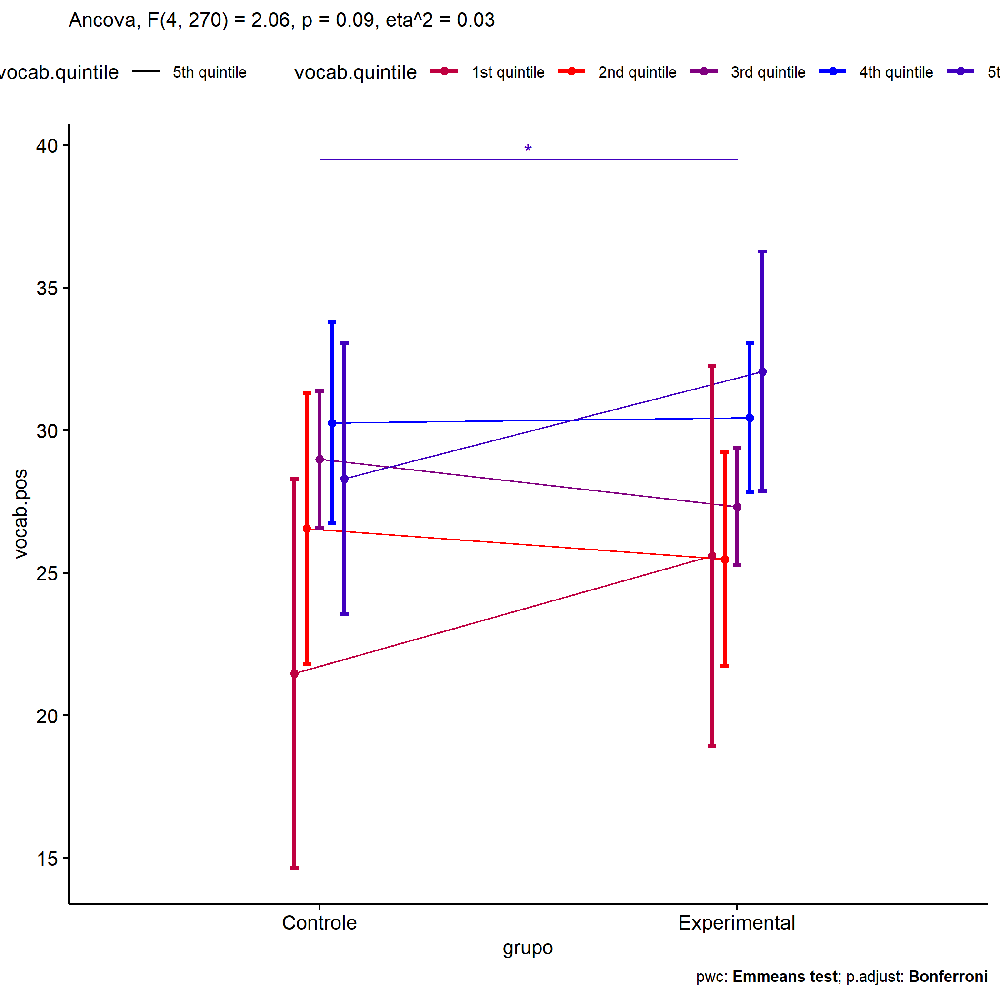<!-- -->

    ## Scale for colour is already present.
    ## Adding another scale for colour, which will replace the existing scale.

<!-- -->

<!-- -->

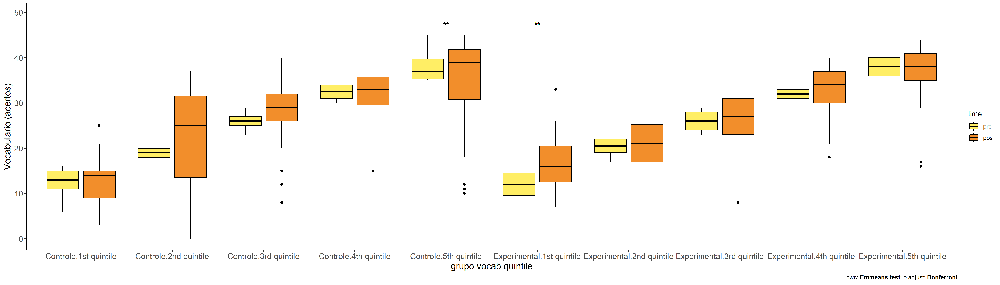<!-- -->
